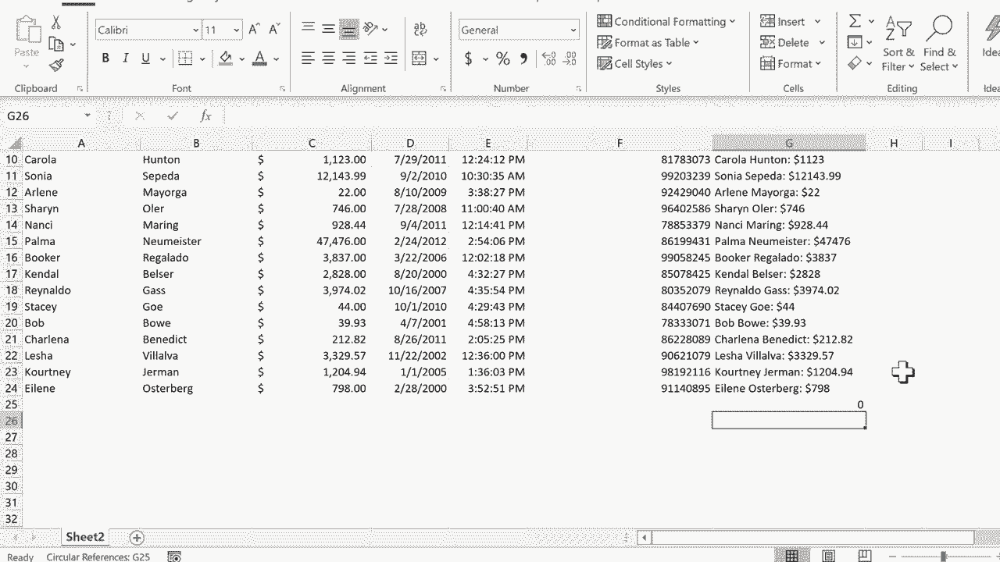

# 【双语字幕+速查表下载】Excel正确打开方式！提效技巧大合集！(持续更新中) - P14：14）组合来自多个单元格的数据 - ShowMeAI - BV1Jg411F7cS

在这个教程中，我将向你展示如何轻松地将多个单元格中的数据结合在Excel中。让我们来看一下这个电子表格。这是一个假想公司的客户关系跟踪器。这些都是该公司的客户。你可以看到他们的名字在这里，姓氏在另一列中。他们从公司购买的总金额以及其他一些数据。

那么，如果我想将这些数据组合在一起呢？比如说，生成一个客户档案，并将这些信息放在右边的一列中。我可以在G2单元格中点击，然后我输入“客户档案”。看起来它没有复制格式。我只需点击我想要复制格式的单元格，然后在主页选项卡上去。

点击格式刷，然后点击这里。它会使格式相同。好的，看看我是怎么做到的。我是怎么把“Gina”添加到“Pullen”这个词中的。假设他们的总购买金额是美元。那么我只需在G3单元格中点击，然后输入等号。所以这个单元格等于。

我希望它等于Gina，所以我点击Gina。然后我还想包括“Pullen”这个词。但是如果我点击Pullen，它会变成B3。那么如果我点击Gina加上Pullen并按回车呢？看，Excel不理解，它似乎无法计算。你知道，如何将一个名字加上另一个名字。所以正确的方法是输入等号，然后点击Gina。

然后你输入一个和号，或者有些人称之为“和”符号。那么A3和号Pullen。现在看看会发生什么，如果我在键盘上按回车或输入，它显示为Gina Pullen。它将A3单元格的内容与B3单元格的内容结合在一起。现在这里有个问题，Gina和Pullen之间没有空格。所以让我们来修复一下。

要在和号后面添加空格，我只需在引号中用空格键输入一个空格，然后再加上引号，然后再输入和号。所以，这样做的目的是将A3中的内容与一个空格连接，然后再与B3中的内容连接。所以我在键盘上按回车或输入，效果很好。现在让我们进一步修改。我想现在添加总购买金额。

所以我再添加一个和号，我可能应该再放一个空格，或者也许是冒号。让我们试试冒号，然后我再加上一个和号，可能我想再放一个空格。所以我输入引号空格，关闭另一个和号，现在我将点击这里的总购买金额，然后在键盘上按回车或输入，如果你使用的是Mac，看看我们得到了什么：Gina Pullen $40。如果我真的想对这个细节挑剔一下。

我可以进去加一个美元符号。所以在最后一个和号、引号、美元符号、引号后面。我需要另一个和号，按下键盘上的回车或输入。现在看起来正是我想要的样子。所以这是一个非常简单的客户档案，但它让我知道多年来从我们这里购买最多的客户姓名。

现在，不幸的是，我将不得不为这些客户中的每一个人再次这样做，对吧？

嗯，实际上，我只需点击“Gina pullin 40”，然后去自动填充手柄。我会稍微放大一下，但你可以在这里看到。每当你点击一个单元格时，在那个单元格的右下角，应该会有一个非常小的方块。你可以在这里看到，它是绿色的。

这就是自动填充手柄。它的作用是复制。当你点击并拖动它时，它会复制所选单元格中的内容。现在，有时它不仅仅是复制，它还会扩展。如果你还没有看过我关于自动填充手柄的教程，你真的应该去看一下。但在这种情况下，我确实只想复制这个单元格中的内容。现在。

有些人可能会说，不，你不想复制“Geninaol和40”。好吧。如果你想想，这其实并不是真正的内容。如果我双击那个单元格，或者只点击一次并查看上面的公式栏，你会发现这实际上是一个公式。它不仅仅是“geninaol和$40”。

所以我想将那个公式复制到这一列中。我会点击并按住自动填充手柄，然后向下拖动工作表并释放。看看它做了什么。它将名字、姓氏与每个客户的总销售额结合在一起。

现在，有一点需要注意。G列的结果会被视为文本。所以这些实际上并不是数字。它们包含数字，但如果我进行自动求和，它实际上并不知道该如何处理，因为这些并不是真正的数字。它们只是将文本和数字组合在一起的公式，结果基本上被视为文本。

我真的认为你越是使用Excel，就会越看到用和号将多个单元格的数据结合在一起的机会，并将这些数据合并到一个单元格中。感谢观看。我希望你觉得这个教程对你有帮助。如果你觉得有帮助，请点击下面的赞按钮。

