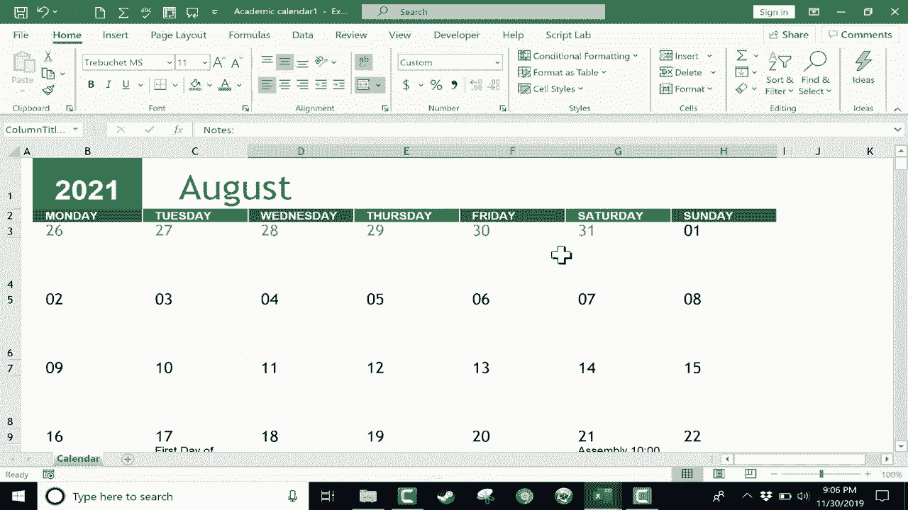

# 【双语字幕+速查表下载】Excel正确打开方式！提效技巧大合集！(持续更新中) - P15：15）创建日历 - ShowMeAI - BV1Jg411F7cS

In this tutorial， I'm going to show you how to create a calendar in Excel。 and there are several ways you can do this， but let's look at the easiest method。 but I'll also throw in some exciting features and options that I think you'll like。 So let's say you're just in Excel like I am here。 The first thing I would do to create a calendar is go to the file tab here in the upper left and click and then go down to the new button when you click on that。

 it gives you the option for a blank workbook and some other options。 but I'm going to browse down the page ways。 and you can see that there are some templates that you can use。 There are some budgets， some invoices， and there also are some calendars。 So I'm going to go here to academic calendar and I'll click on that， And by the way。

 if you don't see this particular calendar。 or if you want to find other calendars。 you can just go up here to the top， search for online templates and type in calendar and it will give you many。 many more options。 besides those。That I have installed by default on my computer。 But anyway。 I'm just gonna to go down and choose the academic calendar。 Just double click on it。

 It brings up a preview， and then I can click create and here is my academic calendar。 As you can see， the template puts in some default dates for parent teacher conferences and things like that。 you may want to delete that if it doesn't match reality。 which it probably won't up at the top of this calendar， you can see that by default。

 it has the current year。 But if I want to， I can change this to， let's say 2021。 Now。 watch what happens to the dates on the calendar。 When I tap enter。 they adjust And so this is a great builtin feature to these Excel calendar templates that whatever year you put into this cell。 it matches the date numbers and the days。 And so that's why I think far and away。

 This is the best way to create a calendar in Excel。 It just saves you a tremendous amount of work。 Now， what if you don't start in August， you can just click here on August。And maybe you want your calendar to start in the month of January。 That's okay。 You can just go up。 choose January， and everything adjusts。 But again。

 this is an academic calendar and in the United States that generally means August would be the first month。 I love that fact that you can just change it。 And this Excel template just adjusts the dates and the days。 So I'm going browse down to， let's say August 17。 let's say this is the first day of school。 Notice that the way that this template is built。 In addition to the number underneath it。

 there's a big cell in which you can type whatever the event is。 So I'm going to type in first day of school。 And then if I browse down， you'll notice。 even though I selected August， the rest of the months are here。 It just starts with August。 So I can browse down to let's say the month of May， May 28， last day of school。

 I'm going browse back up to the top。 And let's go into September。 Let's say。Every Friday in September， there's gonna be a pop quiz。 Okay。 so I can click and type that and then I could just click away and then go back and hold control and tap C to copy that。 and then I'll just paste that same event onto every Friday in September。

 And let's say that every Tuesday homework is due same kind of thing I could just do control C control V to paste。 All right， so you get the idea， you just click type the events for each of these days。 if there is an event。 I'll just put assembly here on the 21 August。 But you just fill in those events。 You can even put the times in there if you want。

 And this calendar is coming together nicely。 If you want to dress it up a little bit。 you can。 you could click and drag to highlight a particular month。 And then here on the page layout tab if you want， you could change the colors。 you could pull in some themes。 So those are some options that you have。 But I'm going to undo those。

Changes and just get back to the default that came with the template。 I think it looks good the way it is。 Now， at this point， I've got a nice calendar。 I could save this。 I could share it with people digitally if I want to。 But in some cases。 you're going want to print In order to print， you just click file print Ally。

 you can also hold control and tap P。 and it takes you to the print interface。 and it gives you a nice preview of what the calendar will look like when printed。 And I think this is going to look great。 There's September with all the homework and pop quizzes。 Poor unfortunate students。 There's August with the assembly in the first day of school。

 So this is print ready。 Now， I wanted to show you another option that you have。 One thing you could do to make your events stand out a little bit。 is you could use some conditional formatting。 And it's actually pretty easy to do this。 All you would have to do is select the entire spreadsheet。 If you hold control in tap A。😊。

It selects the entire spreadsheet。 So control a and then go here to the home tab home ribbon in the Sts group。 Look for conditional formatting。 If you click there。 there's an option for highlight cells rules。 text that contains。 So I want to look for text that contains the word quiz。 If it does contain the word quiz， then I want to highlight it with yellow fill with dark yellow text。

 So I click O， let's see if it worked。 let's go to September。 there you can see that the cell background now is in yellow and the text is dark yellow。 So that helps to draw attention to the days with quizzes。 At least if you're printing in color or if you're sharing the calendar digitally。

 What about homework， I could do the same exact thing。 control a to select everything。 conditional formatting， highlight cells rules， text that contains homeworkwork。 By default。 it wants to format it。With light red fill with dark red text。 But I'm going to change that。 I'm going to go to custom format。 and I can just go here to the fill and choose a different color。

 I can even change the pattern style if I want to。 and then click O。 that doesn't look very good in my opinion。 So I'm going to undo that。 But the idea is that you can actually create your own custom color schemes and custom format here on font。 I can change the automatic color of the actual text itself。 So let's say dark green border。

 Do I want it to have a border or not， I'll say yes， let's have an outline And then fill。 let's fill it with orange。 click O， click O， again， I'm not thrilled with my choice。 So I'm going to go up here to conditional formatting。 And this time。 instead of going to highlight cells rules。 I'm going go down to the very bottom where it says manage rules。

 And there I can change the options that I picked。😊，So this particular one here。 I'm gonna double click on it， and I'll click format。 And even though that didn't look totally familiar。 it is basically the same information that I put in before。 So I click okay。

 click okay click apply and okay， and that's a little bit better。 Okay， so I've got homework do。 I've got pop quizzes there。 Now， let's say in the month of November， let's say on this day here。 what is that Wednesday， there's a pop quiz。 I tap enter and immediately it's formatted based on the rule that I set up。 What if there's homework due on this particular day。

 I can type in homework and it formats it appropriately。 So conditional formatting in this case can be great for color coding your Excel calendars。 Thanks for watching。 I hope you found this tutorial to be helpful。 If you did。 please click the like button。

