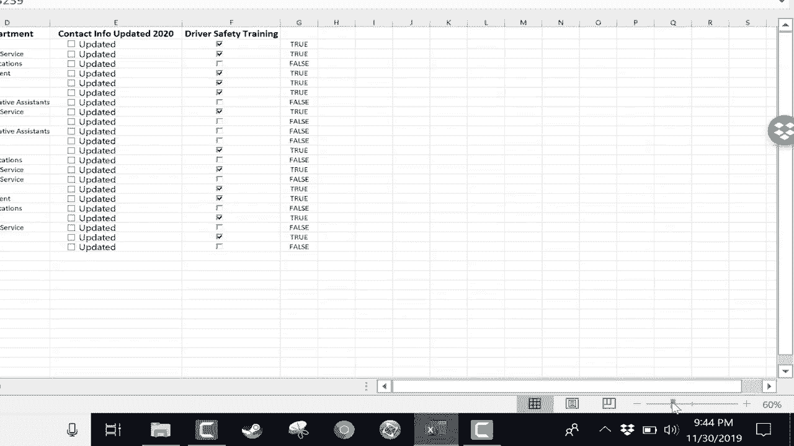

# 【双语字幕+速查表下载】Excel正确打开方式！提效技巧大合集！(持续更新中) - P16：16）放大和缩小 - ShowMeAI - BV1Jg411F7cS

In this short Excel tutorial， I will show you how to quickly and easily change the zoom level in Excel。

 Many times when you're in Excel， you need to zoom in or zoom out in order to see all of your data or at least more of your data。

 or maybe you want to zoom in and look at the data in more depth than more clarity。

 So being able to zoom in and out is important。 Probably the most cumbersome way to zoom is to go here to the view tab look at the view ribbon。

 There's a zoom group and you can quickly zoom to 100%。 You can also zoom to selection。

 So let's say I have these cells selected。 This range。 I can click zoom to selection。

 And now just that range is zoomed in so that that's all that I can see。

 That's kind of a nice feature。 You can also click this zoom button here。

 and say you would like 200% magnification， or you could go down to 50 or 25%。

 and you can also put in a custom magnification。 Let's say 55。

So those are all really good options here in the zoom group on the view ribbon。

 I'm going go back to 100%。 The problem with those options is that they're just a little bit cumbersome。

 like I said before， you have to click on view， then you have to click on the option。

 then you have to click a number。 And so fortunately， Microsoft has added into Excel。

 a quick zoom bar here in the lower right corner。 There's a handle there。

 and I can just quickly click and drag and I can jump to， let's say 218%。

 Now everything looks nice and big。 I can also quickly zoom down。 let's say to 50 or 60%。

 And so that is a very handy slider。 There is yet another option， though for zooming。

 and many people like this the best。 And that is to simply hold the control key on the keyboard and then use the scroll wheel on your mouse to scroll forward。

 that zooms in or to scroll downward。 and that will zoom you out。 Now， if you look closely。

It is kind of choppy and almost confusing to watch If you don't want it to be that way。

 you can click on sell a1。 and now it should zoom in and out much more smoothly。

 It's just a lot more smooth with the data that you have if you're zooming from the a1 cell。

 So those are three options three ways to change the Zoom level in Excel。

 Hopefully it helps you to look at your data more easily and see what you want to be able to see。

 Thanks for watching， I hope you found this tutorial to be helpful。 If you did。

 please click the like button below and consider connecting with me on my social media accounts like Facebook。

 Pinterest and Twitter。 and definitely do subscribe to my YouTube channel for more videos about technology for teachers and students。

 And when you do subscribe， click the bell next to the subscribe button。 If you do that。

 you'll be notified whenever I post another video and watch for another video from me at least every Monday。

 If you'd like to support my channel， consider becoming a supporter of mine through my Patreon account。

 and you'll see a link to that in the description。

Below。

