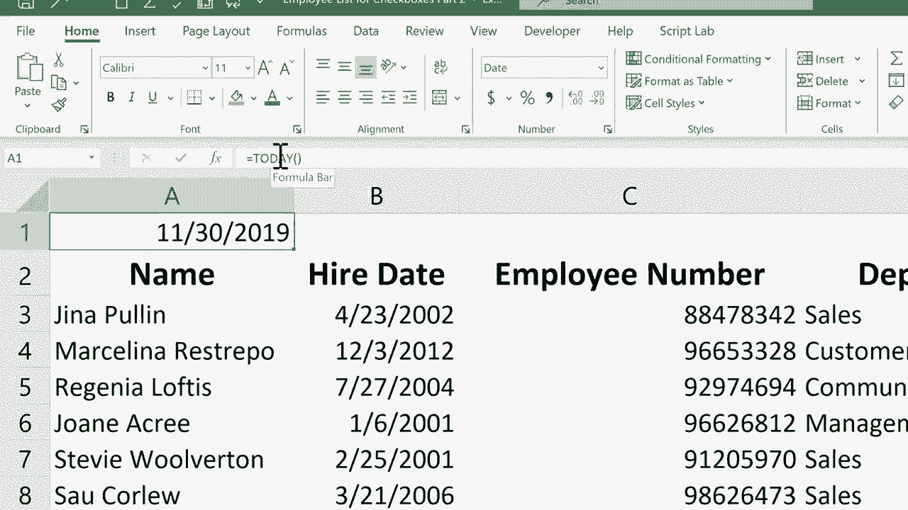

# 【双语字幕+速查表下载】Excel正确打开方式！提效技巧大合集！(持续更新中) - P17：17）快速输入当前日期和时间 - ShowMeAI - BV1Jg411F7cS

In this short Excel tutorial， I'm going to show you how to quickly enter today's date and time into your spreadsheets。

 In a previous tutorial， I showed you how to make it so that whenever you open a spreadsheet。

 the current date is printed in a particular cell。 Basically。

 all you have to do is use a formula equals today day， left parenthesis， right parenthesis tap enter。

 And every time you open the spreadsheet， it should display the current date。

 but sometimes that's not what you want。 for example， in this particular employee spreadsheet。

 I have a list of employees and their higher date。 I don't want the higher date to change every time I open it up。

 So every time someone is hired， I have to manually go in to column B and type let's say November 30。

2019。 and then tap return。 And while that's not too bad。 It is kind of time consuming。

 It seems like there should be a quicker way。 Just so you know， there are a couple of。

s to do this faster。 One that's slightly faster is you can click on a particular cell and just type the month forward slash and then the day and just leave the year off and tap enter on the keyboard。

 And Excel knows to just put in the current year。 But I want to show you a faster way to do this。

 All you have to do is click on a particular cell， hold the control key and then tap semicolon。

 When you do that， it automatically puts whatever today's date is right into that cell that is selected。

 And then you can just tap enter on the keyboard and you're ready to move on。 So control semicolon。

 I quick and you've got today's date。 Now what if the time that Jennifer was hired was also important。

 It doesn't seem like it should be。 But let's say that you'd like the current time of right now to be recorded in your spreadsheet。

 All you have to do is hold control。 hold shift and then tap semicolon。

 and it puts in the current time。I'll tap enter。 Now。

 it's important to know that this date and this time that I put in when I close this spreadsheet and open it up a week from now or 10 days from now。

 it will still say November 30， it will still say  Nine，37 PM。 These are dates that do not update。

 they do not change unless you click on them and type over them。

 That's different than this date up here。 This uses the today function。

 and every time you open the spreadsheet。 If it's a different day。

 it changes the date that's printed here。 If you'd like to learn more about the today function。

 watch my tutorial on that。 But meanwhile， I hope you found this tutorial to be helpful。 If you did。

 please click the like button。

