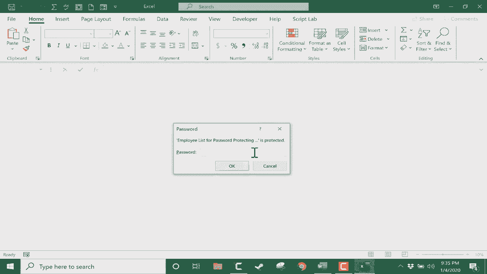

# 【双语字幕+速查表下载】Excel正确打开方式！提效技巧大合集！(持续更新中) - P18：18）Excel 文件密码设置 - ShowMeAI - BV1Jg411F7cS

In this Excel tutorial， we're going to look at a couple of different ways that you can password protectect your Excel files。 As you see here， I have an Excel spreadsheet with some very sensitive employee information。 Fortunatelyly， these are fictional people。 But you can see there's a list of names。 their higher dates， their employee numbers and whether they've done certain things。

 And so I want to make sure that this stays confidential。 There's a couple of things we can do to protect this information。 First of all。 and then there's a way to password protect it so that people who shouldn't see this won't be able to。 The first method for protecting a spreadsheet is to just go here to the review tab on the review ribbon in the Pro group。

 you can see that there is an option to protect the sheet or the whole workbook So let's look at how Pro sheet works here on this spreadsheet sheet number one。 I'm just going to click Pro sheet。 and you'll notice that there's all sorts of options。Here and one of the options we have is to add a password that is required if someone wants to unprotect the sheet。 For now， I'll just leave that blank。 I'll click O。

 So now watch what happens if someone looks at this spreadsheet and wants to change something。 they click， they type but Excel won't let them type over that existing data。 So this doesn't prevent people from seeing the data。 but it protects the data so it doesn't get accidentally or purposefully changed inappropriately。

 The problem with this is look， Someone that knows how to use Excel pretty well can just go up here to review unprotect sheet。 and now they can change that number。 So that's why it may be a good idea to click protect sheet and password protect it。 So I'll just put in a password。 click okay。 I have to confirm that password and notice this warning here。 If you lose or forget the password。 It can't be recovered。

 So this is pretty important that you remember the passwords that you use。 Now。 this is completely protect。From changes， people can still see the data， but they can't change it。 if they try to unprotect it asks for the password。 And as long as I can remember the password。 I'm able to unprotect the sheet。 So that's one option for password protecting an Excel file。

 but it doesn't fully protect it from view right， People can still see the data。 Let's look at a couple of the options we have for fully protect this spreadsheet and workbook。 so that no one can even see it。 So in many cases， a better way to protect your spreadsheet to more fully protect the information is to go to file。 And then click on info。 and that takes you to the info page and look， Pro workbook。

 Now I just click on that button and go down to encrypt with password。 So this is a great option here。 put in that same password。 I get the same warning about not forgetting。 click O reenter it just to make sure I didn't accidentally type it wrong。 And now a password is required to open this workbook。I'm going to now close out of this spreadsheet。

 this workbook completely。 But before I do， I need to make sure I save my changes。 including that password。 So I click save。 This should now be a completely protected spreadsheet。 I'm gonna drag that file onto the desktop。 Give me a minute to do so。 and then I'll resume the video。 So there is the file that I've password protected。

 I'm gonna double click on it to open it up。 Let's see if it'll let me access it。 No， it blocks it。 it's encrypted。 It's protected。 And unless the user knows the password。 They're not gonna be able to get in。 I just entered a guess， it wasn't right。 So I have no access to that file。 Let's try it again。 This time I'll put in the correct password。

 tap enter。 And I'm in， I can use it fully。 Now。 Thanks for watching。 I hope you found this tutorial to be helpful。 If you did， please click the like button below。