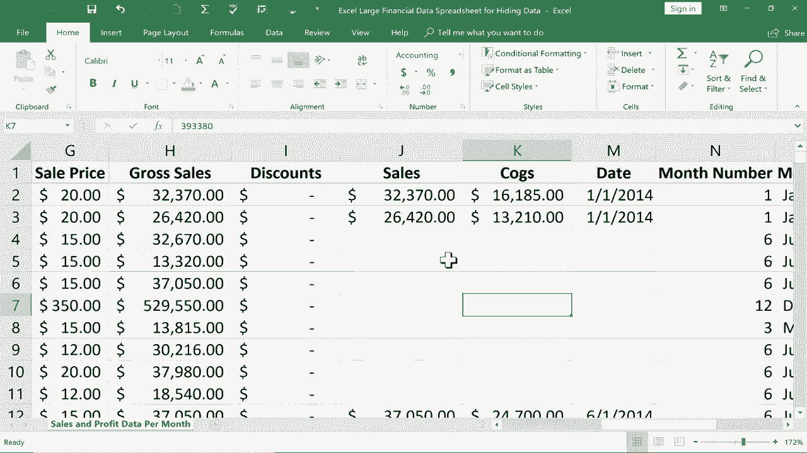

# 【双语字幕+速查表下载】Excel正确打开方式！提效技巧大合集！(持续更新中) - P19：19）隐藏数据 - ShowMeAI - BV1Jg411F7cS

In this tutorial， I'm going to show you how to hide data in Excel。 and we'll also talk about why it might be a good thing to do sometimes。 So here you can see I have a large financial data spreadsheet。 that is just hypothetical。 but it has manufacturing costs in here。 It has sale prices， gross sales， total profit。

 all of this data in this pretty big spreadsheet。 and it's also got the months and the years associated with those numbers。

I also have a second sheet here at the bottom that's called customer list。 And this has people's names， phone numbers， credit card numbers and the type of credit card。 But anyway， let's say that a partner of mine or an associated business that I work with needs to get some of the information in this spreadsheet。 But maybe I don't want them to have all of my customerss personal information。 And also。

 I might not want them to know。 for example， the profit that I'm earning from all of these sales。 So how could I send the spreadsheet without showing off the information that I don't want other people to see。 Well， the easiest way to do that， is to hide data。 you can hide rows。 you can hide columns。 and you can hide sheets。 So let's look at how to do each of those things。

 Let's say I would like to hide the data that's listed here about the product called Montana。 So I would like to hide all of these rows。 All I have to do is。Click and hold the click here at the left on the row number。 So row number 8。 I click and hold the mouse click and then drag down until I get all of the records that have Montana there in column C。

 And then I can release the mouse button And now to hide those rows。 all I have to do is right click on any one of the row numbers and choose hide。 So it looks like I've deleted row numbers 8 through 17。 but that's just not possible in Excel。 You cannot delete row numbers。 You can delete rows of data but the row numbers themselves never go away。

 So that means that they're hidden。 And I'm going to zoom in a little bit so you can see this just a little bit better。 in recent versions of Microsoft Excel。 It's become a little bit easier to see where there is hidden data。 So if you look really closely right here at the line dividing row 7 from row 18。 Theres a line that's just a little bit thicker than normal that indicate。

ates to me that there is hidden data。 Now， to unhide it， there's a couple of ways I could do that。 I could click and drag over the top of the hidden rows and then right click and choose unhide and everything is restored。 Now， the exact same thing works with columns。 As you would kind of expect。 So I'm going go over here to profit。 let's say I don't want the companies that I work with to know the profit that our company is making。

 All I have to do is click to select the column that I want to hide。 Now。 if I wanted to hide more than one column， I would click and hold and drag。 but in this case。 it's just the one column。 Now that it's selected， I right click and choose hide。 Also。 the customer list， this is important。 This is personal information from customers。

 I don't want people to see this。 So watch what I can do。 I can simply right click on the sheet name and choose hide。 And that sheet is hidden。 Now。 how would I unhide that sheet。 with rows and columns。 We know how to。with this column。 I could click and drag over the top of the hidden column and then choose unhide。 Well。

 what about sheets， You don't click and drag instead， just right click on one of the sheet names。 and then choose unhide。 And then you have to select the sheet。 you would like to unhide。 In this case， I only have one hidden sheet。 But in some cases。 you'll have two or5 or 10 hidden sheets and you have to unhide them one at a time。 So in this case。

 there's only one， I select it， I click okay。 and now it's no longer hidden。 I'm going hide it again。 because let's say I really do want to send the spreadsheet。 I want that to be hidden。 So now I can save this spreadsheet。 and I could send it off。 and that important information is safely hidden。 right， Well。

 some of you are thinking not really couldn't the person I send this spreadsheet to notice that there's hidden data and just click and drag to unhide it or right click to unhide hidden sheets。 Yes， they could。So that's a problem。 The solution to that， though， is here on the review tab。

 you can click here on Pro workbook， put in a password and click O。 It wants me to confirm the password。So now that I've protected the workbook。 if I go down and right click on the sheet name and try to unhide， look， it doesn't let me do that。 And so that's a way to protect data。 Now， unfortunately， look， that's not true here。

 if I click and drag across K and M and then right click， I am able to unhide the hidden column。 So just be aware of that。 there might be some people that are savvy enough to unhide a particular column。 And they can do that even in a protected workbook。 but they cannot unhide hidden sheets。 So what would I do in this case， where I don't want them to see the total profit。

 What I would do is I would just print。 So I would go into print And I could even save this as a P Df if I wanted to。 and then email this to the company that wants to look at it。 I wanted to show you one last trick。 In some cases， you may not want to hide an entire column or row or a range of rows and columns。 but maybe just one particular。Sell， what if I just want to hide this cell。 Well。

 there's kind of a tricky way to do that。 If you go to the home tab。 home ribbon here in the font group you can change the font color and change it to white。 And you can see it's not really hiding the cell。 but it does hide the numbers。 If someone clicks on the cell， then the numbers do show up here in the formula bar。

 So just be careful about that。 But that's a way to hide information that's in a cell or in a range without hiding everything in the entire column or row。 And now if I print this spreadsheet， it'll look like those are just completely blank cells。 Thanks for watching this tutorial， I hope you found it to be useful。 If you did。 please click the like button below。

