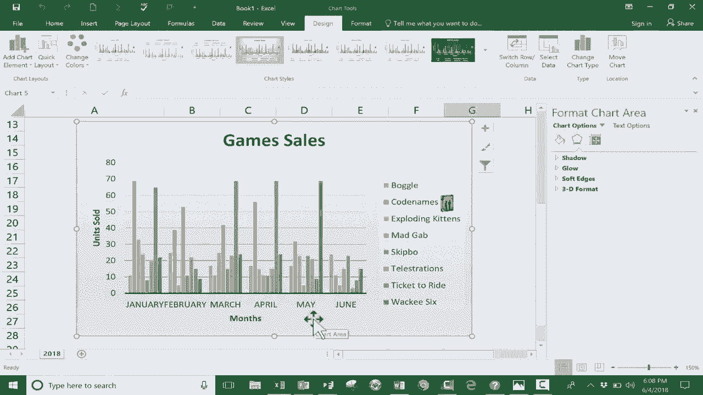

# 【双语字幕+速查表下载】Excel正确打开方式！提效技巧大合集！(持续更新中) - P2：2）快速简单的图表教程 - ShowMeAI - BV1Jg411F7cS

In this short beginners level tutorial， I want to show you a simple and quick way to add charts to your Excel spreadsheets。 And as you can see， the spreadsheet that I'm using for this tutorial is a spreadsheet of board games and card games。 these happen to be some of my favorite board games and card games。 But for this tutorial。 I'm pretending that I own a small business where I sell board games and card games。

 And you can see here at the left， I've got the list of games。 and then I have the first six months of the year。 And how many copies of each game have sold at the bottom。 I have total sales。 So 252 total games were sold in the month of January。 and so forth。 So let's say I would like to create a chart that shows off this data。

 And does it visually in a way that people can see and understand。 There are a couple of different ways I could do this。 But in this tutorial。 I want to show you the easiest method that I'm aware of。The first thing you're gonna want to do in most cases is click and drag to highlight the data that you want to turn into a chart Now the reason you want to do that is that it gives you the opportunity to exclude certain data that you do not want to include So for example in this case I really do not want to include the total number of items sold why because in this particular spreadsheet and in the chart I would like to create I want to be able to see visually what the best sellers are which one stand out and in which month did they stand out so that's kind of the information I'm looking for I don't really need grand total number of total game sold so I just click and drag to include everything else but to exclude that extra information now that I've done that I can simply hold the alt key and tap F1 the F1 key and that automatically generates for me a simple quick chart and it just puts it on。

On top of my data。 Now， if I want to， I could move that。 And the best way to move that is to just put your mouse kind of close to one of the edges of the chart。 If you're clicking here， you might have some problems。 So instead stay close to one of the edges of the chart and just click and drag and you can put it where you want to put it。

 In my case， I want to change the view。 I'm going to zoom out to 100 percent。 that gives me enough space to let's say put the chart underneath the data。 and now I can zoom in again maybe to 1 hundred50%。 So you can see that a little bit better。 So now I have my data above， and I've got my chart underneath。 Now you could put this on the right。

 you could put it on a different tab if you want to。 there are all sorts of options about where you put this chart。 So now let's look at the data that I got。 noticeice it says boggle。 and then it's got six bars code names6 bars Exploding kittens，6 bars。 each of these。

Games that I recommend has six different bars。 Now， what do the bars represent。 Well。 the first bars is January then February all the way through June。 Now that might be exactly what I want to see， right， That tells me that boggle is most popular。 at least in this past year in February。 and that code names was particularly popular in January and so forth。

 It also gives me some sense about what the most popular games are， right， looks like code names。 maggab ticket to ride。 Those seem to be the most consistently popular games。 According to this hypothetical data that I have here。 So this really might be what I want。 But I want you to know that you're not stuck just with the chart that's automatically generated up here at the top when you create a chart。

 you can go to the design tab and the format tab。 and these will appear if you've clicked on the chart that you've created。 And one of the options in design is to switch row and column。 So I can click that。And instantly。 my chart is transformed。 Now， I'm looking month by month across the bottom。 It says January。 And what do the bars represent， Well， blue is boggle oranges code names。

 green is teles and so forth。 And then I can look at February in March， et cetera。 So this is a little bit different information。 This tells me in January。 the hottest game seems to be code names。 But in March， the hottest game seems to be ticket to ride。 And you'll notice that there is a key here across the bottom。

 So I can just glance at that instead of doing what I showed earlier of just putting my mouse on the bar to have it pop up with an explanation。 I could have just look down here and seen， oh yeah， madgab is yellow。 Okay。 a few other things that you might want to adjust after you've created your quick， simple chart。 You'll notice up here in the design tab， the design ribbon， there's a chart styles group。

 And with this， you can just click or even just put your mouse over the chart。 to see the various chart types that you can。Choose from。 And there are some really nice attractive looking charts。 I kind of like this gray one。 If you don't like any of those that are shown here。

 you can go to this button on the right click on it and you get even more。 In my case。 I really like this one。 I'm going to just click on that and select it。 another option that you might want to be aware of that's on the design ribbon is this quick layout。 So with quick layout， you can go down and choose a different layout and you'll notice what happened。

 it gave me these access title access title labels here。 It also moved my key or legend over here on the right。 so I can see that in a list。 So that's one of the options。 that's just one of these 11 different quick layouts that I can choose。 And there's various ones that you would have to look through to decide which one you want。

 And I guess I'll go with this one here。 when I click on that it makes that change official And I really like how that looks。 but there still are。Coup of things off just a little bit here。 One of them is chart title。 I don't want it just to say chart title。 So， of course， I could highlight that。 and I could type in game sales January through June 2018。 So that's how you can fix that label。

 Just click on it and type。 Now there is another way to do that。 if you want。 you can just click。 type the equals sign and notice where it put the equal sign。 it put it up here in this formula bar and then just click on what you want to be there。 if the words exist somewhere in your spreadsheet。 So in this case， game sales。

 and then tap enter on the keyboard and it makes this label in my chart， match this cell。 Now I could do the same things with these axis titles。 or I could simply type。 and I'm just gonna type in this case。 I'll put in months。 So these are the months。 and then this label is for units sold。 So there we have， I think a really good looking chart。

 and it was simple and quick to create。I did have to make a few adjustments。 and you may have noticed that a panel opened up at the right。 The reason that happened is because I double clicked on the chart and it just opened up this panel on the right where I can adjust the fill color。 I can also adjust the gradient and do a pattern fill all sorts of fun interesting options you can also change the borders and there's even more that you can explore if you'd like to a couple of final notes that I want you to know about。

 let's say you want to make this chart even more visual and attractive looking。 What you could do is instead of having words here to explain what the bar colors represent。 I could insert pictures from my computer and these are images that I collected before starting this tutorial。 but I would like to insert one of these pictures and notice that I can resize that image and I could put it either on top of or next to the name of the game。

 Now that's kind of small， but at least you get。Sense of what the game it looks like。 So that's one thing I wanted you to see。 And notice， because I inserted that image onto the chart。 When I move the chart， the image moves with it。 It's part of the chart。 the other thing I wanted you to see is now that my chart is pretty much done。

 I can right click on the chart copypy and I can open up PowerPoint or word and even publisher。 And let's see what I can do with that chart。 So here in PowerPoint。 I can go to a new slide and I could paste and look that chart comes right in and the data is all there being pulled from Excel。 same with Microsoft Word and same with Microsoft publisherlish。 So thanks for watching。

 I hope you found this tutorial to be helpful。 If you did， please click the like button below。