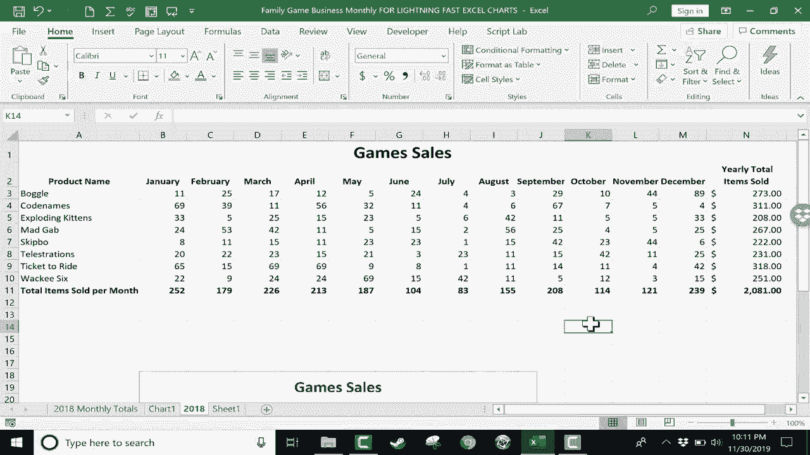

# Excel正确打开方式！提效技巧大合集！(持续更新中) - P20：20）闪电般的 Excel 图表 - ShowMeAI - BV1Jg411F7cS

在这个 Excel 教程中，我将向你展示如何用我将要展示的方法制作闪电般快速的 Excel 图表。你不用紧张。你不需要担心。你也不需要想太多。你基本上只需做几件事，然后按一个键盘快捷键，就能得到一个图表。所以让我们看看如何做到这一点。这里我们有一些关于棋盘游戏和纸牌游戏销售的数据。

你可以看到这里有一个有趣游戏的列表。然后是每个月和每种游戏的销售数量。在添加我的闪电般快速的 Excel 图表之前，我需要做的第一件事是高亮显示数据。而这里的数据是指在图表中重要的数据。所以这个游戏销售的标题，我可能不需要。但我确实需要游戏的名称。

所以我会点击这里的产品名称，然后点击并拖动到底部和侧面。现在。我不会包括总计，无论是底部的还是右侧的。那些会完全搞乱图表，让它们显得毫无意义。所以这就是我真正关心的数据。接下来是我的图表。

我只需输入以下键盘快捷键：Alt + F1。所以我按住键盘上的 Alt，然后轻轻点击 F1 键。这样就生成了一个 Excel 图表，显示你的数据。现在，它并没有给我选择图表类型的选项。它只是选择了我的默认图表类型。你可以在 Excel 设置中更改它，如果你愿意。如你所见，我已经点击并拖动角落，把它放大，这样你可以看到我只用两步就创建的这个精彩图表。

每个月都有列出，每种游戏用不同颜色的条形表示。因此我可以看到，在一月，游戏代码名称的表现特别好。在十二月，似乎拼字游戏是最常销售的游戏。现在，如果你不喜欢选择的图表类型，只需去图表设计选项卡。

因为我现在在电子表格中有一个选中的图表。我有一个图表设计选项卡，还有一个格式选项卡。我可以用这些来格式化和更改我的图表。让我们看看在图表设计中制作这些闪电般快速的 Excel 图表时你可能需要的一些选项，你可能会选择更改图表类型，而不是默认的类型。

所以这是我默认的簇状柱形图。我可能会把它改成堆叠柱形图，然后点击 O。这样你可以看到二者的区别。通过这种方式，我可以看到一月和十二月是我整体销售游戏的最佳月份，但我也可以快速查看每个月销售最好的游戏，代码名称在这里搞糊涂了。颜色编码与下面这些标签相对应。所以这种图表类型可能更好。

我可以再次点击，改为，比如说，一个3D堆叠柱形图。这看起来挺酷的。就这样。如果我真的想让它复杂一点，我可以切换到3D柱形图。对我来说，这有点难以阅读和理解，但还是挺酷的。所以我要回到堆叠柱形图。现在，让你知道一下。

如果你想要不同的图表类型作为默认值，你只需右键点击它并选择设为默认图表。好的。所以我会点击确定，看看我的图表。还有一个或两个选项你可能想了解的，可以在图表设计选项卡和功能区找到，比如更改图表样式。这看起来挺酷的，换成那种样式。这里有一整套样式可以供你快速选择。

你也可以在这里点击更改颜色。你可以选择单色。可以改成橙色或者你想要的任何颜色。我将撤销这些。此外，除了图表设计选项，还有一些格式选项。你也可以通过格式选项卡对图表进行这些细微的修改。

我将删除这个图表。尽管它看起来很美观。我只是想向你展示另一个键盘快捷键。你可以使用W键根据这里的数据创建图表，但如果你想把图表放在另一个工作表上，重复一次，你只需选择数据。现在。

如果我不选择数据，看看会发生什么。如果我只是点击数据内部的某个地方，比如这里，然后再按一次alt F1。你可以看到它的效果，它仍然会创建图表，即使我没有点击和拖动来选择所有数据。

它仍然创建了图表，但包括了我的合计。所以第一件你需要做的事情就是点击并拖动选择你的数据。但如果你的电子表格没有合计，比如说你有一个巨大的电子表格，不想点击和拖动选择所有列和行。

其实有一些快捷键可以帮助你做到这一点。不过如果你不想麻烦，就确保数据的上方或下方没有合计，然后在数据内部的某个地方点击。在这种情况下，我只是要点击并拖动选择重要数据。这次因为我想让图表出现在这个电子表格上。

但在新的额外工作表上，这种情况下我只需按F11键。你可以看到它为我添加了一个新工作表。现在，这次图表看起来对我来说有点奇怪。所以我可能会去更改图表类型，切换到另一种布局或另一种外观，然后点击。所以，总结一下。

创建一个快速的Excel图表，你只需选择数据，然后按alt F1在当前工作表上创建图表。如果你不想在当前工作表上，只需选择重要数据，然后按F11键，它会把图表放在一个新的单独工作表上。

感谢观看，如果你想要一个关于如何在Excel中创建图表的完整教程，请观看我之前制作的关于创建Excel图表的视频。在此期间，希望你觉得这个教程有帮助。如果是这样，请点击“喜欢”。
