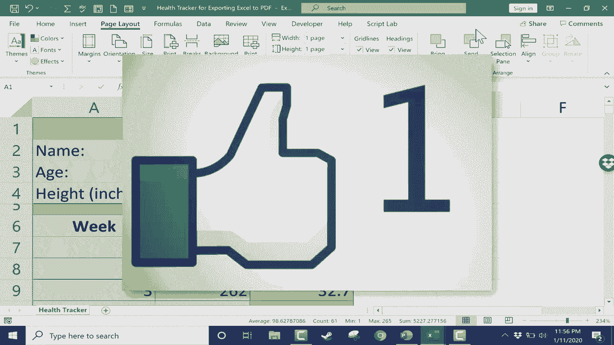

# 【双语字幕+速查表下载】Excel正确打开方式！提效技巧大合集！(持续更新中) - P21：21）将 Excel 文件导出为 PDF - ShowMeAI - BV1Jg411F7cS

In this short Excel tutorial， I'm going to show you how to easily export Excel files into P Df format。 And here's an example of why that's important。 here I have a health tracker。 let's say I'm a personal trainer and I'm working with Jason Smith and he's made some good progress。 as I've been working with him， he's lost some weight。 But after 17 weeks， our time is up。

 And I would like to be able to send him a report of his progress and how he did。 The problem is。 Jason doesn't have Excel。 And maybe he doesn't understand how to use things like Google sheetets or open office。 And so it's going to be pretty hard for Jason to really benefit from this spreadsheet。 I could print it for him and mail it to him。 But if I wanted to send him a digital version of this spreadsheet。

 knowing that he doesn't have Excel。 Probably the best way to do that is to turn it into a P D F file。 pretty much everyone can access and look at P D F files to do。This I simply go to file and that takes you to this screen here and then go down to export。 So I click on export and look， there's an option for create Pdf document。

 And I can just click this button。 I'm going keep all of the defaults that are here。 and I could change where it's going save to。 For example。 I'll save it to the desktop So I click on desktop and publish。 And once it's done publishing。 it opens up the Pdf that I've created so I can review it。 Now。

 what that did is it exported the entire spreadsheet as a Pdf。 and notice it got data that I don't really need。 Jason has dropped out after 17 weeks。 He doesn't need all of this other data。 So I'm going close out of that and show you a couple of other options。 For one thing， I could have selected just the data that I want to export and then gone to the file tab down to export and then clicked options。

 And at this point， I could have picked。Seelection。 so now it's just going to turn the selection into a Pdf。 So I'm going to choose that and then choose publish。 Here's my new Pdf。 And now it's nice and short。 Now there are other ways to export。 You can go to the file tab。

 and then do save as And then here there's a drop down arrow。 I can click on that。 and I can switch it from Excel workbook to Pdf。 So that's another way to do the same kind of thing。 It's just a little bit harder to find that option。 And then one other tip。 before you do this。 you may want to go to the page layout tab。 And look in the scale to fit group。

 And then you could set the width and the height to be one page。 And now let's try it again。 I'll click on file export， create Pf。 and I'm going to go to the options and make sure it's dealing just with the selection。 I click okay。 let's publish。 Now you'll notice there's a warning It's。I already have a Pdf with that exact name。 But that's okay。 I'll just replace it。

 And let's look at the results。 It didn't change much。 It looks very similar。 That's okay。 But in some cases， that page layout scale to fit and setting the width and the height to one page or two pages or whatever you need。 That may be important because it'll help shrink the data so that you can fit more onto a particular sheet。 Thanks for watching， I hope you found this tutorial to be helpful。 If you did。

 please click the like button below。