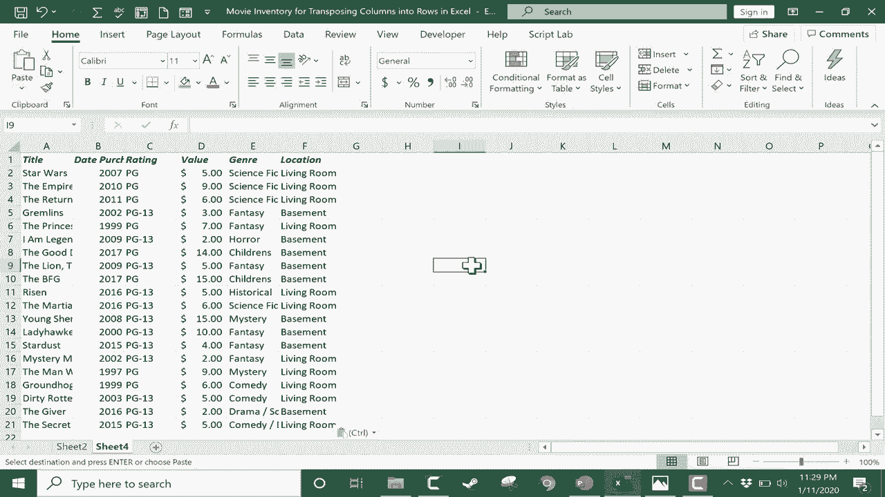

# 【双语字幕+速查表下载】Excel正确打开方式！提效技巧大合集！(持续更新中) - P22：22）将列转换为行 - ShowMeAI - BV1Jg411F7cS

In this short Excel tutorial， I'm going to show you how to transpose columns into rows in Excel。 So here we have a spreadsheet of someone's personal movie collection。 And you see the titles here and some information about those titles over here on the side。 Now。 let's say I'm building this spreadsheet。 And then I decide I did it wrong。

 Instead of having column titles here across the top。 I really would like them to be row titles and to have them listed here vertically。 Sometimes your purpose for the spreadsheet changes。 And therefore， the design has to change。 And so when that happens to you， this is how you can transpose columns into rows。

 Step 1 is to click in the upper left corner of the range of the data。 So my data is really right here。 That's the heart of my data of my spreadsheet。 So I'm just going to click in the upper left corner and drag to the lower right corner。 Now。 perhaps you're really looking to transpose the entire。

SpreadheetIt is possible to select the whole spreadsheet。 You can click this button here in the upper left and it should select all of the data。 but in my case， really all I want to transpose is that information there。 So now that it's selected。 copy that range。 and I did that by holding control and tapping C。

 but there's other ways to copy of course。 next， in order to transpose this in a clean way。 I'm going recommend going to a second sheet。 So I've been working on sheet 1。 but I can click on this button here to add a second sheet， it called it sheet 3。 but I'm going rename that and call it sheet 2。 And now I'm just going go to sell a1。

 And now I need to paste in the data。 but not a regular paste。 Instead。 I need to go here to paste special。 And when you click on paste special it gives you a list of some special ways to paste as you would guess one of those is to paste while transposing。

 So click that and then click O and look now。My data in that spreadsheet has been transposed。 Colns have become rows and rows have become columns。 Now I can clean up this data pretty easily。 You can see a lot of it doesn't fit in the provided space。 but if I click and drag and highlight all of the column letters。

 I can then double click between any two of the column letters right on the line between them。 and that should automatically resize all of the columns so that the data inside them can fit perfectly。 if it's not about making everything fit perfectly， but you just want them all the same width。 you could click and drag and make them identical in width。

 So I have successfully transposed columns into rows。 And now I can delete sheet1。 I'll just right click on that and delete it if I'm sure I don't need it。 And then of course。 maybe I change my mind in which I hadn't deleted it。 Well， that's okay。 it's the same exact process to transpose back。 highlight the data that's important。 copy。

 create another sheet。 find a。Space in the sheet。 It's all blank for me。 I'll go to a1。 right click paste special transpose。 And now we're back to my original layout。 Again。 I could adjust those column widths to make it so that everything fits。 Thanks for watching this tutorial。 I hope you enjoyed it。 If you did。

 please click the like button below。😊。