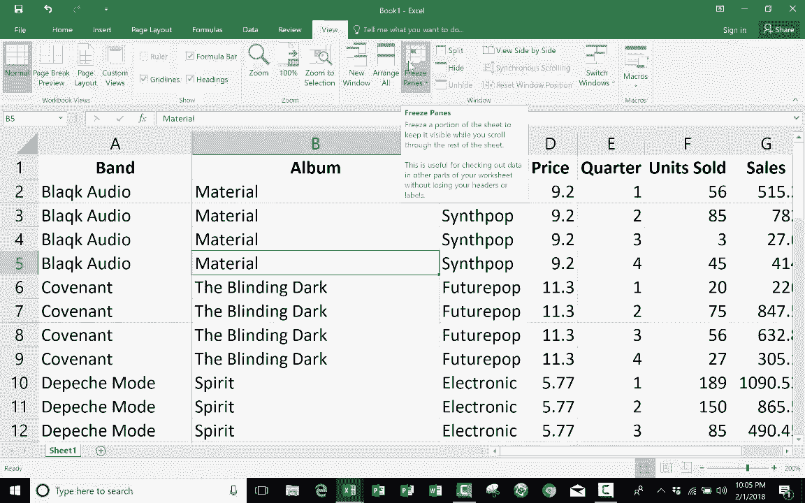

# 【双语字幕+速查表下载】Excel正确打开方式！提效技巧大合集！(持续更新中) - P23：23）使用冻结窗格 - ShowMeAI - BV1Jg411F7cS

In this short Microsoft Excel tutorial， I want to show you a tool called freezeze panes。

 And I want to illustrate for you how it's useful。 And to do so， I have a simple spreadsheet here。

 It's basically just a list of synth pop bands and their recent albums。

 And there's some other information here as well。 But notice as I browse down the page。

 It's easy for me to lose track of what each of these columns represent。 Because my column titles。

 band album genre price sales。 that all gets lost as I browse down the page。 Now。

 this is just a list of 30 records or so。 But imagine what if I had a spreadsheet with thousands of records。

 Thouands of rows， or even just hundreds of rows。 It would be very easy to get confused about what does this number one represent。

 What does 20 represent， What does it mean， And that's where the freeze panes tool comes in very handy。

 Basically， what it allows me to do is it makes it so that I can freeze row number one， for example。

 So that it's。

Stays there at the top of the screen and doesn't disappear and go away。 So as I browse down the page。

 I would always be able to see row number one。 Let's look at how to activate freeze panes。

 There are basically two different ways you can do it。

 the classic oldfashioned way to do it would be to click on the row underneath the row that you want to freeze So I clicked on row number two It highlighted the entire row and now I can go up to the view tab and notice there's freeze panes。

 I just click on that and choose freeze panes。 It doesn't look like anything happened。

 but now watch as I browse down the page row number one stays at the top。

 So I always know what the numbers mean and what the text means。

 So that's the classic way to activate freeze panes and it doesn't have to always be this top row。

 I'm going to unfreeze panes。 and I could choose if I wanted to to freeze rows1 through 17。

 In order to do that， I just click on row 18。 go up to freeze panes freeze panes now。

The first 17 rows are all frozen Okay so like I said。

 that's the classic oldfashioned way of doing freeze panes。

 The newer method is simply to not worry about what column you're in about what row you're in or what cell is selected but simply to go up here to freeze panes and choose freeze top row So this way you don't even have to worry about which row should I select or anything like that。

 you simply go up to freeze panes and choose freeze top row and it has the exact same effect as if you had done at the oldfashed way noticeice that there is also an option to freeze the first column if you choose that。

 then the column at the far left stays visible no matter how far to the right you go So I hope you find freeze panes to be helpful and I hope that you found this video to be helpful If you have please click the like button below。

