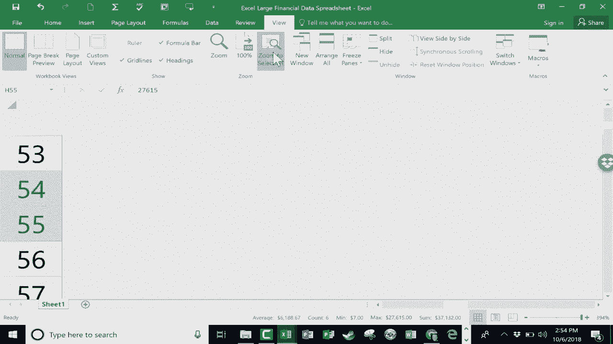

# 【双语字幕+速查表下载】Excel正确打开方式！提效技巧大合集！(持续更新中) - P24：24）在 Excel 电子表格中导航 - ShowMeAI - BV1Jg411F7cS

In this video tutorial， we're going to look at an issue that comes up in Excel sometimes。

 and that is how to navigate around a huge spreadsheet。

 So we can all deal with the small spreadsheet， Let's say there's 10 or 15 records in the spreadsheet。

 It's easy to kind of move around and keep track of the data。

 But what about when you get hundreds of these records or thousands even It's easy to kind of lose track of the data where it is and how to get to different parts of your spreadsheet quickly。

 And so let's look at a few options that you have。 The first thing I would point out is over here in the lower right corner。

 We have a view zoom level。 And for me right now， it's set to be 235%。

 But I can just click and drag on this bar to make it much smaller。

 And so I can quickly get a sense of the data in my spreadsheet。 Now， you'll notice when you do that。

 look what happens to some of the data。If the data doesn't fit naturally in the columns。

 you'll get these pound signs， don't worry about that。

 the data is still good and watch as I go bigger again， zoomed in more。

 those pound signs disappear so that's one thing you can do to get a sense of your data。

 how big it is， where everything is， just change that zoom level。Now。

 there is another way to do the same thing， and that is by holding the control key on the keyboard and then using the scroll wheel on your mouse。

 If you scroll up， it zooms in。 if you scroll down on the scroll wheel， it zooms out。

 And you can see it' adjust here as well。Next， let's look at how to jump from maybe the top of your spreadsheet down to the bottom。

 So here I am pretty much at the top of this spreadsheet。 And I'm looking at the information。

 looking at the data。 But now I'd like to get back down to the bottom of the sheet to enter more information。

 There's a couple of ways I could do this。 One is to use a keyboard shortcut。

 If you hold the control key and then tap the end button。

 it takes you not only down to the bottom of your spreadsheet， but also to the right edge。

 So the bottom right corner of the range of your data， and that worked beautifully for me。 Now。

 what if I want to get back up to the top， there's another keyboard shortcut for that。 And that is。

 hold control and tap the home button。 and that takes me to the upper left corner。Now。

 there is another little known way to do a similar thing。 Let's say I'm here in column G。

 And I would like to get down to the bottom of the spreadsheet。

 but I don't really want to go to the bottom right corner。 So I'm not going to use control end。

 I just want to get to the bottom of column G。 Watch this。

 I'm going to increase the zoom just a little bit so that you can see this better。

 But watch this technique。 All you have to do is go to the bottom edge of the cell that you're in at the moment。

 Put your mouse right there on the bottom edge and then click twice fast。And that quickly。

 it took me to the bottom of the spreadsheet。 Now， if I want to get back up to the top in the same column。

 I just double click on the top edge of the cell that I'm currently in。And it takes me up to the top。

 So what a beautiful， simple and elegant way to get to the bottom of a spreadsheet and also to the top of a spreadsheet very quickly by double clicking。

 And as I pointed out earlier， it keeps you in the same column that you're currently working in。

The last technique I'd like to show you is， let's say， as you're zooming in， zooming out。

 jumping to the top to the bottom， maybe the bottom right corner of your spreadsheet。

 let's say you get to a point where you find that you want to just work on one section  one range in your spreadsheet at the moment。

 maybe just this part。 that's what I want to work on now。 I can click and drag to highlight it。

 and then I can go up here to view and I can choose to zoom to selection。 Let's see what that does。

 It maximized the view。 So that that section that I highlighted。

 is zoomed in as much as it possibly can be。 Now， if I had chosen a different part of the spreadsheet and clicked zoom to selection。

 You can see it's much more dramatic。 So those are three or four tips and tricks that you can use in Microsoft Excel to help you move around your spreadsheets。

 especially big ones， and that can help you to see the。

Data and navigate around the data a little bit better and easier。 Thanks for watching。

 I hope you found this tutorial to be helpful。 If you did， please click the like button below。

