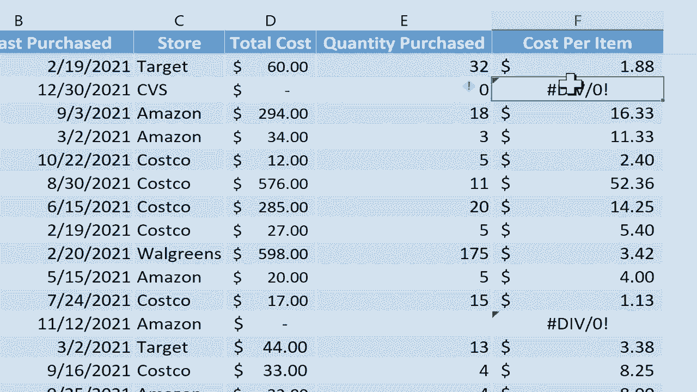

# 【双语字幕+速查表下载】Excel正确打开方式！提效技巧大合集！(持续更新中) - P25：25）修复常见错误：NULL、NUM 和 ##### - ShowMeAI - BV1Jg411F7cS

这个视频是修复常见Excel问题的。第二部分。这是一个三部分系列的第二个视频，介绍一些修复常见Excel错误的策略。我这里有一个电子表格与这个视频配合。我希望你通过查看视频下方的描述来下载它。

这个工作簿应该看起来很熟悉。如果你看过第一部分，你会看到它仍然有div0错误消息。如果你想了解如何修复div 0错误消息，请在这里观看第一部分。在第二部分，我们将看一些修复空值错误、nu错误和井号错误的策略。

首先从空值开始。你会看到空值错误的主要原因是如果在公式中使用了空格，而实际上应该使用逗号或其他符号。所以让我们做一个例子。假设我想计算前面的总成本。

这个列表中的项目以及最后五到六个项目，我想在中间的部分省略一些东西，比如运送信封。我不想包括那些。所以为了做到这一点，我会到右边去，假设是G4，虽然不一定非得在那，我会输入等于。所以这个单元格等于什么呢？我会放一个左括号，然后点击并拖动。我可以在这里输入单元格引用，但我会直接点击并拖动，获取列表中前8个项目。我想加上这个，但我还想加上，比如橡皮擦。于是我在公式中留一个空格，然后往下到橡皮擦那儿点击并拖动，获取剩下的项目。所以回到我的公式，你可以看到它的样子。我会在键盘上按回车，但它给了我一个空值错误。原因是这个空格。

在这里，我不应该放一个空格。每当你在这种情况或类似情况中放一个空格，它会试图识别两个范围的交集。它在寻找两个范围的交集。好吧，猜猜看。我选择的这个范围与这个范围没有交集。没有交集。

这就是为什么它会产生错误消息的原因。不，两个范围之间没有交集。因此我真正想做的，应该做的，是放一个逗号。现在，如果我在键盘上按回车，它正在累加这个范围并将它们加在一起，给我1757。所以如果你看到这个空值错误，请仔细检查你的公式。

确保你使用的是正确的符号，并且没有多余的空格。很多时候，这将解决错误。接下来，我们来看**无效**错误。对于这一点，我要切换到我的工作簿中的健康追踪电子表格。如你所见，这个健康追踪器是用来跟踪杰森·史密斯的健康，他正在尝试减肥。

你可以在这里看到他的体重和与前一周的变化，这通过一个公式进行了跟踪，你可以看到那个公式。很简单，挺容易的。不知道为什么，但就说我需要知道杰森每周减掉多少磅的平方根。

嗯，我可以这么做，我可以输入等于SQRT，注意它说返回一个数字的平方根，那个数字是什么？就是这里的这个。所以我点击那里，然后放入左括号。现在我需要放入这个数字。所以我在这个情况下点击数字0，但实际上点击的不是数字，而是单元格引用C7。

然后我会在键盘上按下回车，这样你就得到了结果。0的平方根是0。现在，我要使用自动填充手柄，这个小绿方块在单元格的右下角。我会点击并按住，然后向下拖动页面，这样就复制了那个公式，并且效果很好，只是出现了几个**无效**错误。现在。

我为什么会得到这些**无效**错误呢？基本上，当你有一个试图产生无效数字的公式时，你会看到**无效**错误。所以如果你告诉Excel进行一个不可能的计算，它是无法做到的。这是不可能的。因此，它可能会给你这个**无效**错误。那么为什么这是不可能的呢？好吧，我告诉Excel给我-4的平方根。如果你知道平方根是如何运作的。

得到-4的平方根是不可能的，因为它是一个负数。对于-3也是同样的道理，得到它的平方根是不可能的。

所以每次你看到这个**无效**错误时，仔细检查你的公式。检查你的数据，确保你没有对Excel提出不可能的要求。解决方法是简单地将负数改为0。但在这种情况下，这并不能反映现实。因此，你可能想要使用一个**如果错误**公式。

希望你能看到我是怎么做到的。所以等于如果错误左括号，然后是我之前使用的公式，然后我会放一个逗号，再放上引号和引号。因此，这基本上会在屏幕上打印一个空白。什么都没有。然后我可以放上右括号并按回车键。

现在如果我把那个公式写下来，你会注意到它的作用。如果出现了一个**无效**错误，它会将其清除，假装没有错误。如果没有错误，那么它就会按照我在这里创建的带有平方根的公式进行计算。现在还有其他情况你会看到**无效**错误。

从技术上讲，当数字对Excel来说太大或太小时，“numb”错误有可能出现。这种情况很少发生，我敢打赌你从未遇到过。但Excel能显示的最大数字是1后面有308个零。如果你尝试更高的数字，它会产生“numb”错误。为了演示这一点。

我将在这个单元格中输入等于号。所以这个单元格等于。假设2000的幂，而表示这个的方式是用这个小的插入符号，对我来说是键盘上的Shift 6。然后我输入，假设7676。所以我要将20提升到7676的幂。我们来试试这个。

我在键盘上按下回车，结果出现了一个错误信息，因为我的公式产生了一个太大的数字。这个数字超过了1后面有308个零。因此，Excel无法显示它。现在，这对于负数也是如此。如果我尝试输入或计算一个小于-1后面有308个零的数字，这也会产生“numb”错误，因为这个数字对Excel来说太小，无法显示。

你可能会看到“numb”错误的其他原因，这些情况相对少见。但是要注意我分享的那两个例子。我们将在这个视频中查看的第三个错误信息非常简单，容易且非常常见。我将使用这个第三个电子表格。

电影库存电子表格。这里我有一份电影清单，以及购买这些电影（DVD格式）所支付的费用。因此，我将往下移到底部，想要获得一个总计。我只需上移，使用主页选项卡中编辑组的自动求和按钮。我只需点击一下，它会自动求和该列中的所有内容。我在键盘上按下回车。

但是看看，我得到了这个可怕、丑陋的井号错误。原因非常简单，解决办法也很简单。这个符号的意思是Excel无法在提供的空间内适应该单元格的内容。你会注意到，如果我往上看列字母D，我将移动到D和E之间的线。

我可以点击并拖动，如果我愿意，可以把它调得更窄。如果我这样做，你会注意到之前的文本变成了井号。这表明这实际上只是关于空间的问题。它是关于能够显示单元格内容的问题。解决这个问题非常简单。你只需点击并拖动以为该列提供更多空间。

这样所有这些单元格的内容就会显示出来，并能够适应提供的空间。还有一种更简单的方法。你只需在此情况下双击D和E之间的线。只需双击，这样会自动调整列的宽度，使其完美适合以便显示所有内容。

我们已经看过三种常见的错误信息，null、nu 和 hashtag 错误。我向你展示了一些解决这些错误的最佳技巧。请关注这个系列的第 3 部分，在那里我将讲解 ref 错误和 value 错误。
