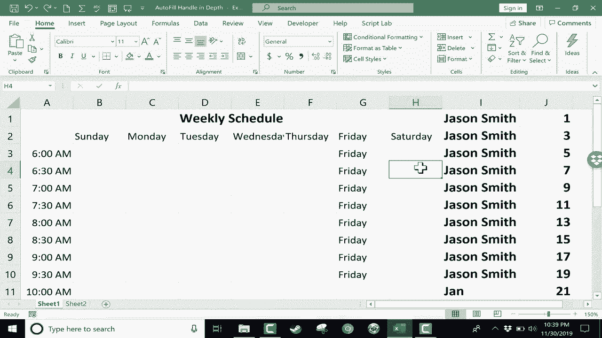

# 【双语字幕+速查表下载】Excel正确打开方式！提效技巧大合集！(持续更新中) - P27：27）深入了解自动填充句柄 - ShowMeAI - BV1Jg411F7cS

在本教程中，我将重点介绍 Excel 中的自动填充句柄，有时也称为填充句柄。我在我的中级 Excel 技能教程中提到过这一点。但我想在本教程中专门关注自动填充句柄。什么是自动填充句柄呢？基本上，它就是你点击的单元格右下角那个看起来无辜的绿色方块。

所以如果我点击这个单元格，它看起来很无辜，似乎没有特别强大或有用的功能。再来一次，这个小绿色方块的用途是什么？一般来说，它帮助你复制单元格的内容。例如，如果我在 I1 单元格中输入一个名字，然后按下键盘上的回车键，那么这个名字就会在单元格 I1 中。

然后我可以点击 I1，找到自动填充句柄，点击并保持，然后向下拖动，它的作用是什么呢？它复制了 I1 的内容，并复制到我拖动的范围内。对于文本，它也是如此，尽管有一些例外。但如果你想复制文本，请点击包含文本的单元格，然后去找自动填充句柄。

点击并拖动，它就会向下复制内容。现在对于数字，有时情况会有所不同。那么我们来试试一些数字。在 J1 单元格中，我输入 number1，然后点击其他地方再回到这个单元格，接着我点击自动填充句柄并向下拖动。你可以看到，它仍然复制了 number1。

所以对于数字也是同样的情况。然而，自动填充句柄也可以用来扩展模式，因此我可以建立一个模式 1，2，3。然后我可以点击并拖动，以向 Excel 显示这个模式。通过突出显示这 1，2，3，Excel 是聪明的，它在识别，好的，他想要继续这个模式。因此，现在我使用自动填充句柄，看看它做了什么，它扩展了这个模式。现在。

这种模式可能会有点复杂。如果你想让它变得复杂的话。我可以输入，比如说一些奇数，只需点击并拖动以突出显示奇数，然后使用自动填充句柄。看看，它继续了仅有奇数的模式。所以你可以尝试一下，看看 Excel 中的自动填充句柄能够识别什么样的模式。

现在，自动填充句柄，或者说它也可以叫填充句柄，对与时间相关的任何内容都特别有效。因此，我们这里有一个时间，左侧是一个每周日程安排。现在有一天是星期天，但我想在这里添加所有的日子。日子与时间有关吗？是的，确实如此。那么如果我点击星期天并使用自动填充句柄，会发生什么呢？

我可以点击并拖动，当我这样做时，你可以看到预览出现在下面。因此，我可以看到它正在扩展模式。现在，实际上没有模式，但因为“星期日”与时间相关，自动填充手柄自然会理解我想要“星期一”跟在“星期日”后面。如果情况不是这样，通常是的，你确实希望“星期一”跟在“星期日”后面。

但是如果我只想要“星期日”这个词不断重复呢？如果你想在Excel中强制自动填充手柄像之前那样复制而不是扩展模式，你只需点击单元格，使用自动填充手柄，但在点击之前，按住键盘上的控制键，然后拖动。这样就可以了。

这强制它复制，而不是扩展模式或跟随时间序列。我将撤销，因为我确实想要星期几的日子。我会先清除掉杰森·史密斯这里多余的记录。现在，让我们看看时间。这里是早上6点，我将去自动填充手柄，点击并拖动，直到。

说晚上10点，因为一天中的时间与时间有关。自动填充手柄知道该怎么做。它只是给每个单元格添加了一个小时。当它到达PM时，它毫不犹豫，直接切换到PM。现在，你可能会想，如果我想要的不是早上6点到7点，而是早上6点到6:30呢？那就直接输入6:30 AM。

然后向Excel展示模式。因此我点击并拖动以突出显示6和6:30。这就是模式。我去自动填充手柄，点击并拖动向下。现在，模式变为每30分钟一次，而不是每60分钟一次。所以这个自动填充手柄真的很聪明。与时间相关的其他功能也包括月份。

所以是1月。你可以拼写出来，或者缩写，但自动填充手柄会理解为与时间相关的月份。因此，它会自动扩展模式。但如果你不想这样做，可以按住控制键并点击拖动自动填充手柄，这样它只会复制而不是扩展模式。

现在，还有一点需要注意。当你处理像这样的可管理的小电子表格时，实际上只有20或30行，直接点击并按住自动填充手柄向下拖动是完全合理的。这并不麻烦，也不难，但想象一下一个有500行、1000条记录的电子表格，点击并拖动自动填充手柄会是多么乏味。

好消息是，你可以突出显示单元格，或者在这种情况下，突出显示你想复制或扩展的模式范围，然后直接去自动填充手柄双击。现在，你可以看到它做了什么，它将模式扩展到我的数据所及的范围。

因为我的数据只到第19行，这就是自动填充双击的极限。没有数据在它下面，所以如果我去到新表，输入“1月”，然后点击单元格并双击自动填充句柄，你看，什么也没发生。为什么呢？

因为“1月”已经是我数据的底部了，下面没有数据。如果我添加一些数据，那么现在我可以双击，它会扩展模式或时间序列，直到我的数据结束。所以在第一张表上，我可以在4月的自动填充句柄上双击，它会填充到剩下的部分。所以我希望你能寻找机会使用自动填充句柄。

当你处理像这样短的列表时，请使用点击并拖动的方法。如果列表更长，你可能想双击自动填充句柄，让它自动填充到页面下方。然后记住，如果你不想扩展模式或时间序列，只需在点击并拖动时按住控制键，它将简单地复制和重复。

感谢观看。我希望你觉得这个教程对你有帮助。如果你觉得有用，请点击下面的点赞按钮。
