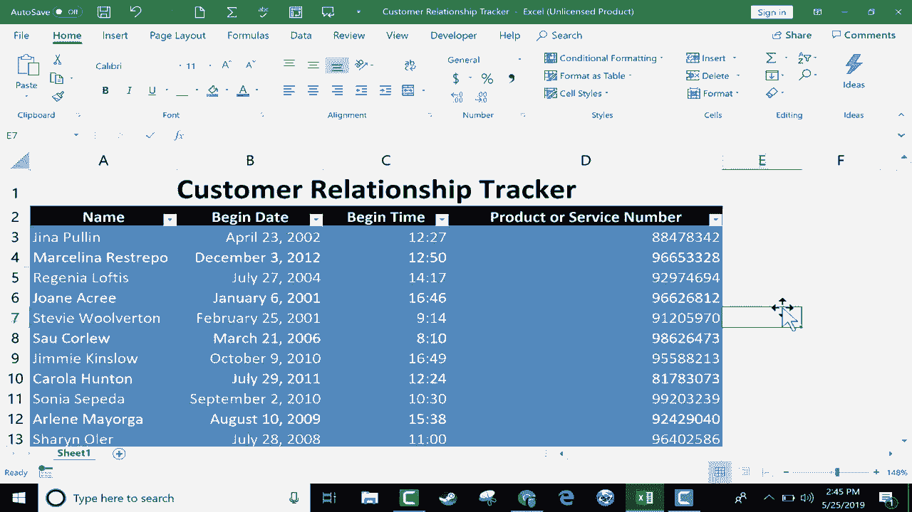

# 【双语字幕+速查表下载】Excel正确打开方式！提效技巧大合集！(持续更新中) - P28：28）数字格式说明 - ShowMeAI - BV1Jg411F7cS

In this short Excel tutorial， we're going to look at the variety of number formats that we have available to us in Excel。

 And for this video， I'm using a customer relationship tracker spreadsheet。

 And you can see it's got lots of dates and lots of times and some numbers。

 And you'll notice that the dates and times， especially are formatted in a specific way。 Here。

 we have the first three letters of a month。 Then the date comma and then the year。

 But what if you prefer a different format than this for your dates。

 Let's look at how to change those up。 The first thing you would do is select the column that you want to change the format for。

 So I just left clicked on column B。 And then we just go to the home tab， home ribbon。

 and here in the number group， we have some formats。 right now， it says that the format is general。

 And the reason for that is because I have the entire column selected。 So it includes。

Text in these cases and also dates down here。 So it has to say general。 But again。

 I'm gonna to click on column B and then go to the number group and change it from general to number。

 And the first time I did this。 I thought， wow， that's kind of odd。

 How did the specific date that was here， transform suddenly into a number。 Well。

 the reason that happened is that in Excel dates and times are handled as numbers。 So， for example。

 over here on the right， I'm just going to put in the number one。

 And then I'm going to click on it and go to the number group and switch to short date。

 And you see what happened， the number one， if it's formatted as a date will be January 1，1900。

 Let's check out the number 55，55 as a date is February 24，1900。

 So that's a little bit strange and hard to get used to it first。

 but that's why these dates turned into numbers。 Okay， that's not at all。What I want。

 So I select column B again， and then I'll go back here， and let's look at what else we can do。

 I can turn these dates into currency。 So that's a number format that I can use。 again。

 doesn't make sense in this case。 but in many cases， you will want to format numbers as currency。

 underneath currency， we have accounting。 and it's very similar to currency。

 but instead of having the dollar sign right next to the numbers。

 the dollar sign is separated away from the numbers。

 and that just makes the number a little bit easier to read。

 I really like how this looks with accounting format。 We also have short date。

 and this format has changed my three letter abbreviations of April and so forth。

 and turn them into just numbers。 I really like that option。 Let's look at long date。

 You can see what that did。 Now it includes the day and the date along with the year quite。

longeronger than it was before takes up more space。 We can also format it to be a time。 And again。

 it doesn't make sense in this case。 So I'm going to switch over to the next column where we do have some times。

 and I'll click select time。 And by doing that， it added AM and PM to each of those times。

We have percentages， and this isn't going to make much sense。 But if I select column D。

 let's look at that。 I can format this text to be percentages。 I can format them to be fractions。

 which in this case didn't work out so well。 And I can also set these numbers to be formatted as text。

 So they're treated similarly to how Excel treats text。

 So those are the default number formats that are in Excel。

 But what if you're still not happy with the results。 For example， for me。

 these dates are a little bit too long。 I would like to shorten them up。

 but not all the way to short date。 So in order to get this number format just the way I want it to be。

 I need to do one of two things， I can either go to the launch button here in the corner and click or I can be here in the list of number formats and go to the very bottom。

 More number formats and click Either way， it takes you to the same place。All right。

 I would like to change this date format。 So I click here on the appropriate category， click on date。

 and it lists some options that I have。 and it gives me examples of what those would look like。

 All right， and I can just browse through those and pick the 1 I want。 And this is the 1 I want。

 I want the full name of the month spelled out。 So I double click on that， or you can just click O。

 and it makes the change。 So now I can shorten up this column a little bit。

 I did it by just double clicking between column B and column C， and it resized to the perfect width。

What about times， I can click on column C and do a similar thing。

 I can go into more number formats time。 And let's say instead of using AM PM。

 I would like to use military time。 I can definitely do that。

 I can just go down here and select military time， which I believe is this one here。

 I can just double click on it or just click once and then click O。

 and it changed all of those times to military time。 much better。

 But notice that it included the seconds in the time， and that may not be important to you。

 If you don't want the seconds， you can go back into the time formats。More number formats time。

 And this one here should also be military time。 So I click O， and it is showing up as military time。

1400 hours，1600 hours。 but it does not include seconds。

 As you can see here in the more number formats window。

 There are just dozens and dozens of options that we have。 in the special category。

 There's zip codes， Social Security numbers， phone numbers。

 So you can format text as these things as phone numbers as zip codes。

 And you can also use some custom number formats that you can see here at the right。 So hopefully。

 this video will help you with your number formatting in Excel。 And before I end the video。

 I'd like to send a shout out to my $5 Patreon supporters， Charman Natooli and Triia Ellis。

 You're awesome。 Thank you so much for being $5 supporters of mine on Patreon。 And of course。

 I appreciate all of my Patreon supporters。😊。

If you found this tutorial to be helpful， please click the like button。

