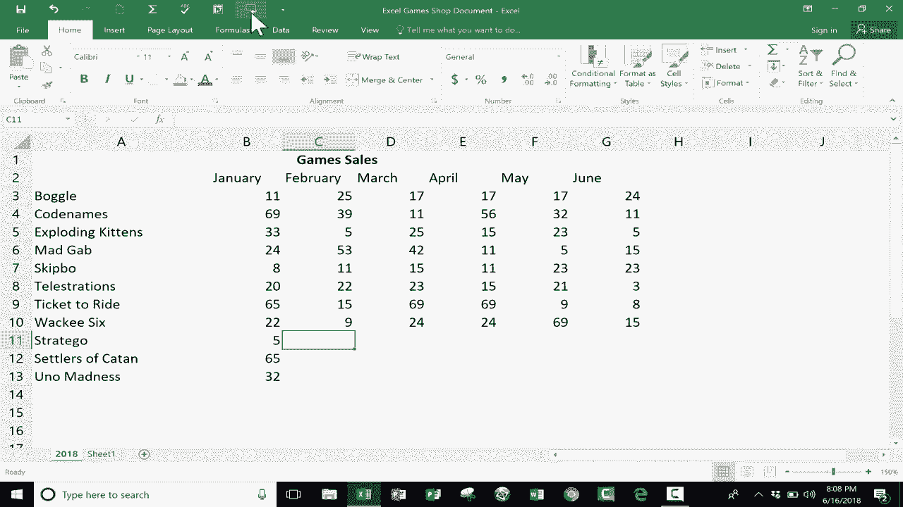

# 【双语字幕+速查表下载】Excel正确打开方式！提效技巧大合集！(持续更新中) - P3：3）使用输入工具上的单元格 - ShowMeAI - BV1Jg411F7cS

In this short Excel tutorial， I want to show you a wonderful but little known feature in Microsoft Excel。 And it's one that I think many of you will find very， very helpful。 And it's called speak cells on enter。 And I want to start by talking about why you might want to use speak cells on enter。 This feature is perfect for people who enter a lot of data。

 Let's say that your boss or your manager or someone gives you a bunch of data that you're supposed to enter into Excel。 You're probably going be looking at a piece of paper or some other source of that data。 Maybe it's another screen or another application。 but you're going to be looking at the source。 and then typing that data into your Excel spreadsheet。

 So unless you're very confident in your typing skills。 you're going to be looking back and forth from the source of the information。 let's say the piece of paper。 and switching from that and then you're going to move your attention to your Excel spreadsheet to make sure that you typed the number or。😊，Data correctly and then your eyes are going go back to the paper and then back to Excel back to the paper back to Excel This is gonna be very time consuming and it might drive you crazy so let's look at how we can use speakak cells onent to help us with that situation Basically I can just go up here to what's called the quick access toolbar and you can see right now I've added a couple of extra tools if you want to learn more about this please watch my video that covers the quick access toolbar but I'm going click this button here to customize the quick access toolbar I'm going go down to more commands and it's gonna to give me a list of some of the popular commands that you can easily add to the quick access toolbar so that they appear here but I'm going to click where it says popular commands and I'm going switch to either all commands or just commands not in the ribbon and if I click on that I should be able to browse down and find speakak cells on enter there it is I'm going click on it click add and it adds。

to this list of tools that I want to be here on the quick access toolbar。 Now。 if I don't like the order， I could click on it and then click this button to move it up or down to put it in the right spot。 Now I simply click okay and there it is。 I have a button for Spak cells on En and it's right there on my quick access toolbar。 So let's say with this spreadsheet here， which is a list of games that I would sell in a hypothetical board game and card game store。

 And let's say we add some more games to the inventory。 let's say a classic game like Strtigo。 it's a lot of fun。 I type in Strtigo。 I hit enter and nothing happened。 Why the reason nothing happened is because up here on the quick access toolbar even though I added speak cells on En to the toolbar it's not activated yet。 So I have to click on it will now be spoken on enter。 And it's ready to go。 So let's try that again。

 Strtigo。 I type it in， hit enter and it tried to pronounce it。Did OK and now I'll go down and I want to add settlers of Katon tap enterrs pretty good。 but that at least tells me that it recognized what I typed and that now I can move on to the next data to enter。Settlers of Caton， the last one I'm going to add is Uno madness。Who know madness。Now。

 this is especially useful in many cases with numbers。 so I can put in the sales for Strtigo5 for settlers of Katon 65 and Uno madness32 So I hope you can see the potential benefit here with speak cells on enter。 It really can help you to check your work as you enter it into the spreadsheet。 If you ever get sick of speak cells on enter 9 Then go up here to the quick access toolbar。

 Just click button speak on enter。 And this is a toggle button so you can toggle it on cells will now be spoken on enter。 and you can toggle it off turned off， speak on enter。 I hope you've enjoyed watching this tutorial。 If you did， please click the like button below。