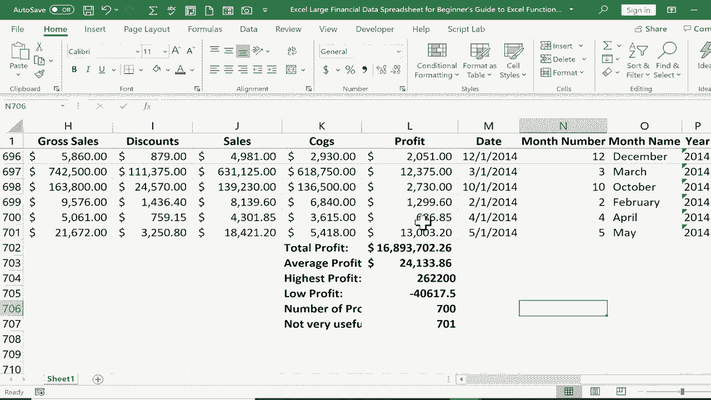

# 【双语字幕+速查表下载】Excel正确打开方式！提效技巧大合集！(持续更新中) - P30：30）函数和公式初学者指南 - ShowMeAI - BV1Jg411F7cS

This is the beginner's guide to Excel functions and formulas。 In this video。

 I'll show you six of the most commonly used and basic Excel functions and how they work So here I have a pretty big financial data spreadsheet。

 Let's imagine that I'm an accountant at a pretty large business and this information shows how the business is doing。

 here at the left， there's different market segments， different countries。

  different products all laid out。 And let's say I'm interested in figuring out some information about the profit that's being generated from each of these segments of the customer base。

 So in this video， I'm mainly concerned about the profit。

 So what I'd like to do is go down to the very bottom of this spreadsheet。

 But it's such a big spreadsheet。 How can I quickly do that。 Well。

 if I hold control on the keyboard and tap the down arrow。

 It takes me all the way down to the bottom of this group of data。

 But you'll notice I can still see row number one， which has my column。

If you'd like to learn how to do that， please watch my video on freeze panes。 But anyway， here。

 I would like to calculate some important information about the profit that's been generated。 First。

 I would like the total amount of profit throughout the whole company to do this。

 I would just click where I want that total to be shown。

 and then type the equals key on the keyboard。 When I first learned Excel。

 I was kind of confused as to why I would start with an equals sign。 but now I understand。

 It's basically like saying this cell equals。 and then I type in a formula。

 So I want this cell to be equal to。 and I'll use my first function and the function I'll use is sum。

 as I start typing the word sum。 Notice that I get a guide that pops up with some suggested other functions。

 This is the 1 I want just sum。 But Excel is recommending also to look into some， if and some if。

 some product， etc cea。 and no。Notice that I do get a description of each of these additional functions。

 This is really the one I want。 Some。 it adds all the numbers in a range of cells。

 So now that I've typed in some， I can just put in a left parenthesis。 And next。

 I just need to establish what is the range of numbers that I would like to add up。

 I can do that a couple of different ways。 One way is to click and drag to highlight what you want to add The problem。

 as you can see， though， is with 700 records with so much data。

 it's going take me a while to get all the way up to the top。 If I wanted to do it that way， though。

 I could， let's pretend like I went all the way to the top。

 I could tap enter on the keyboard and it adds up everything that I selected。

 Another option that is going to be better in this case。

 would be instead of clicking and dragging to simply type in L2 the L is for the column and the number2 is for the row that I would like to add。

 So L 2 through and the way you type through in Excel。Is with a colon。 So L2 through L 701。

 notice that that entire column now is highlighted， and I can tap enter on the keyboard。

 and now Excel adds everything in the entire range。 Now。

 because sum is such a popular and common function。 Excel actually has a built in autos。

 So in many cases， the best and easiest way to use some is to click underneath the data that you want to add up。

 and then go here to the home tab， home ribbon and in the editing group。

 you can click on this symbol here to do an autos and then tap enter on the keyboard。

 Now to help me remember that this data is different。 It's not really a regular record。

 It's rather some data about those records。 I just selected it。

 and I clicked bold to make it stand out。 I might also want to go here to the left and type in total profit。

 and again， I might want to bold that。 and now it's clear with that information。

Means the next function I'd like to show is average。

 If I want the average profit for each of those segments of the customer base。

 all I have to do is go to a new cell type equals average。 again， I get some good suggestions。

 and then left parenthesis。 and once again， I'll put in L 2 through using a colon L 701。 Now。

 you probably saw what just happened there。 I was trying to type my formula here。

 and I accidentally brushed my trackpa and suddenly I was typing in a different cell。

 That's a good illustration of why sometimes when you're working with formulas and functions。

 Instead of just typing here in a particular cell。 It's often better to use the formula bar here at the top of the screen。

 So I can click and type in the formula bar and I'll fix the mistake that was made。

 And everything that I type here in the formula bar is reflected here in the cell Now I。

Should finish this formula with another parenthesis。 It's actually not necessary to do that。

 You can tap enter， and it works without the right parenthesis， but it is proper to put it in。

 So it may be a good idea to get in that habit。 Okay， so now I have the average profit。

 The next common and basic function that you need to know is max。 And the max function。

 What it does is it returns the highest number in a range。

 So this cell is equal to the max of this column。 And I do want to go up here and use the formula bar。

Write parenthesis， tap enter， and that is the highest number in the range。 Next， let's look at min。

This cell is equal to min left parenthesis， and I'll put in my range。 tap enter on the keyboard。 Wow。

 we had negative profit。 So just like you would expect， min produces the smallest number in a range。

 So in this range of everything in column L。 This is the smallest number。 Our next function is count。

 And what count does is it looks in a range and counts up how many cell have numbers in them。

 It skips every cell that is blank and every cell that has letters instead of numbers or words instead of numbers。

 So let's try it out。 This cell equals count left parenthesis and going up to the formula bar。

 I'm going type L 1， this time， not L 2 through L 701。

 So it's going to try to count L 1 where the word profit is。 But let's see if the total comes to 701。

enterter on the keyboard。 And instead of being 701， it's simply 700。 Why。

 because it does not count the word profit。 That's not a number。 So it skips it。

 So this can be very useful when you're only interested in the numbers。

 I'll call that number of profit categories。 And then our final example is similar to count but it's count a。

 the difference between count and count a is count a includes any cell that has a keyboard character in it。

 And it also count cells that have spaces in them。 So if a cell simply has a blank space by someone tapping the space bar that would count toward the total。

 So here count a going up to the formula bar left parenthesis L 1 through L 701 tap enter because I used count a this time。

 the count is different， It included the word profit in the total count。

 I'm not sure what to call this。 How about not very useful。 at least。In this scenario。

 but there are scenarios in which you would want to know how many items make up a list and include both text based and also numerical items。

 So now I could bold all of this。 And I've generated a list of important data。

Important information from the profit details in my spreadsheet。

 Thanks for watching this beginner's guide to Excel functions and formulas。

 If you like this tutorial and would like me to create an intermediate guide to Excel functions and formulas。

 I will do that。 and I'll show you some more functions that you'll find to be helpful and useful in Excel。

 Thanks for watching， I hope you found this tutorial to be helpful。

