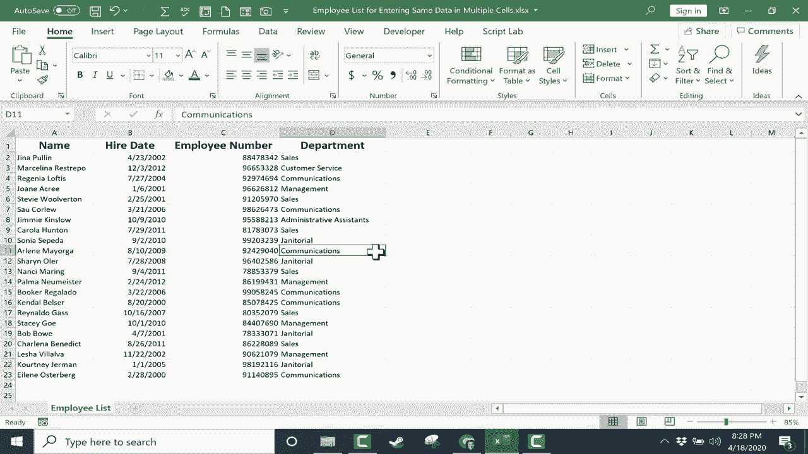

# Excel正确打开方式！提效技巧大合集！(持续更新中) - P31：31）在多个 Excel 单元格中输入相同的数据 - ShowMeAI - BV1Jg411F7cS

在这个简短的 Excel 视频中，我将向你展示如何在 Excel 中将相同的数据输入到多个单元格中。在之前的视频中，我展示了如何使用自动填充柄将相同的数据输入到多个单元格。我只需在这里输入“管理”这个词，然后点击它，使用右下角的自动填充柄进行拖动，将数据从一个单元格复制到下一个单元格。但如果这不是你想要的呢？如果你看看我这里的电子表格。

这是一个员工名单。它包含员工的名字、入职日期、员工编号和他们所在的部门。所以我不能仅仅使用自动填充柄将这个内容拖下来，给每个销售部门的员工都应用“销售”这个词。幸运的是，有一个好的方法可以做到这一点。在我创建这个电子表格时。

我可以很容易地识别出谁在销售团队中，比如这里的Stevie。假设Corolla也在销售团队中。我需要做的就是按住控制键，选择D9。这样，D6和D9就会被高亮或选择。也许Nancy也在销售团队中。所以我点击Nancy的单元格，然后我会向下到Renaldo，可能还有Charrlena。

现在我将在我高亮的最底部单元格中输入“销售”。然后诀窍是按住控制键并在键盘上按回车，看看它做了什么。它在所有正确的位置输入了“销售”这个词。我们可以用“通讯”做同样的事情。我会点击这里。再点击这里。也许在这里和这里，以及最底部的Eileen。

希望这能成功。我在通讯中输入。我按下回车，但没有成功。为什么呢？因为我忘了按住控制键。所以，当你在最底部的单元格或最近点击的单元格中输入单词时，按住控制键并在键盘上按回车是非常重要的。

现在它成功了。所以我可以在短时间内完全填写这个内容，只需点击并按住控制键，然后点击其他需要填入相同单词或数字的单元格。只需记得在按下回车时按住控制键。谢谢。😊

希望你觉得这个教程对你有帮助。
