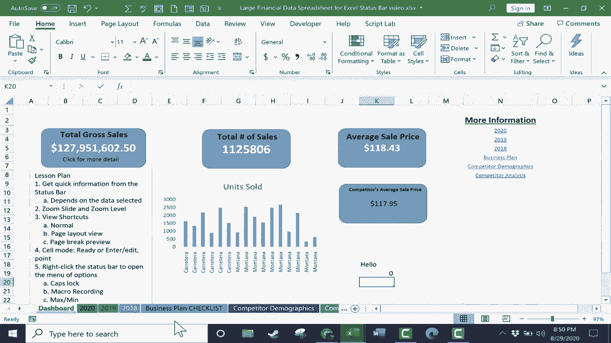

# 【双语字幕+速查表下载】Excel正确打开方式！提效技巧大合集！(持续更新中) - P34：34）状态栏 - ShowMeAI - BV1Jg411F7cS

在这个视频中，你将了解 Excel 状态栏以及它可以提供的有用且强大的信息，以帮助你使用 Excel。在我的许多视频中，我谈论顶部的标签，讨论功能区及其组。这些都是非常重要的。这些功能区上有许多强大的 Excel 功能。但我很少谈论状态栏。

这是 Excel 底部看似无辜的状态栏。它大部分是空白的，但实际上非常有帮助且实用。让我们来看看。状态栏最常见的用途之一是快速提供关于所选数据的信息。所以我将跳转到 2020 年的电子表格。这里有很多关于一个虚构公司的财务数据。

假设我去查看 H 列的总销售额。我只需点击 H，它会高亮整个列。现在，看看 Excel 状态栏。它自动为我计算出了一些关键信息。平均值。所以我知道这一列的平均数字。😊它确实进行了计数。所以我知道这一列有 703 条记录。这里的最小值是 1799。

最大值非常大。它还为我生成了总和，计算了这一列中的所有内容。所以这个快速信息非常有用。在许多情况下，现在你知道它在那里，你甚至不需要去做。例如自动求和，很多人可能会使用自动求和来计算这种信息或平均数或计数数字，最大值或最小值。你不需要再这样做了，只需选择这一列或任何数据范围。

它可以只是列的一部分。并且会很快为你生成这些信息。你也可以选择一个范围，所以可以选择多个列，我可以跨越所有这些进行选择。所有我选择的内容，这整个范围，这就是它的数据。现在，在某些情况下，它不会生成所有这些数据。例如，我选择了 B 列作为国家。

它没有计算平均值。它没有计算最大值或最小值。原因是因为它仅包含文本。它所做的只是计数那些包含文本或数字的单元格。现在，当你尝试这个时，它可能不会显示最大值和最小值，可能会显示一些这里没有列出的其他内容。原因是状态栏上的信息是可自定义的。

所以你可以在 Excel 的状态栏上右键点击，你可以添加或减去最大值和最小值。你希望显示这些信息吗？如果希望，就选择它；如果不希望，就取消选择。我喜欢它在那里。还有数字计数，你可以添加这个。在这种情况下我不太想要。如果你愿意，可以去掉平均值。

我喜欢Excel的状态栏是可定制的。好的，Excel状态栏还可以为我们做些什么呢？其中一个最常用的功能就是缩放。状态栏上有一个缩放滑块。你可以点击并拖动快速放大或缩小数据。这非常有用。

你可能已经知道这一点。除了缩放滑块，我们还有缩放级别。如果你点击缩放级别，你可以不使用滑块直接跳到25%。点击后，你也可以跳到200%或自定义数值，或者适应选定内容。这些都是很好的选择，我将跳到100%，就在缩放选项的左侧。

我们有三种视图选项。我们有正常视图，也就是你现在看到的。这是正常的Excel视图，右侧是页面布局视图，这种视图强调可能打印的页面，因此你可以看到页面的开始和结束位置，右侧和下方都是页面布局。

我们有分页预览，我需要稍微向左移动一点，可以将这个拖到顶部。

所以你可以完全看到。这在考虑页面和打印时非常有帮助。我可以看到第一页的结束位置，也能看到这些数据将放置的位置。这将在第16页。可能并不理想，你也可以使用这些虚线点击并拖动，尝试更改一些内容。我现在让更多的数据适应在第一页。我可能可以将所有内容都放在第一页上。

如果你想了解更多关于这个选项以及Excel中的其他打印选项，可以观看我的打印选项和技巧教程。不过这三种视图选项非常有用，尽管大多数人一般只使用正常视图，我认为这是个好主意。我认为明智的是，在必要时能够切换到这些其他视图。

我现在要跳回仪表板，因为我想让你看到状态栏还可以以其他方式使用。例如，你可以获取关于Excel中单元格模式的信息。现在，这是一个你可能需要开启的功能，所以我要右键单击状态栏，查看单元格模式。好的，它已经激活。如果我点击一个单元格并在状态栏左下角输入。

它显示“输入”。所以我处于输入模式，正在将数据输入到单元格中。如果我点击其他单元格，它显示“准备”。所以现在单元格模式是准备模式。换句话说，它准备让我做某事。如果我双击一个单元格输入文本，而不是转到公式栏点击，它显示“编辑”。

我正在通过公式栏编辑该单元格的内容。还有一种单元格模式有时会出现。那就是如果你在输入公式。假设我想对这个范围进行求和。注意，因为我正在使用鼠标选择范围，单元格模式会变成点模式。

这是因为我正在用鼠标指向。当你使用键盘上的箭头键时，这种情况也会发生，比如下箭头、左箭头、右箭头等。你可以添加到状态栏的其他功能包括你可以开启大写锁定和数字锁定的检测。

宏录制。正如我之前所展示的，如果你希望它们显示出来，你可能需要添加最大值和最小值。让我们快速谈谈这些的作用。选中大写锁定选项，数字锁定在状态栏上也是一样。假设你不小心按下了大写锁定，状态栏会通知你这个情况。如果你再次按下大写锁定将其关闭，状态栏消息会改变。

选择宏录制。这是这里的符号。它只是告诉我我是否正在录制宏。如果我没有，我可以点击这个按钮开始录制宏。这是一个大多数人不知道的不错快捷方式。

如果你对宏不太熟悉，真的应该观看我关于创建自己Excel宏的视频。我希望你能看到意识到这个状态栏所带来的好处。也许可以调整它，改变所选选项和它带给你的信息。我希望你在未来能更关注这个状态栏。感谢观看。

我希望你觉得这个教程有帮助。
