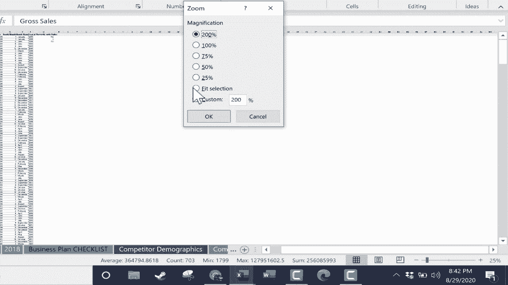

# 【双语字幕+速查表下载】Excel正确打开方式！提效技巧大合集！(持续更新中) - P34：34）状态栏 - ShowMeAI - BV1Jg411F7cS

In this video， you're going to learn all about the Excel status bar and the useful and powerful information that it can give you to help you with Excel。 So in a lot of my videos， I talk about the tabs across the top。 I talk about the ribbons and the groups within those ribbons。 And those are all very important。 There are many powerful Excel features on these ribbons。 But I rarely talk about the status bar。

 It's this innocent looking bar here at the bottom of Excel。 And it's mostly blank。 but it's actually very helpful and very useful。 Let's take a look。 One of the most common uses of the status bar is to give us quick information about the selected data。 So I'm going to jump to the 2020 spreadsheet。 And there's a lot of financial data here for a fictional company。

 But let's say I go to column H gross sales。 And I just click on H。 It highlights the entire column。 Now， look at the Excel status bar。 It automatically figured out some key information for me。 Aver。 So I know the。😊，Average number in this column。 it did count。 So I know that there are 703 records in this column。 The min number， the small number here is 1799。

 and the max is huge。 It also generates a sum for me， it adds up everything in that column。 So this quick information is very useful。 And in many cases， now that you know it's there。 you won't even have to do。 let's say an autosum， a lot of you probably do autosums to figure out this kind of information or average or count numbers。 max or min。 you don't have to do that anymore。 just select the column or any range of data。

 It could just be part of a column。 And it generates that information very quickly for you。 You can also select a range So more than one column， I could select across all of these。 And everything I've selected here。 this entire range， this is the data for it。 Now， in some cases。 it won't generate all of this data。 So， for example。I select column B for country。

 It didn't do average。 It didn't do max or min。 The reason why is because it's only text。 All it did was count the cells that had text or numbers in them。 Now， when you try this。 it may not show max and min。 and it might show something else that's not listed here for me。 The reason for that is that the information on this status bar is customizable。

 So you can right click on the status bar in Excel。 and you can add or subtract max and min。 Do you want that information to be displayed。 if so， select it。 if you don't， then unselected。 I do like it there。 There's also numerical counting。 You could add that。 I don't really want that in this case。 if you want， you can remove average。

 but I love that the status bar is customizable in Excel。 Okay。 what else can the Excel status bar do for us。 Well。 one of the most commonly used features on the status bar is zoom。 There's a zoom slider。So you can just click and drag to quickly zoom in or zoom out on the data。 So that's very useful。

 And you're probably already aware of that。 In addition to the zoom slider。 we also just have Zoom level。 If you click onoom level。 you can jump without using a slider down to 25%。 click or you could jump to 200% or a custom amount or fit selection。 Those are all good options I'm going to jump to 100% just to the left of the zoom options。

 we have three view options。 we have normal， which is just what you see here。 normal Excel view to the right of that， we have page layout view and this view stresses the pages that this would be printed on perhaps so you can see where the page begins and the page ends on the right and also down below So that's the page layout to the right of page layout。

 we have page break preview and I need to scoot over a little bit to the left and I can drag this up to the top。

So you can see it fully。 again， this is helpful when you're thinking about pages and printing。 I can see where page 1 ends。 and I can see where this data will go。 This will go on page 16。 That may not be ideal。 you can also use these dashed lines to click and drag to try to change some of that。 I've now made more data fit on page 1。 I might be able to go all the way across and fit all of that on page 1。

 If you want to learn more about this option， and also other print options in Excel。 watch my tutorial on print options and techniques。 but those three view options are very useful。 even though most people just generally use the normal view， and I think that's a good idea。 I think it's wise。 it is nice to be able to switch to these other views when necessary。

 I'm going jump back now to the dashboard because I want you to see that the status bar can also be used in other ways。 For example， you can get information about the cell mode in Excel。 Now。 this is a feature that you may need to turn on So I'm going to right click。On the status bar。 and look for cell mode。 Okay， it is activated。 So now if I click on a cell and type here in the lower left on the status bar。

 it says enter。 So I'm in enter mode， I'm entering the data into the cell。 If I click away from that onto another cell， it says ready。 So now the cell mode is ready mode。 In other words， it's ready for me to do something。 If I double click on a cell to type in text。 but instead go up to the formula bar and click， instead of saying enter， it says edit。

 So I am editing the contents of that cell by using the formula bar。 And then there's one other cell mode that sometimes comes up。 And that's if you're typing in a formula。 let's say I want to do a sum of this range。 Notice because I'm using my mouse to select the range。 the cell mode changes to say point。

 It's because I'm pointing with the mouse。 that also happens sometimes when you use keys on the keyboard like the down arrow left arrow right arrow。Et cetera。 Other features you can add to the status bar include you can turn on caps lock detection and num lock as well。

 macro recording。 And like I showed earlier， you may need to add max and min if you want them to show up。 So let's quickly talk about what these do。 with the caps lock options selected and same with num lock on the status bar。 Let's say you accidentally tap caps lock the status bar notifies you of that。 And then if you tap caps lock to turn it off again。 the status bar message changes。

 with macro recording selected。 That's this symbol here。 It just tells me if I'm currently recording a macro or not。 If I'm not。 I can just click this button to start recording a macro。 So that's a nice little shortcut that most people don't know about。

 If you're not familiar with macros， you should really watch my video on creating your own Excel macros。 So I hope you can see the benefits that come by being aware of this status bar。 And maybe adjusting it making。Some changes to the options that are selected and the information that it brings to you。 And I hope you'll be more aware of that status bar in the future。 Thanks for watching。

 I hope you found the tutorial to be helpful。