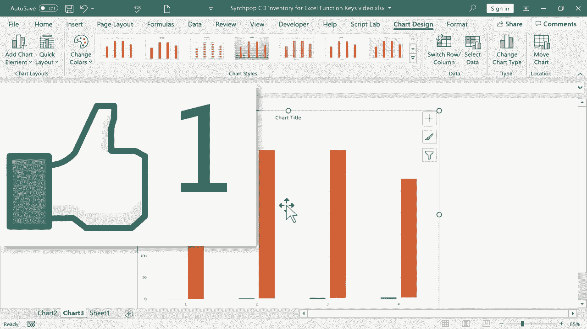

# 【双语字幕+速查表下载】Excel正确打开方式！提效技巧大合集！(持续更新中) - P35：35）Excel 功能键 - ShowMeAI - BV1Jg411F7cS

在这个视频中，我将向你展示Excel中每个功能键的作用。所有从F1到F12的键。我想你会发现这些键使使用Excel更友好，更容易。我们从F1开始。当你在Excel中卡住或需要帮助时，只需确保你在电子表格中点击了某处，然后按F1，它会在Excel右侧打开帮助面板。在此时。

你可以浏览推荐的主题，或者如果你需要帮助，可以去公式和函数，当然你也可以进行搜索。所以也许我需要帮助宏。当然，如果你需要宏的帮助，你应该观看我的宏视频。但通过搜索，我可以找到一些帮助，指引我到激活宏的地方，并提供关于如何运行宏的信息等。

当你完成帮助面板时，你只需点击X将其关闭。接下来，我们有F2按钮，F2的作用是让我们进入一个单元格。无论我们点击的是哪个单元格，当我们按F2时，它会让我们进入那个单元格。现在，你可能在想，这有什么用，因为，当然。

我们知道，你可以通过一次点击进入单元格，但你必须双击它。所以双击让我进入了单元格。好吧，这正是F2的作用。那么，为什么要有一个功能键，基本上是一个快捷键，来完成你通过鼠标双击就能做到的事情呢？好吧。

一切都是为了让你的手保持在键盘上。每当你需要离开键盘使用鼠标时，你在使用Excel时就失去了一点效率。F2按钮可以帮助我们保持手在键盘上并输入。接下来，我们有F3。当你按F3按钮时，它会给你所有命名范围的列表。

它打开了这个粘贴名称对话框。所以你可以看到我有一个乐队命名范围和一个类型命名范围。如果你不熟悉命名范围，你需要观看我关于该主题的教程。但通过按F3，我现在可以简单地点击粘贴列表，它会粘贴我的命名范围列表。在这种情况下，这可能不太有用，但有时你只想要一个所有命名范围的列表。

我将再次点击F3，向你展示你也可以选择一个特定范围，然后点击确定。然后我可以在键盘上按回车，它会拉入我整个命名范围的类型。基本上，这里是相同的数据，但我能够快速轻松地将其粘贴到I列，而F3键让这变得可能和简单。接下来，我们有F4。我将双击单元格H2，然后按F4，看看它会做什么。

它为我的公式添加了美元符号，并移动这些美元符号。有时向左，有时向右。有时有两个。这到底发生了什么？这些美元符号表示绝对引用。所以通过按 F4，我在切换绝对引用选项。

这是一种简单的方式来改变这个公式的工作方式。请期待未来关于使用绝对单元格引用的教程。接下来，我们通过点击 F5 进入 F5 对话框。它再次列出了我命名的范围，比如乐队和类型。我可能应该再添加一些命名范围。

但是这个对话框简单地让我可以快速跳转到这些命名范围。比如乐队。我点击确定，然后迅速跳转到乐队的命名范围。再次按 F5。这次我想去类型。那次我只需双击，它直接带我去类型。现在，请注意你还可以到这里的引用部分，输入，比如 Z500，然后按回车。

点击确定，它直接带你到 Z500。这里还有一些特殊选项可能会对你有帮助。例如，点击 O，它为我高亮了这个情况下涉及公式的单元格或列。接下来，我们通过按 F6 继续。我可以在 Excel 的一个位置移动到另一个位置。有时是在一个工作表内，有时是在我们这里的 Excel 布局内。

这可能有点难以演示。但我按一下 F6，注意到它现在高亮了状态栏上的这个按钮。这是状态栏上的宏按钮。如果我再次按 F6，它会带我进入我所有快捷键的列表。所以此时我可以按 N，它会更改功能区和我拥有的选项，因为我按下了那一键，基本上就像我点击了插入选项卡。因此它带我到了插入功能区。接下来是 F7。如果我按 F7。

它会调出拼写检查器，我可以继续检查电子表格中的拼写。接下来是 F8，和 F6 一样。如果你还记得，F6 是让我们循环浏览电子表格的不同部分，F2 也是如此。这些功能键的每一个都帮助我们保持手指在键盘上。

让我们看看 F8 的作用。假设我想选择乐队 The Killers 及其最新的优秀专辑《Imploding the Mirage》。我想选择该信息的所有实例。假设当前活动单元格是 A2。我可以按 F8 按钮。如果你看一下左下角的状态栏，它告诉我正在扩展选择。这就是 F8 的作用。它启用扩展模式。

这使得我可以轻松使用键盘上的按键。在这种情况下，我使用箭头键向下和向右移动。并且我正在扩展或延伸所选中或高亮的单元格范围。所以这相当于使用鼠标点击并拖动来高亮一系列数据。

但不需要使用鼠标，我可以直接使用我当前所在的单元格 T F8，然后使用键盘上的箭头键扩展选择。当然，我可以按 Control C 复制或者执行其他需要的操作。接下来，我们有 F9，F9 有点难以展示。它与手动计算和自动计算有关。所以在 H 列中，我有一些自动计算的公式。

我可以转到公式选项卡，在公式功能区的计算组中，有计算选项。现在它是自动计算的。如果我想的话，可以切换到手动计算。让我们看看这会有什么效果。假设销售数量上升到275。

如果我在键盘上按下回车，注意到这里的销售数字，总收入没有变化。为什么？因为我将计算选项从自动更改为手动。如果这是你所喜欢的，你可以随时使用 F9 强制手动计算。所以当我按下 F9 时，注意到它强制进行了手动计算，数字更新了。接下来，我们有 F10。当我按 F10。

它展示了功能区中的关键提示。换句话说，快捷方式提供了 Excel 功能区中不同选项的访问。接下来，我们有 F11，按 F11 将自动在 Excel 的新标签中创建一个图表，你只需确保点击了电子表格中的某个数据位置，所以我会在这里点击，然后按 F11，我会在新工作表上得到一个全新的图表。现在这个图表可能不是很有意义，你可能需要思考。

通过你的数据，无论它在图表中是否工作良好，但 Excel 至少会尝试自动为你创建一个图表。你还可以单击并拖动以高亮显示你想制作图表的数据，然后按 F11，这将根据你所选择的内容生成一个图表。最后，我们有 F12。当你按 F12 时，会弹出“另存为”对话框，我可以快速保存这个电子表格。

我可以以不同的名称保存，无论我需要做什么。这就是 Excel 中的 12 个功能键。我希望你觉得这个教程有帮助。
