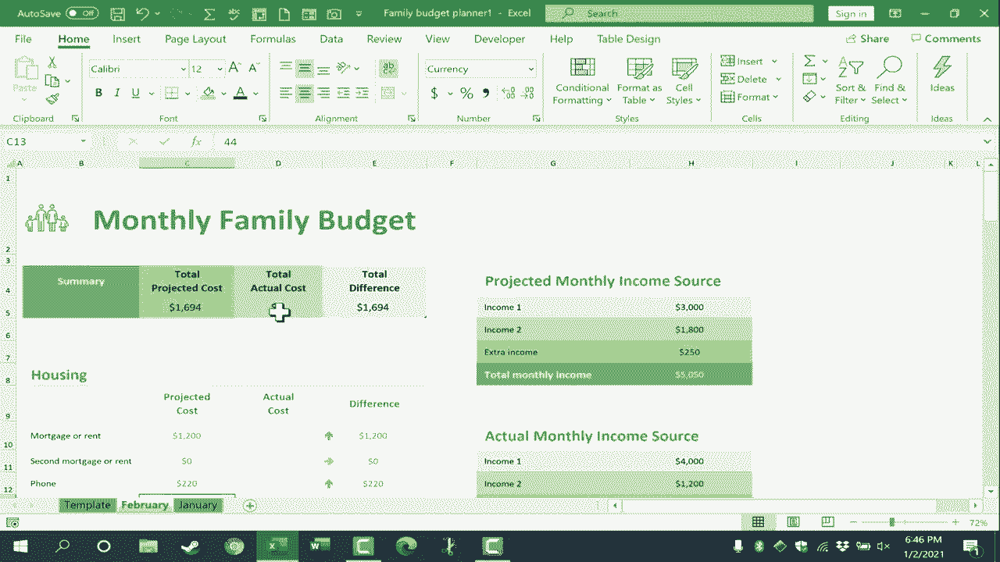

# 【双语字幕+速查表下载】Excel正确打开方式！提效技巧大合集！(持续更新中) - P38：38）使用 Excel 创建家庭预算 - ShowMeAI - BV1Jg411F7cS

In this video， I will show you how to use Excel to create and maintain a monthly family budget。 There are so many people right now setting financial goals。 maybe to get out of debt。 saveve up for a house， whatever it might be。 that I thought this would be a good topic for this time。 And you know what， I've been using Excel for many， many years。

 I've made dozens and dozens of YouTube videos about Excel。 But this topic and Excel monthly family budget is still the most powerful impactful way that I use Excel。 Let's look at how to do it。 So here I am in Microsoft Excel。 and I will just go here to the upper left， click on file and select new。

 And this brings up the screen where I can start a new blank workbook。 There's also a list of some recent templates I've accessed。 So this will probably look different for you。 underneath that。 there's a search box。 and I can use that to search for some online templates。 So I'll type in family budget tap enter。

 and several results up。😊，Instead of family budget。 I could try family monthly budget or maybe this budget isn't for a family。 maybe it's for an organization， a company In that case。 maybe just search for monthly budget or college budget or department budget。

 whatever you want to search for In my case， though I'll just search for family budget and I'm going select this one here but all of the same principles that I'll show in this video would apply to other styles。 other templates for budgets whether for a family or for a business， whatever it might be。

 So I just double clicked on it， and I got to pop up with more details about the template。 I can read through that and then click create to download a copy of that template and this is ready to start using right away to help you see this a little better I'm going to zoom out using this slider in the lower right corner and let's take a look at how you could use this to really help transform the way you track your family budget and possibly transform your family。

Finances in the process。 When you download this template the first time。 it's going to come with some default numbers。 And of course， we can change these numbers。 So let's say this is a two income family income source number one。 maybe $4000 is not accurate。 Maybe it's more like $3000 per month。 So I just clicked on the cell， I typed in 3000。

 and I'll tap enter on the keyboard。 and that erases the number that was there before。 What about the second income。 Maybe the second income is $1800。 Again， I just clicked on the cell。 typed the number and I can tap enter to make the change。 Notice that there is a spot now for a third entry for income。 This is extra income。

 maybe in a particular month。 We're going do some babysitting or we're going to have a yard cell or something that will bring in some extra money。 I'll estimate maybe $250 there and tap enter。 And this brings up an important point when it comes to using a monthly family budget。

In Excel， the idea behind this is that I and my spouse would discuss together at the beginning of a month and estimate what the two monthly income amounts are going to be and any possible extra income。 So this is projecting What is this upcoming month going to be like financially。 next。

 my spouse and I sit down and we look at each of these budget categories and again。 make a projection for what it's going to cost for this month， let's say mortgage or rent。 maybe that's $1200。 Now， maybe I don't know the actual cost yet。 of any of these things， really。 if that's the case， I might want to click and drag to select all of those cells。

 And then I could right click and select clear contents。 And then we can move on to the next line item in the budget。 No second mortgage。 What about the foam bill。 maybe that's more like $200 gas and electricity。 And so because this is a。Default template from Microsoft， especially the first time you do this。

 there's going to be some initial work where you go in and change the numbers to your reality。 So now that I've done that， notice that Excel calculates a projected cost in this case for the housing category。 Now， all of these numbers add up to what is called the total projected cost that is listed here。 and you'll notice that if I change the amount for phone to 220 tap enter the number up here updated and changed。

 All right， so then of course I would move on to transportation。 put in projected costs for that insurance， food， children， legal。 and there's all sorts of other categories as well。 Now。 before I actually put in all of those numbers。 let me show you a trick that I use with my family you can see that these numbers。

 the housing numbers， the water bill， the electricity bill etc ce。 Those are numbers that generally stay basically the same。They might be adjusted up or down a little bit， but they're generally somewhat consistent from month to month。 So now that I have those numbers in before I put in the rest of these numbers that often change like the transportation costs for the month or the entertainment costs for the month。

 Those might go up or down a little more regularly。 before I add any of that。 I'm going to go down to the lower left corner where we have the name of this spreadsheet。 the monthly family budget。 And I'm going to right click on that and choose rename。 And I'll just call this template。Tap enter and the reason I've done that is so that I can very easily reuse this spreadsheet over and over and over。

 And that way I won't have to clear out the previous month's information。 Let me demonstrate what I mean now that I've got this template let's say January comes along All I have to do is right click on template go to move or copy and I do want to create a copy。

 so I'll click this checkbox here。 click okay and now I have a new tab called template too。 I'll right click on that。 rename it to be January。 Tap enter。 and it may be better to have January to the right of the template or maybe to the left whatever you prefer。 but now as I fill in the data for this January budget I still have the mostly blank template here that I can just make another copy of for February and then another for March etc going back to the January budget though This is where my wife and I would go through and project how much it's going to cost let's say for the fuel for gas。

For the two vehicles for the month， any maintenance that might be required。 and then we can go down and work on these other categories as well。 What's the projected cost for food， eating out and so on。 What we can do now is look here at the balance。 the projected balance at the beginning of the month is 1921。

 So what my wife and I would do at this point if these were the numbers we got is we'd say okay it's expected that we would have this much money left over at the end of the month let's go ahead and plan for how we're going to use that And in many cases that's going to be saving for college or saving for retirement or making repairs on the house。

 but that's the projected balance Then as the month progresses and the income actually comes in I would need to come back into the spreadsheet and put those actual numbers not just the projected monthly income but the actual income numbers into the spreadsheet。

 So let's say there's a little bonus that comes in the check。Let's say income number two comes in right as expected。 and then maybe the yard sale brings in more than expected。 So that's the actual monthly income。 And then， of course， throughout the month and definitely by the end of the month。

 My wife and I need to come into the spreadsheet and put in the actual costs of each of these items just by clicking。 typing and then tapping enter。 it's easy to update these。 And I can easily see which categories we've overspent on， maybe we underd the amount needed。 but that helps draw attention to either some overspending or just some incorrect guesses。

 When we're done putting in the actual costs。 We can look at the total projected cost the total actual cost and the total difference。 This is the money that wasn't spent the money that was left over。 So when February comes along。 that's a good thing to do is to look at how the last month went how did everything end up。 And then I can simply right click on template move or copy。I want to create a copy。

 and where do I want to put it。 I want it to be before January in my case。 click O。 and there's template2。 I can right click， rename， call this February。 tapap enter and the budget is mostly cleared out So I can go in and make any changes to the regular monthly expenses like utilities。 house payment， etc ce。 And then we can work to fill in the rest of these projected costs。

 One of the great things about a monthly family budget done like this in Excel。 is that I can look back one year， two years， five years and see what we've spent typically in the month of February because birthdays because of different traditions and things。

 holidays over the years， what do we typically spend in January。 And that can help us make our plan for this February。 Sam with other months like December where there's some holidays and sometimes a vacation or something like that。 It's wonderful to have a record of specific expenses。😊。

And the overall actual cost of all the items in the family budget。 Thank you so much for watching this video。 I hope you found the video to be helpful。 I know that this information has has helped me tremendously over the past 14 years that I've been doing this once a month with my spouse。 projecting what the future month will be like and making plans based on that and then tracking how it goes and putting in the actual cost。

