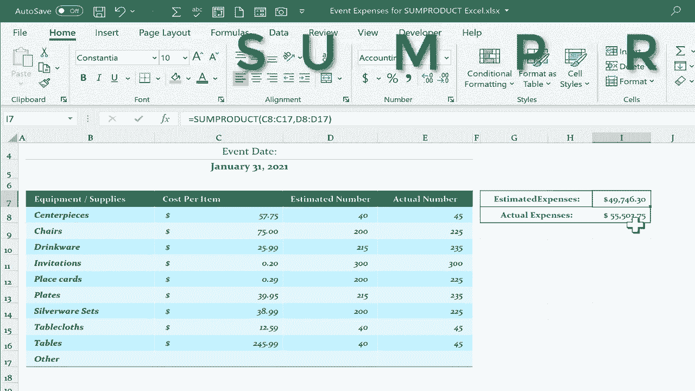

# 【双语字幕+速查表下载】Excel正确打开方式！提效技巧大合集！(持续更新中) - P39：39）Excel SUMPRODUCT 函数 - ShowMeAI - BV1Jg411F7cS

In this video， I will demonstrate the basics of using the some product function。 After watching this video， I hope you'll understand how some product can save you a few steps in many of your Excel spreadsheets。 So here we have an event expenses spreadsheet。 Let's say there's an event coming up and there's various aspects of that event that we need to plan for and what the cost will be。 there's a list of equipment and supplies the cost per item， the estimated number that will need。

 and then the actual number that it ends up being。 Now。 typically what people would do is you would have another column and normally it would be formatted the same way。 and you would create a formula that would produce the right result。 So this is the estimated total cost for centerpiece。 Let's figure that out。

 So normally you would say the number in C8。 So you just click on C 8 multiplied by the estimated number。 So D8 Now of course， instead of clicking to get these in。 I could just type the cell references when I'm done。Tap enter and it calculates the total estimated cost for centerpieces and then of course I could use the autofill handle by clicking and holding on that green square and then pulling down and it multiplies out and it produces the total estimated cost of each of these items Now if I want the grand total estimated cost down here somewhere I could click type equals and do a sum of everything above this formula tap enter。

 and that's the grand total。 So you can see there are multiple steps there I have to calculate each itemss cost multiplied by the estimated number。 whatever the product is of that。 In other words， the result of that multiplication that appears here。 and then I reproduce that formula for the rest of these items and then do a sum same with the actual cost I could type equals this is the cost per item let's say instead of the expected 200 people showing up at this event。 there's 225 Well that changes the number for table。Tables， centerpieces， all of that changes。

 So C 8 asterisk for multiplied by。 and then the actual number goes here。 So E8 tap enter。 I can autofill that down and then do a sum and I can actually autofill the sum by dragging that over。 So that's the slower way the more time consuming way to figure out the total estimated expenses and the total actual expenses。 Now watch as I use one formula and one function to produce the same results。

 using the sum product function。 I can do all of this at once。 I can have Excel multiply column C by column D or E， and then sum up those products。 And of course。 a product in math just means the results of multiplication。 that's the product。 So back now to sell K7 I've typed equals sum product and you can see Excel recognizes that function left。

hesis and now Excel is looking for an array， comma， another array， comm， another array。 and array is just another way to say range in Excel。 So what's the first array involved in this adding up of the multiplication results。 the sum of all the products。 Well， the first array that needs to be multiplied is the cost per item。

 So I'll click and drag to highlight all of the numbers in column C。 That's the first array Now the second array。 What will these be multiplied by in order to produce a product。 Well， each one of these in turn will be multiplied by for the estimated expenses。 they'll be multiplied by the numbers in column D。 So that's my array number two。

 I click and drag to highlight the numbers。 not the column headings here。 just the numbers in column D。 and that's all I need for estimated expenses。 So I should put in the right parenthesis and then tap enter before I tap enter。 I just want to direct。Attention up here to the formula bar。

 This is often the most clear and safest place to look at formulas that you're creating or have created in the past。 So let's review what's going to happen here。 Excel is going to multiply C 8 by D8 So C 8 will be multiplied by D8 to produce a product again。

 a product is just the results of a multiplication。 Then that will continue down the range。 So the colon here and here means through So C 8 through C17。 So next it will multiply C 9 by D 9。 and then it will continue through C17 which happens to be blank 0 multiplied by D17 also 0。 when it's done doing all of that multiplication。 it produces a whole bunch of products。

 You're not going to see those products。 and then Excel will sum them。 It will add them all up。 So let's tap enter you can do that here in the formula bar or here where the。ula actually goes。 I'll just do it in the formula bar。 I'll tap enter on the keyboard。 and that one formula。 some product with the two ranges or arrays produces the exact same results。

 the same number as what we had here in G18。 but that took multiple steps for us to create。 Now。 of course， I could click and drag to format these results to be currency or accounting so that it's clear that this is money that we're talking about。 let's do the same thing again， but this time for actual expenses。 So this cell equals the some product。 And I'll just do this one in the formula bar left parenthesis array number one。

 Now again， this time we're talking about actual expenses。 but it still has the same cost per item。 So I click and drag to highlight all the numbers in the cost per item column put in my comma and Excel is expecting another array at this point and notice that you can do more than just two arrays if you want to。

 But in this example all we need is to。 So this time， instead of estimated number I need。Actual number of chairs， tables， plates that were purchased。 So I'll click and drag to highlight the array that has the numbers of actual items purchased。 and I should put in that right parenthesis， even though you often don't need to。

 And then I'll tap enter on the keyboard and it produces the same results。 So， of course。 we don't really need these columns at all。 I can highlight those columns。 I can delete to produce these results， all you need is a cell and a formula that uses some product As I've demonstrated in this video。 Now， this is just the beginning， the some product function is capable of doing much more than this。

 it can be a really powerful function for you to use in many different ways。 Thanks for watching this video， I hope you found it to be helpful。