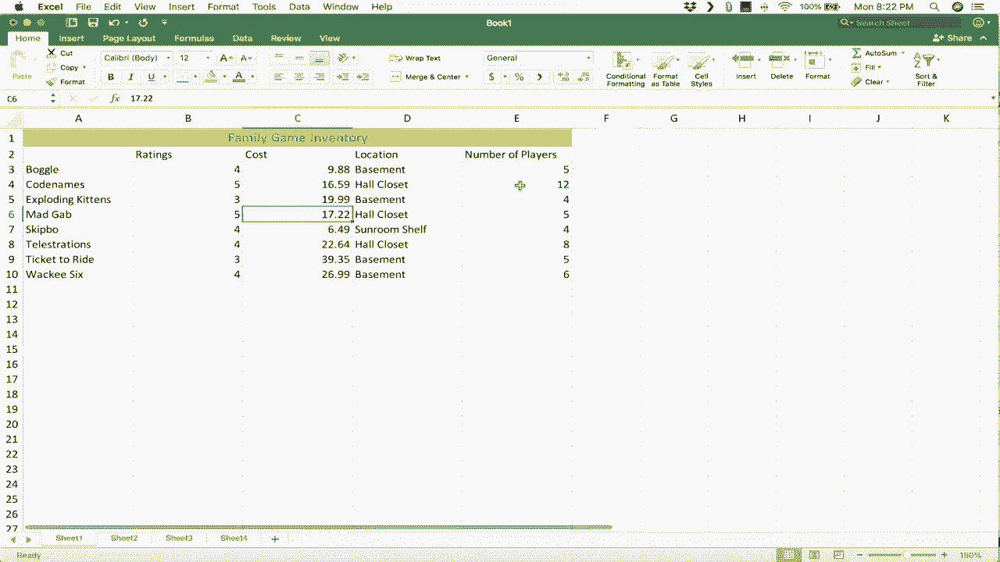

# 【双语字幕+速查表下载】Excel正确打开方式！提效技巧大合集！(持续更新中) - P4：4）Excel for Mac 初学者指南 - ShowMeAI - BV1Jg411F7cS

这是针对Mac的Microsoft Excel初学者指南。在这个教程中，我的目标是涵盖你需要了解的一切，以便有效地在Macintosh电脑上使用Microsoft Excel。所以让我们直接开始吧。我将到我的文档中找到Excel，然后点击它打开。如果你在Dock上没有它，没关系。

你可以简单地在这里搜索Excel。如果它在你的Mac上，你应该能够通过点击来打开并启动它。你会注意到，当你打开Excel时，通常会出现一个窗口，里面有一系列可供选择的模板。在左上角还有一个空白工作簿。

你可以浏览这些模板，看看有什么可用的。模板非常方便。你可以点击获取，例如，一份年度财务报告。里面有一些虚假的数字。但你只需进入，替换成你自己的数字，就有了一个好的电子表格。😊。

这是一个小企业的时间表，或者说是员工的发票模板。一些非常实用的模板。如果你那里没有你感兴趣的模板，只需在这里搜索所有模板。我可以搜索，比如说家庭预算。我输入了预算，弹出了很多。

但是有家庭预算，我只需双击即可打开。很快。我有一个电子表格。我只需点击将里面的内容替换为我自己的内容。好的，模板非常有用。但我知道这可能不是你们来的原因。你们大多数人可能需要在工作中使用Excel。在很多情况下。

其他人创建了电子表格。你只需要使用它并进行添加和理解。那么，让我们看看你需要知道什么，以便理解和使用Excel。我将点击这里的空白工作簿。我将双击它，它将打开一个完全空白的Excel工作簿。我更喜欢完全全屏。

我在左上角双击一下，这样就可以了。如果你有一台现代的Mac电脑，你只需双击一个角落，它应该会最大化。如果你无法那样做，你可以在这里获取角落，然后点击并拖动以最大化并填满屏幕。好的，这就是我的工作簿。我想教你的第一件事是Excel的结构。

我希望你真正理解你在看什么，以及使用Excel时看到的内容。因此，我想让你学习的第一个术语是工作簿。工作簿就是这一切。与大多数书籍类似，这本书由一系列页面或工作表组成。在Excel中，我们称之为工作表。所以我们有工作表1。好吧，稍后如果我想要。

我可以点击这个加号以获取sheet2，然后再获取sheet3，等等。但这些工作表共同构成了工作簿。现在，每个工作表，我将点击回sheet1，每一个工作表都是由一系列列和行组成的。我会稍微调整一下视图，点击视图标签，功能区会出现。

我可以放大，比如说到150%。这样你可以看得更清楚。你可以看到有A列、B列、C列，一直到右边。我可以继续到Z，然后看看当你到达Z时发生了什么，它会变成AA，AB，AC。所以你可以一直往右走。它有某种限制。

但它的高度相当高，行也是如此，只是行是编号的。它们没有与之相关的字母。它们有一个数字。所以我有从1到27的行。但如果我向下滚动页面，你会看到它可以到200，500，甚至5000。它远远超过那个。现在，列和行用字母和数字表示的好处在于，它让我们不仅可以通过说来描述一列。

转到E列或查看第10行。但它也让我们能够描述Excel中的任何一个框。这些矩形的术语是单元格。每一个都是一个单元格。每个都有一个名称。例如，这个矩形的名称是一个非常具体的名称，它是单元格E9。它只是列和行的交点。就是E9。好吧，让我们快速回顾一下。

到目前为止，我们有一本工作簿，它包含了所有这些。我们有构成单个页面的表格。假设在书中的某一页上，我们有列，有行，还有它们的交点。😊，列和行的交点称为单元格。现在，这样的话，多于一个单元格在一起呢？这个称为范围。

还可以命名范围。你在Excel中命名范围的方式是，从范围的左上角开始，说出左上角单元格的名称。所以是E4。这是单元格E4。接下来，你会加上一个冒号。冒号代表“到”这个词。

所以E4到H11单元格。这就是你写这个范围名称的方式。现在。随着你在这个视频以及下一个视频中逐步深入，即中级Excel for Mac视频，你会理解这为什么重要。但现在，我们先停止对实际工作簿和工作表结构的描述。好的，下一个。

让我们看看Excel的内部，不是电子表格本身的结构，而是工具和选项的布局。你会注意到有一系列标签。每个标签在你点击时，会在页面上生成一个不同的功能区。这个功能区显示了你可能想使用的不同选项。

所以我可以去数据选项卡和功能区，那里有很多我看到的选项。你会注意到这些选项中有一些是用这些垂直线分组的。那些线是用来基本上分隔不同选项和工具的不同组，试图将相似的工具放在一起。在上面，你会看到一些快速按钮。那里有一个文件按钮。

如果你想快速打开一个电子表格，那里有保存按钮。还有撤消按钮，以及重复按钮。在这种情况下，重复你所做的最后一项。我们还有一个定制的快速访问工具栏按钮，这有点有趣。然后如果你看看上面，像大多数 Mac 程序一样。

你可以看到，如果你点击并拖动，你可以将窗口与顶部的工具栏分开。但这个工具栏上确实有一些其他选项。你可以在这里查看你使用的是哪个版本的 Excel，我的是 16.x。你可以在这里点击文件，获取一些我们之前查看过的相同选项，比如编辑。

插入等等。所以这里有一点重复。你可以在这里插入，例如，或者你可以在这里点击插入。现在，如果你不小心点击了一个已经激活的标签。这个标签已经被点击，功能区显示出来。如果我再次点击那个标签，看看它隐藏了功能区和选项。所以如果那发生了。

只需再次点击插入，它就会回到原处。现在你已经学会了 Mac 的 Excel 界面，并了解了电子表格和工作簿的结构，你准备好学习如何在 Excel 中创建一些数据了。因此，对于这些数据，我想创建一个我家里拥有的游戏库存，包括桌游、纸牌游戏等。为了做到这一点，我将选择影响。

这是你应该写下来的一个短语。你应该记住它。在 Excel 中选择影响。如果你想在电子表格中影响数据，你必须先选择某个东西。你必须选择才能影响那里所存在的内容。因此，我想选择单元格 A1，并输入家庭游戏库存。所以我选择了那个单元格并输入。现在我将按下键盘上的回车。

我按下回车，看看发生了什么，它正式将文本输入到了单元格 A1。此外，它将我的选择向下移动了1。所以现在选择的是单元格 A2。这意味着 Excel 现在准备让我在下一个单元格中输入内容。😊，我想输入 boggle，这是我认为的最佳文字游戏之一。我输入 boggle。

然后我按下回车，它就会在 boggle 下面移动下来，我要输入代码名称。这是我最近为家人买的一款非常有趣的游戏。然后我按下回车，它又移动了下来。我将继续向这个列表添加游戏。所以请给我一点时间来做这个，然后我会继续视频。所以这就是我的游戏列表。

当然，我们还有更多，但这些是我们的一些最爱。我的电子表格看起来还不错，但如你所见，存在一些问题。首先，你会注意到在这种情况下，这些游戏的名称看起来像是溢出到列A之外，延伸到列B。至少看起来是这样。

实际上，情况并非如此。我可以通过在B1单元格点击并输入来证明这一点。我将输入hello there。你会注意到短语“家庭游戏”仍然在那里。如果我双击，它会显示家庭游戏库存。所以我并没有通过在B1单元格输入hello来覆盖“库存”这个词。我将删除它。

尽管这些游戏的名称看起来溢出到列B，但实际上并非如此。不过，这确实有点烦人，让人难以阅读这些数据。因此，我鼓励你尝试解决这样的問題，以使数据更易于阅读和理解。所以让我们看看在列A和列B之间你可以这样做的几种方法。

有一条线将它们分隔开。如果我点击并按住鼠标，我可以将那条线向右拖动，并调整列宽。所以你现在可以看到所有的游戏都适合在这一列中。现在，仅供你知道，你可以对行做同样的事情。如果你愿意，可以让行更高，在这种情况下。

我不想那样做。所以我将向上移动。点击撤销。这是一种调整列宽的方法，点击并拖动。其实还有更快的方法，我希望你知道。那就是如果我双击列A和列B之间的线。

它会自动调整为刚好适合列中所有内容的宽度。这是一个不错的小技巧。好的，现在接下来，我想建立关于这些游戏的我想要跟踪的数据种类。因此，例如，在B1单元格中，我将选择它以进行更改。

我将输入我想要跟踪的每个游戏的第一件事，那就是评分。所以我将把这些游戏从1到5评分，5意味着这是一个很棒的游戏。好的，我要在这里点击，并将boggle的评分设为4。现在，如果我按下回车键，注意到选择像之前一样向下移动。现在。

如果你按住Shift再按回车键，注意，它会向上移动而不是向下。所以Shift加回车向上，回车向下。既然我们在谈论这个，我想让你知道如果你按Tab键，选择会向右移动。我敢打赌你能猜到如何向左移动。那就是Shift加Tab，它会让你向左移动。

所以这些是一些键盘快捷键，可以帮助你将选定项移动到你希望的位置。在评分旁边，我将追踪游戏的成本和房屋中的位置。最后是玩家人数。我将按回车。好的。现在注意到我在这里犯了一个错误。我拼错了“玩家”这个词，来修正它。

我可以通过几种方式来做到这一点。我可以单击一下以进入。😊 在这个单元格E1中，因为一旦我在这个单元格中输入任何内容，看看，之前的所有内容都会被擦除。所以我得重新输入所有内容。玩家人数。所以这是一种修正此类错误的方法。但我们来看第二种方法。

如果我双击一个单元格，我就不再在单元格上，而是在单元格内。所以我希望你能注意到两者之间的区别。当我双击时，它让我进入了单元格。现在，看看，我可以使用方向键在单元格内移动到我想要编辑的确切位置。在这种情况下，我想删除Z并用S替换它。然后按回车。

这是一个非常重要的区别。单击一下以进入单元格。如果你这样做，输入的任何内容都会擦除之前的内容。另一个选项是双击，这样你就能进入单元格，可以对该单元格的内容进行微调调整。现在，我想对这个做一些更改。这看起来不错。

但是有几件事让我困扰。真的。第一件事是我希望在“家庭游戏清单”上，我并不想要它现在的位置。我希望它基本上成为这组数据的标题。我希望它在数据的上方，显示出这组数据的标题或目的。

所以为了做到这一点，我希望在第一行上方有另一行。嗯，获取另一行的方法是右键点击你希望新行出现的下方的那一行。所以右键点击该行的编号，然后点击插入，它会在上方插入一行。现在，你也可以对列做同样的操作。右键点击D列，插入。

并且它在D列的左侧插入了一列。我将撤销这个操作。所以现在我有了一行空白行，我可以点击“家庭游戏清单”。我将剪切它。我将按住命令键并按X，这样就选择并剪切了原有内容。然后我将选择A1，点击该单元格，然后按住命令键并按V进行粘贴。好的。

你可以右键点击复制，右键点击粘贴，这也可以。现在我在其他信息上方有了这组数据的标题。我可以进行所谓的合并并居中。所以我将点击A1单元格并拖动选中所有数据。在这一点上，数据只到达E列。所以我将停在那里。

然后我将去主标签的主功能区。在这里，你可以找到在Mac版Excel中最常用的选项。所以我去那个主标签的主功能区。看看，那里有合并和居中。于是我选择了那个按钮，注意它做了什么。它打破了单元格A1之间的单元格边界。

从B1到E1。它打破了那些障碍。这是一个很好的方法，基本上可以给你的数据加上标题。现在我做到了这一点。我还可以让这个标题突出并真正闪耀，通过再次进入主功能区，选择一些文本选项，比如**加粗**、**下划线**，如果我想的话。我并不想要。

你可以*斜体*。如果你想的话，可以增大文本的大小。你可以改变它的颜色。如果你真的想这样做，甚至可以放入背景颜色，我想我会这样做。看起来不错。还有一件事让我困扰的是这句话“玩家人数”。首先，我想将字母P大写。好了。其次，再次。

看起来它溢出了列。我可以手动或自动修复它，但我想让你看看一个非常好的快捷方式。如果你点击并拖动跨越你的数据，你可以在任何两列之间双击。

不管选哪个，只需双击，所有单元格都会完美调整大小，刚好适合它们的数据。现在，在这种情况下，可能太窄了。所以我要点击并拖动，稍微调整一下，看看。所有单元格都会被调整为完全相同的宽度。从这里，我可以点击外面，然后进行调整，确保一切看起来如我所愿。

好的，这很好。给我几分钟😊，继续输入我的评分、成本和数据，然后我会恢复视频。所以这是我的数据。你可以看到这是一种跟踪信息的好方法。Excel非常适合库存，但还有很多其他功能可以利用，除了库存。

所以现在我有了这个非常实用的游戏库存。随着游戏数量的增长，我可以继续填写数据，点击单元格输入信息，我可以Tab键向右，Shift + Tab键向左，回车键向下，Shift + 回车键向上，我可以将我想要的数据输入到这个表格中。

然后我可以使用我在主标签上展示的格式来格式化数据，我可以单独或同时更改列宽，等等。此时，我们将保存。因此，我只需点击左上角。

我可以点击这个快速保存，或者我可以点击文件，保存。这就是我在这种情况下想要做的。文件，保存。它带我😊，到我的电脑。我将通过点击我要保存的位置在电脑上浏览。它实际上带我到了完美的地方。所以我只会给这个电子表格命名。

家庭游戏库存，只需点击保存。因此，现在回到这个电子表格。假设在一个月或一周后，我可以打开Excel。然后我应该能够在“最近”中找到它，位于顶部。所以我希望你觉得这个视频有帮助，此时你已经学习了进入Excel并进行一些基本数据格式化所需的所有内容。

所以我希望你觉得这个视频有帮助。如果你觉得有帮助，请关注我将会制作的关于Mac中级Excel技巧和窍门的未来教程。如果你觉得这个视频有帮助，请点击下面的喜欢按钮。
