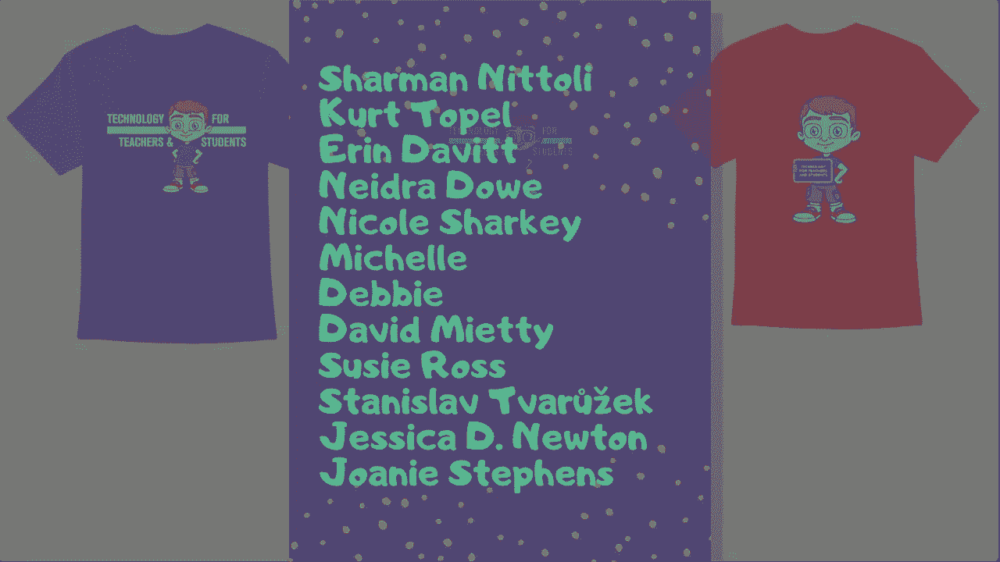

# 【双语字幕+速查表下载】Excel正确打开方式！提效技巧大合集！(持续更新中) - P41：41）Excel双击鼠标技巧 - ShowMeAI - BV1Jg411F7cS

In this video， we're going to learn some Excel。 double mouse click tricks。 Try saying that three times fast。 And you can get a copy of this spreadsheet that I'm using in the description below this video if you want to follow along。 So Excel is full of some little tricks that you can perform using a double mouse click trick number one。 you can double click the title bar of Excel to maximize the window。 So as you can see。

 my Excel window doesn't fill the whole screen。 If I double click this title bar。 It automatically maximizes the window。 Now， what if I need to go back to the smaller previous size of this window。 All I have to do is double click again， and it goes back exactly to the size that it was at before。 T number two， Excel has this nice tab and ribbon layout that makes it easy to identify the most important options and Excel features and tools that we might want to use。

 But sometimes this big ribbon just gets in the way， especially if you have a small screen like I do。 if you want to hide the ribbon， all you have to do is double click。On any of the tabs except for file， don't double click on file。 So if I double click here on data。 for example， it hides the ribbon and now I have more real estate for typing in data in the spreadsheet if I want to restore the ribbon I just double click again on any of the tabs other than file trick number3 as I'm working with data in Excel if I need to change the data that's inside a cell instead of just clicking once and then overr the data by typing I can double click on a particular cell to jump inside that cell。

 you can see my mouse cursor as flashing and now I can simply edit the contents of the cell so I don't have to delete the word DVD in this case。 I can just add a forward slash and type in blueray trick number4 you can double click the text inside a cell to select the word So let's say I've double clicked to get inside this cell at this point if I double click on the word comedy it select the entire word that could be helpful if I want to cut that word or。

Opy it or delete out that word。 Now， what if there's more than one word in an Excel cell。 Ive double clicked to get inside this cell， If I double click on the word science。 it highlights just science。 What if I triple click。 if I triple click it highlights all of the words in that cell。

 trick number 5 is I can double click between columns to autofi them。 So， for example。 let's say my column for location is bigger than necessary。 I could double click between column F and column G。 it has to be up here not down here in the data itself， but up above with the column letters。

 but double click between F and G and it automatically sizes that column to fit all of the data perfectly。 It also works in the other direction， So let's say my column is too narrow。 I can double click between F and G to expand that column， make it bigger。 You can also do this with more than one column at once。

 So I'm going to change A B and D to make them all different sizes if。Click and drag on the column letters all the way across and then double click between any two of them。 It should automatically resize all of them to the perfect width。 trick number6。 you can double click on the autofill handle to copy a formula down the spreadsheet。

 Here's an example of what I'm talking about at the right side of this range of data。 I've set up a new formula to calculate the value change of what I paid for each of these DVDvds and the DVD's current value As you probably know if you've watched my other Excel videos。

 I can use the autofill handle to click and drag and apply this formula down the page So that's nice and often that's a really good way to use the autofill handle。 But what if instead of 30 or 40 movies in this spreadsheet。 What if I had 1 thousand00 I wouldn't want to click and drag indefinitely down the spreadsheet。 So instead as a realtime saver， I can just double click on that little green square the autofill handle Just double click and it extends that formula。

All the way down to the bottom of your data。 trick number7。 you can double click on the format painter to use it over and over。 So let's say I want to format my spreadsheet with some colors and maybe some bold options。 Maybe I want the data here below to be italicized。

 maybe I want to have borders visible borders around my data in column a So I've made some format changes Now。 what if I want to copy that over here to column J。 How would I do that？ Well。 one way to do that is to use the format painter。 I can click on a particular cell that I like the format of and then go here to the home tab in the clipboard group。 I can click the format painter and then I can go over here and click to format another cell the same way。

 But at that point the format painter is deselected I would have to start that process again in order to format more cells that way This time。 instead of clicking the format painter once I'm going to double click on the format painter。And that keeps it enabled。 So now I can click multiple cells。 And， of course。 I could click and drag to apply that format to all of those cells at once。

 But what if the cells that you want to highlight are scattered throughout a spreadsheet。 because I've double clicked on that format painter。 I can just keep clicking and it will continue to format those specific cells the same way that this cell is formatted。 I think I'll undo all of that， Let's move on to trick number 8。

 You can double click on the edge of a cell to jump to the last cell within a range that has data on that side。 So， for example， let's say I'm here on the Gremlin's cell。 If I double click on the bottom edge of that cell。 it jumps me down to the very bottommost record or movie in this case。 in my range。 So tenantet。

 Now what if I need to get to the far right。 I can double click on the right edge of cell A 35 in this case。 And that takes me just to B 35。 Now， why is that。😊。reasonason why is because I have a blank column inserted in my data。 I'm going go ahead and right click and delete that column and try it again。 I select a 35。

 I double click on the right edge of that cell and it jumps me all the way to the far right of my range of data。 It also works with the left edge and the top edge of a particular cell。 T number 9。 you can double click on a shape to add text to it。 and I can find those here shapes。 let's say I insert a shape on top of my data。 I can double click on that shape to add text to it。

 T number 10。 double click to choose your option in dialog boxes。 Many times in Excel when a dialog box opens up。 you'll have the ability to select an option and then click O to apply that option。 Instead， why not just double click on the option。 In most cases that's all you need to do to apply that option。 You don't have to click OK Trick number 11。 you can double click to rename。Your worksheets。

 So here I have sheet number one。 I can just double click there and rename it movie collection。 tipip number 12。 you can double click in the upper left corner of the title bar to close your Excel workbook。 Now because I haven't saved when I double click。 it asks me if I want to save my changes。 I do。 And then it closes the workbook。 but that can be a good time saver when you want to quickly exit Excel。

 So those are my Excel double mouse click tricks。 Thanks for watching this video。 I hope you found it to be helpful if you did， please like follow and subscribe。 And when you subscribe， click the bell so you'll be notified when I post another video。 if you'd like to support my channel you can do that through my Patreon account or by buying channel merch。

 and you'll learn more about those options below this video。 speakingea of Patreon。 I'd like to give a quick shout out to my $5 Patreon supporters。 Thank you so much for all you do to support the channel。

