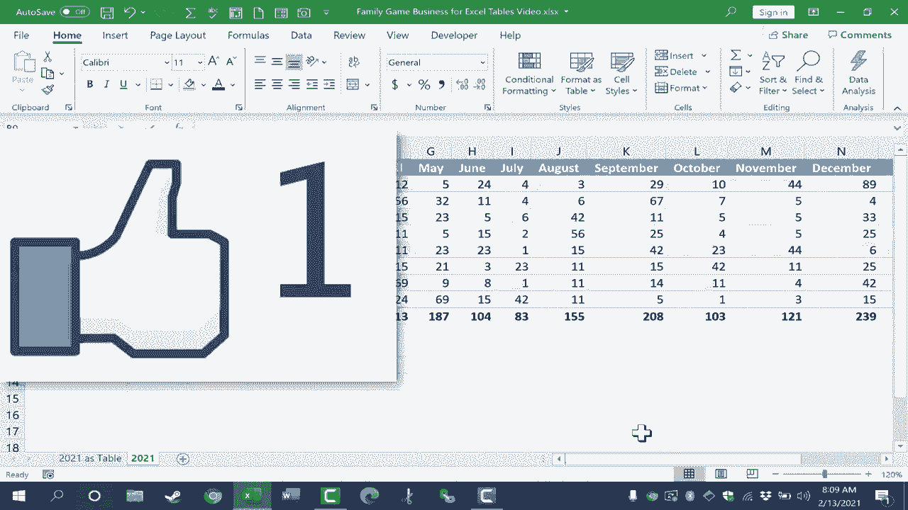

# 【双语字幕+速查表下载】Excel正确打开方式！提效技巧大合集！(持续更新中) - P42：42）所有关于 Excel 表格 - ShowMeAI - BV1Jg411F7cS

In this video， we're going to learn all about Excel tables。 including how they work and some of the great benefits that they give you。 And we're going to start by focusing on the anatomy of an Excel table here in this spreadshe。 which you can get in the description below this video。 You'll see that I have two sheets。

 One that is formatted as a table and the other that is formatted just as a range of data。 So what are the individual components that make up this table at the top。 we have the table header row。 In this case， it's row number one。 Each column has a header that explains the kind of data that follows below。 So product name。

 and then there's some board games or card games listed below price。 and we have some prices listed below。 and then we have some data for each month of the year。 And then yearly total sales over here at the right。 But the table header row explains or describes the kind of data that follows below。

 There are a couple of。😊，Very powerful features that come with the table header when you create a table。 The first happens automatically without you doing anything special。 you can see that my data in this particular spreadsheet is really not that long。 I don't have 100 rows 1000 rows。 But if I did， look what would happen as I scroll down the page。

 the table header row gets pinned basically here at the top so that I always know what goes in each column。 It doesn't matter how far down the table I go as long as I'm still in the table。 the table header row will be visible。 The other nice thing about the table header row in Excel tables is that it automatically includes sort and filter options。 That's what these little buttons are that appear in each column heading。 so I could for example。

 click this button here to reorder my spreadsheet based on the highest yearly total sales to the lowest or largest to smallest as its stated here。 so I。Click that and now I know right away which product has brought in the most total sales。 So that's a nice feature。 I can also use those buttons to filter。 In other words。 to hide some data temporarily So let's say I want a report of only a few of the products and I want to hide the data for the other products。

 I click and I've filtered out some of the data based on the product name I could also filter based on the product price or some of these other options but I want to just put everything back at this time。 so I'll just click to select all click OK and my filter has been removed So those are the two main benefits that the table header row gives you in Excel tables It stays visible if you're within the table still and it gives you sort and filter options with these buttons The second part of the anatomy of an Excel table is the table data and it's here and as you can see by default the table。

Data comes with banded rows。 In other words， we have a blue background here， white background here。 blue background here。 that just makes it really easy to track your data and your rows across the entire table I know for sure that this number of yearly total sales goes with the game Teles because those banded rows help me to clearly identify which product it goes with。

 One of the other nice things about the table data in an Excel table is that if I need to add more data to this table all I have to do is go to the lower right corner of the table data and tap tab on the keyboard and it gives me a new row of data and I can put in additional information So the table data part of the table can auto expand to include new data as needed The final part of the anatomy of an Excel table that you need to know about is this This is the table totals row and as long as it's enabled in your settings。

 it will automatically add up at least。Part of the numerical data in your table。 I'll show you more about how that works as we get further into the video。 So let's look now at how to convert a range of data like this into an Excel table to begin you just need a range of data that's all together。 It's not separated by blank columns or blank rows。 It's just data that's all。

 and then you can simply click anywhere in that range and then go here to insert table。 Excel pops up with a dialog box。 where's the data for your table。 It automatically identified that data。 Here's the range that it automatically identified and I can also see it with these dashed lines around my data If for some reason there's a mistake here。 you can click this button and then select the data manually but you shouldn't have to do that in most cases At this point。

 I could click this button here。 Next， it's important to notice this checkbox here。 My table has headers Here， Excel is asking if my table。AsColumn headings， like product name， price。 yearly totals etc。 And it does。 And so it's important that I have that checked。 If not。 it will cause a little bit of trouble with my data。

 I'll go ahead and click OK and it's now converted my range into a table Now I'm going hold control in T Z to show you that you can skip a couple of steps if you just hold control on the keyboard and tap T for table that takes you right to this create table dialog box and you can click OK to convert the range to a table At this point you'll notice that a new tab and ribbon have been enabled in your spreadsheet As long as you have selected at least part of your table you'll see the table design tab here at the top with the table design tab selected it's a good idea to now go to the properties group and give your table a name and the name should have no spaces in it and while it's not totally necessary to name your tables it can come in handy later if you want to use formulas using your table。

Also there's some other reasons it might come in handy。 So it's a good practice to get into of naming your table。 So now my range is a table。 you can see my table header row looks really good。 You can see my table data is here and has banded rows just like I expected but the table totals row is missing Why is that Well by default it may not be included So if you look here at the table design tab here in the table style options group you can see that there's an option for total row Now that I've checked that the total row appears and you can see it automatically totaled the yearly total sales for each game sold by this company Now it did not total each month's number of sales。

 If I want that I can just click here underneath January for example。 click this button and choose what I want to do do I want to identify the highest number of item sold the average how about the sum I just want to add it up and then I could do that with each additional column or I could just use the autofill handle。

Extend that formula across my table。 So there's my table totals row。 Let's look next at some of the other table design options I have By default。 I've been given banded rows。 If I prefer， though， I could change that to banded columns。 I do prefer banded rows myself。 If you want， you can choose first column which will give you some special formatting for that first column。

 it basically bolded the names of the games。 you can also do the same thing with the last row if you would like In my case。 I'm going to stick with the last row。 you can also turn on or off the filter buttons in the table header row here in the table styles group。

 you can change up the color scheme for your table if you would like。 if you click this button here。 it gives you even more options And so depending on the look and feel that you want for your table。 you really have many， many options to choose from some other table design options you should be aware of include the insert slicer option。 If you haven't watched my tutorial on Excel slicers。

You should definitely watch that but this is a powerful feature same with summarize with pivot table I have a video on that topic。 but basically with the click of a button you can begin the process of creating a pivot table using your Excel table there's a button to remove the duplicates and there are other options as well that are worth checking out one final thing I want to point out about Excel tables is that now that this is a table it makes it a little faster and easier to apply Excel formulas let me demonstrate I'm going to right click on O and choose insert to insert a new column and I'll title this fourth quarter sales and I just want to create a formula that will add up the total number of sales from October through December so I click on that cell type equals some left parenthesis and then I just want to add up these three numbers So I clicked and dragged to select those numbers I tap enter on the keyboard and look what it did it calculated the total fourth quarter sales not just for my boggle game but it automatically apply。

That same formula down through the rest of the table。 So this is a nice little time saveer。 It automatically assumed that I want that same information for everything else in the table Now。 despite the advantages to using Excel tables。 There are times when you want to convert your table back into just a simple range to do that。 you can just click anywhere in the table go to the table design tab and then click this button convert to range do you want to convert the table to a normal range。

 Yes， so now this is just a simple range of data。 the formulas still work but you can see that the sort and filter buttons are gone If I go to the end of the data and tap tab it doesn't create a new row for the table even though it's formatted as if it were a table with the banded rows etc it's really not a table anymore。

 So I hope you can see some of the advantages of using Excel tables for your data。 Thanks for watching， I hope you found this tutorial to be helpful if you did， please like。 follow and subscribe。

When you subscribe， click the bell so you'll be notified when I posted another video if you'd like to support my channel。 you can do that through my Patreon account or by buying channel merch and you can find out more about those options below this video。

