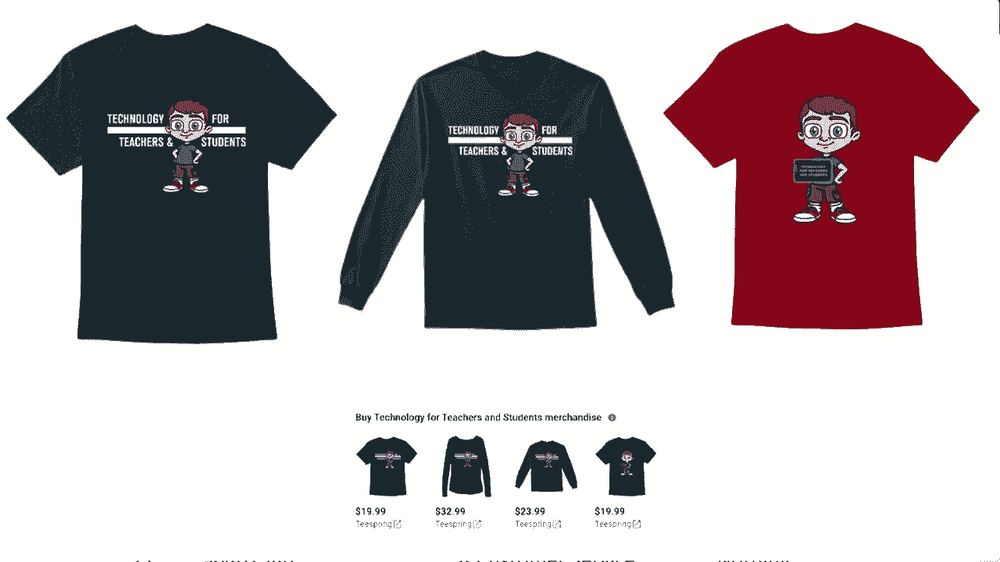

# 【双语字幕+速查表下载】Excel正确打开方式！提效技巧大合集！(持续更新中) - P46：46）使用强大的AND函数 - ShowMeAI - BV1Jg411F7cS

在这个Excel教程中，我将向你展示如何使用AND函数。这是一个很棒的函数，需要多个条件为真才能发生某事或返回结果为真。如果这些多个条件不为真，那么它返回结果为假。所以让我们看看几个示例，以及你如何使用它。

你可以在这个电子表格中看到，我有一个虚构公司的员工列表。假设这家公司的管理层决定给予销售部门每位在公司工作至少五年并获得至少6的绩效评估的成员奖金。

我该如何做到这一点？如何在Excel中自动计算？好吧，使用AND函数比你想象的要简单。我只需从F2开始，输入等号和左括号。然后开始输入逻辑测试。这里的每个逻辑测试都必须为真，以返回结果为真。

如果任何一个为假，则返回结果为假。那么我们开始，左括号，然后是逻辑测试一B2，我可以直接输入，或者点击B2大于四。所以如果大于四，就是在公司工作五年或更长时间。现在我输入逗号，第二个逻辑测试是绩效评估，至少需要6或更高，这次我直接点击，所以D2大于5，再输入逗号，现在第三个逻辑测试E2需要等于销售。因为销售是一个单词而不是数字，我需要将其放在引号中。所以“销售”，然后我应该放上右括号。有时你不必这样做，但在这种情况下我还是会这样做。我按下回车，看看，这看起来像是Gina Pullin。

她在公司工作超过四年。她的绩效评估高于5，并且她是销售部门的成员。好消息是，我不必为每位员工重新创建相同的公式。我要做的就是点击并拖动这个绿色的方块，即自动填充手柄，只需将其向下拖动，或者最简单的方法是双击它。它会将内容复制到数据的尽头，我们可以看到公司中有几个人获得了奖金。现在，让我们将这个提升到另一个层次。

假设我不仅仅想要真和假，如果我想在这里打印一些更有意义的东西，比如奖金或没有奖金，或证书，或祝贺，或者其他可能放入这个单元格的内容，而不是非常简单的真或假。

我该怎么做呢？我们可以使用一个 if 函数。如果你还没有观看我关于 if 函数以及以 S 结尾的 ifs 函数的教程，我强烈建议你这样做。关于 if 或 ifs，你可以做一些非常令人兴奋的事情。

我们将使用 if 函数。所以等于 if 左括号。现在我们将把单词 and 嵌套在这个 if 函数中。所以我会输入单词 and。所以如果 and，然后我接下来输入的任何内容这里都必须为真。所以如果 and 左括号 B2 大于 4，并且我在这里放一个逗号。

现在我们的第二个逻辑测试 D2 大于 5，我再放一个逗号 E2 等于并且引号中为 sales。现在在这一点上放入右括号是很重要的，我确实需要在这时这样做。原因是这现在关闭了嵌套的 and 函数及其相关的公式。这个部分完成了，现在我需要回去完成公式的 if 部分。所以如果这一切都为真。那么，在这种情况下，你用逗号表示“那么”。

然后我想打印。所以我会把这个放在引号中，单词 bonus。当然，这并不会在打印机上打印。它将在这个单元格的屏幕上打印。现在，如果它不等于 bonus，我可以在这里用右括号结束公式，按回车。你可以看到它显示为 bonus，如果我双击自动填充手柄，它会向下复制。

但是对于那些没有赚取奖金的人，它仍然显示为 false。所以如果我想改变这个，我可以在 bonus 后面加一个逗号，让我们读一下公式。如果这些条件都为真，那么打印 bonus。接下来的逗号表示如果不是，那么打印什么呢？那就什么都不打印。我把这个放在引号里，按回车。然后我会通过双击自动填充手柄复制这个公式。

现在我们可以看到有些人赚取了奖金，有些人什么都没有赚到。但是我希望你能看到 and 函数的强大。它是一种方法，使多个条件为真。如果它们为真，打印单词 true。如果它们不为真，打印单词 false。如果你希望它是其他东西，而不是 true 或 false。

你可以在 if 函数中使用 and 函数。实际上，你可以用这个实现一些很棒的创意和实用方式，并在电子表格中使用它们。感谢观看，我希望你觉得这个教程对你有帮助。如果你觉得有帮助，请点赞、关注和订阅。当你这样做时，点击铃铛，这样你就会在我发布另一个视频时收到通知。

如果你想支持我的频道，你可以通过我的 Patreon 账户或购买频道周边产品来实现，关于这些选项的信息在这个视频下方的描述中。说到 Patreon，我想快速感谢我的 $5 Patreon 支持者。

非常感谢你为支持我的频道所做的一切。

