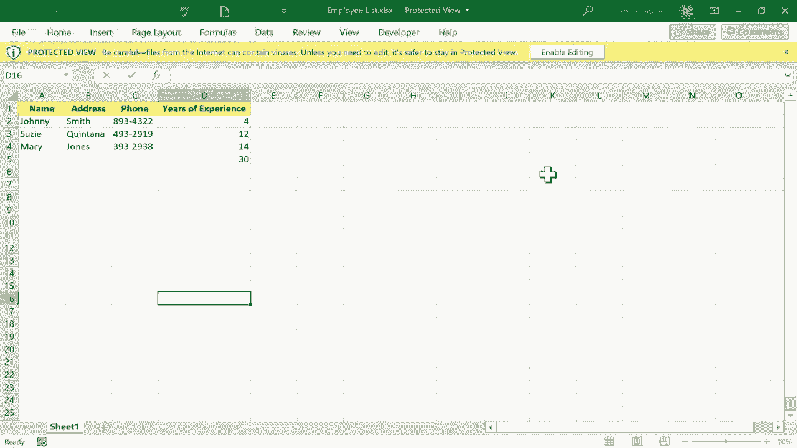
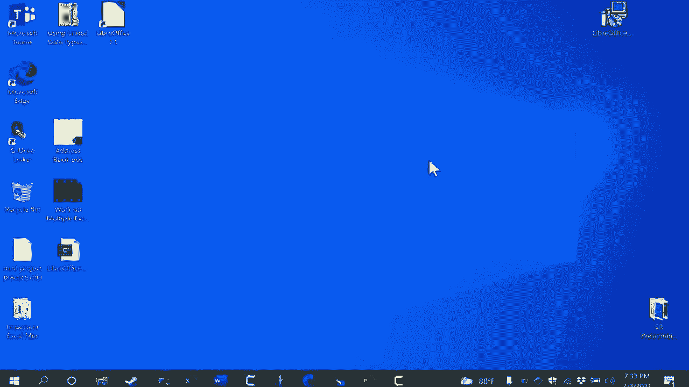
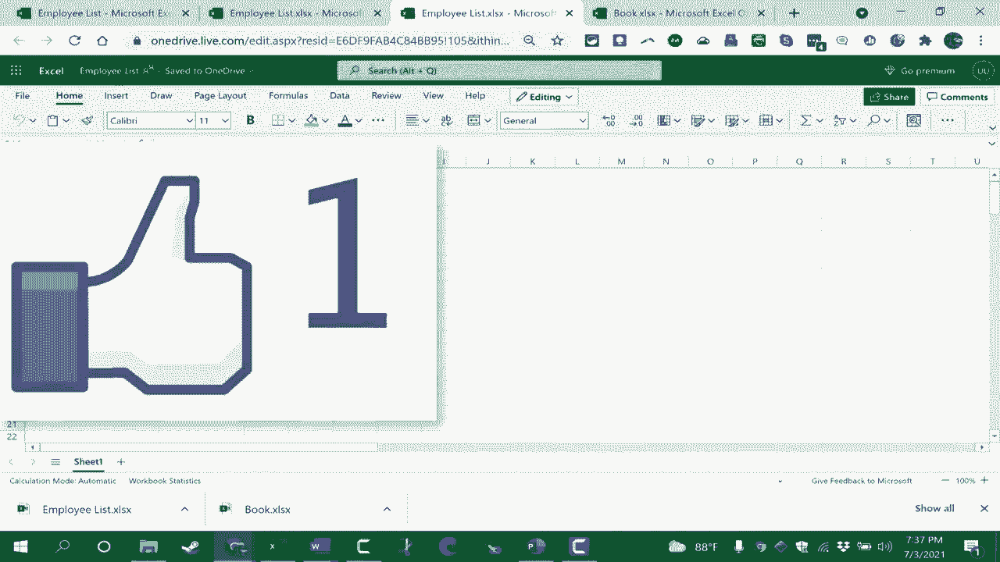

# Excel正确打开方式！提效技巧大合集！(持续更新中) - P47：47）Excel Web应用 - ShowMeAI - BV1Jg411F7cS

在这个视频中，我将向你展示如何完全免费使用微软Excel。你不仅可以查看其他人的Excel电子表格，还可以创建自己的。你可以以各种格式保存它们，可以轻松与他人共享。这确实是一个被低估的使用微软Excel的方式。

这就是所谓的网页版Excel。所以这是微软Excel的在线版本，要访问它，只需去Office do co。它看起来像这样。你可以看到它写着注册免费版的Office，你也可以直接点击登录。现在，如果你点击这个按钮，获取Office，微软会鼓励你购买Microsoft 365，并给你一些选项。

但如果你想完全免费使用，只需点击登录或注册免费版的Office。我会点击登录。这将带我到一个屏幕，我可以输入我的任何微软邮箱地址。如果你有Outlook邮箱地址或Xbox账户。如果你曾经在微软设置过账户。😊

你很可能已经可以使用现有的微软账户登录。给我一分钟时间登录我的微软账户，然后我会继续视频。好的，我现在在我的微软Office在线界面，你可以看到左侧我应该可以快速访问每个最常用的微软Office产品，有Word、Excel、PowerPoint、Outlook、OneNote、待办事项等等，这太棒了。如果我想，我可以快速在这些产品之间切换，甚至可以在桌面上添加一个快捷方式，快速带我到这里。虽然这次我不打算这样做，但这是个不错的选择。所以在左侧你还会看到一个创建按钮，看起来像个加号，如果我点击它，我可以在新的免费Office在线账户中快速创建任何这些类型的文档。我只需选择电子表格，如果你们中有人使用过G Suite的Google文档、Google表格、Google幻灯片，这个想法是相似的。

不过这是来自微软的，这些都是我们将要创建的真实微软电子表格，PowerPoint 和 Word 也是如此。所以我们这里有的，正如我所说，是微软 Excel，但它在云端，是在线的，我们仍然拥有类似于 Windows 或 Mac 版 Excel 的布局。我有选项卡，所以每个选项卡都可以被点击，当我点击一个选项卡时，它会改变功能区。你会注意到，功能区与安装版下载版的微软 Excel 不太一样，你必须为此付费，功能区包含了最基本、最常用的选项和功能，但并不是所有的。如果我查看插入选项卡和功能区，我可以看到我可以插入图形和图表，但我看不到智能艺术列在那里，所以我们得到的只是最重要、最常用的选项和设置，而不是所有的，就像桌面版的微软 Excel 一样，我可以点击一次进入某个单元格，我可以点击。

双击单元格可以跳入该单元格。一旦你在某个单元格中，你可以输入，然后按回车或制表键使数据进入单元格。按回车通常会将你向下移动到电子表格中，制表键将你向右移动，如果按住 shift 并按制表键，它会将你向左移动。如果按 shift 和回车，它会将你向上移动。因此，通过制表键和 shift 制表键，你可以向右和向左移动，而通过回车和 shift 回车。

你可以向上和向下移动。当然，你也可以用鼠标点击你想要进入的特定单元格。因此，我可以通过这种方式直接在 Excel 中输入信息。给我一分钟来输入一些数据，然后我会继续视频。我可以通过点击和拖动来格式化我的电子表格和数据。我可以选择我想要影响的内容。这是我使用 Excel 的座右铭，选择以影响。

一旦我选择了一个范围，我可以向上点击粗体，在这种情况下。我也可以将数据居中。我可以高亮数据，改变文本颜色。我们真的有微软 Excel 中最重要的功能和最常用的功能，但它们在线免费提供在 Excel for web 中。我会在这里添加一点更多的数据。

而且这条新数据我希望它的格式与这里其他数据相同。我所要做的就是选择一个我希望它格式化的示例，然后去主页选项卡，点击这里的格式刷，然后点击我想要以相同方式格式化的新信息，它就会格式化。我真的很高兴格式刷是 Excel for web 的一部分。我还想让你看到公式在 Excel for web 中可以使用，所以我将在这里点击等于号并输入一个公式。

一些左括号，然后我可以选择我想要相加的内容，或者我可以描述它，因此我可以输入 D2 通过，而我们用冒号表示通过 D4，然后放入我的右括号。你真的不需要放在那里，但养成这个习惯可能是个好主意，然后我可以按回车，它会加总总的工作经验年数。

同样的操作方式是输入等于符号sum左括号，然后点击并拖动以显示Excel中我想要相加的数据，然后只需按回车。由于sum非常常用，实际上有一个自动选项，所以我可以点击下面的单元格，在这种情况下是工作经验，然后我可以在主页选项卡上找到一个自动按钮，点击后按回车，它也能完成同样的操作。因此，使用这个免费的Excel网页版，我真的可以使用Excel。这绝对是Excel，但它是完全免费的，且可以在我想访问的任何地方轻松分享和访问。说到分享，与其他人分享的方式是点击这里的分享按钮，我们在这里有一些设置需要考虑。目前，任何拥有链接的人都可以编辑这些数据。如果我想改变这一点，我必须点击，可以去掉编辑权限，这样人们可以查看，但无法更改。我可以设置过期日期，这听起来很不错，但这是一个高级功能，所以需要为Microsoft付费。

要拥有这个选项，365和密码保护的功能也是一样，所以我需要决定。我是否希望别人能够编辑，还是仅能查看？在我的情况下，我会允许编辑。我会点击应用，然后可以将其发送给一组人，每个团队成员都能编辑或查看，或者我可以复制一个链接。现在，任何拥有这个链接的人都可以编辑这个电子表格，所以我复制了它，然后可以粘贴到电子邮件中，发送给别人，或者以我想要的任何方式分享这个链接。现在，如果我想把这个变成一个实际保存在我电脑上的文档，因为到目前为止，这个电子表格只存在于云端，我只需点击文件，查看一些可选项。我可以选择另存为，其中一个选项是下载副本，这将是一个真正的Excel文档。另一个选项是将其下载为OD文件，即开放文档文件。我将选择下载副本，这样就保存了一份副本。

我将电子表格保存到我的计算机，我可能应该先给它命名。我可以在这里的书名处将其称为员工列表，然后点击其他地方，现在下载时会使用正确的名称。我可以点击并在我计算机上安装的 Microsoft Excel 中打开它。还有另一种方式访问网页版 Excel，我可以在左下角点击搜索放大镜，输入“office”，注意到有一个 Office 应用。如果我点击它，打开的界面看起来与我在 office.co 上展示的相似，但这是在我的实际计算机上。你可以看到我刚刚在网页版 Excel 中创建的文档，并且可以从这个 Office 应用中打开它，它还显示我计算机上所有的 Microsoft Office 文档，这很不错，它将在线内容与计算机上的内容结合起来，如果我想直接进入网页版 Excel。

我可以直接点击这里创建新工作簿。它会带我进入网页版 Excel 或 Excel 在线，我可以创建另一个文档。这个 Office 应用应该在几乎所有现代版本的 Microsoft Windows 上都有，这是一个不太为人所知的选项，帮助你快速进入网页版 Excel 或 Excel 在线文档。感谢观看，如果你想了解更多关于使用网页版 Excel 或 Excel Online 的内容，可以观看我的其他 Excel 教程。

包括 Microsoft Excel 的初学者指南。你在 Microsoft Excel 初学者指南中学到的几乎所有内容都适用于网页版 Excel，我希望你觉得这个教程对你有帮助。如果你觉得有用，请点赞、关注并订阅，订阅时点击铃铛，这样你就会在我发布新视频时收到通知。如果你想支持我的频道，可以通过我的 Patreon 账户或购买频道周边产品来实现，关于这些选项的信息可以在视频下方的描述中找到。

