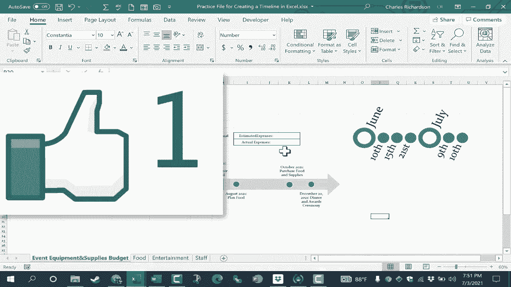

# 【双语字幕+速查表下载】Excel正确打开方式！提效技巧大合集！(持续更新中) - P48：48）创建时间线 - ShowMeAI - BV1Jg411F7cS

在这个视频中，我想向你展示如何在Microsoft Excel中轻松快速地创建时间线。我们这里有一个工作簿，里面有一些电子表格，帮助我们准备和规划一个活动。我们需要购买和规划不同的东西。除了我已经拥有的数据之外，我还想在这里添加一个时间线，以帮助我们保持进度。当然，在许多情况下。

时间线是在看过去。但在这种情况下，它会看最近的过去、现在和未来。那么，我该如何添加这个时间线呢？好吧，我将从插入选项卡开始。我会在这里查找插图。现在，在某些情况下，如果你有比我更大的屏幕，可能不需要点击插图。

你可能只会看到我们需要在功能区上显示的图标。但在我的情况下，我将点击插图，看看，那里有一个智能图形的符号。我会点击那里，会弹出一个窗口，允许我选择添加哪种智能图形。在这种情况下，我会选择流程😊，并寻找一个时间线流程。看起来这可能是一个时间线。

它说的是圆形重音时间线。这里还有另一个，基本时间线。当然，你可以看看其他的时间线，看看它们是否适合你，但我会坚持使用这两个。因此，我将选择基本时间线来开始。我会点击它，然后我就能将时间线添加到我的文档中，现在可以点击并拖动时间线的边缘，将它拖到合适的位置。

如果我不点击这个边缘的线，或者这条线、这条线。如果我不使用这些外边框线，而是会不小心移动箭头。这不是你想要的。为了给它留出空间，我将使用右下角的滑块缩小视图。

我会找到一个合适的位置，我可以把它放在这里，但在这种情况下我觉得就放在这里。然后注意到左侧写着在这里输入你的文本。我在这个第一条要点中输入的任何内容都会在这里显示。当我输入第二条要点时，也会在这里显示，依此类推。

所以我刚刚点击了第一条要点，我将输入2021年6月，然后我会继续输入当时发生的事情。我输入事件协调员分配了任务。你会注意到，文本大小调整以适应提供的空间，这在添加时间线或其他类型的智能图形时是个很棒的功能。所以现在我点击了第二条要点，我将输入2021年8月为活动计划食物。现在我只剩下最后一条要点，这是活动本身的日期。

但问题是，除了规划食物，还有很多事情要做。那么，我如何获得另一个要点呢？好消息是，这非常简单，只需在键盘上点击Enter，我就会得到另一个要点，并注意时间线也会添加一个要点。假设是2021年10月，我当然可以注明具体的日期，购买食品和用品，然后显然会有更多的事件。

时间线，但我们现在跳到最后一点，那就是事件本身。假设是2021年12月20日，我已输入这是什么。关于这个框有几件事你应该知道，它帮助我们填写智能艺术的内容。注意，如果我在其中一个要点上点击Tab，它会将该项目作为前一个要点的子项，因此在我的情况下这完全不是我想要的，但我希望你知道Tab是这样工作的，它将这些信息作为该其他要点的子事件放置，然后正如我之前所示，如果你点击Enter，它会添加额外的要点，所以如果我在最后这样做，它会在时间线的右侧添加更多要点。我将撤销这个，假设我需要在2021年8月和10月之间再添加一个要点，我所要做的就是去到2021年8月那一行的末尾，点击键盘上的Enter，现在我在时间线上有了另一个要点。

我也会撤销那样做。另一个需要考虑的事情是，你可能想展示这些事件之间的距离不同。例如，假设不是6月和8月，而是6月和7月。我可能希望这个时间线上的要点与6月更近。你只需点击并拖动即可移动它。如果你觉得需要这样做。

你还可以移动文本，以确保它更靠近，使其明显指向哪个要点。所以这就是你如何调整时间线，使其在描述更近日期时更现实。现在，正如你可能注意到的，我的智能艺术带来了与我已有主题相匹配的颜色。但如果没有，你可以右键点击智能艺术。

你可以看到，在底部我有样式选项。我可以快速通过这种方式更改样式，或者我可以右键点击，改变填充颜色和轮廓颜色。我不太喜欢那样的效果，但这是一个你应该注意的选项，可以右键点击来更改一些视觉选项。

如果你决定想让时间线变小或变大，只需选择它。然后你可以去右上角或其他角落，点击并拖动来调整到合适的大小。如你所见，时间线中的所有内容都会被调整大小。现在你可能会想知道我本可以选择的其他智能艺术时间线。

但它不是以类似的方式工作。所以如果你想尝试那个，没问题。这是圆形重点时间线，我会稍微移动一下，这样你可以更清楚地看到。再一次，我会使用这个框来输入信息。注意这个有点不同，所以更大的圆圈在这里。

更小的圆圈有缩进。因此，它确实有些不同。也许是6月10日。我们可以把它放在这里，6月15日，然后这可以是7月9日和7月10日等等。现在，就像我之前展示的那样，如果你按下回车键，你会得到另一个项目符号。就像其他时间线一样，我需要把左侧的日期更改为与我的时间线匹配。

除此之外，我已经完成了重要事件的时间线创建，希望你觉得这个教程有帮助。如果你喜欢，请关注和订阅，订阅时点击铃铛，这样你就会在我发布另一个视频时收到通知。如果你想支持我的频道，可以通过我的Patreon账户或购买我的商品，更多信息请查看视频下方的描述。

