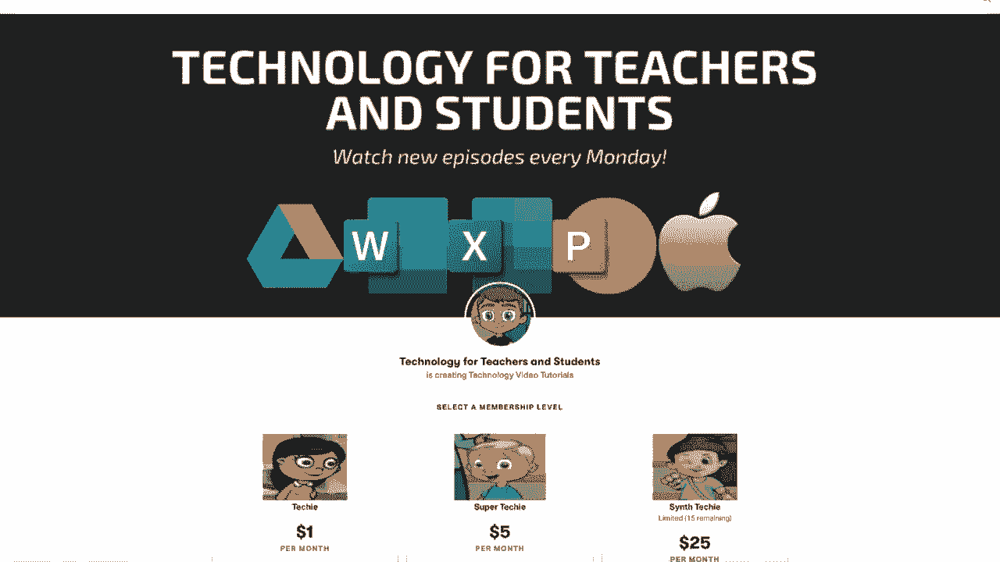
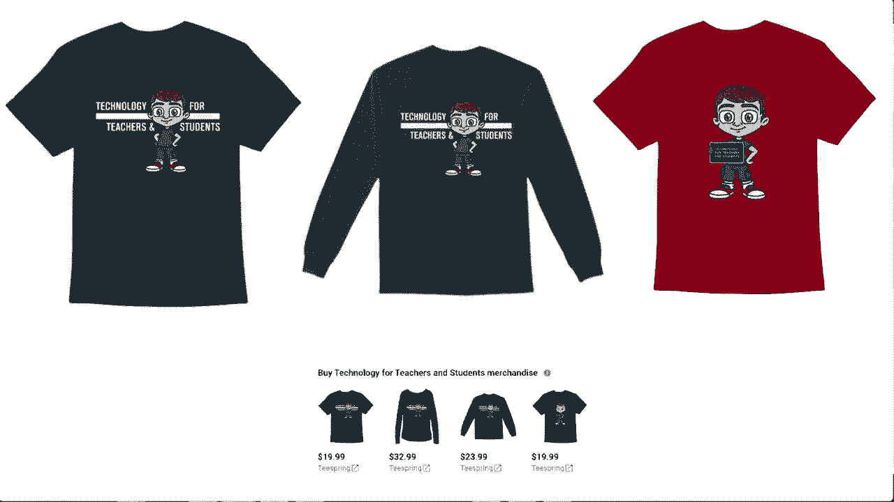

# 【双语字幕+速查表下载】Excel正确打开方式！提效技巧大合集！(持续更新中) - P48：48）创建时间线 - ShowMeAI - BV1Jg411F7cS

In this video， I want to show you how to easily and quickly create a timeline in Microsoft Excel。

 And what we have here is a workbook full of some spreadsheets to help us prepare for and plan an event。

 There's different things we need to buy and plan。 In addition to this data that I already have。

 I would like to add a timeline here to help us kind of stay on track。 Now， of course， in many cases。

 a timeline is looking at the past。 But in this case， it's going to look at the recent past。

 the present and the future。 So how would I add this timeline。 Well。

 I'm going to start by going to the insert tab。 And I'm going to look here for illustrations。 Now。

 in some cases， if you have a bigger screen that I have， you may not have to click on illustrations。

 You may just see the icon that we need displayed here on the ribbon。 But in my case。

 I'm going to click on illustrations and look， there's a symbol here for smart art。 I'll click there。

 and I get a pop up that enables me to choose what kind of smart art to add。 In this case。

 I'll go to process。😊，And I'll look for a timeline process。 It looks like this could be a timeline。

 It says circle accent timeline。 Here's another one。 basic timeline。 Now， of course。

 you could definitely look at some of these others and see if they would work well for you also。

 but I'm going stick with these two that are here。 So I'll just choose basic timeline to start。

 I'll click and I get the timeline added into my document I can now click and drag on the very edge of the timeline to drag it to the right place。

 if I don't click on the edge on this line that's at the very edge or this line or this line。

 if I don't use one of those outer border lines。 instead what will happen is you'll accidentally move the arrow。

 and that's not what you want to create some room for this。

 I'm going to zoom out using this slider in the lower right corner。

 and I'll find a good place for this， I could put it up here but in this case I think I'll just put it here。

 and then notice it says here at the left type your text here。

 Whatever I type in this first bullet point will be entered here。 and then when I type in the。

Second bullet point will be entered here and so on。

 So I've just clicked at the first bullet point and I'll type in June 2021 Col。

 and then I'm just going to go ahead and type what happened at that time。

 So I type in event coordinator assigned。 and you notice what happened the text size adjusted so that it could fit within the space provided so that's a great feature whenever you're adding a timeline or other kinds of smart art。

 So now I've clicked at the second bullet point I'll type in August 2021 plan food for the event And now all I have left is one more bullet point and this is going to be the date of the event itself。

 but the problem is there's much more to do than just plan the food So how do I get another bullet。

 Well， the good news is it's super easy just tap enter on the keyboard and I get another bullet point and notice that the timeline gets another point on it So let's say October 2021 and I could put specific days of course purchase food and supplies and then obviously there would be more events on。

Timeline， but let's just now jump to the last bullet point which is going to be the event itself。

 let's say December 20 2021 and I've typed in what that is Now a couple of things that you should know about this box that helps us fill in the contents of the smart art Watch what happens if I am on one of the bullet points and I tap tab what it does is it makes that item a subsection of the previous bullet point so in my case that is not at all what I want to do but I just want you to be aware that tab does that it works that way to put this information as a subeven to this other bullet point and then as I already showed if you tap enter it adds additional points so if I do that at the end it adds more points at the right of the timeline I'll undo that let's say I need another bullet point here between August 2021 and October all I have to do is go here to August 2021 to the end of that line tap enter on the keyboard now I have another point in the timeline。

I'll undo that as well。 Another thing to consider is you may want to show that some of these events are closer together than others。

 So， for example， let's say instead of June and August， what if it were June and July。

 I might want this point on the timeline to be physically closer to June。

 And all you have to do is click and drag to move that。 Now， if you feel like you need to do so。

 you can also move the text to make sure it's closer enough so that it's obvious which point it goes to。

 And so that's how you could adjust the timeline to make it more realistic in describing dates that are closer together。

 Now， as you may have noticed， my smart art came in with colors that match the theme that I already have。

 But if that doesn't happen for you， you could certainly right click on the smart art。

 And you can see that right here toward the bottom， I have style options。

 And I could quickly change the style that way。 or I could right click and change the fill color and the outline color。

 I don't really like how that looks。 but that is an option that you should be aware of that you。

Can right click to change some of those visual options for your smart art。

 If you ever decide that you want the timeline to be smaller or bigger， simply select it。

 and then you can go to the upper right corner or any of the other corners and click and drag to make it the right size。

 And as you can see everything that's part of that timeline gets resized。

 Now you may be wondering about that other smart art timeline that I could have chosen。

 but didn't it would work similarly So if you want to try that one out。 That's fine。

 This is the circle accent timeline and I'll scoot it over so that you can see it a little bit better。

 Once again， I would use this box here to enter the information。

 notice that this one is a little different So the bigger circles are here。

 the smaller circles are indented。 so it does work a little differently。 maybe June 10。

 we could put here and June 15 and then this could be July 9 and July 10 etc Now。

 just like I showed before， if you tap enter， you'll get another bullet。

Just like with the other timeline looks like I need to change the date here at the left to match my timeline。

 but other than that， I'm done creating a timeline of important events you for hope found tutorial to be helpful if you did like follow and subscribe and when you do click the bell so you'll be notified when I post another video If you'd like to support my channel you can do through my Patreon account or Cha merch and you'll out more information those opportunities in the description below the video。

