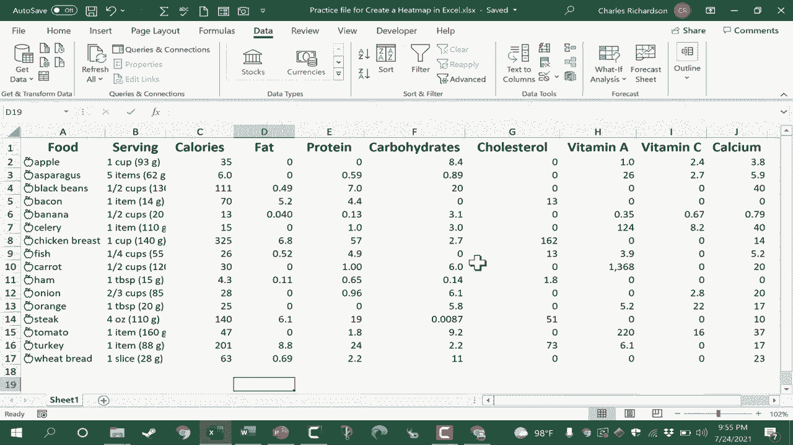
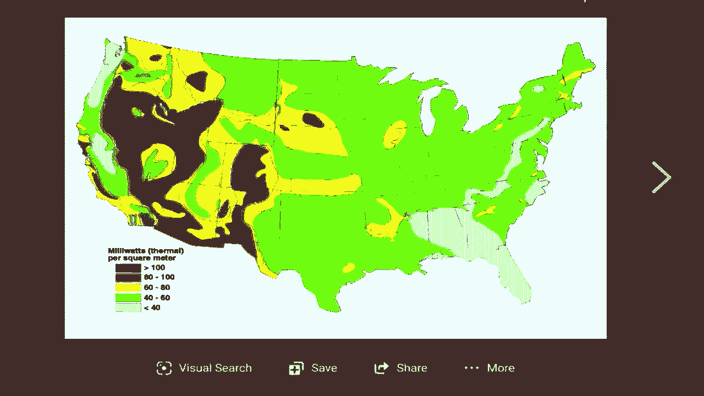
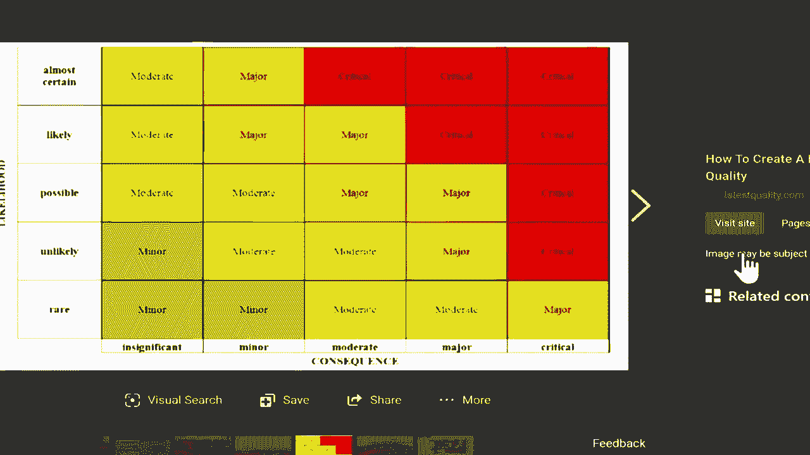
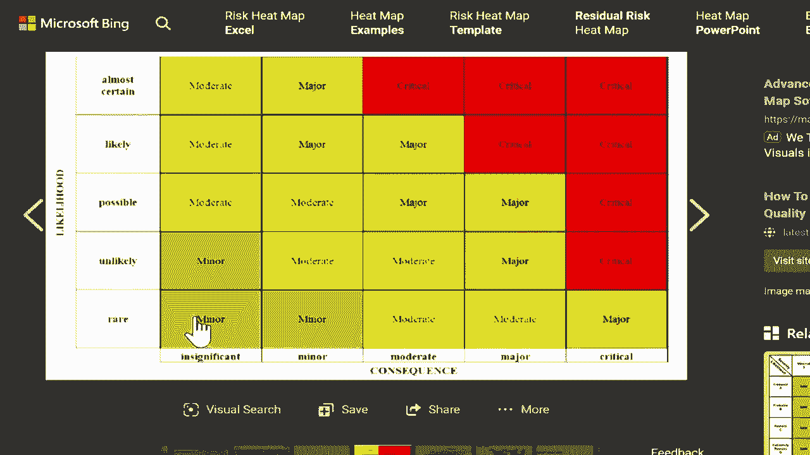
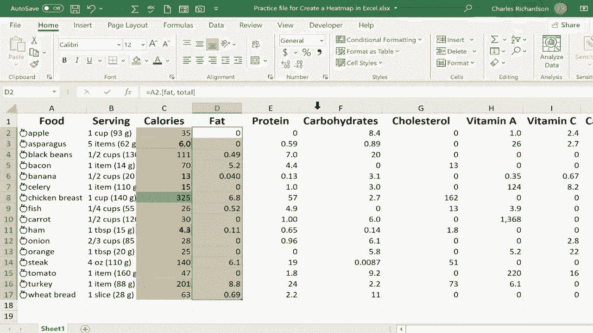
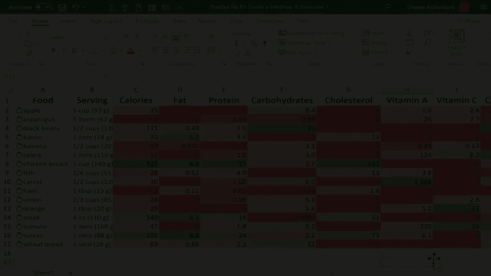
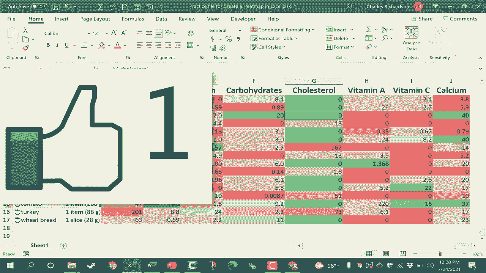

# 【双语字幕+速查表下载】Excel正确打开方式！提效技巧大合集！(持续更新中) - P49：49）创建热图 - ShowMeAI - BV1Jg411F7cS

在这个视频中，我将向你展示如何在Excel中轻松快速地从数据中创建一个美丽的热图。所以这里有一个电子表格，列出了不同食品及其详细信息。我通过使用“数据”选项卡和“数据类型”组收集了这些信息。如果你想知道怎么做，请观看我关于这个主题的视频。但在电子表格中拥有如此多数据时，确实很难理解和消化数据的含义。因此，为了帮助解决这个问题，我想使用热图。这里有几个其他热图的例子。

热图通常用于显示某个地理位置的温度。让我们来看看这个例子。这显示了美国各地的温度，但热图也可以用于其他方面。比如显示人口中心的位置或某个地方的高犯罪率或低犯罪率，并且它们也可以完全独立于地理使用，以指示在这种情况下什么是关键的，什么是次要的等等。但最好的事情之一是。

热图的好处在于它可以让观众立即理解数据的意义以及哪些内容在数据中脱颖而出。因此，让我们来看看在我的电子表格中设置热图效果是多么简单。首先，我们需要选择想要转换为热图的数据，不幸的是，你不能仅仅通过点击和拖动一次性选中所有数据。让我来给你演示一下，如果我选择了所有想要转换为热图的数据，然后进入“主页”选项卡的“样式”组，我可以进入“条件格式”并选择“颜色刻度”。你可以看到，当我将鼠标移动到不同的选项上时，基本上会得到热图效果。如果我选择这里的这个选项，最低的数字将是红色，最高的数字将是绿色；如果我切换到这个选项，它会反转，最高的数字将是红色，最低的数字将是绿色，并且有很多不同的选项，你可以浏览并选择最适合你想要创建的热图的选项。至少现在我会坚持这个选项。

但是正如我几秒钟前所说的，对于我在这个电子表格中拥有的如此复杂的数据，这并不是正确的处理方式。让我们来看看原因。当我选择了所有数据并应用了条件格式时，无论在我的电子表格中，最低的数字都被涂成红色，最高的数字被涂成绿色，这并不是我想要的。我并不关心这个数字与卡路里、脂肪或蛋白质的关系，我想知道胡萝卜中的维生素A与芦笋中的维生素A的关系。

假设或在他这里。所以我将通过按住控制键并点击Z来撤销。我将撤销我应用于这些数据的热图或颜色刻度。我只是想让你看到，在这种情况下，仅选择你希望比较的数据是多么重要，因此我想比较每种食物的卡路里。选定后，我返回到主页功能区。

Sts组。附加格式、颜色刻度和那种从绿色到黄色再到红色的颜色刻度。现在效果很好。我只需扫一眼，就能立刻看到鸡胸肉在这份食品清单中卡路里最高。现在，正如你所见，一些份量大小有点偏差。

但我也能立刻看到芦笋的卡路里非常低。现在我将为这些数据的每一列执行此操作。我只需点击并拖动选择我希望彼此比较的所有内容，转到条件格式的颜色刻度，然后选择同样的选项。

给我一点时间来完成，然后我会继续录制视频。好的，很好。我已经完成了对每一列的颜色刻度应用。现在完成后，我可能想稍微认真考虑一下。也许我在尝试突出显示这些食物的特别好或健康的地方。

所以，比如说，在卡路里的情况下，高卡路里可能实际上最好用红色显示，这表明也许这是你需要关注的东西。😊。

小心。所以我会再次突出显示数据，条件格式，颜色刻度。我可以切换到相反的选项。因此，现在一些可能更健康的选项显示为深绿色，而一些高卡路里的项目显示为深红色。我可以对脂肪列做同样的事情，也许有人想减少他们摄入的脂肪或碳水化合物或其他任何东西。我只需选择脂肪，并按住键盘上的控制键。

我还在选择胆固醇。假设我们想限制胆固醇的摄入量，然后维生素A、维生素C、钙，我们希望这些数值保持较高。因此，较高的数值可能更好，所以它们是绿色的。所以我将保持这些不变。但我想把脂肪和胆固醇调整为与卡路里一致，以便较高的数值标记为红色，较低的数值标记为绿色。因此，选定这两列后。

我将转到条件格式颜色刻度，并再次交换选项，这样在这些情况下，较低的数值将显示为绿色。因此，没有一种正确的方法来做这件事。这完全取决于你试图分享的数据和信息。

我现在的设置是为了显示哪些食物可能更健康，可能卡路里更少，脂肪和胆固醇稍低，同时可能富含维生素A、维生素C和钙。因此，我希望你能看到使用条件格式在Excel中创建热图的一些强大功能，特别是颜色比例。

如果你想了解我是如何收集这些不同食物的数据的，请观看我关于这个主题的教程。希望你喜欢这个视频，如果喜欢，请点赞、关注和订阅。当你点击铃铛时，你将收到我发布另一个视频的通知。如果你想支持我的频道，可以考虑点击感谢按钮，或通过我的Patreon账户支持我，或者购买频道周边产品。

你可以在视频下方的描述中找到关于这些选项的信息。😊！

