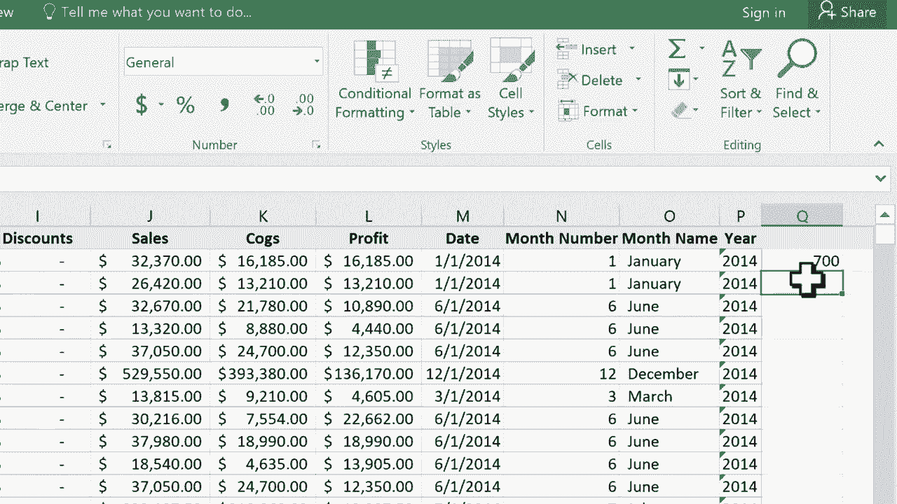

# Excel正确打开方式！提效技巧大合集！(持续更新中) - P6：6）使用 Count 和 CountA - ShowMeAI - BV1Jg411F7cS

在这个Excel教程中，我们将看几个我希望你会觉得有用的函数，它们是count和count a。此外，我们还会谈论一下状态栏以及如何使用它。所以你可以看到，这里有一个相当大的电子表格，里面有许多不同的记录，成百上千的记录。

记住，这就是我们称呼每一行的方式。基本上，填满数据的行是一个记录。这个电子表格有数百条记录。如果我想确切知道有多少条呢？当然，我可以向下滚动一段距离查看数据。

然后继续向下滚动，直到找到一个空行。但过了一段时间，这样做越来越难，效果也越来越差。所以让我们学习如何使用count或count a函数设置公式，以帮助你计算记录的数量。为此，我将浏览到右侧找到一个空单元格。这里有一个空单元格。

这是我将要使用的。现在，当然，你可以在其他很多地方做到这一点。这只是我展示的一个例子。所以在这个单元格中，我希望它告诉我这个Excel电子表格中有多少总记录。选择单元格后，我需要做的第一件事是按等号。

如果你看过我之前的Excel教程，你就会知道在Excel中使用公式时，可以把它想象成代数方程。因此，我会说这个单元格等于。所以我按下等号，然后输入“count left parenthesis”。那么我想计算什么呢？假设我想计算有销售记录的总条数。

我只需点击E列，它会高亮整个列，你可以在右侧看到它标记为E到E，这实际上意味着整个列。此时，我应该输入闭合的论文。但你并不一定非得这样做。所以我只需在键盘上按回车。它告诉我，这个电子表格中有700条记录的销售数量。现在。

当然，我可以在这里输入类似“有销售记录的总记录数”。这样我就可以标记这一列及其含义。现在。如果我不让它计算有销售的记录总数，而是输入计数左括号，只计算这一列呢，对吧。

我假设这些记录的第一列都有内容。所以如果我选择A列并按回车，看看它返回的数字。它返回了0。所以为什么呢？当我计算销售单位时，它返回700，但计算段时却返回0。原因在于我在这里使用的计数函数。

它仅计算该范围内的单元格。

包含数字的单元格。所以因为我的A列没有任何数字。它只是一些单词。它是政府、中型市场、渠道合作伙伴。这些只是单词，没有数字。因此，由于这个原因。它们没有被计算，返回的数字为0。那么让我们看看你如何可以修复这个问题。如果你想计算记录的总数，但希望包含文本。

你需要做的就是这样。这一单元等于。计算并添加字母A。说实话，我不太确定这个a意味着什么。也许它仅仅代表字母，而不仅仅是数字。但字母，或者也许它意味着全部的计数。不过无论如何，计算左括号。现在，如果我选择A列，整个列，按下键盘上的回车键。看看它返回的数字。

它为我返回701。现在，让我们往下浏览页面，看看为什么会显示701。你可以看到因为我选择了计数A，而不仅仅是计数。它在统计中包含了第一个单元格A1。因此，这就是它得出701的原因。当我仅使用计数与E列时。如果你还记得的话。

它仅计算了只有数字的单元格。因此，销售单位不包含在该统计中。因此，最终结果仅为700。所以我希望你能看到一些计数和计数A对你有用的方法。在我们结束之前，我还想指出，有一种更快的方法可以获得类似的信息。

尽管有时你只想使用计数A和计数。所以知道这些是很重要的。但是假设你在此刻需要知道H列中有多少条记录。你只需点击H列，而无需设置任何公式，看看它在我们称之为状态栏的地方做了什么。

我们有一些Excel提供给我们的自动信息。其中一条信息就是计数。所以它在这里告诉我。H列中有701条记录的计数。它还给了我H列中所有数字的总和。因此，我那里的总和非常庞大。并且它给了我H列中数字的平均值。

这对我来说没有任何工作。没有公式，没有使用函数。我只是点击了J列和K列，它给了我这些信息。现在，如果我选择一个只有单词的列，比如A列或B列。那它就不能给我太多数据。但它仍然给了我一个计数。只是让你知道。

你可以自定义它提供给你的信息。你可以右击状态栏。它给了你一些修改信息的机会。我将点击这里的销售价格，以更好地说明这一点。现在我可以右击，添加最小值和最大值。

所以现在我可以看看这个电子表格中最便宜的商品售价为$7，而最贵的售价为$350。 在某些情况下，这个状态栏会提供你所需的所有信息，你无需创建账户或计算公式。在其他情况下，我希望你觉得这个教程有帮助。如果有，请点击下面的点赞按钮。
