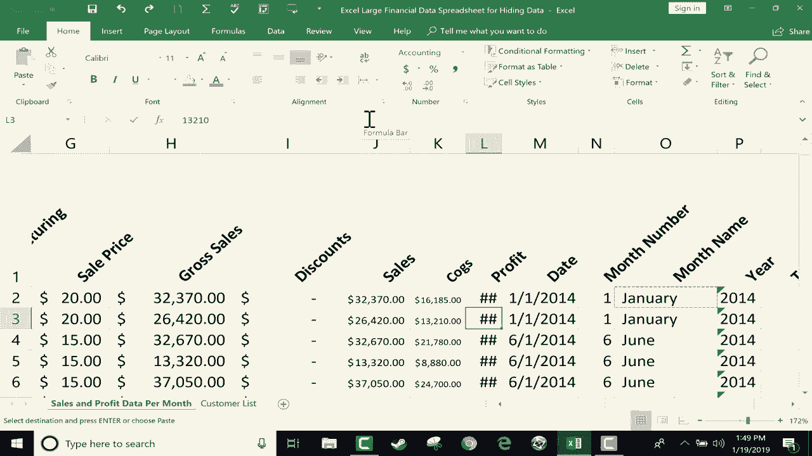

# 【双语字幕+速查表下载】Excel正确打开方式！提效技巧大合集！(持续更新中) - P7：7）对齐选项教程 - ShowMeAI - BV1Jg411F7cS

In this Excel tutorial， I'm going to show you some of the alignment options that you have in Excel that help you so that you can see your data the way you want to see it。 And I'm using this sample spreadsheet， it's a pretty big spreadsheet。 It's got lots of numbers。

 Lots of data that's recorded in it But the problem is there's so much data that sometimes it doesn't fit within the cells that I have。 And you can see the result if that happens。 If the data is too big to fit into their cells。 Then you get this symbol here。 a bunch of pound signs or hashtags。 And that's not really a problem。 but it makes it hard to read and understand the data。

 So let's look at some of the options that we have here on the home tab home ribbon in the alignment group。 I have some tools that can help me to be able to read this data。 even though the data is too big for the cell size that I've set it to。 So one thing I could do is click on a cell。 and then go here to the alignment group。

 I'm looking for an option called。Shrink to fit。 I don't see it there。 And so I'm going to click the launch button here in the lower right corner of the alignment group。 If I click on that， it gives me all of the alignment options for the cell that I selected。 One of the options is shrink to fit。 I click O。 and look， Now。

 that number fits in the space provided。 Now， what if I shrink the column even more。 Look what happens。 The numbers shrink even more so that they can fit， no matter how small。 I make that column， The number that I have in cell J 2 will shrink to fit the space provided。 So that's a great option to have。 Now， I could apply that to each of these other cells。

 I could click on the next cell， click the launch button in alignment and choose shrink to fit。 click O。 So that's gonna to take forever。 So better than that。 just click on the entire column column J。 It highlights the whole thing。 Then go to the alignment group launch button。 chooseose shrink to fit。😊，Click O。

 And now everything will shrink to fit。 So that's a great option。 The only downside is that it gets so small sometimes that you can't read it at all。 Okay。 so that's one thing to consider。 Another option that we have is to use rap text。 And this works best with words better than it does with numbers。

 So I'm going click here where it says month number。 and I'm gonna shrink this column down a little bit。 The numbers only go one through 12。 So this column really doesn't need to be very wide。 except for the fact that the column title month number。 that takes up a lot of space。

 So I would like to be able to shrink this down， but still be able to read month number。 So with that cell selected on the home tab home ribbon in the alignment group I could click the launch button and do it that way。 But in this case， there's a button here that says rap text。 Now for me。 the wrap text button is kind of small。 It's basically a square for you。 It might be bigger。😊。

In Microsoft Office， these options adjust their size based on your screen size。 So I have a pretty small computer screen。 so it has to adjust the size of the buttons。 So don't panic。 if you don't see the exact same button as I have。 just look around for rap text and click it。 Now， if you can't find it at all。

 just go down to the launch button and you should see it there。 Okay。 so what did that do wrap text makes it so that the text fits in the column width that I provided。 But the way it fits is by wrapping the text。 And so it made row1 much taller than it used to be。 but it's the same width。 Let's go back。 I'm going to do control Z to go back。

 you can see the width that it is here。 Now， if I do control Y to redo it。 you can see it's the same width。 It just made it taller and the text wraps。 to be honest。 I don't like that very much in this case。 But I want you to know that that option is available to help you fit your data into the cells。way you want them to look Now there is a third tool and a third option to consider。

 And that is instead of wrapping text， maybe what I could do is use this alignment option here orientation。 so I could orient the text in row1 so that it's vertical you can see what that did。 with it being vertical I can really make this column very， very narrow。 and I can still read the column title just fine。 but that takes up a lot of vertical space。

 doesn't it So there are some options to angle it So there it is angled counterclockwise。 and if I want to I can do that to the entire row angle counterclockwise and that does enable me to shrink these columns a little bit more So hopefully those three alignment options will help you to arrange your data so that it's easier for people to read and to learn from Thanks for watching I hope that you found this tutorial to be helpful if you did。

 please click the like button below。