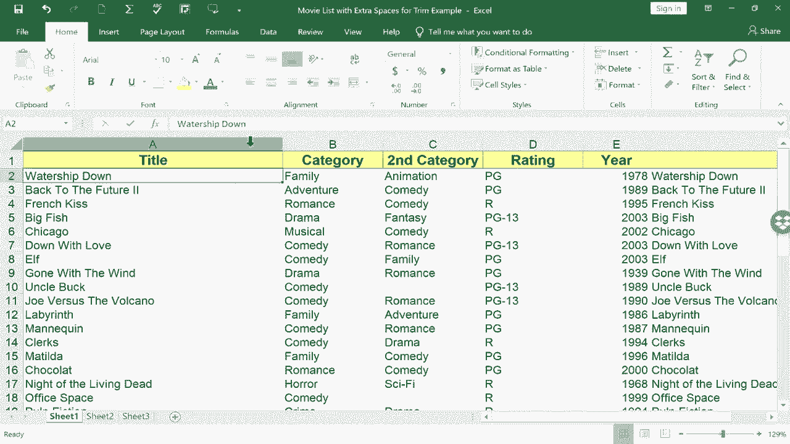

# 【双语字幕+速查表下载】Excel正确打开方式！提效技巧大合集！(持续更新中) - P9：9）移动和复制列 - ShowMeAI - BV1Jg411F7cS

In this short Excel tutorial， I want to show you a faster， easier way to move columns in Excel。 Many people follow these steps to move a column in Excel。 They would right click on the column letter and choose cut。 Then they would go to where they want to paste that column right click on the column letter and choose paste。

 and that does work and it's fine， but watch a much faster method。 All I have to do is select column a with a left mouse click。 and then put my mouse pointer on the right edge of that column。 So I'm just going go down the column a little ways。 and you can see my mouse pointer turns into a symbol with four arrows。 instead of the plus sign。 it becomes four arrows。 At that point， I can just left click and hold the left click and drag that entire column wherever I want it to go。 If I drag it on a blank column。 It's easy。 it just puts it right there。 If I drag it onto a column。That already has data。Look what it says。 there's already data here。 Do you want to replace it。 No。

 I don't。 So I'll cancel that。 So if I did want to put this column right there in column D。 I would have to go here on column D right click， insert a blank column And now I can left click on column H。 go to the edge。 I went to the right edge before。 but the left edge works just as well。 And I'm going to drop it right where I want it to be。

 I'm going to use control Z to undo all of that。 because I want to show you one more trick that you can use by selecting an entire column。 In addition to just going to the edge， clicking and dragging。 you can also hold control。 and then click and drag the edge。 Now， what does that do。 that actually copies the column。 So the column stays where it was。 and it's duplicated and added wherever I dragged it to。

 So whenever you need to move a column。 Think about this video and the tip of select。

The entire column and using the edge of that column to drag it where you want it to be。 Thanks for watching。 I hope you found this tutorial to be helpful。 If you did。 please click the like。