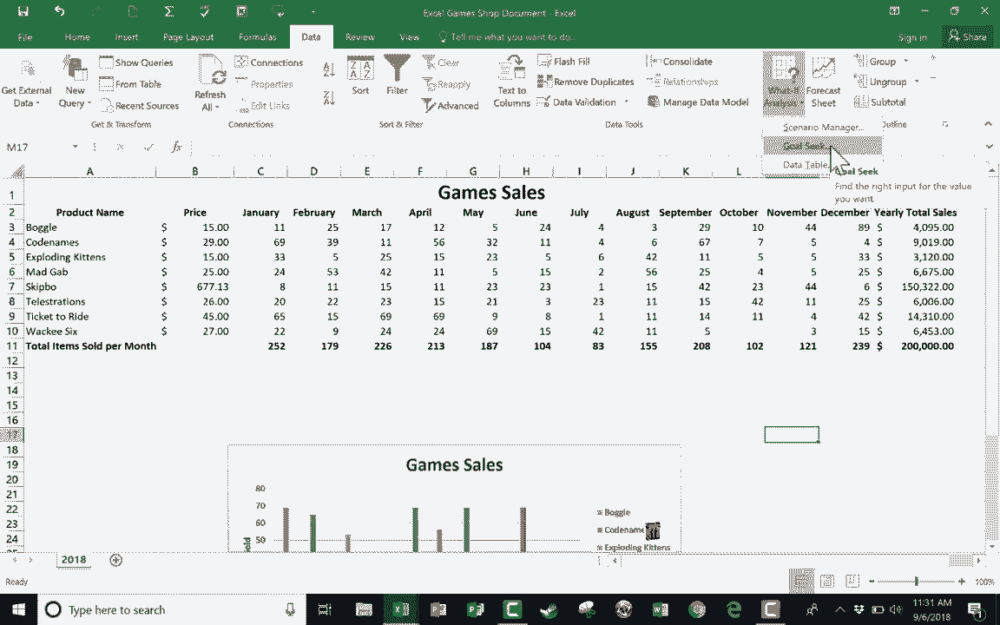

# 【双语字幕+速查表下载】Excel高级教程（持续更新中） - P1：1）What If 使用场景管理器和目标搜索进行分析 - ShowMeAI - BV1sQ4y1B71N

在本教程中，我将向你展示 Microsoft Excel 中的两个假设分析功能。首先，我们将查看情景管理器，然后再看目标搜索。这两个功能帮助我们设想如果某些事情发生会怎样。我们将使用的电子表格是这个游戏销售电子表格。

这是一个针对假设的桌游和卡牌游戏商店的电子表格。左侧可以看到一些桌游和卡牌游戏及其价格，以及一年的12个月。右侧则显示了这些桌游的年度总销售额，这些数字是以美元计算的。如果你查看这些的公式，双击销售额就可以看到。

它显示的是这些数字的总和乘以商品的成本，然后我们得到了今年通过销售这些游戏所赚取的总金额。但假设我想做一些设想，展望明年，我想问自己。

我该如何才能让这个小企业的总收入达到十万、一百万，甚至更多呢？我可以利用数据选项卡上找到的假设分析功能，数据功能区右侧的预测选项。所以我将点击“假设分析”，会弹出三个选项：情景管理器、目标搜索和数据表。在本教程中我们将关注前两个。

我会点击情景管理器，它会弹出一个向导，帮助我创建和比较我的情景。我可以创建这些情景。第一次做这个可能会有点棘手，希望这个视频能有所帮助。你需要点击这里来添加一个新情景，或许我想先确认一下我们目前的状况。

所以我会输入一些比如“当前年份”的内容。这是这个情景的名称。接下来，它希望我确认在这些情景中我们要关注的内容。假设有什么可能会变化。那么，假设这个小企业，我想在圣诞节期间有所突破，尽量在圣诞节期间卖出比以往更多的游戏。

在这里的“可变单元格”部分，我可以点击这个按钮，然后点击并拖动选择每个游戏的12月销售额。然后我可以按下键盘上的回车键，它会填入该范围。接下来，我可以添加一些注释，比如说“实际当前年份数字”。点击O。

在这里，它想让我输入一些我们可能能够实现的假设数字。但请记住，在这种情况下，这只是实际的当前数字。这是我将要进行比较的。因此，我不想更改这些。我会直接点击O。现在我有了当前年份实际信息存储在这个第一个情景中。

现在，我要添加第二个情景。这将是乐观情景。在这里的注释中，我将写下“十二月销售的最佳案例情景”。然后我点击O。对于这个情景，我会说，好的，最佳案例情景。也许我们每种商品都销售100个。然后我点击O。现在我有了乐观情景。

最后，我要添加悲观情景。它的销售和3到N10是相同的。这是最坏的情况。我点击O。假设最坏的情况是每个三笔销售。我点击O。所以现在，我有三个情景。当然，我可以添加更多。但现在我只需点击这些情景中的一个，然后点击显示，看看数字我会更新。

现在我意识到我没有像应该的那样更新所有数字。所以我需要进去修正。在悲观情景中，我将进行编辑，并点击O，注意我犯的错误。我只是把数字3输入到这里，记录数字5。但请注意，那里有一个滚动条，我需要向下滚动以更改其他假设数字。

点击O，给我一点时间来处理乐观情景，然后我会继续视频。好，现在我修正了那个错误。让我们看看我们的三个情景。我们有当前情景。我刚刚点击了它，然后点击显示。你也可以双击以获得相同的结果。因此，当前年份小企业的收入是$51000。

在乐观的强劲十二月情景中。如果我在这里双击，它会更新数字。这将使我们达到$64000。那悲观的情景呢？我在这里双击，我们可能会降到$46000。希望你能明白我为什么喜欢有一个反映实际数据的情景。真实的数据是因为这样我可以轻松比较和对比，来回切换不同的选项。

现在我要点击关闭，并注意我故意保持设置为乐观情景。我点击关闭，注意现在我的电子表格显示的是乐观情景。因此，当你完成情景管理器时，重要的是要返回到真实数据，点击关闭，然后你就会回到你需要的位置。

接下来，让我们看看假设分析的目标搜索。这是相似的，有点相关。假设我想设定一个目标，不是$51000的销售，而是$200000。所以我将点击这里的销售011，那是目标的地方。那么目标是什么呢？假设是$200000。我输入200000。那么我该如何达到这个目标呢？

什么数字会改变以使我们达到这个目标？现在这个例子有点离谱，但假设我想通过销售《票到达》的游戏票来让我们达到200000的销售额。所以我可以点击这个，销售12月的《票到达》。点击O。它会计算出我们需要通过改善12月的《票到达》销售来达到200000的目标。

这将需要我们在12月销售303047或8个《票到达》。正如我所说，这是一个有点离谱的例子，但希望你能看到这里的目的：你输入想要达到的目标，然后问自己，什么会改变以让你达到这个目标。

也许是某个特定游戏的销售数量。然后它告诉你在这种情况下需要销售多少才能达到那个数字。现在，我可以再做一次。我将使用这里的撤销按钮或键盘上的控制Z撤销之前的目标。这次，当我进入假设分析，目标，好的，我想要这个单元格。好的。

我想要这个数字变成200000。但是这次，如果我们只改变某个特定游戏的价格呢？比如说skipkbo，Skbo是一个相当便宜的卡牌游戏。但如果我们稍微提高价格，而销售保持不变，这种情况有点令人怀疑。不过我们试试看，如果我点击O，它就能让我们达到200000，方法是我们收费$677。

每包skipkbo卡片13个。进行这些场景和目标分析是相当有趣的。我发现这些“假设分析”情景管理器和目标工具非常有帮助，想象一下可能发生的事情，以及如果我们达到一些目标和基准会发生什么。

