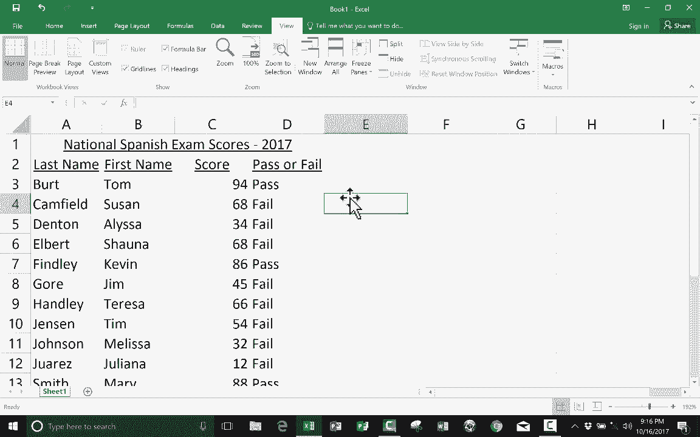

# 【双语字幕+速查表下载】Excel 高级教程（持续更新中） - P11：11）使用 IF 函数编写电子表格 - ShowMeAI - BV1sQ4y1B71N

在这个简短的视频教程中，我们将了解 Microsoft Excel 中 if 函数的基础知识。对我来说，这是一个非常激动人心的话题。我喜欢使用 if 函数，原因在于它允许我们作为 Excel 用户基本上在电子表格中加入一些编程。虽然这并不完全是编程，但确实与一些简单的编程相似。

所以我们直接进入 Excel 中 if 函数的基础知识。现在我这里有一个简单的电子表格，列出了我的学生参加全国西班牙语考试的结果。显然，这些并不是真实的学生姓名，这也不是真实的分数。我了解学生隐私法，我不会在 YouTube 视频中放入我真实学生的姓名和分数。

但是假设这些是真实的学生。我希望能够看到每个学生获得的原始分数，但我也希望通过查看这一列来知道他们是通过还是未通过。！

有很多不同的方法可以做到这一点。但是，Excel 中的 if 函数是我最喜欢的之一。那么我们来看看怎么做。我可以点击这个单元格，假设是 D3 单元格。这是我希望它报告汤姆的分数是否通过或未通过的地方，分数是 94。一旦我在这个单元格上，我可以直接输入等号来开始写公式。

然后我输入 if，我之所以说这有点像编程是因为它让我想起了我学习基础编程的日子。我不知道是否还有其他人在学校时学习过基础编程，但我学过。我记得 if then 语句。if then 语句是编程中非常重要的一部分。所以如果这是真的，那么就做这个。我们要创建的就是这样一个 if then 语句。所以等号 if 然后我输入一个左括号，刚一输入，Excel 就给我一些提示和提示，帮助我成功完成这个公式。

这是一个功能。在现代版本的 Excel 中，它会给你一些指导和帮助，真的很不错有这样的提醒。所以等号 if 左括号。然后我要点击 C3 单元格，因为这是我想测试的内容。我想测试汤姆的分数是否大于某个值。所以我会点击汤姆的分数。但请注意，代替在这里输入 94，它只放了单元格 C3。这正是我想要的。

所以等号 if 左括号 C3 大于，我只需输入大于号。然后我输入通过或未通过的临界点，假设这个测试 69% 是不及格，70% 是及格，假设在这个情况下这是真的。现在我必须在这个公式中输入 then 部分。

如果我输入“then”，在使用if函数编写公式时，它是由第一个逗号表示的。所以在公式中输入的第一个逗号代表“then”。我在这里又重复自己很多次，但我们来详细讲一下。如果C3大于69。

这就是我写的内容。我想显示“pass”这个词，所说的打印并不是指打印到打印机上，而是指在屏幕上显示。为了做到这一点，你需要用引号标出。所以这是第一个引号，我在这里留了一个空格，所以我放了一个空格在左引号后，然后我输入“pass”这个词，然后是引号。我的第二个逗号表示“如果不成立”或“如果为假”，这里的说法是这样。如果C3大于69，则打印“pass”，否则打印“fail”。现在我需要放置闭合符号，然后应该在这里放右括号，但如果你忘记这样做也没关系，它仍然可以工作。你不能忘记这个闭合符号，让我们看看它是否有效。

我将按下键盘上的回车键，或者说返回。它成功了。我的if函数公式有效。它可以判断汤姆是否通过了。好了，我需要为苏珊、阿丽莎、肖娜和凯文重新输入一遍。这要花一整晚。其实，我不需要这样做。

如果你看过我的其他教程，你就知道我可以使用自动填充手柄为我节省很多时间。所以我将点击这里的“pass”。然后我会去到右下角。如果我将鼠标正好放在那个小绿色方块上，鼠标指针会变成黑色的加号。

这意味着我即将使用自动填充手柄，在这种情况下，它将复制此单元格中的内容。好了，开始吧。你可能在想，它只会将“pass”这个词复制到下面，但并不是这样。它将复制单元格中的任何内容。

而且“pass”这个词实际上并不在单元格中。你看，上面显示的实际上是单元格里的内容。这就是将被复制的公式。所以我将点击并拖动，然后释放。看看，它准确地告诉我谁通过了，谁没有，基于我在if公式中输入的标准。好了，这就是在Excel中使用if函数的基本知识，还有很多你可以做的事情。

但这将帮助你入门，我希望你能继续观看我的其他Excel视频，我有几个关于Microsoft Excel的视频教程，我想你会喜欢。
