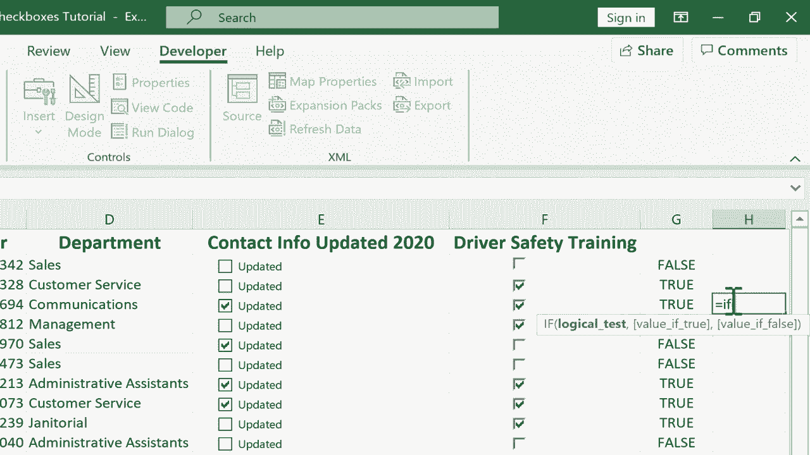

# Excel高级教程（持续更新中） - P12：12）复选框 - Part 1 - ShowMeAI - BV1sQ4y1B71N

在这个教程中，我将向你展示一种将复选框添加到Excel电子表格中的方法，我们将看看这对你有何帮助。在之前的视频中，我展示了如何在开发者选项卡的控件组中使用表单控件。

你可以插入表单控件。我给你展示了其中一个例子。那段视频引起了很多关注。所以我承诺制作另一个表单控件视频，这里就是。你可以在这个电子表格中看到，我有一份员工名单，包含了一些关于假设公司员工的基本信息。我想创建几列复选框。比如说。

他们是否更新了2020年的联系信息？他们是否完成了驾驶员安全培训？实际上有两到三种不同的方法来添加复选框并考虑它们。我想先给你展示最简单的例子。所以在E2单元格中，我想创建。

复选框。现在，你需要做的第一步是确保你有开发者选项卡。它默认情况下并不在那里。所以对很多人来说，你不会看到开发者选项卡。获取开发者选项卡的方式有几种，但可能最简单的方法是右键点击功能区。所以我就在这里右键点击，定制功能区。

这会弹出一些选项，我可以用来改变功能区的外观和显示的选项。我会去右侧的主要选项卡那里。你会注意到我已经勾选了开发者选项卡。如果没有，你需要勾选它，如果你想添加复选框，就像我将要展示的那样。所以我点击确定，我有了开发者选项卡。

我想在这里添加一个复选框。我只需要确保我在控件组中的开发者选项卡上，然后点击插入，这里是所有的表单控件。现在有两组表单控件。有活动X控件，那些稍微复杂一些但功能更强大。但在这种情况下，我不需要那么强大的功能。我会选择常规表单控件。这些更简单。

它们在这种情况下会完成任务。所以这里是复选框表单控件。我只需点击，然后点击屏幕上我希望复选框出现的位置。所以我就在这里点击。现在，它并没有完全放在我想要的位置。如果我点击其他地方，你可以看到这个。如果我再次点击它，看看发生了什么，它只是勾选了框。好吧。

我想把它稍微往上移动，并且与Gina Puen对齐。所以这样做的方法是，你不能左键点击并拖动，你必须右键点击并拖动。所以这不是移动某物的典型过程，但由于表单控件的性质，在很多情况下你确实需要使用右键点击拖动来移动这些表单控件。

所以我会点击移动到这里。这样好多了。现在你会注意到复选框带有一些文本。有时候你想要这个文本，有时候不需要，在这种情况下，我确实想使用这个文本，但我想改变文本的内容。所以我会右键点击它，点击编辑文本，现在我可以使用光标进行删除。

所以我刚刚按下右箭头键，然后使用键盘上的删除键删除现有内容，我会输入“更新”。所以如果这个复选框被选中，我知道这个人最近更新了他们的联系信息。现在我将取消选中。现在我需要对Marcelinina Rerepo、Regia Lofts和所有其他出色的人重复这一切。

好消息是，你可以点击在这种情况下E2，并使用自动填充手柄。这个选中单元格右下角的小方块，你可以点击并拖动，看看它会做什么，它只是将那个单元格的内容复制到下面。

在这种情况下，该单元格中有一个表单控件。所以你可以直接点击并拖动，将这些复选框添加到整个电子表格中，这真的很简单，很容易，对吧，添加简单的复选框。好吧，我想给你展示一个稍微复杂一点的例子，但我觉得观看这个过程会对你有帮助。

这些复选框不仅可以用作某个事项已完成的视觉提示，或某种特征适用于此人或事物。因此，我会在F列点击，在开发者选项卡的控件组中。

我会点击插入复选框，并执行相同的步骤，右键点击并拖动将其放在合适的位置。在这种情况下，我右键点击它并删除文本，以便你可以看到你确实有这两种选择。所以现在复选框仅仅意味着他们确实完成了驾驶员安全培训。

但是接下来，我要右键点击这个😊复选框，然后向下选择格式控制。这会弹出一些复选框的选项。该复选框的默认值是未选中、选中还是混合，混合基本上是灰色的。我将选择未选中。这是默认值。接下来，有一个单元格链接的选项。

所以我可以将这个复选框链接到一个单元格。这个复选框的结果可以传递到另一个单元格。所以我会在这个箭头上点击。这是一个按钮。所以我在那里点击。现在它隐藏了其余的选项。现在我可以直接点击我想链接到这个复选框的单元格。所以我会在G2上点击，然后我可以回去再点击那个箭头。这太好了。

如果我想，我可以为复选框添加一些3D阴影。让我们看看那是什么样子。现在我点击确定，你可以看到我的复选框现在有了一些3D阴影。这真不错。现在，当我勾选复选框时，看看会发生什么。因为我将单元格G2链接到了复选框。它在告诉我复选框是否被勾选。

另外，它也说他们确实接受过驾驶安全培训。对的，这一切都已经连接好了。这太好了，我非常喜欢。所以现在我们再试一次之前做的事情。试着用自动填充手柄将其复制到页面下方。这里有点棘手。

有时如果你点击，你可能是在点击复选框。所以要小心。你可能需要右键点击以选择单元格。但只需获取相同的自动填充手柄，你就可以向下复制。现在，让我们看看它是否有效。注意，当我勾选一个复选框时，所有的复选框都被勾选了。它们都是基于G2工作的。

这确实是个问题。我需要右键点击我的第二个复选框并进入表单控制。然后我需要将其更新为G3。接着我会返回，点击O。然后我会点击其他地方。现在我们来试试。好，现在它独立于其他复选框工作了。这就是复选框表单控制在Excel中运作的一个缺点。

我必须更新每一个复选框。现在，学会这个模式后，我可以直接输入。我可以输入4用于G4。它就能工作。老实说，这确实有点麻烦，尤其是如果你有一个巨大的电子表格。这就是为什么我认为在这种情况下，使用小型或中型企业员工列表的例子是合理的。

我认为这是一个好例子，说明我会在这种情况下使用更复杂的复选框。因为这样工作量并不巨大。如果我有一个包含1000条记录的电子表格，我认为这不是创建复选框的明智方式。还有其他方法可以实现类似效果。在我看来。

这些是添加复选框的最佳方法。但我刚才展示的缺点是，你必须更新单元格引用。如果你想按照我即将展示的方式使用数据。请给我一点时间来修复其余的表单控制单元格链接。然后我会恢复视频。现在我已经完成了更新，你可以看到我可以非常轻松地标记每位员工是否完成了他们的驾驶安全培训。

现在，有这个报告显示真假是好的，这样你就可以设置一个公式，基本上是一个if语句。你可以在这里点击，这个单元格等于if，然后你可以基本上说如果这个单元格显示为真。那么做某事。你也可以使用条件格式设置。举个例子。

我可以让尚未完成驾驶安全培训的员工以红色突出显示。因此有一个视觉提示，表明他们需要完成这项任务。当然，如果我想的话，我甚至可以通过右键点击隐藏这一列。

右击列字母，我可以选择隐藏。这个真实的故障仍然存在于电子表格中，但对查看电子表格的人来说是隐藏的。因此现在只是关于文本框，至少在视觉上。如果你有兴趣看看我如何通过条件格式让记录以红色、绿色或其他颜色亮起，以及我如何利用IF函数在这个电子表格中做一些事情。

请在下面的评论中给我留言。我会考虑制作后续视频。
