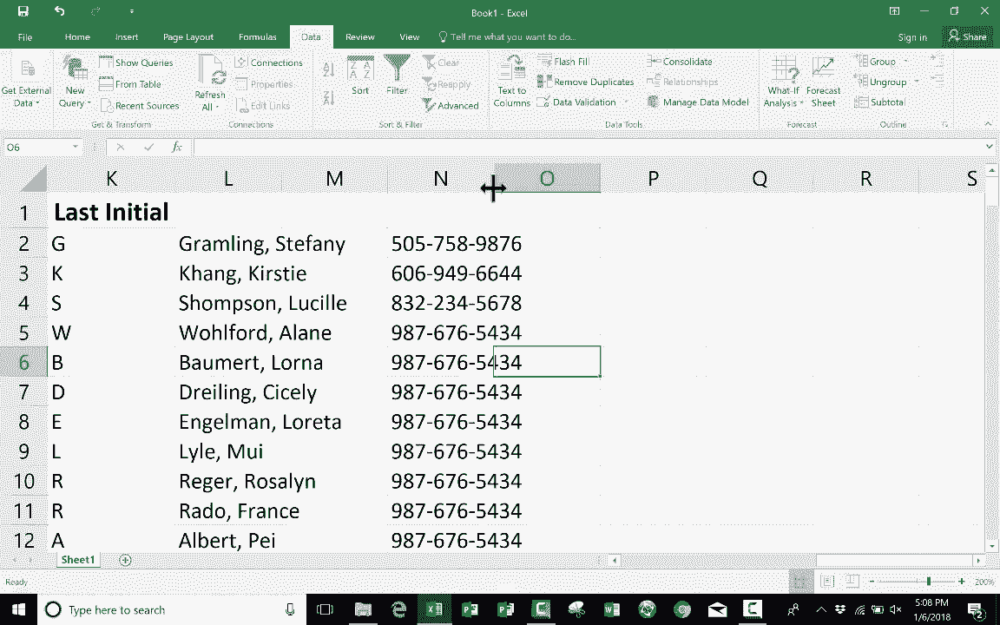

# Excel高级教程（持续更新中） - P15：15）快速填充教程 - ShowMeAI - BV1sQ4y1B71N

在这个教程中，我将向你展示Excel最新版本中的一个很棒的功能。它叫做闪填。在很多情况下，这将为你节省大量时间。为了向你展示闪填的工作原理，我创建了一个示例电子表格，基本上是100个名字的列表。

在名字的右侧，我有一个列用于名、姓、名字首字母和姓氏首字母。假设我被赋予了将这个充满人名的电子表格分离出名字和姓氏，并且还要填写首字母的任务。这可能是一个巨大的噩梦，巨大的头疼，尤其是如果我有1000个名字，或者10000个以上的名字要处理。现在。

在之前的视频中，我向你展示了如何拆分名字。如果你有兴趣学习如何做这个，你仍然应该观看那个视频。但是今天，我想向你展示如何使用闪填选项来完成我必须做的这个任务。😊 在Excel的较新版本中，我首先需要向Excel展示我想要什么样的信息。所以我将在这里点击，那里在单元格H2中。

我将点击并输入Stephanie，然后在键盘上按回车或输入，接下来我只需转到数据选项卡，查找数据工具组，你会找到闪填。所以我点击闪填，看看它做了什么，它基于我已经输入到H列的数据进行了识别。

它已经确定我只想要名字。这不是基于我在这里输入的列标题。不，实际上是基于我在这里输入的名字Stephanie，Excel识别出了这一点，并将其应用到整列。现在注意，每当你使用闪填时，左下角会有一些提示信息。所以在使用闪填时，请注意左下角的内容，它显示“闪填更改”。

单元格，它显示149。所以149个单元格受到我刚才进行的闪填的影响。好的。现在我们来试试姓氏。在姓氏列中，我要输入grambling。这次注意，如果我去数据，无法使用闪填。原因是我正在输入的单元格仍然处于活动状态。因此，从技术上讲。

这个单元格里根本没有任何内容，直到我点击回车或输入键。现在单元格里有了内容，列中也有数据。所以现在我可以去数据，选择闪填。现在。 我不想让你觉得你总是必须选择你想要模仿的信息下方的单元格。

不，你不需要。我可以待在这里。我可以回到那些数据上，但你确实需要确保你要模仿的数据已经实际输入到单元格中，而不仅仅是在输入过程中。因此，为了证明这一点，我将上去选择grambling。点击它进行选择。我会点击闪填，看看它完美地一直工作到了最后。我可以检查。

假设是89号Delmer quail。好的，它完美地工作了。我现在要回去。我们尝试只用名字的首字母。所以是S，这次我将点击几行下面的单元格，只是为了证明你可以选择你想要闪填的列中的任何单元格。

这次我不想点击闪填，而是使用键盘快捷键。是控制E。所以你只需按住控制键，然后按E，它的效果和点击闪填按钮是一样的。看看，它完美地工作了，我得到了名字的首字母。现在让我们尝试姓的首字母，我将基于另一个人，而不是基于Stephanie graling，我想基于Alberttha Kenny，所以我会点击这里，输入她的姓氏首字母，确保输入数据，只需按回车或返回，或者像我一样点击其他地方。

但我在我想要进行闪填的列中。然后我将按住控制键。按E。让我们检查一下是否有效。是的。所以尽管还有其他方法可以做到这一点，例如使用文本到列，我真的很喜欢闪填，并且我经常使用它。但是有一句警告。当你使用闪填时，你应该仅在数据非常稳定的情况下使用它。

它基本上会保持不变。我之所以这么说是因为这一点。看，如果我改变Lucll Suman的名字，假设她将姓氏改为Thompson，我按下回车。注意，它没有更新闪填的信息。即使我选择了一部分电子表格，假设我清空它，清除内容。

让我们看看如果我再尝试一次闪填会发生什么，我得到了有趣的结果。你看到了吗。因此，闪填确实最好用。如果你是基于非常稳定的数据进行闪填。数据会保持不变，不会改变。好的。我想展示最后一个例子。假设我们不使用名字首字母或名字加姓氏。

如果我想将名字改为以姓氏开头，然后是逗号，再加上名字，这也应该有效。所以我将尝试一下，我只需去这个单元格。输入grambling comm Stephanie，我按下回车或返回。然后我将按住控制，按E，它遵循了这个模式。

现在我想让你知道，尽管我的示例主要是关于名字，快速填充也适用于许多其他内容。它所做的就是寻找一个模式。在这个例子中，它看到了两个单词，然后它发现我这里只输入了第一个单词。因此，当我进行快速填充时，它只是看到了那个模式并进行了复制。

现在如果它没有完全遵循模式，你可能需要在列中输入两个示例，然后尝试快速填充，这样更有可能看到模式。但是，我想说的是，这不仅仅适用于名字。如果有任何模式的话。

它会尝试识别那个模式，理解它，然后模仿它。例如，假设你有一份电话号码列表，并且想为电话号码添加破折号。你可以这样做，直接按照你想要的格式输入，然后按回车键。现在，在我实际进行快速填充之前。

我需要列出其他电话号码。所以给我一点时间添加几个电话号码，然后我会向你展示结果。好的，太好了。现在如果我进行快速填充，看看它会怎么做。它在这种情况下添加了破折号。现在我已经这样做了，我不再需要这个列了。所以我可以右键单击它。

删除一下，我的数据就按照我想要的格式排版好了。
