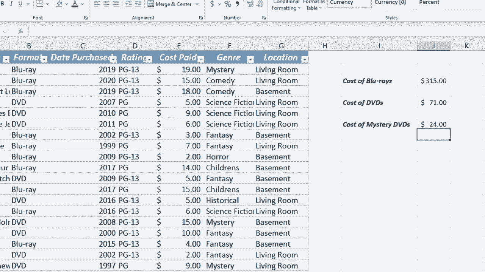

# 【双语字幕+速查表下载】Excel高级教程（持续更新中） - P18：18）SUMIFS 函数 - ShowMeAI - BV1sQ4y1B71N

In this video， I'm going to show you how to use the sum ifs Excel function。

 This function is just a fantastic function。 Very useful， very helpful。

 You can see I have a simple spreadsheet here that serves as a movie inventory for my DVD and blueray collection。

 And let's say I would like to figure out how much money I've spent over the years on DVDs on blue rays or maybe on different genres of movies。

 So this calls for a sum function。 And I could do a typical sum function here or use autosum。

 but that would give me the total of everything。 So what if I just want a list of all the blue rays and the total cost for them。

 Well， I could filter the data I could deselect DVDs and just show blue rays and things like that and then do a sum function just of the blue rays。

 But that can get time consuming。 And what if there's not just two options。

 What if there's five or 6， like in the case of genres。 So what we can do is use a sum ifs function。

😊，Let me demonstrate here in i3， I'm just gonna type in cost of bluerays。

 and then I'll tap into a couple of times and type in cost of DVDs。

 so right here I would like the total cost of my blueray collection to appear I would start by typing equals and then use my function some ifs left parenthesis and Excel shows us what it's looking for。

 it wants the sum range So what is it that we want it to add up。 Well。

 we want it to add up the cost paid。 So I'll click and drag to get the whole sum range Now if I only have 20 or 30 rows or records to select that's a good way to do it。

 But what if I had1 thousand records and I wanted Excel to examine all of them to see what to add up clicking and dragging is not going be a great option So instead what you do is you click on the topmost record that you care about hold control shift and tap the down arrow on the keyboard that will automatically highlight the information from the point that you selected all the way。

okay， so I've got the sum range。 now I'll put in a comma。 and now I need to find the criteria range。

 So I want the criteria range to be this format column So I'll click here on blue ray control shift down。

 So it looks through all of those searching for what Well。

 that's what I put in next what am I searching for。 what is the criteria。 Well， it's bluerays。

 So I could either type out blue ray in or I could simply click here on B2 to show Excel what I'm looking for。

 I'm looking for the word blue ray。 Let's just leave it in quote I'll put in the right parenthesis and then tap enter on the keyboard and you see what it did Excel searched column B looking for the word blue ray and when it found it。

 It added the cost paid or the amount paid for that blue ray to all of the other costs of blue rays from this entire sheet。

 This is a very powerful time savingaving function that we have here。 Let's do。Same thing now。

 but with DVDs， I'll type equals sum ifs left parenthesis the sum range。 What do I want it to add up。

 I want it to add up at least some of these numbers。

 Now I can go back up here to continue my formula or sometimes it's easier just to go up here to the formula bar what's my criteria range That's here。

 I select the topmost record that I want it to search control shift down it selects everything And then up here in the formula bar what do I want it to find Well。

 in this case I want it to find DVDs。 Now， this time。

 instead of putting the word DVD inside of quotation marks。

 I just want to click on it just to show you that that is another option So I can click there。

 put in the right parenthesis tap enter71 Now I could format this to look like dollars and there we have it。

 It's summing up the cost paid if the format is blue ray or in this case， DVD Now。

 because the second example is based。On this cell B5， Watch what happens if I type in blueray there。

 It updates the amount because it's not based on something in quotes This one is based on whatever is in B5。

 I'll change that back to DVD and it changes the results again Now there is a reason it's called some ifs and not just some if and that's because you can do more than one some if at a time。

 So let's look at how to do that What if I want to know the total amount spent。 not just on DVDvds。

 but specifically mystery DVDvs。 How would I do that Well equals some ifs left parenthesis。

 I want to add up the cost paid control shift down。

 I'll go up here to the formula bar comma the criteria range it's right here I want it to search B2 all the way through the bottom So control shift down and then I put a comma in the formula bar。

 I'm searching for DVDvs。 I'll just click here on this B7 in this case where the word DVD is and then。

Put a comma in。 so that's my first if。 but look because I put a comma Excel is now expecting another criteria range criteria range2。

 In addition to DVD， I'm looking for mysteries， So I'll go up here。

 click on F2 in this case control shift down to get the whole column and then back up in the formula bar comma and what is the actual criteria。

 What is it that we're looking for We're looking for mysteries。 So as you can see。

 this gets fairly complicated。 if you have more than one criteria in your sum ifs formula。

 So this is all lit up in different colors。 but let's see if it worked。

 I'll put a close parenthesis tap enter。 and I've only spent $24 on mystery DVDvs in my collection。

 and you can see that that's true just by browsing down $15 mystery DVD plus a $ nine mystery DVD。

 So this is just one example of how to use some ifs。

 there are lots of very powerful uses of some ifs。

