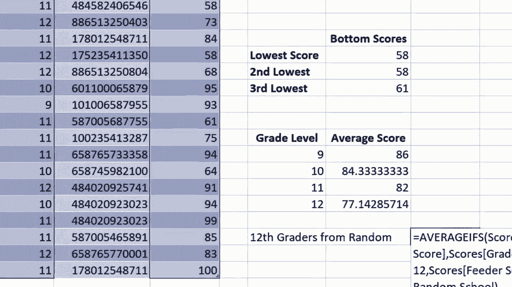

# 【双语字幕+速查表下载】Excel高级教程（持续更新中） - P19：19）AVERAGEIFS 函数 - ShowMeAI - BV1sQ4y1B71N

In this video， I will show you how to use Excel's average ifs function。

 And the sample spreadsheet I have for this， which you can find in the description below has a list of fictional student names。

 grade levels， test scores。 And I've already calculated the quartile scores， top scores。

 bottom scores， etc cea。 But what I'd really like to know at this point is what's the average score for 9th graders on this test。

 What's the average score for 10th graders，11th graders，12th graders。

 And there are various ways that I could do this。 I could filter out the data that I don't need。

 And then I could create an average formula。 but there's a lot of steps there。 Instead。

 I'm going to just use the Excel average ifs function to do this。

 I'll just click here in cell J 14 type equals average ifs left parenthesis。

 And the idea behind average ifs is that we only want to average something If it meets certain criteria。

 And you can see here， Excel is giving me hint。About what it's looking for。 So at this point。

 it wants the average range。 So what is it that will be averaged。 Well， the score。

 that's what I'm looking for。 The average score。 So here I have the range that has the scores and I could click and drag to highlight that range and that works perfectly in this case。

 but what if your spreadsheet has1 thousand00 records or 10000 records。

 clicking and dragging is not going to be practical。

 So instead what you can do is click on the topmost cell hold control and shift and then tap the down arrow on the keyboard。

 that will select the range from the cell that you're in all the way down。 Okay。

 now we put a comma and Excel is now looking for criteria range number one。

 So what is the criteria that's going to tell Excel that it should average a test score。

 Well the criteria is the grade level。 So I need to select the grade levels。

 I'll click on the first student's grade level hold control shift。

 tap down to select all of the grade level。And then I'll put in a comma。

 And a lot of times when doing a complicated formula like this。

 it's better to go up to the formula bar and use that to enter the information。

 So I'll put in my comma。 And now Excel is looking for criteria 1。

 So we've already told it what the criteria range is。

 It's going to look in this range but look for what what's the actual criteria itself。 Well。

 it's the number 9。 Now I could type the number9 here as my first criteria but sometimes it makes more sense instead of typing the number in。

 Why don't I just click the cell I 14 in this case。 because that's what I'm looking for。

 I'm looking for number 9 and number 9 is right here。 So I'll click on that to select it。

 at this point， write parenthesis is all we need tap enter and the average test score for 9 graders is 86。

 So we can eyeball that to see if it's right，9th grader 799 grader 93。

 the average of that yeah would be about 86。 It looks like it works。It did it correctly。

 So now I need to do the same thing for 10th grade， right？

 I need to go through and type average ifs and do the whole thing again， except  for10th grade。

 Well actually， no， I don't have to do that。 Instead， I'll click on 86。 But keep in mind。

 it's not really 86。 If you look up here in the formula bar。 It doesn't have the number 86。

 It has the formula that I used to produce the number 86。

 And then I'll go here to the lower right corner of the cell。 There's a green square。

 That's the autofill handle or fill handle it's sometimes called。

 And I'll click and hold the mouse click and drag down。

 and it will automatically copy that same formula down。 but adjust the criteria 1。

 So I can test that out by clicking here and then looking up at the formula bar。

 The criteria 1 there is I 15。 What about here， It's I 16。 and what about here， It's I 17。

 So what a great way to quickly search a range and then pull out the exact information that I want averaged。

Based on a criteria。 Now， there's a reason it's called average ifs with an S at the end。

 And that's because you can actually do more than one criteria in the formula。 So， for example。

 if I were to add another column just by right clicking on E and selecting insert。

 Let's say column E is where I list the feed or school。

 the middle school or junior high where the student came from。

 and I'll just quickly specify which school each student came from。

 So now let's see if I can get the results of the average score for 12th graders from random school。

 So 12th graders from random。 I'll click here and I'll type equals average ifs left parenthesis。

 and this formula is going to get pretty complicated。

 So I'm going move up to the formula bar to finish this formula I'll click Excel is looking for the average range。

 So what is it that I want to average。 Well， it's this。 So I click there。

 hold control shift down arrow。 It selects all of the data in my formula bar I。a comma。

 What's the criteria range。 Well， there's two criteriaerion， right。

 We're looking for 12th graders from random school。 Let's start with 12th graders。

 So criteria range number one。 I'll click here on the first students' grade Hol control shift down arrow to select all of the data。

 put in my comma Now Excel is looking for criteria number one which is the number 12。

 Now I could either click here on 12， or I could type it into the formula。

 I'll just type it in Now I put my comma。 Now what's my second criteria。

 It's not just the grade level of 12 but they have to come from random school。

 So criteria range number two is the schools So I click on the first school control shift down arrow。

 back up in my formula bar。 I'll put in a comma Now Excel wants the actual criteria too that it's gonna look for。

 It's going to look in this range for criteria2， which is the words random school。

 It's looking for those words。 Now in this case， I could either click on cell。

E2 and whatevers in cell E2， that's the criteria that Excel is going to look for to decide what scores to average。

 So that will work。 Let me prove to you that it works。 I'll put in my right parenthesis。

 tap enter and the average score of 12th graders from random school is 81。

 and you can see that that's different from the average of all 12th graders。 Now。

 let's look at the alternate way to do that。 instead of clicking on E2。

 I could have typed in the words random school。 However， watch what happens when I tap enter。

 It didn't work。 I get an error message。 Why Well， the reason why is because the data in column E isn't numbers。

 It's text。 And so I need to put random school in quotation marks。

 So now if I tap enter on the keyboard。 Look， it gives me the same results，81。

 So these are just a couple of examples of how to use the average if's function in Microsoft Excel。

 There's a lot more that you can do。

With it。