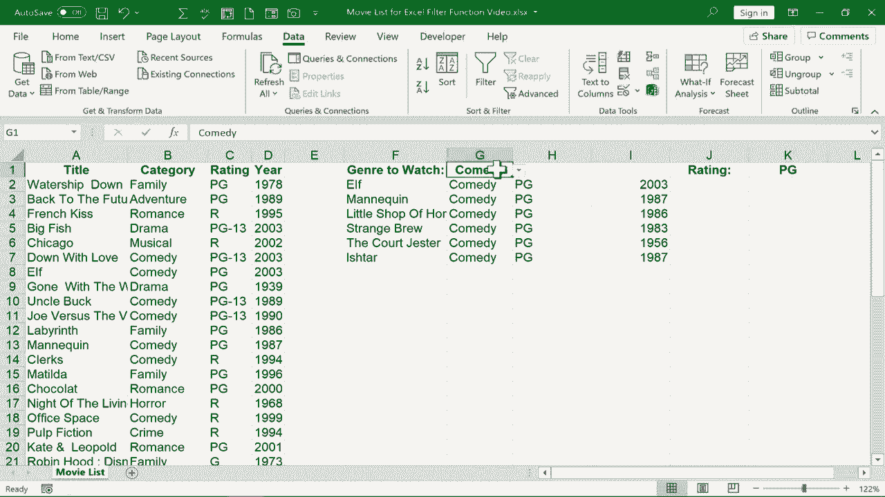

# 【双语字幕+速查表下载】Excel高级教程（持续更新中） - P20：20）使用FILTER 函数创建动态过滤器 - ShowMeAI - BV1sQ4y1B71N

In this video， I will show you how to use the Excel filter function to create dynamic filters in your spreadsheets。 And you can see the spreadsheet that I'm working with is a list of movies。 The categories that those movies would fall into and some other information about the movies。 You can get a copy of this spreadsheet in the description below this video if you want to follow along。

 Now， I would like to set it up so that I can type in this box。 the genre or category of movie that I would like to watch。 And then I would like a dynamic list to be produced of the movies that I could choose from。 Now。 there are some ways to do this without using the Excel filter function。

 I could click and drag to highlight the column headings。 And on the home tab home ribbon。 I could go to sort and filter， and I could create a filter。 and then I could filter out only the specific movie category or genre that I'm looking for。 But that's gonna be a little bit more work in the end。 Then just using the Excel filter function。

 So I held control and tap Z to undo that。😊，And I'm just gonna go over here underneath where I've typed genre to watch or category to watch。 and I'll click and type equals filter。 You can see that Excel identifies the filter function。 and this is a fairly new function in Excel。 If you have Microsoft 365。 you should have access to it After typing in filter。 I'll just put in a left parenthesis。 Next。

 Excel is looking for an array。 So what is the range or array that's important to me in the spreadsheet。 Well， it's this。 it's the data。 So I don't need to get the column headings。 but everything else I'm just going click and drag to highlight all of it all the way down to row 43。 Now I could have simply typed in the cell references。

 A2 colon D43 A2 through D43 But sometimes clicking and dragging is a little easier。 Next。 I put in a comma。 Now， Excel is looking for the information to include And what this means here is what range do。I want Excel to examine to see if a particular word in this case。 a particular genre or category is listed。 so I'm going to click and drag on the data in column B。

 So from B2 down all the way to B43 Now I'll browse back up just using the scroll wheel on the mouse or you could use this scroll bar if you want to So now it's going include B2 through B43 and now I can put in a logical test I can say are any of those category equal to and I should put this in quotes let's say family So family movies。

 and then I could put another quotation mark， and then I need to put in a comma next Excel is expecting me to put something in here in case the results come up empty。 What if none of these movies have a category of family Well then I want to print so I'll put in quotation marks the word none close and then my right parenthesis tap enter。

It identified all of the family movies in that range or in that array。 At this point。 I'm going hold control and tap Z to undo that。 because I want you to see that I could have handle this a little differently。 I could have said equals filter left parenthesis selected the array that I want to examine。 So all of this data here going back up I'll put in a comma next is include。

 So this is what's going to be examined to see if I have a movie of a particular genre。 And now the test equals。 Now here， instead of putting in the word family。 I could just click on a cell like G5 H3， or I could even just type it in。 in this case。 I'll just type in G1。 And what this means is that Excel will look and see if anything in this list is equal to whatever is in G1。

 Now， I put another comma in。 Now， Excel is expecting me to put something in case。There are no results produced。 So I'll put in the word none。 close quote， write parenthesis。 tap enter。 Now， there's nothing in G1。 So Excel returns the word none。 Now。 I can see I accidentally changed my spreadsheet data。 I'm gonna change it back。

 So now watch what happens when I type something in G1。 Let's say I type drama。 I tap enter it lists all the dramas in my movie list。 What if I click and change that to scifi。 My dynamic filter changes and shows me different results。 This is one of the things that makes it dynamic。 I can type in horror comedy， whatever I want。

 it gives me a nice list of the movies that fit that category or genre。 Now， if I really wanted to。 I could， instead of just having people type in the genre that they're looking for。 I could click here where it says comedy。 I could go to data here on the data tab in the data tools group。 There's a symbol here。 a button。That represents data validation So I can click there here in the settings for data validation。

 I can change it from any value to list。 Where's the source of my list。 Well。 I click the button with the arrow。 and I can show it here the source of my list。 I click this button again to get back。 click O。 So now look what we have。 I have a button with a drop down list and then I can change the word that's in cell G1。

 and whatever I pick， it will list the movies that meet that criteria。 Now。 let's see if we can add one more component to this dynamic filter。 First。 I'm going to right click on K to insert another column。 And I'm just going click on rating。 I didn't put that in the right place。 I'm going to scoot it over here。

 and I moved it just by putting my mouse right on the edge of the cell and then dragging。 that's an easy， quick way to move text or other data from one cell to the next。 Would it be possible for me to use the filter function。To create a dynamic filter that not only filters for， let's say romance。

 fantasy horror or other genres， but also filters based on rating。 Let's see if we can do that。 So if you recall， I typed in my filter formula here in cell F2 And when I click on F2 that becomes apparent here in the formula bar。 So here's my formula。 And what I'd like to do here is say that I want to filter that same range based on what's in this range B2 through B43。 making sure that that's equal to G1， which is romance in this case。 So I want to do that。

 and at the same time， I want to filter based on rating。 in order to do this correctly I need to put my first include in parentheses。 So I've done that Now how do I say and I want to search this to make sure it's equal to what's in G1 and I want to search this to see if it's equal to whatever is in K1。I write and well， it doesn't make a lot of sense at first。 But the answer is you put in an asterisk。

 So now I can put in another left parenthesis。 What am I trying to include this time。 Excelels giving me hints still， you can see that include is in bold。 Well。 I want to include C2 through C 43。 So that now has been added to my formula in the formula bar。 And I want to test to see if the data in column C， basically is equal to whatever is in K1。

 I put in my right parenthesis tapap enter， and my formula produces none。 but that's because I have nothing typed in K1。 Let's type Pg and see what happens。 All right。 that produced two movies that are both romance movies and rated P G。 What about horror that's rated P G 13。 I tap enter。 It did not produce any。 What about R。

 I tap enter and it does produce results。 Next， let's try comedy that's rated P。GI tap enter。 and I get results。 So this is a dynamic filter that I've created using the Excel filter function。 Now， of course， if I wanted to， I could click here and create a drop down list similar to this one so that the user doesn't have to type in P G dash 13 or whatever it might be。 But I hope you can see some of the power of the Excel filter function。

 There's so much that you can do with it。