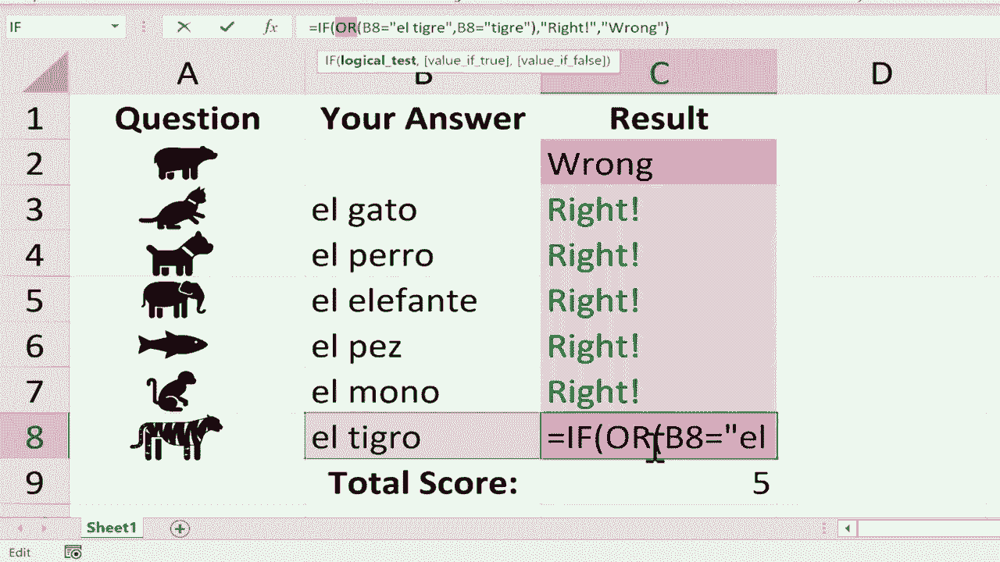

# 【双语字幕+速查表下载】Excel高级教程（持续更新中） - P21：21）使用 IF 和 COUNTIF 函数创建交互式工作表 - ShowMeAI - BV1sQ4y1B71N

In this video， I will show you how to create interactive worksheets in Microsoft Excel and not only are they interactive。

 but they're also self grading。 You might also think of these as being selfgrading practice quizzes that the students can take to prepare for a test and you can see I've created the beginnings of a spreadsheet here。

 And you can get a copy of this in the description below the video。

 But what I have here is a series of icons of different animals。

 And I got these in the spreadsheet simply by going to insert illustrations， icons。

 and then searching for the different animals， and then I just selected the animal that I wanted。

 click insert， shrunk it down and put it where I wanted it to be。

 And let's say I'm a Spanish teacher and I would like my students to practice their Spanish animal words。

 In this example I've chosen to make the questions simply be images or icons But of course。

 if you prefer you could use text in your own interactive worksheets or quizzes So the way。

I would like this to work is I want my students to be able to click here and type in the answers to each question and then I want Excel to basically grade their answer to say whether it's correct or incorrect so how would I do this the answer is I need to use the if function let me demonstrate so I'm going to click on C2 tap equals if you can see that Excel explains what the if function typically does and then I'll put in the left parenthesis Excel is now looking for a logical test so if I'm going to click here on B2 so if B2 is equal to and inside of quotes because we're dealing with text I'm going type L Oso close I put a comma and the comma represents the word then so if B2 is equal to L Oso then again I need to put quotation marks I'll type the word right with an exclamation point and then close and then if I want to I can。

another comma， this second comma represents if not or else。 So if B2 is equal to L Oso。

 then print the word right if not or else print the word wrong close and right parenthesis If I tap enter on the keyboard now you can see that Excel evaluates the contents of cell B2 and Excel finds that L Oso does meet the criteria that I established and so it prints the word right here in C2。

 Now of course I want my students to put that in so I'm going to click on B2 tap delete to get rid of it and you'll notice that the result changes to the word wrong。

 Okay so now I need to do the same thing with C3 right I need to tap equals if left parentes Well。

 yes， that's a good idea to do but let me show you a shortcut。

 There's a big time saver that I like to do。 I clicked on C2。

 and I'm going to go here to the lower right corner。

That little green square is the fill handle or autofill handle。

 I'll put my mouse on it until the mouse pointer turns into a black plus sign。

 And then I'll just click and drag and pull that down。 And you can see what happened。

 The autofill handle copied the contents of cell C2 and copied it exactly into cell C 3。

 Sometimes the autofill handle continues a pattern or extends a pattern。 But in this case。

 it simply copy pasted。 If you want to learn more about the autofill handle。

 please watch my other video on that topic。 Now， I said that it copy pasted the contents of cell C2 into C3。

 C4， C5， etc cea。 And it did。 but it is important to notice that Excel automatically changed B2 to B3 and B4。

 So it adjusted the row in question。 So that will be very helpful later。 Now。

 you probably noticed the problem。 right， The word for cat in Spanish is not L Oso L Oso means bare。

 So I need to adjust this and change。To sayelgato or the cat I can do that here in cell C3。

 but in a lot of cases， it's easier， safer and just better to go up here to the formula bar。 Yes。

 I still have to click on C3 but then I go up here to the formula bar and I can change it from El Oso to Elgato tap enter it still says it's wrong。

 but now if I put in the correct answer here in cell B3 it changes to right So I need to do the same thing with the dog and the elephant give me a minute to change the rest of these formulas in these cells and then I'll resume the video。

 I've finished updating the formulas。 So now as the correct answers are typed in the text changes to say right now at this point if I want to spice this up a little bit I could select olive column C and I could use some conditional formatting to provide additional feedback to the student So here on the home tab home ribbon here in the Sts group you should find condition。

ForingI want to highlight the cells rules based on text that's in the cells。

 So I'm going go down here to text that contains I'll type in the word right with an exclamation point and if the student gets the answer right I don't want it to turn red。

 I would like it to turn green fill with dark green text I click and that conditional formatting has been applied to the entire column next if I want to I can click on C again do another conditional formatting。

 highlight cells rule again， it'll be text that contains but this time I'm going type the word wrong and I want it to be formattted light red fill with dark red text Now of course you can adjust all of this and if you want to learn more about conditional formatting。

 I have a couple of videos on that topic that you really should watch but I'm gonna just leave it red with dark red click and that's a nice extra way to provide feedback to the students as they answer the questions either correctly or incorrectly the color really does help。

To provide some feedback next， I would like to add one finishing touch。

 and that is I want Excel to total up the right answers and give the students a total score。

 I can do that here in cell C 9。 and to make this work I'm going use the count if function So I'll tap equals type in count if count if counts the number of cells within a range that meet the given condition。

 So count if left parenthesis I'm going select the range that includes all of the feedback right or wrong。

 So that's my range C2 through C8。 Then I put in a comma and you can see what Excel is expecting here。

 it's looking for my criteria。 So what is it that Excel is looking for to decide whether or not to count that cell。

 because I'm dealing with text I need to put this in quotation marks。

 I want Excel to look for the word right with an exclamation point I put in my close and right parenthesis tap enter on the keyboard and according to Excel I got6。

Out of seven questions right If you want to take this one step further。

 you could make it so that the students can type in variations on the correct answer and still get the question right。

 So for example， with the word L t gray。 What if the students just wrote T gray technically that could be considered correct without the word L in front of it and yet Excel marks it as wrong how could we fix that Well。

 I'll click on cell C8 and this is an advanced technique don't feel bad if you're not ready to try this yourself。

 but with cell C8 selected。 I'm going go up here to the formula bar and write in front of B8 I'm going type the word or and then put in a left parenthesis and then I'll leave B8 equals L t gray and then I'll put in a comma and then B8 equals in I'll just put t gray without the word L in front of it close now I need to put in a right parenthsesis you'll notice that I have two sets of parentheses One that begins here。

And ends here and one that begins here and ends here Now I can tap enter on the keyboard and look Excel considers the word tgra to be correct and also L Tgra。

 but not Ltegra since that's another a word So if you'd like to do that。

 you can use formulas that are a little bit more complicated using this or function to create multiple possible correct answers for each question。

