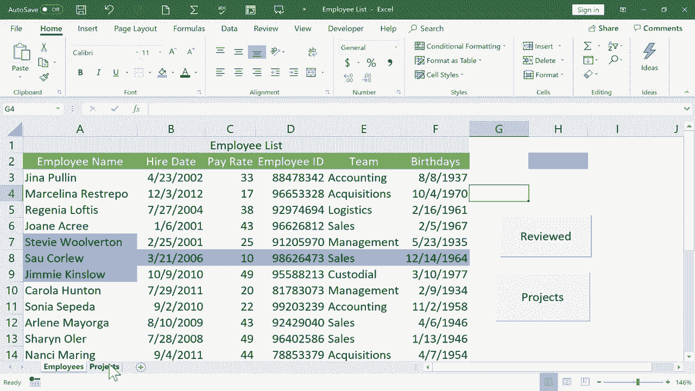
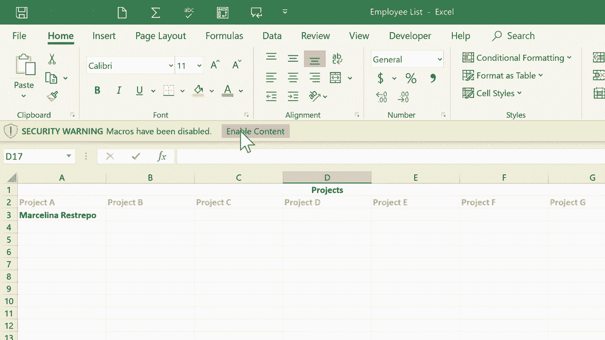

# 【双语字幕+速查表下载】Excel高级教程（持续更新中） - P6：6）宏初学者指南 - 创建快捷方式 - ShowMeAI - BV1sQ4y1B71N

This is the beginner's guide to Excel macros。 How to use macros to create shortcuts for the tasks that you need to do in Excel。 And the spreadsheet that I'm gonna to use for this example is an employee list You can see there's a list of several employees here for a hypothetical small business。

 It's got some information about them like the date they were hired their employee I D and the team that they're part of。 And on this projects tab， I have a list of some projects that I would like to assign these employees to。 so they can work on them。 So I will be switching back and forth from the first tab to the second tab。 And， of course， I could certainly do that here just by clicking on the tabs。

 But let's create a macro to make this a little bit easier a little bit more convenient。 What I want to end up with is a button may be right here。 that when I click that button。 it takes me to the second tab。 The second sheet really in this work book。 So how would I do that。 I would simply go here to the。Developer tab。And if you don't see the developer tab。

 you might need to right click here on the ribbon and choose customize the ribbon and make sure that developer is included here。 But anyway， I'm just going go to the developer tab and click on it。 and the ribbon changes to match that。 And here at the left。 there are some options related to macros。 In this beginner's guide。

 we're going stick basically with record macro and also this macros button。 So in this case。 I'm going to click record macro。 And it opens up a little wizard here that I can use to create this macro。 By default， it's calling this one macro 5。 because in the past。 I created some other macros in this spreadsheet。 So I'm going rename that。

 and I'll call this button to projects tab。 Next， I have to establish a shortcut key for this macro。 a keyboard shortcut。 Now， if you think about this， you know， you have to be careful here。 because they're already R。Keyboard shortcuts。 We have control X， control Z， control C。 Those are all already keyboard shortcuts。 And so I don't want to put control C here。

 That would be a mistake because control C already does copy。 So it's a good idea to actually put two keys in this box。 So I'm going hold shift and tap a。 So control shift A now is the keyboard shortcut that I'm reserving for this macro that I'm about to create。 Where's it going to store this macro in this workbook。

 So that means the collection of the spreadsheets that I have here。 right now。 there's just two spreadsheets， but I could add another sheet and another and another。 They're all part of the same workbook。 and I want to store this macro in this workbook。 There are other options， but let's stick to just this。 Next。

 I could describe this macro if I wanted to。 And I guess I will。 So give me a minute to type a description， and then I'll resume the video。There's my very descriptive description and I click OK。And I got an error message。 I wanted you to see that so that， you know that you cannot have spaces in your macro titles。

 So now when I click O， it should accept it。And it did Now， notice here on the upper left。 it now says stop recording。 It doesn't say record macro。 So it is currently recording what I do in Excel。 but it's important to realize it's not recording the passage of time。 So I could sit here thinking about what am I going to do with this macro。 I'm recording。

 And I can think about it for 10 minutes for an hour for 10 days， whatever I want to do。 It won't matter because it's not recording time。 It's also not recording the location of my mouse pointer。 I can move the mouse wherever I want to。 None of that is getting recorded。 What gets recorded is where I click and the options and settings and things that I change in Excel。

 Okay， so what do I want it to record。 I want it to record me going from the employees spreadsheet to the projects spreadsheet。 So I'll just click on projects。 And that's really all I want it to record。 So I'll click。 stop recording。 And that macro has been successfully recorded。Now。 I'm going to jump back to the employees spreadsheet。 and let's look at the macro that I've created。

 If I click here on macros， it should list all of the macros that exist in this workbook And there it is button to projects tab。 while I'm here， I want you to notice that in that macros option that I just selected。 It does let you delete macros that you don't want to use。 And there are some other options as well。 All right， I'm just going to cancel this。 And it's time now for me to create a button and link it to that macro。

 So here again， on the developer tab， I'm gonna to go down to insert， and I'll click。 and that brings up some form controls。 in a previous tutorial。 I showed you how to create a scroll bar and use it in Excel。 And I hope you'll go back and watch that video if you haven't seen it。 in this tutorial。

 we're going to use another form control。 and that is a button。 So I'll click on the button option。 And notice what happened to my mouse pointer。😊，It's become crosshairs has become a plus sign。 basically。 And that's a sign that I can draw something on the screen。 so I will click and drag to draw out a button， and I can make it as big as I want pretty much or as small as I want and the dimensions and all of that's up to me。

 I think I'll go with about that size there。 As soon as I let go of the mouse button。 It popped up with this window for me to choose which macro to link to this button that I've created。 And right now， there's really only one option。 So I click on button to projects tab click O。 And my button is created。 If I double click on the text for the button。

 Sometimes it works just a single click。 I can change the text on the button。 So I'll type in projects。 All right， now I'll click off the button and to test it out。 I'll left click right on the button。 and look what it did。 It instantly executed that macro that I created using record macro。

 and it's stored here in the list of macros。😊，When I click the button， it took me here。 So now that I'm here， I can add somebody to a project。 How about my good friend Marcellina Resrepo。 I'll put her on project a。 Now I highly recommend if you're gonna create buttons like this that take you from one spreadsheet to another。 It is a good idea to create a button on the second spreadsheet to take you back to the first one。

 So really quick， I'm going do that， I'll just click developer record macro。 I'll call it return to employee sheet。 I'll give it a shortcut key。 and this time I'm gonna skip the description。 I click O， and the macro now has been named。 and it's ready to record。 So this time I'll click on employees。 I'm done recording。 I click stop。

 and I go back to the project sheet to create my form control button。😊，Then in this pop up。 I need to make sure I pick the right one， return to employee sheet， click O。 and maybe click and drag to highlight button1。 and I'll just call this return。Now。 when you're working with buttons， if you click away from a button， the next time you click on it。

 it's going to work。 It's going to do what it's supposed to do。 So how would I ever edit this button。 What if I regret the shape that it is or the location。 I can't click and drag。 So the trick there is to right click on the button。 If you right click on it， it selects it。 and then you can click away， and then click back on the button to move the button to resize it And if you want to。

 you can cut it or do these other things。 So at this point， I've got the two buttons。 one that takes me to my list of projects， and one that returns me back to the employee list。 Now。 that's just one kind of macro。 If you think about it。 I could have recorded several other steps as well。

 you can create macros with multiple actions that happen when you execute the macro。 But I chose to start with these simple buttons that just switch from one sheet to the next。 Let's look at one more example in this beginning。VideoLet's say I'm the owner of this company。 and it's time for me to have performance reviews with all of my employees。

 And maybe I want to track who I've already had the review with and who's up next to be reviewed。 One way to show that in a sheet is to use color。 So let's say good old M Rerepo and I have our review。 I could click and drag to highlight the whole row， or if I prefer maybe just her name。 And then on the home tab， I could either change the color of the text or maybe put a background color in。

 And maybe I'll say that the color blue means that we've had the review。 So that's one way to do it。 But now， let me show you how to do that as a macro。 So that I could just click on a person's name。 click a button and automatically apply the right color to that person's name。 to do this。 I would create a macro。 The first thing I want to do is to click away just click on a blank part of the spreadsheet。

 And then I'll go here to the developer。And click record macro。 And I'm going to name this。 mark as reviewed。 the shortcut key。 I'm going to do control shift C。 and I click， O。 it's now recording。 Now， you would think I would want to click here to select Gina pullulin or Regia loftus or one of these other fine people。 But instead， I'm purposefully going leave this cell selected。

 and I'm simply going to go to the home tab， home ribbon。 and I'll choose this blue background color。 and it just colored that cell。 Now I'll go back to the developer tab， and I'll click stop recording。 Now， why did I leave this cell selected。 The reason why is because if I had clicked to select Gina pullulin or Regia loftus or any of these other people。 Then every time I executed the macro。 That particular cell。 let's say cell a 6 in this case。

 would have been turned blue， but only this cell。 And the reason why is。Because I would have clicked on it after starting the recording of the macro。 But the way I actually did it。 I clicked here first， then I recorded the macro。 and I did not click on anything else。 And so the way Excel interprets that is it says， O。

 He didn't click on anything。 So whatever is selected will be turned blue。 not any specific cell。 Now， sometimes you will want it to be a specific cell。 In that case， after you click record macro。 click on what you want to turn blue or whatever the macro does。 O。 let's create a button and see if it worked。 So I'm going to go here to the developer tab insert a form control button。

 and I'll just click and drag to draw it on the screen。 And I just need to click mark as reviewed。 click O， there's my button。 And before I forget what it means。 I better change the name here on the button itself。 and I'll just click away from the button。 So let's say Jimmy Kinslow and I have a great review， I can click on。name click reviewed。

 and it instantly highlighted his name in just the exact color of blue that I wanted to use。 So I don't have to guess and try to remember which of these was it。 I can just simply click to select and then click reviewed and it changes the color。 Now。 if I want the whole row to be colored in blue。 Like， let's say for salw cordew here。

 I could click and drag to highlight the whole row， and then click reviewed。 And now the whole thing is turned blue。 Now， of course， at this point。 I could create yet another macro that turns these names or whatever is selected yellow if it's their turn to be reviewed next。 So I hope that these examples give you some ideas for ways that you could use macros。

 You can make macros for many， many different things。 and then just create a form control button linked to the macro。 and it really can save you a lot of time and energy。 It'll help you easily and quickly jump from sheet to sheet。 Now， of course。 in this particular workbook， there's only two sheets，Imagine what if I had 10 or 20 sheets here。 it would be kind of hard to click on exactly the right tab that I need to go to。 And so to have a button to take you to a particularly important tab or sheet。 that really could be a beneficial time saver for you。 So let's say that at this point。

 I'm finished creating macros in this Excel spreadsheet。 there's one more important step that you have to take whenever you're building macros into a spreadsheet。 And that is you go here to file in the upper left corner。 click and go to save as because this spreadsheet has macros in it。

 It's very important that I go here and click on this dropdown arrow。 and change it from just Excel workbook to Excel macro enabled workbook。 If you don't do that。 It's not going to work in the future。 So I'll click save。 So now let's try it out and see if it works。 Let's say to morrow。

 I need to work on that spreadsheet again， I can just open up。

And look in my list of recently used spreadsheets， there it is。 And notice that the suffix has an M at the end。 Typically in Microsoft Excel。 the suffix ends in an S or an X。 But in this case， it's X， L S M for macro enabled。 Now。 watch what happens when I double click to open it up because this spreadsheet has macros in it。

 At least the first time that you open it up， you'll probably get a security warning。 macros have been disabled。 And so in order to use them， I have to click enable content。 Now。 my macro should work。 and it does。