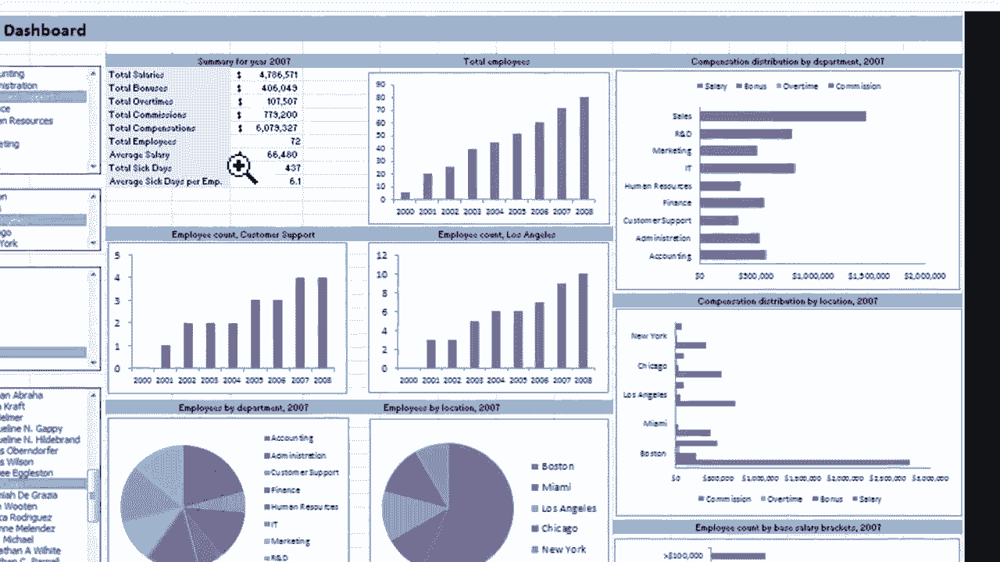
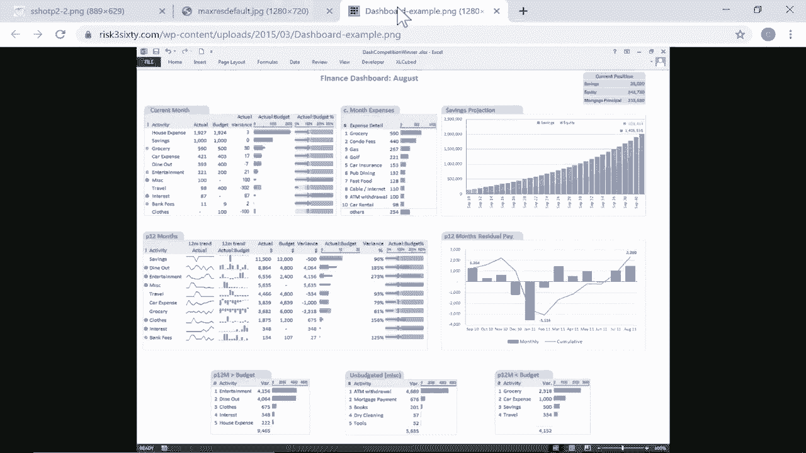
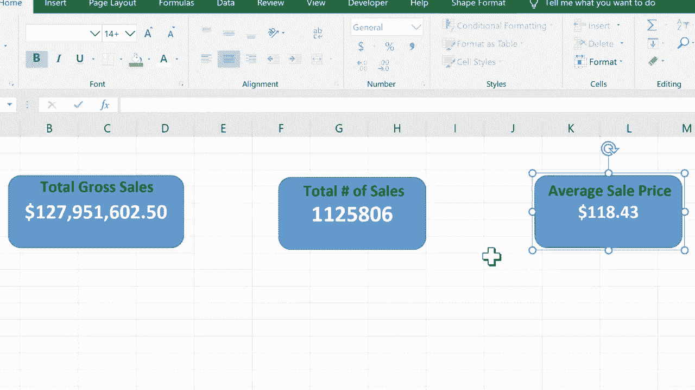

# 【双语字幕+速查表下载】Excel高级教程（持续更新中） - P7：7）Excel仪表板初学者指南 - ShowMeAI - BV1sQ4y1B71N

This is the beginner's guide to creating dashboards for your Excel workbooks。 And what is a dashboard。 I can give you a couple of examples。 Here's an example of a dashboard。 Now。 this is a beautiful complex， very complicated dashboard。 That's not what I'm going to show in this particular video。

 we're going to start at the beginning with the basics and how to get started creating dashboards。 But you can see that there's a summary for the year here。 And this is data that's being shown on a dashboard。 but the data actually comes from another spreadsheet。 or in some cases， another workbook。

 And here is a chart， a pie chart here， some graphs and things And again。 all of the data that's being shown here in this dashboard。 comes from a spreadsheet。 General。 the spreadsheet looks much more complicated。 It's cluttered full of data。 but dashboards lets you focus in on specifically the kind of data and the metrics that。😊。

You want to look at Here's another example。 This one showing sales total and trend by state。 Now。 of course， in Excel， you can create stuff like this。 Just write on a regular spreadsheet。 But with a dashboard， it makes it look a little nicer to pull the charts， the graphs。 the numbers that matter most to pull those out from the regular spreadsheet that you normally use and separate them and put them on their own spreadsheet。

 Here's a third example， So again， those are very advanced， complicated examples。 But now let's look at the basics of getting started creating your own Excel dashboards。 So here I have a complicated large financial data spreadsheet。 There are hundreds and hundreds of rows of data， hundreds of records。

 and just lots and lots of information here。 Also notice that past years are listed to the right。 So we have 2018，2019 and 2020。

So this is just a lot of information。 How do I know what I'm looking at here。 How do I know what's important？ Well， if I know how to create a spreadsheet。 know how to read a spreadsheet， I can certainly get that information just by paying attention to what I'm seeing。 But sometimes we need to simplify things。 So here in the lower left corner。

 I want to set up in this case， a fourth spreadsheet， a new sheet。 So I'll click the plus sign。 and it automatically called it sheet4。 but I'm going to double click on that name and change it and call it dashboard。Now， you could call it something else if you prefer。 I'll tap enter on the keyboard。 and there's my fourth spreadsheet。 I'm going to move it to the front。

 And that's going to be my dashboard。 Now， it's a good idea。 whenever you're creating a dashboard to kind of map out what exactly you're going to show on the dashboard。 Maybe here in the upper left， I want a list of total sales for the year。 maybe over here。 I want average price or something like that to be shown。 So it's a good idea to map this out。

 Sometimes it helps to do it on paper， or you could cut some corners and just do it right in Excel。 And that's what I'm going to do here in this tutorial。 So what I want to do is go up here to insert。 And one of the simplest ways to start setting up a dashboard is just to use some simple shapes。 And for me， Shas are hidden here under illustrations。 So for you。

 just look for your illustrations group。 and you should see it。 And I'll just go in here to shapes。 And there are a whole bunch of shapes that I could use。😊，I'll use rectangle。 but maybe one that's got curved edges or something like that。 So I'll just click and drag to set up a shape here。 Alright， and I would like my current ear。

 let's say 2020 total gross sales to appear here。 I want it to appear here in this blue box。 Now I can click on the box， and I can type。 I can type in text。 I can type in numbers。 and I could just figure out what the gross sales number is for 2020。 and I could just type it in there。 But there's nothing special about that。 right。

 it wouldn't get updated as more items sell。 So let's look at how to make it automatically update and sync with the actual data。 So I'll just delete the numbers that I put in there。 And the trick for this is to click on the shape so that the shape is here and then to link the shape to the data in question。 The way you do that is once the shape is selected just go up here to the formula bar and type in equal。

So this shape equals。 and then just click on 2020。 and I want gross sales。 So I'm gonna go down all the way to the bottom of this data。 and it's quite a big spreadsheet。 So let me just quickly show you a trick。 If I click here on gross sales。 Even on the title I can hold control。 and then the down arrow。

 and that should take me down to the bottom of the spreadsheet。 Okay， look。 there's totals right here。 so I can click on the exact cell that I want to use。 and then up here。 look my cursor is flashing。 That's what I'm working on right now。 So I tap enter on the keyboard and look， it has linked this shape with the data on this spreadsheet。

 All right， so you can see it ends in 598。5598。5 Now back here on the dashboard。 I can make this look better。 by clicking on it。 and I could work on， let's say the font size。 make that bigger。Maybe that's too big。 There we go。 I can decide if I want to center it， which I do。 I could center it horizontally and vertically。 I think that looks a lot better。

 I can also go here to the font color， And I could select something other than black。 I could go with white。 I think that looks pretty good。 could go with yellow。 just about any of these colors here to make that look a little nicer。 Make it pop so that people like to look at it。 You can also change the shape background color or fill color。

 So play with the font and shape fill colors to find what looks best to you。 Now。 you might be thinking that that's just all cosmetic。 It doesn't matter that much。 And you might be right。 but really， that's the whole point of dashboards is to make it look nice to make it look attractive and easy for people to access and read the information that they're looking for。 All right， so now I've got this shape and it's linked to the data on this spreadsheet。 Now。

 let's take a look at what happens if the data on the。Under sheet changes。 So here we have 5061。 What if that becomes 25065。 When I enter that data， it changes the total here。 Does it update the dashboard。 Yes， it does。 The dashboard should always match the data that it's linked to。 Now， I do have a minor problem with this。 And that is， I'm not exactly sure what this number means。

 And there's a couple of ways I could fix that。 I could go here to insert。 and add a text box。 so I can click here text box and just click and type total gross sales。 I could click and drag and put that inside the same box and then make it bold。 make the font size bigger， Perhaps And again， when it comes to dashboards。

 a lot of what we're doing is making things look nice。 So I think that looks really pretty good。 Now。 what if I decide later to move this somewhere else。 I could click and drag。To move it。 But look。 these two items， the text box and the shape with the number。 they're not really connected。 They're not really linked together。 So that might be a problem。

 What you could do to try to fix that is you can click on the shape。 hold control and click on the text box。 So now they're both selected。 and then go here to the page layout tab in the arrange group。 There's an option to group objects。 And so I'll just click that group。 And now they act as if they were one object。

 So now I can really easily move elements of my dashboard and put them where I want them to be。 Now that's just one way to create the beginnings of a dashboard。 There's many other options that you could do。 And instead of putting the title of what it is here inside the box。 I could insert another shape and have it appear here。 And so maybe I have another rectangle above。

 and that's where I put the text， and then I could group them together。 But for now。 I'm going to stick with this， This is just a basic Excel。DashboardNow。 for the next element of my dashboard， let's say I want to track the total number of items sold。 But this time I want to save myself a little bit of time。 So what am I going do。

 I'm gonna right click on the dashboard element that I've already created。 and I'll choose copy and then right click paste。 So now I've got two of them。 It didn't copy the title。 unfortunately， total gross sales。 So I still do want that。 I'll just select it control C control V to copy paste and then I'll drag it over here。

 So now I can double click on it to highlight the whole bit of text and I can type total number of sales。 So this is dollars here at the left， and this is just total number of items sold。 Now， obviously。 the data that I have here is linked improperly。 It doesn't match the text that I just typed。 So I have to change what this shape is linked to。 But that's not hard。 I just click on it。

 And then I go up here to the formula bar。'。L what's there。 And then I'll go in to the 2020 spreadsheet， and I'll find units sold。 So here it is。 hold control and tap the down arrow。 It takes me down to the lowermost part of the spreadsheet and you'll notice that I did cheat a little bit。 I added averages underneath totals。 But right now I'm still dealing with totals。

 So I'll click there on the total number of items sold。 and you can see up here。 it's entered it into the formula bar。 I tapped enter to take me back here to this screen。 And you'll see it is linked up properly，806806。 Now， unfortunately， it did change the formatting。 but that's okay。 I can just click away then click back to it。

 and I can just go up here and make those same adjustments that I made before。 Once again。 if I want these two things to be linked。 I should click on them holding the control key while I do it and then go to page layout and group。Give me a minute to add one more element to this dashboard。 And that's going be the average price of the item sold。

 So I'll need to get one of these averages numbers。 I think it's this one here。 And that's one of the things about dashboards。 You have to be really careful。 You have to make sure that you're getting the proper source data。 If you don't。 it can be a huge mistake and cause a lot of problems for people。

 So give me a minute to set up that third dashboard element。 It's very similar to what I've just done twice。 And then I'll resume the video。 So this is a great beginning to the dashboard for this work book。 And I'm pretty much going to leave it here for this beginner's guide。

 But there are a couple of little housekeeping things that I need to do before I end this video。 Number one， this is money。 This should have a dollar sign attached to it。 So I understand what I'm looking at。 This one's fine， as is。 this one here， again。 should have a dollar sign。 Also， this doesn't make a lot of sense to have 1 hundred and 18 in all of those numbers for the sense。

I want to change these up so they are easier to read and understand。 But watch what happens if I click here and then go to the home tab home ribbon。 typicallyyp。 I could use these tools here to change how those numbers appear。 And it looks like they're grayed out。 I can't do that。 So here's the trick。

 What I have to do is go to the source data。 So here on the 2020 spreadsheet。 Here's the first piece of information。 So I need to click on it and then change the formatting here。 So I'll change it to currency。 and notice that that took care of the sense problem as well。 So now if I go back to the dashboard。 Look， it shows up as dollars and cents。

 Now that numbers so big that I'll have to make some changes to make it fit。 In fact。 I might have to just stretch out the rectangle。 I think that looks pretty good the way it is there。 But at least that's readable。 And wow， take a look at that。 I wish this was my company。 Now。 let's try the same thing with average。Price， so I'll go in here。 Here's the average sale price。

 Notice that I could just go to the home tab home ribbon and use these tools here to increase the decimals or decrease the decimals。 So I could get it down to just two digits in the decimal area。 And if you go back to dashboard。 look， it solved that part of the problem。 But in fact， this number is currency。 So all I really have to do is switch it to currency。 and that'll solve the problem too。 There we go。

 So that's pretty much what you need to know to get started creating your own Excel dashboard。 There are some other intermediate skills that you might want to learn and some advanced skills。 So if there's a lot of interest in this video and in this topic。 I'll consider creating an intermediate guide to Excel dashboards and then maybe an advanced guide to Excel dashboards。

