# “当前最好的 TensorFlow 教程！”，P17：L17- 完整的 TensorBoard 指南 

本视频的目标是让你充分理解如何使用 TensorBoard 来更轻松地理解错误并修改我们的模型。这个视频较长，因为涉及的内容太多，关于 TensorBoard 的内容。因此，让我首先给你展示一下我们将在本教程中学习的内容概览。我们将从学习或许是最基础但也是最有用的事情开始，即获取这些准确度和损失图。

在这个示例中，你会看到训练我们模型时使用不同学习率的准确度图。接下来，我们将学习如何可视化图像。在这个示例中，我们对图像进行了少量的数据增强，将极少数图像转换为灰度，因此可视化这些变化将非常有用，以确保我们期望发生的事情确实正在发生。

比如，在这里我们有一匹马，它已经被转换为灰度图像。我们还将看到如何创建混淆矩阵并将其发送到 TensorBoard，在这里我们将预测标签放在 Y 轴上，真实标签放在 X 轴上，这样我们可以看到模型在何处错误分类图像。

比如，在这里我们看到它正确预测飞机的概率为 65%，但在 7% 的时间里，它错误地将鸟类分类为飞机。我们还可以看到它正确预测猫的概率为 40%，而最大的错误发生在它将猫误分类为狗的情况，大约占 21%。其他有用的功能是你可以可视化我们模型的图形，在这里我们有一个非常。  

一个非常简单的模型，它接受两个输入 X 和 Y，执行矩阵乘法，然后将其通过一个激活函数，这将是模型的输出。因此，如果你正在构建更复杂的模型，比如 Resnets，这种模型可以确保所有跳跃连接位于正确的位置，这将是非常有用的。

或者，如果你只是想更好地理解并更直观地查看模型的外观，TensorBoard 还能做其他酷事，你可以可视化并查看模型各种参数的分布，这对调试非常有用。如果你收到错误信息并想确切知道错误发生在模型的哪个地方，那么这些分布图将有助于你了解错误发生在哪一层。我们还有更多的内容要查看，比如我们将使用 TensorBoard 的 Hpars API 进行超参数搜索，这样你就可以看到哪些参数适合你的模型。

通过观察在这种情况下丢弃率、学习率和单元数之间的不同相关性，以及这些因素如何最终影响单次训练后准确率。为了更容易理解这一点，我们可以将注意力限制在仅关注与最佳准确率对应的部分。我们在这里看到的是，模型更倾向于使用相对较低的丢弃率，然后希望有一个非常高的学习率和较高的单元数。在这种情况下，我们正在检查训练集上的准确率，因此这可能是模型希望使用非常低的丢弃率的原因。我们还将学习如何使用TensorBoard的投影器选项卡，这在视觉上非常棒，你可以使用不同的算法，如t-SNE和PCA，以了解模型如何学习表示这些图像。

从一个非常高维空间投影到3D空间，在这里我们可以轻松可视化它们。例如，这里我们在MNIST数据集上运行它，我们可以，例如，使用TS&算法，如果我们现在搜索零，那么我们可以看到这里有零的聚类。同样，如果我们搜索数字二，我们会看到这里有一个数字二的聚类，这对理解模型的工作原理以及模型如何创建其表示是非常有用的。TensorFlow分析器也是一个非常有用的工具，它允许你查看哪些部分占用了最多的时间，以及在训练中你应该关注哪些方面进行改进。例如，在这里我们给出了不同部分的总结，以及它们在训练中占用的时间。因此在这里的图表中，我们可以看到输入占用了很大一部分时间。

占用了很大一部分时间，因此他们还给出了一些建议，表示该程序高度依赖输入，因为约84%的总步骤时间都在等待输入。因此，在这个特定的程序中，我们应该努力改善输入管道的效率，分析器的其他部分也可以看到许多不同的部分。

不过稍后再讲，现在你对我们将要覆盖的TensorBoard的不同部分和领域有了一个概念，所以让我们开始吧。

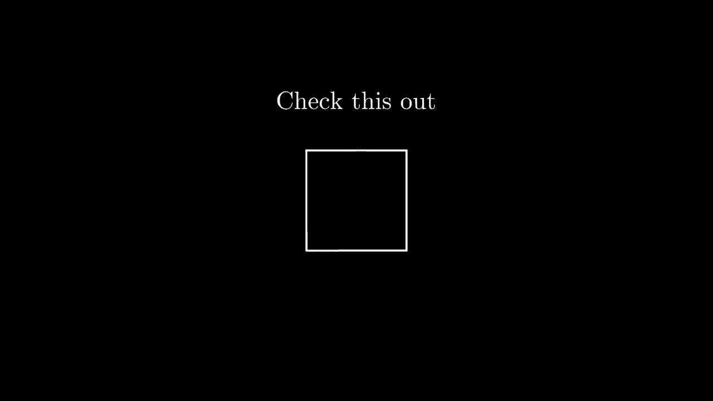

好的，为了让这个视频至少相对结构清晰，我将其分成不同的文件，每个文件专注于TensorBoard的一个特定部分。对于每个部分，我有一个起始代码，我的想法是快速讲解这个基于我之前许多教程的代码。所以我会相对快速地讲解，然后你可以查看之前的视频，我会引用那些视频以便对每个部分进行更深入的探讨。

所以我们将一切基于这个起始代码，然后我们将修改它或添加一些部分以写入 TensorBoard。首先，这是我们需要的基本导入，然后这是我们之前看到的内容。

我们将添加这两行，以避免任何 GPp 错误。我们正在从 TensorFlow 数据集中加载 CIFAR 10 数据集。我们通过除以 255 来规范化这些图像。然后我们对这些图像进行了数据增强，然后进行映射、缓存、批处理和预取训练和测试集。

虽然我们没有对测试集进行随机打乱。然后我们在这里有类名，这些将在投影仪标签中用于查看每个相应图像的正确标签。接下来我们有一个模型，这里是一个非常简单的模型，使用了组合层，两个组合层，一个最大池化层，一个展平层，然后是两个稠密层，中间有 dropout。

然后在这里我们有一些自定义训练循环的设置，所以我们首先获取模型。接着我们有损失函数，我们有优化器，在这种情况下，我们有一个准确性对称体来跟踪当前的准确性。

然后我们有这两个训练记录器，这将用于写入 TensorBoard，这些将是训练和测试，因此我们将为每个记录训练步骤和测试步骤。好的，然后我们有自定义循环。我们将遍历每个周期，范围是 nu Epos，然后在 DS train 中进行分批，这个过程非常基础。

我们在进行前向传播，反向传播。然后我们在这里进行梯度更新或优化步骤。然后我们对训练集做同样的事情，尽管我们没有进行反向传播。我们只是在检查准确性。好的，对于这个第一个文件。

实际上我将要做一些看起来可能有点奇怪的事情，但我们会去掉很多代码。

所以我想我们就到这里。

这里的想法是，这段起始代码是我们几乎所有文件的基础，你可以在这里看到。但我们希望在这个特定的文件中使用回调，这是一个更简单的方法，我们不使用自定义训练循环，所以我想首先展示这一点。因此，在获取模型后，我们将直接执行 model.dot compile，我们将指定我们的优化器，在这种情况下我们只会使用 Adam。

然后我们将指定损失。在这种情况下，我们将使用稀疏分类交叉熵，并且 log 设为 true。我们还将指定指标，在这种情况下将是准确率。好的，然后我们将做 Tensor board 回调。所以这可能是使用 Tensor board 的最简单方法，我将给你展示它的具体作用。

但这非常方便，所以你所要做的就是需要做 cars。回调 Tensor board，你必须指定一个日志目录，它会跟踪所有日志，所以我们就这样做，称之为 TBb 回调目录。然后我们指定一些直方图频率，这个我们将设置为一。这个用于我之前展示的梯度分布图等所有东西。

好的，最后我们将进行模型拟合，所以我们将传入 DS train。我们将传入 epoch 数，假设我不知道 a5。然后我们将做验证数据，实际上我们将传入测试集，通常你会这样做，所以为了目的，我们就假装测试集是验证数据。我知道这样做非常不正确，但这对于这个目的来说并不重要。

然后我们将指定回调，我们将做 Tensor board 回调。然后我们将指定 verbose 设为 2。好的，就这样。让我们运行这个，我将向你展示在 Tensor board 中的样子。但实际上，在我们这样做之前，我需要向你展示如何实际运行它。

所以你如何运行这个，你需要进入你有的文件夹。具体来说，就是你运行这个特定脚本的地方。然后你还需要激活你安装了 Tensorflow 的环境。然后你会做的是，tensor board，你会做 log De。

然后你需要指定你在这里称为的那个，TB 回调目录。如果你运行这个，我们将返回一个 URL，这在本例中是本地主机 6006。所以如果我们去查看这个。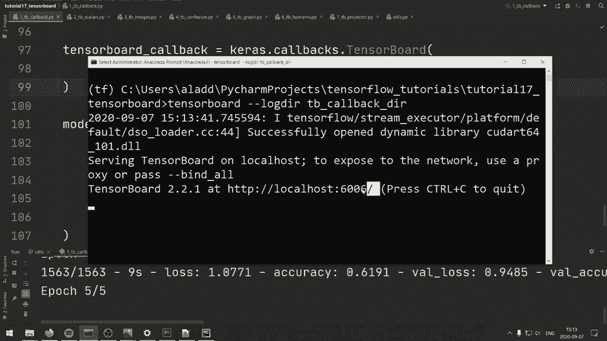

更新后，我们将得到这样的结果，其中包含每个 epoch 的训练和验证准确度，同时我们也有损失函数的结果。因此你可以看到，验证准确度实际上更高，这可能有点奇怪，但请记住，我们正在使用 dropout，同时也在使用数据增强，这可能使模型在训练数据上更难过拟合。例如，我们将一些图像转换为灰度，当然，这可能更具挑战性，所以这大概就是为什么通常你会看到这种情况反转，训练准确度高于验证准确度。

好的，但正如我们在这个标签上看到的，我们有四个不同的内容。这只是用于 SCRS 的，关于损失和准确度的。你还有图形，告诉我们它看起来如何，我们有输入、两个组合层、最大池化、扁平化和稠密的 dropout，然后是另一个稠密层。

这样你可以在这里检查它，然后我们有之前展示给你的分布，你可以看到所有参数的梯度。或者更确切地说，是参数的分布。好的。这是使用回调设置 Tensor board 的最基本方式，我将要展示的是如何从自定义训练循环中实现它，因此从现在开始我们将专注于此。但请知道我将向你展示的大多数内容也可以使用回调和模型拟合来完成，但使用自定义训练循环使我们拥有更多灵活性，实际上使很多事情变得更简单。

所以让我们全屏查看这个。再一次，这只是你之前看到的起始代码，我们要做的就是移动到自定义训练循环的部分。这里我们想要添加打印到 Tensor board 的功能。因此，一个想法是。

要么你为每个批次写入 Tensor board，所以你可以在这里执行。或者你可以在这里执行，这样也可以。但也许每个 epoch 执行会使图形更清晰，因此我们可以在这里使用训练者作为默认值。然后我们想要发送损失值，同时也想发送准确度，这里有一件事是我们要发送损失值。

就像这样，这实际上只是该批次的最后损失，所以要注意，你可能希望发送该批次的平均损失。因此你会有一个损失列表，然后取其均值发送，但这可以展示如何写入 Tensor board，因此我们会在那里发送损失，然后发送步骤，我们可以用 epoch 作为我们的步骤。

然后我们将做同样的事情，使用 dot scalar。我们将使用准确度，所以让我滚动到下方，我们将发送准确度，准确度将存储在这个 accuracy metric 的结果中。请记住，在每个 epoch 之间它会重置，并且在训练和测试之间也会重置。

这应该是通过测试集进行迭代的。好的，然后我们要添加 chsmetryduct 结果。我们将再次指定步数为 epoch。现在我们完成了训练，我们也想为测试做同样的事情。因此，我们可以在这里复制并粘贴，并确保更改所有这些内容，测试写入器的步数仍然是 epoch，步数仍然是 epoch，所以希望现在没有错误。

所以这里需要记住的一点是，我们现在使用了另一个日志目录。在这里，我们使用日志，并在日志中存储两个子文件夹，分别用于训练和测试。首先让我们运行这个，接着我们要再次打开这个 Anaconda 提示符。

我们将使用这个，但我们会指定日志文件夹只是 logs，然后它将自动找到训练和测试。如果我们运行它，然后去打开 Firefox 或其他浏览器，访问 Tboard 的那个网址。

本地地址 6006。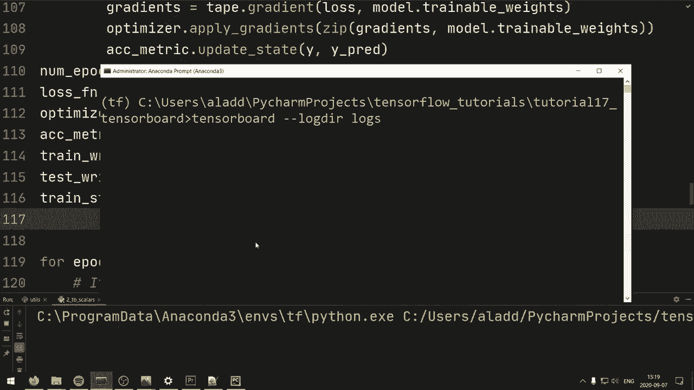

我想我们在这里只需等一下，因为它会写入每个 epoch，所以好的。在这里，我们现在可以看到准确度图，例如最后的图，这些将是非常清晰的离散步骤，因为我们只是每个 epoch 记录一次。

当然，正如我所说，你可以每个批次进行记录，这样会得到更平滑的图形。但这里有一点奇怪的是，测试集的准确率高于训练集，我想这可能与我选择的增强方法有关。例如，我将训练中的一些 RGB 转换为灰度，这当然会让模型在这些数据上训练得更困难，所以这可能就是原因。这就是我想向你展示的内容，你还可以做更复杂的事情，比如进行超参数搜索，可以指定学习率之类的。

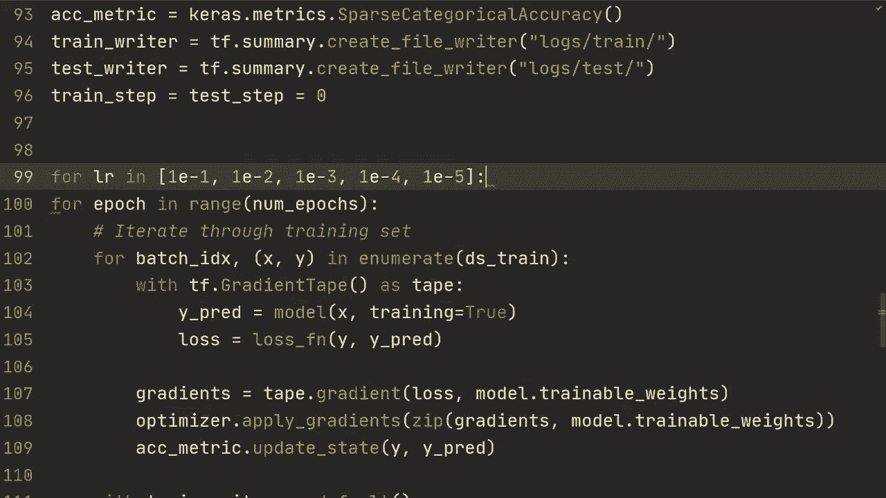

让我们缩进一下。

在一个步骤中。所以你可以做的是。你可以为每个相应的学习率训练一个特定数量的vpoOs模型，这里我只对这五个不同的学习率进行网格搜索，所以我们来做这个，我们可以设置训练步骤等于测试步骤，每次都将其设置为零。

然后我们将执行训练日志，使用TF.dot.summary.dot.create_file_writer。然后我们将进行日志训练。但是我们还将添加。让我们看看。我还会添加学习率的字符串，以便我们可以区分不同的运行。所以让我们再做一次，并进行测试写入。这里我们将执行测试。

然后我们需要获取模型，因为我们想要刷新，每次都重置权重。因此，我们将执行获取模型，然后优化器是ks.optimizeims.Adam。所以我们也需要使用这个特定的学习率重新初始化优化器。你可以这样做，并且可以像这样从一些纪元中写入测试写入器。

但就像我说的，让我们对每个批次执行一次。这可能会使图表更平滑，因此我们在这里要做的是指定训练步骤，而不是纪元，然后在这里我们将训练步骤迭代增加一，这将是图表中的一个离散步骤，然后我们也会对测试写入器执行同样的操作。

所以我们得把这个改成测试，让我们看看。测试步骤。我们必须对所有这些进行处理，以确保我们不会在这里犯任何错误。我们还将将其迭代增加一。好的，让我们想想还有什么需要更改的。

我们可以减少纪元的数量，以加快速度。让我运行一下，然后我会向你展示它在Tensor板上的样子。

好的，看着这个张量板，我刚刚将训练部分分离出来，所以你可以在这里写“train”，你可以获取所有不同的模型，这些对应于不同的学习率，你也可以在这里进行一些平滑处理，这样你就可以知道损失在每个批次之间变化很大，因此你可以使用一些平滑处理来制作更好看的图表，然后，比如说。

就在这种情况下，如果我们进行比较，初始学习率应该在0.001和0.0001之间，这两个学习率之间是橙色和红色的。所以关于损失图和准确率图就是这样，你可以随意玩玩，这非常有用。那么让我们继续获取图像。所以我们这里要做的第一件事是可视化图像，可能我们要做的第一件事是添加一些数据增强，我们将使用matplotlib来绘制它。

他们想要在0和1之间的值。所以我们可以使用matpl1。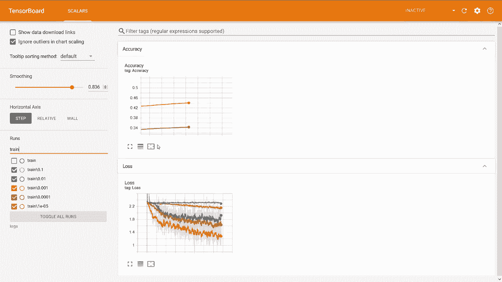

值，所以我们可以使用`T F clip`。通过值，图像然后裁剪值最小为0，裁剪值最大为1。顺便说一句，如果你在想为什么会低于或高于这个0和1的范围，因为我们除以255，这应该是自然范围，但由于数据增强，某些像素值可能会低于或高于1，所以我们只是想确保最后它们实际上在0和1之间，这在后面会用到，但我马上会向你展示。

所以我们可以在这里实际移除训练部分，这样我们就可以这样处理批次，我们可以通过`enumerate DS train`来迭代每个批次的XY。首先我们将创建一个图形，并创建一个图像网格。

所以我们将传入x和Y，以及类名。这里是一个我们将在这个u函数中创建的函数。我们将创建一个图像网格，然后将宽度设置为默认值。我们将做`Tfsmary image`。然后我们将发送可视化图像。我们将做绘图到图像，并发送图形和步骤。

这等于步骤。因此在这种情况下，我们只会使用一个单独的写入器，就这样做。而不是使用训练步骤，我们只称之为步骤。就这样。然后这就是我们将要做的所有事情。我们将逐步迭代。

当然我们需要创建这个图像网格，并且我们需要创建这个图像绘图。我想先说有更简单的方法可以做到这一点，而我在这里所做的确实使这个图像网格的创建变得复杂，但这有助于或者说更好。

如果你想以整洁的方式呈现，使其以网格形式显示，并在上方有标签。那么这就是你想要的做法，虽然还有更简单的方法来绘制图像，但效果可能不够美观，当然我们希望它看起来不错。那么让我们开始，我首先要复制一些将在此文件中使用的导入内容。

我们首先要做的事情是，我们有，嗯，让我看看，我们定义了绘图到图像。然后我们将发送一些图形。因此，让我们先处理那个。然后我们还有另一个图像，实际上是另一个函数，我们有图像网格，发送一些数据，发送一些标签，并发送一些类名。

我将从 TensorFlow 官方教程中复制这个绘图到图像。这是从 TensorFlow 官方指南中偷来的，你可以在这里看到 URL，但基本上，它将指定的 mapplot lib 绘图转换为 PNG 图像并返回它，这个应用的图形在此调用后被关闭且不可访问，所以基本上它是在内存中将 mapplot lib 绘图转换为 PNG，然后解码为张量，接着可以发送到 TensorBoard，因此在这里我们使用 IO 将绘图保存在内存中。

然后我们关闭图形，防止它直接在笔记本中显示。然后，我们通过 image.decode PNG 将 PNG 缓冲区转换为 TF 图像。最后，我们添加批量维度。我不想过多关注这一点，我认为这并不相关，这只是一些样板代码，以确保它处于正确格式。

这是一个张量，然后这个图像网格是我们将首先创建的，因此我们将创建图像网格，这将创建这个 Matplotlib 图形，然后我们将其发送到这个绘图到图像，接着会发送到 TensorBoard。

首先，数据应该采用这种格式，因此我们需要有批量大小。HW 然后是通道。所以我们可以首先断言数据的维度为 4，我们要做的是创建一个图形，所以图形是 PLT.dot.figure 的 fig size，这只是 Matplotlib 的导入。就在这里，importpl pipeline as PLT。所以我们以 10 和 10 的 fig size 创建它，这我认为是以英寸为单位，因此可能会有点混淆。

我尝试过不同的值，这就是看起来不错的效果，所以无论如何，图像数量将是数据的形状 0，我想这对于特定的批量大小来说是特定的，我们在这里使用的 fig size，我尝试过的是批量 32，你也可以使用更大的批量大小，它看起来仍然相对不错。我在这里做的是将图像数量设为数据形状的 0，这是一种通用格式，并不特定于 32。

整数 N 为 MP 的平方根的上取整图像，因为我们想要一个好看的网格，一个正方形网格，因此网格的大小将是图像数量的平方根，上取整到下一个整数值。接着我们将迭代范围为数据的形状 0 的 I，因此对于数据中的每个图像，我们将为该图像创建一个子图。

子图的大小将是大小。大小和大小，正好是图像总数，而当前特定图像将由这个索引指定，即 i+1。该图的标题将是类别名称。

标签是该索引的值。然后我们在这里使用该索引的类名称来获取它的名称，接下来我们将做`xt`，并发送一个空列表，然后我们将做`yt`，并做类似的事情，最后我们将设置`plot grid`为`false`。

然后我们将检查数据形状的第三个维度是否为1。我们将进行绘图，并将CMap设置为`PLT.dot.Cm.dot.binary`以获取灰度图。如果是灰度图，我们将这样处理；如果是RGB，我们将直接使用`plot I show of data of I`。最后，看看这里的内容。

我们将返回图形。在这里我们不需要指定任何CMap，因为默认情况下是RGB。所以这里有很多Matplotlib的内容，我不想深入细节，但你能理解整体概念吧。即使你对Matplotlib不太熟悉，我认为我们正在创建一个图形，然后创建一个子图，这将是这些特定的训练图像，大小为`size`，行数由我们传入的图像数量决定。

所以假设我们传入16张图像，那么网格将是4乘4，每个单元格将是我们训练集中的一张图像。现在我们有了图像网格，然后我们有`plot to image`，所以如果我们回到这里，这应该可以正常工作。我们先做图像网格，然后做`plot to image`，这里我们正在写入我们批次中的每一张图像。这并不是特别必要，也许你想在每个epoch时执行一次。

但这可能很有用，可以查看所有图像，所以让我们运行它。看看它的样子。好吧，在这里我们需要导入它。所以我们需要在这里做`from us import plot to image`和`image grid`。然后重新运行它，希望能成功。好吧，writer未定义，所以我想这应该是。

😔，Wrier dot为默认设置。

好吧，如果我们现在打开TensorBoard，我们会得到一个漂亮的格式。标签会打印在上方，正如你所看到的，这是一种正方形网格，例如这里是6乘6，然后这些最后的图像没有被任何图像覆盖，因为我们进行了密封并向上取整。但我觉得这看起来很好，这是一种可视化图像的好方法，你可以看到这里每个批次的步骤。一件事是，如果你向后滚动一次，你会看到实际上是六个步骤。

如果你在Anaconda中调用TensorBoard，你可以发送另一个参数，即`samples per plugin`，这将指定你希望在此步骤滑块中显示多少张图像。例如，如果你将其指定为94。

这意味着这里的一个滑动步骤是针对一个批次，而不是像这种情况下大约 25 个批次。所以如果你对此感到困惑，这只是需要记住的一点。但无论如何，这就是我们如何可视化图像的方式。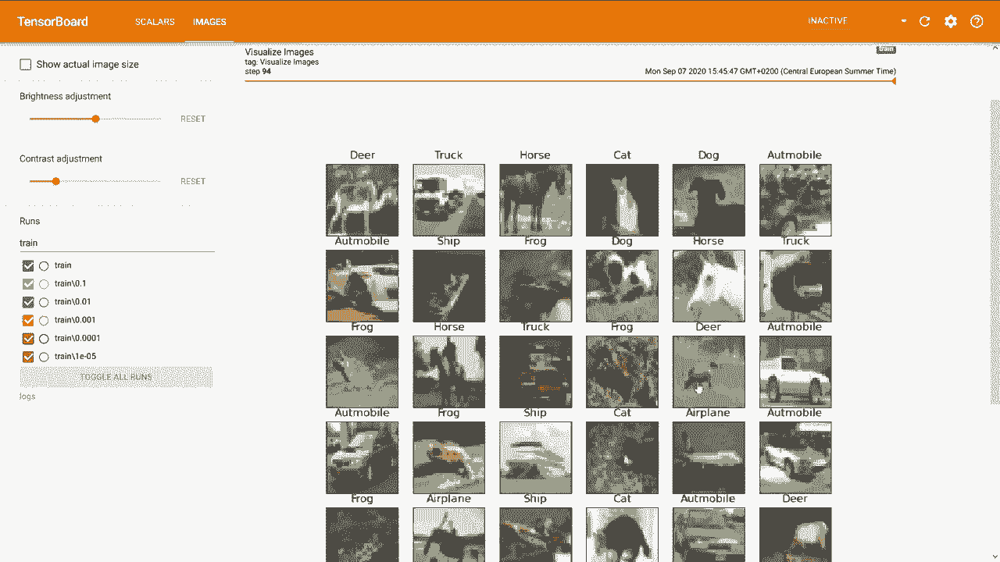

接下来我们要创建这个混淆矩阵，这也有点复杂。但是正如你之前看到的，它会表现得相当不错，所以让我们一步一步来，再次这是启动代码。通常你会通过同时发送所有图像以及输出和 y 标签来创建混淆矩阵，但在这种情况下，我们想要在每个批次处理时更新它，假设我们有一个庞大的数据集，无法一次性发送。

我们将创建一个最初为空的混淆矩阵。所以我们将使用 MP.zeros，长度为类名。然后类名的长度，这将是行数和列数。我们将在遍历我们的批次时更新它。

所以我们将要在这里进行混淆矩阵的计算，使用的是 confusion is plus equals 函数。我们将发送输入 y 和 Y 预测，以及类名。然后这将累加到混淆矩阵中，可能会产生一些数值的四舍五入误差等。

但至少这个近似值非常好，足以获取模型学习的良好表示。然后在这个批次之后，我们将使用默认的宽度训练进行操作。我们将使用 Tf.summary.im，并指定名称为混淆矩阵。然后我们会做 App plot confusion matrix，这又将是另一个函数。

我们将发送混淆矩阵，并按批次索引进行除法，因为我们将在每次更新时获得一个具有自己概率的混淆矩阵，范围在零到一之间。但由于这是一个线性操作，我们可以按批次索引进行除法。

然后我们将得到整个 epoch 的概率平均值。当然，你知道这样做可能会导致溢出，因为你实际上是在每个批次中加一，但为了导致溢出，你需要有一个非常大的数据集。即使你有 100,000 个样本，100,000 也远离溢出。

所以这没问题，只需记住这一点，然后我们有类名。接下来我们将把这一步指定为epoch。因此，我们每个epoch绘制混淆矩阵，因为这也可能相当昂贵。好的，然后我们不必为测试集做这个，但当然如果你愿意，也可以为测试集做。

但我实际上将去掉这个。像这样，因为我们不需要那样，这样可以节省一些计算资源。所以我们现在想要去到u函数，并创建那两个函数。好的，我们首先要获取混淆矩阵。我们将传入y标签，传入Los，传入类名。

所以这里是正确的标签。这就是模型的输出。这些是类名。让我们快速处理一下，然后我们还想定义绘制混淆矩阵的方法，并将其作为输入。某些混淆矩阵，我将其称为CM，我们还将传入一些类名，所以也许首先我们想要实际创建混淆矩阵，并且为了不从头开始，我们将使用SK learn来生成混淆矩阵。

创建混淆矩阵可能会是一个单独的视频。我想。但我们将进行预测，即逻辑回归的nuy arg max，然后x是1。因此我们在这里也将其转换为Numpy。所以从nuy到Tensorflow的转换相当顺利。因此我们只需直接做nu argm，然后那将是预测结果。

然后我们要使用SK learn的`matrix.confusion_matrix`来生成混淆矩阵。我们将传入y标签，传入预测结果。然后我们将传入标签，作为NP的类名长度范围。这基本上是为了确保我们得到的混淆矩阵在行和列上都与类名的长度相等，因为假设我们的批量大小为32，我们可能不会从每个类中得到一个样本，这会破坏我们的混淆矩阵。

所以我们这样做只是为了确保它的确是我们想要的大小。然后我们将返回混淆矩阵。好的。然后我们想要绘制混淆矩阵，这里我们将根据类名的数量设置大小。我们将创建一个图形，即PLT.figure，然后fig size是size, size。

我们将执行绘图，并展示混淆矩阵。我们将进行插值，插值方法是最近邻。你可以查看文档了解这到底是在做什么。我不太确定不同的插值算法是什么。

但这似乎是一个默认值，然后我们将使用CM是PLt.cm.bls。这只是让颜色变成蓝色。我们稍后会看到它的具体样子，但接下来我们将使用PLT.back.title。我们将指定混淆矩阵，然后索引将是NPR范围内的类名长度。

好的。然后我们将进行plot.do.x_ticks。我们将发送索引。这就是有多少种x值。我们将有多少个，然后可以指定它们的名称，我们将使用类名，确保它们看起来不错，并且文本不会重叠。

我们将指定旋转为45度。然后我们将进行ytics，并进行索引和类名的设置。好的。然后我们希望确保进行归一化，因此我们要归一化混淆矩阵。我们通过CM是NP.dot.around来实现。我们将使用CMm类型Float。

然后我们会通过看到总和x等于1来进行除法。我们将要做domp donuax，并指定小数位数U。这只是为了确保所有内容加起来为1。对于特定的预测，所有不同标签的和只能等于1。

所以这就是我们要做的，我们想要打印，或者说是的。我们希望得到特定概率的文本。因此，我们首先会设定阈值为CM.dot.max，并将其除以二，然后我们将用这个做一些相当酷的事情。

但你将在一秒钟内看到。我们将遍历大小范围内的I，然后进行4 J的遍历，没错。我们需要遍历每一行，然后遍历每一列，首先如果CMI J大于阈值，颜色为白色，否则为黑色。所以如果它超过某个阈值，我们将把它设为白色，因为那个单元格的背景色会相对较暗。

然后我们将把颜色设为白色，否则如果值较低，则意味着它是相对较浅的单元格或浅色单元格。某种更白的单元格，因此我们将把文本颜色设为黑色。然后我们将使用plot.do.text，指定位置为IJ，然后发送实际值，即CMIj。

我们将进行水平对齐，选择中心以居中文本。然后我们将设定颜色为color，这就是我们在这里指定的内容。好的，接下来我们将使用plot.tight.layout，这只是为了获得一些良好的格式。然后我们将使用plot.x_label，将真实标签作为x值。

然后 y 轴的标签是预测的。预测标签。同样，正如我们之前所做的。这现在是一个 matplot 图形，为了使其在 TensorBoard 中显示良好，它需要转换为张量。因此，我们可以重用该图形以生成图像，然后返回 CMm 图像。好的，现在我们可以回去，希望这现在能工作。

所以如果我们现在运行，这实际上是无法工作的，对吧，我们还需要从 Us 导入这些内容，导入 confusion matrix 的名称，然后是 plot confusion matrix，希望这现在可以运行。那么我们看看。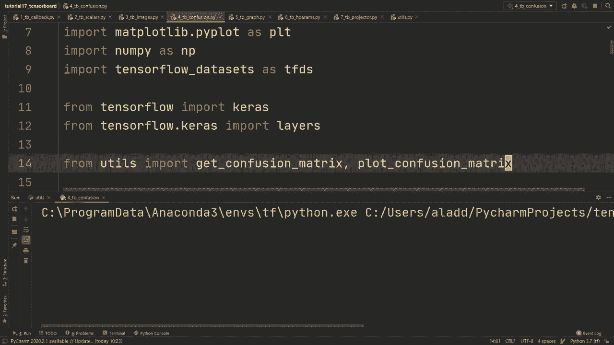

好吧，如你所见，它似乎在工作。当然，我们现在只运行了一次 epoch，因此我们的模型相当糟糕，这在对角线的值中得到了体现。这是它准确分类每个特定类别的概率，所以在这种情况下，飞机大约是 50% 等等。因此，我的意思是让我们增加 epoch 的数量，假设到 5，并重新运行它，然后你会看到随着 epoch 的增加，这一情况有所改善。

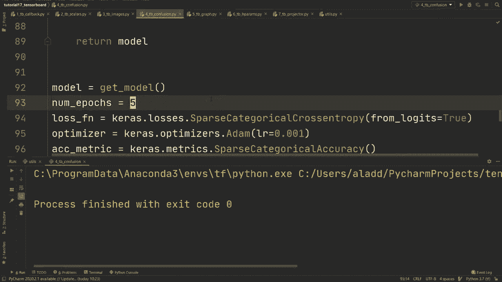

好的，如你所见，情况变得更好了，但模型仍然很糟糕。我们使用的是一个非常小的模型。因此，你仍然可以看到它并不完美，但无论如何，可视化似乎有效。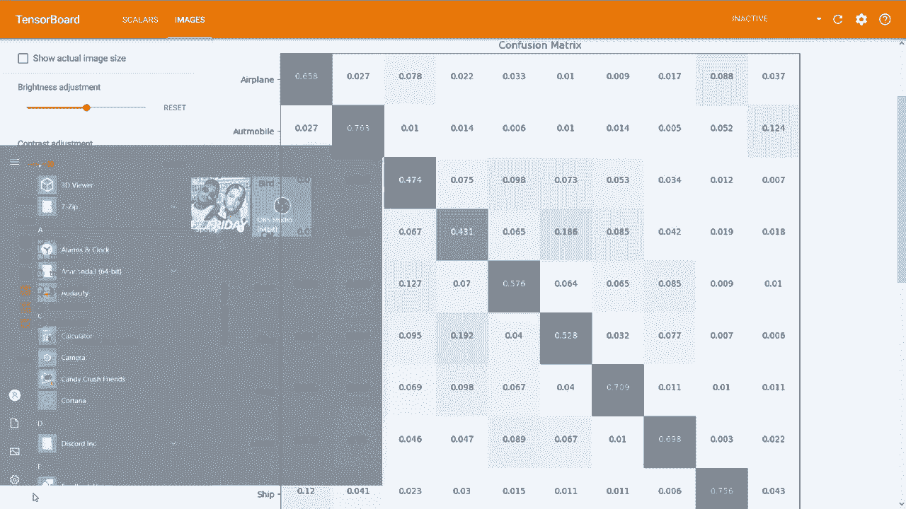

现在让我们转到创建图形。这将是一个猜测，稍微简单一点。那么让我们看看。我实际上不需要这些东西。因此，我们将移除这里的所有数据集内容。我们将全部删除。我们实际上要做的是使用 writer。我们将使用 TF summary。

创建。文件写入器。我们将指定日志，然后指定图形。就叫它这个吧。接下来，我们将定义一些函数。我的函数将接收 x 和 y 的输入，然后返回 Tf.nn.ReLU，然后是 Tf.matmul，然后是 x 和 y。因此，它只是在进行矩阵乘法，然后获取结果。

我们将做 x 是 Tf.random.uniform 形状为 3x3，y 也是类似的 Tf.random.uniform 三维矩阵。然后我们需要创建，添加 Tf.function。因此，自从 TensorFlow 2.0 起，默认情况下以 eager 模式执行。但在 eager 模式下实际上无法创建这些图形，因此我们需要确保它在静态图中运行。

因此，这个 Tia 函数确保函数被转换并在静态图中运行。当这完成后。现在我们将执行 Tf.summary.trace，并设置 graph 为 true，profiler 也为 true。然后我们将执行我的函数，输入我们刚刚发送的 x 和 y。然后我们将使用 writer 作为默认值。我们将执行 TF summary.dot trace export。

我们要做的名字，我们就叫它函数跟踪。😔。我们将步骤设为0，因为我们只做一次，然后是分析器。我们的目录将是。日志，然后我们不能这样做，所以我们需要这样做。只是一个奇怪的事情。我们需要这样做，然后进行图形可视化，让我们看看。

如果我没记错的话，我们还需要这样做。如果你想可视化模型，这样应该可以工作，所以我的意思是，如果你有一个模型，只需在这里返回X的模型，所以只需在这里使用Keras的顺序模型创建你的模型，然后返回X的模型，这样仍然可以工作。我想在这里做的只是给你展示一个非常简单的例子，但当然这可以广泛使用，所以如果我们运行这个，然后去TensorBoard，或者让我们先看看没有错误，是的，我们在这里收到一些警告，我不太确定该怎么处理。我是说。

有时在TensorFlow中，你会遇到错误，但如果一切正常。我不知道。我不知道该怎么处理这个。不过，我们只是看看图形，它会显示没有数据集名称训练。好吧！

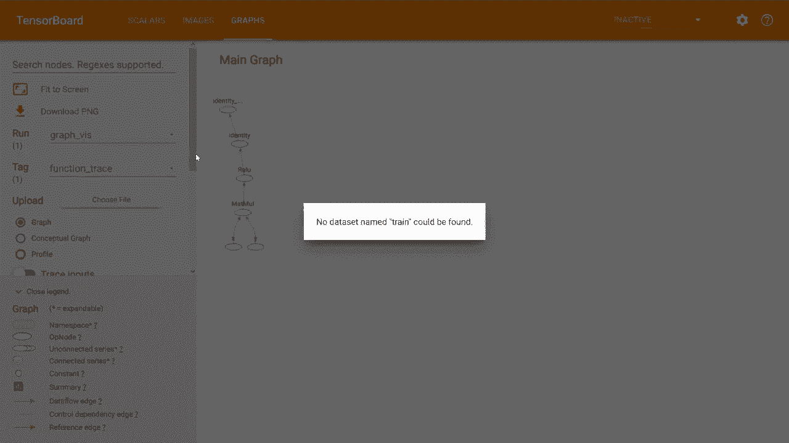

然后我们有这个X和Y矩阵相乘Re，然后就是输出。有时这些图形看起来有点奇怪。我不确定为什么我们在这里有两个身份。嗯。不过，是的。所以无论如何。你可以看到我们正在做的最相关部分，然后Re，个人来说，我没有使用太多，但。

我想这在调试一些非常复杂的模型时可能很有用。但是无论如何。让我们回到代码，所以我们现在要处理超参数，这非常有用。我会说如果你想进行超参数搜索，并且可以很漂亮地可视化。

嗯，是的，我们将再次从起始代码开始，并进行修改。现在我们要修改的内容是。我们要创建一种。一个函数。我们称之为训练模型，让我们进行一个周期。然后我们将传入一些叫做H PR的内容，实际上我们需要导入这个。

首先，我们需要导入的是来自Tensorboard插件的内容。插件中的H PR导入API作为H。这只是为了H参数API。我们将其导入为H。那么让我们回到那个函数。我们将在这里做的。假设在我们的模型中，我们会复制那个模型，假设我们想在模型上玩一下。

假设我们想在这里进行一些尝试，我们就称之为密集层中的单位数量，当然你可以想象对不同值进行这样的操作等等，但我在这个例子中只使用这个。我将向你展示如何从中获取Hpm，并且假设我们也想尝试一下dropout。

所以等一下，先移除这个，然后使用某个drop rate。然后我们还想尝试一下学习率。从这个h参数中，我们将获得单位，做H参数，然后称之为H nu units。我们将获得一个drop rate，当然。

我们还没有定义这些，但我们稍后会进行。因此我们将获得H dropout，然后我们也将获得学习率。这是Kaos optimizeimrs.adom。学习率将设置为学习率。我们也需要获取学习率。这来自H的H学习率。好的。

现在我们有了这些，我们想要的是，哦等一下，那是学习率优化器。那是优化器，我们使用的是从H primes得到的学习率。然后我们使用这个单位和这个drop rate来创建模型。然后我们实际上要创建一个训练epoch，我们将用这个来进行。

所以我们要复制这个并放到这里。说这个功能，不，不是这个。这是训练模型1个epoch。这将训练1个epoch，所以我们可以粘贴它。这就应该是这样。然后我们要写入Tensor board，所以写入TBb。我们将通过指定它们的运行目录来实现。

由于我们进行许多不同的运行，使用不同的学习率和drop rate等。我们将首先指定日志，然后是训练，然后我们将进行。加上单位的字符串。然后我们将进行单位，所以这只是一个整数。然后我们将进行单位，并且我们将使用下划线来使其可读。

然后我们将进行drop rate的字符串处理。然后我们将进行drop out。然后我们将进行学习率的字符串处理。😔 然后我们将进行学习率。那么这看起来可能有点奇怪，这只是为了不让一行太长，所以这样看起来还不错。我们可以轻松阅读它。当我们有运行目录时。

这个将根据单位drop rate和学习率而有所不同。我们将进行w.T F点summary，点create file。Rer of that run directory。我们将其设为默认。所以请注意，我们没有使用train writer。我们创建文件写入器时会写入，因此这对每个人来说都是不同的。

然后我们将进行h参数的h参数。我们将准确性定义为准确性指标结果。所以这将记录此运行中使用的值。然后我们有准确性。然后我们有Tf摘要做标量。准确性。

然后我们将传入那个准确性，我们只会进行第一步。之后，我们需要重置对称状态。好了，现在我们可以。我想我们可以删除这个获取模型，因为我们为每个人创建了模型。然后我们就不需要那个。😔，我们不需要Vpo的数量，或者是的，我们可以。

我们可以有纪元数量，但我实际上会将其仅运行一个纪元。因此我要删除那个。然后我们想要有损失。我们想要有优化器，我们想要有对称的。然后我们不需要那些，因为我们每次都已经用新方法写了它。

然后我们将指定H nu单位。我们将进行H。t H每个Ram。我们将做nu单位。我们将称之为这个。然后我们将进行Hp dot离散。我们将传入32，64，128。这意味着我们选择该特定密集层中的单元数量为32、64或128。

所以我们在这里有点像使用网格搜索，如果你熟悉超参数搜索，你可能知道使用随机搜索更好。我不打算解释原因，但本质上使用随机搜索更好。当然。

你在这里需要做的是，首先可能使用随机搜索对值进行随机抽样，然后将这些值放入离散值中，但无论如何，这里只是为了说明，我用一种非常简单的方式来处理。以离散步骤进行。

以网格搜索的方式进行，然后我们将进行H dropout，做H dot H PRm。我们将传入dropout。我们将做HB。t离散，并指定0.1、0.2、0.3和0.5，所以假设我们有这四个值，然后我们有HP学习率。我们来做HB进行H参数。它被称为学习率。再一次。

我们将HP出离散。嗯。然后1 e minus3，1 e minus5和1 e minus5，4和5。所以无论如何，你在这里还可以做的是，有一个叫做H dot int间隔的东西，我认为它是实际间隔。然后你可以从中抽样。但是。我真的看不出这些的意义。我只是自己抽样，然后找到值，然后将其作为离散值放入。

所以我认为这在一般情况下也会很好，但可能有一些我并不熟悉的用例。因此，当我们有这些时。我们可以在这里更改，我们不会使用之前用过的正常训练循环。我们要做的是使用HP学习率的完整学习率。

域值。我们将以 H nu 单位进行四个单元的计算，这些域值。还有在 HP dropout 中的速率。域值。通过这种方式，我们只是在这些离散值中迭代贷款利率单元。然后。我们将仅运行一次训练周期。但否则，你会在这个地方为 epoC 的范围内进行多次训练。

但是我们只会进行一次。所以我们将 h 参数等于一个字典。然后我们将指定 H 学习率等于一个学习率。那么这里有什么问题呢？

😔，是的，需要使其不等于这样，然后 Hum 单元。我们将其指定为单元。HP dropout 仅仅是速率。好的。然后我们将调用那个函数，也就是训练模型 1 个 H 周期。所以实际上。这一点是你不能。在这里进行多次训练，因为那样会。

稍微重置一下。是的，你需要做的是修改这个。所以你需要在这里添加一个循环。我想象中是这样的，但是。无论如何。这只是为了说明如何在不同的超参数下进行单次训练周期。这可能需要一段时间才能运行，所以我会运行它，希望我们不会遇到任何错误。

好的，所以我们在这里获得 H 参数，我会稍微放大一点，你会看到它随着数据点的增加而更新。好的，现在我们得到了所有这些超参数，这可能看起来有点混乱。

所以你可以做的就是，看看我能否做到，你可以指定某种。前几个。最高的准确性。在这种情况下，我们可以看到前几个对应于高单位数，基本上较大的模型在学习率为 0 的情况下总是更好。

001，所以我们选择的这些中最高的那个，然后最好是选择最低的 dropout 级别，这样做是因为我们是在训练集上进行的，实际上你应该在验证集上进行，以确保这是正确的。但再次强调，我们只是想演示这在 Tensor board 中是如何工作的。

所以使用 H 参数就到此为止。现在我们想要继续做投影器，而投影器非常酷且可以非常有用，所以让我们转到那个文件，其实我们不需要这些东西。所以我要删除模型，并且我将删除这里几乎所有的内容。

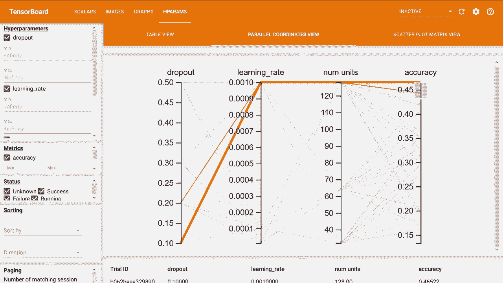

我们其实不需要。任何东西，真的，我们只需要一个批次，一个 X 批次，一个 y 批次。我们可以通过使用 S strain 的下一次迭代来实现。然后我们将把它发送到某个函数。我们将创建一个绘图到投影器的函数。我们将发送 X 批次，并且我们将再次发送 X 批次。我稍后会解释这一点，然后我们将发送 Y 批次。

我们将发送类名。我们还会发送一些日志目录。我们就叫它Proge，像投影仪那样。因此，我们在这里发送exppat两次的原因是，这个我们要创建的函数显然会接收一些数据点，对吧。

这些图像。它将接收一些标签，但也会接收一些特征向量。通常，你会将你的图像、数据发送到模型，然后从模型中获取一些特征向量，特征向量可能是任意维度的数字。

然后这个投影仪将接收这个特征向量，并试图将其投影到图像上，看看哪些特征，以及使用像TS&E或PCA这样的算法进行投影，看看我们的模型认为在特征向量所描述的相似组中有什么。

而我们在这种情况下要做的是不将其发送到某个模型。这意味着我们将使用图像本身。我们将重塑图像。将其变为一个长的特征向量，包含该图像的像素值。这将是我们的特征向量。同样，正如本教程中大多数内容一样，它是为了说明如何使用Tensorboard，因此这就是为了简化我们的操作。

但通常这将是一个特征向量，为了让你清楚，你会得到特征向量。你会用Xpat做模型，你会得到一个特征向量，然后在这里你会调用那个特征向量。现在我们不会这样做，正如我所说，我们需要做的就是创建这个plot to projector。在我忘记之前，让我们从U中导入plot to projector。

然后我们将再次使用这些u函数。我们需要两个东西。首先，我们需要一个称为创建精灵图像的东西，精灵图像本质上是我们将提取的图像，输入或X patch，输入的X patch。我们将创建一个精灵图像，它将包含我们发送的那个批次中的所有图像。让我看看我能否举一个例子。

所以emnist的精灵图像是这样的，或者说这是时尚emnist。所以就在这里。这是一个精灵图像。正如你所看到的，这是一组许多、许多不同图像的集合，集中在一个单一的图像中。这将对发送到Tensor board非常有用，这样我们只需发送一张图像，而不是多张。因此，这就是我们首先需要做的。我不会这样做。

我打算直接偷用它，我会复制粘贴。所以这段内容是从这个人那里偷来的。安德鲁·B·马丁。是的，你可以阅读一下，我们就要使用它。我不会专注于它的功能。基本上，它创建了这个精灵图像，并进行一些重塑和处理，添加填充以获得这个图像。

我们将创建这个定义投影到投影仪的函数，我们要传入的是 X。就是我所说的特征向量，Y，类名。我们将指定一些日志目录。默认情况下。我们就称之为默认日志轨迹，然后我们还将获得 Me 文件。

我们将指定元数据。TSV。好吧，这样会让我们用它们的目的更清晰。因此首先，我们需要确保 X 维度的数量为四。因为我们将假设它的形式是这样的，我们有批量大小。

我们有高度、宽度和通道。非常令人沮丧的一点是，如果你已经有一个包含此日志目录的目录，你是无法运行这个的。因此，我们将进行检查，如果 OS.path 是目录。也就是说，如果日志方向中存在目录，则意味着那里有一些旧的投影仪文件。

接下来，我们将进行 shuttle。移除 3 和移除树的日志目录。然后，我们将创建日志目录。基本上，我们从头开始清理。所以我们将创建一个新的、干净的、全新的文件夹。好吧，然后我们将继续。

我将指定 Sprites 文件，它将是日志目录的操作系统路径连接，然后我们将称之为 sprite_sub.png。接着我们将生成 sprite 是输入数据的创建精灵。然后我们将做 CM M V2，写入精灵文件。精灵文件和精灵。

好吧，然后我们想要生成标签名称。我们将通过将标签设置为 Y 的类名来实现。因此每个训练示例的相应整数目标值，I 是训练示例。然后我们将在 Y 的形状范围内进行循环。

然后我们将写入元数据 TSV 文件，这将用于在投影仪中绘制标签。所以我们将打开操作系统路径连接，日志目录和元数据文件。这就是我们所称的，然后我们将写入这个文件。我们将以 F 的方式打开它。因此，对于标签中的每一个，我们将进行 Ft 写入。

我们将进行换行，并使用点格式标签，全都吗？

所以我们只会传入标签，然后我们将换行，这只是我们想要的结构张量。现在我将做的是处理特征向量。如果特征向量的维度不等于 2，那就意味着这不是一个特征向量，比如说。

就像我们现在所做的，我们两次发送 exppat。所以如果是这样的话，我们要做 print。然后我们要看注释。特征向量不是一个形式批次逗号特征。然后我们可以进行重塑，尝试把它变成这个形式。然后我们要做的是特征向量。等于 Tf do reshape。然后特征向量。

然后。特征向量 dot shape0，然后是 -1。好的，然后我们要做。特征向量是 T F 变量。所以我们只需将其转换为 T F 变量。然后我们要做 checkpoint 是 Tf train dot checkpoint 的嵌入等于特征向量。接着 checkpoint dot save，然后 OS path 显示日志目录。

然后我们将指定 embeddings. ckKP。嗯。基本上我们将特征向量保存到日志目录，然后嵌入那个 CKPT，这就是 TensorBoard 想要的名称。然后我们将设置一个配置，这个配置将写入 projector。

所以我们要配置的是 projector dot projector config。嵌入是 config do embeddings add。然后我们要做 embedding dot tensor name，我们要指定嵌入。然后我们需要在这里做，做 dot attribute。然后是变量名变量值。接着我们需要做嵌入的 met data path。

我们需要做 meta file。是的，如果你觉得这有点笨拙，我的意思是。代码有点。要做这个有很多代码。我不会太关注具体的 Pythtor 代码，例如这在一行中完成。字面上是一行，但在 TensorFlow 中这有点困难，嵌入投影器通常用于投影嵌入，这没错吧。

当我们为图像这样做时，我们需要以这种。非常复杂的方式来做。但无论如何，这就是我们的做法，如果你发现更好的方法，请留言。但这是我目前找到的最好方法。然后我们将做嵌入。sprite。图像路径，然后我们将做 sprite。p 和 ng。所以我们只是在指定图像路径。

然后我们正在做嵌入 thatt sp 单图像维度扩展。然后我们需要指定 x 形状为 1，接着 x 形状为 2。所以我们指定了高度和宽度。最后，我们必须做 projector，visualize embedding。我们要发送日志目录，然后是配置，这样就好了。

所以现在希望如果没有错误的话。这应该可以运行。

而这并不正确。😔。

所以错误是当我们对图像进行归一化时，当我们创建这些精灵图像时。我们需要确保不除以 255。如果我们重新运行它。我们现在应该能够获得正确的像素值。

正如你所看到的，我们有这些图像，我们可以看到那是一只狗，然后那是一艘船。我认为那是一匹马，让我们看看还有什么。是的，反正你可以玩玩这个。我们这里的图像很少，所以你可能想做的是将批量大小更改为500。

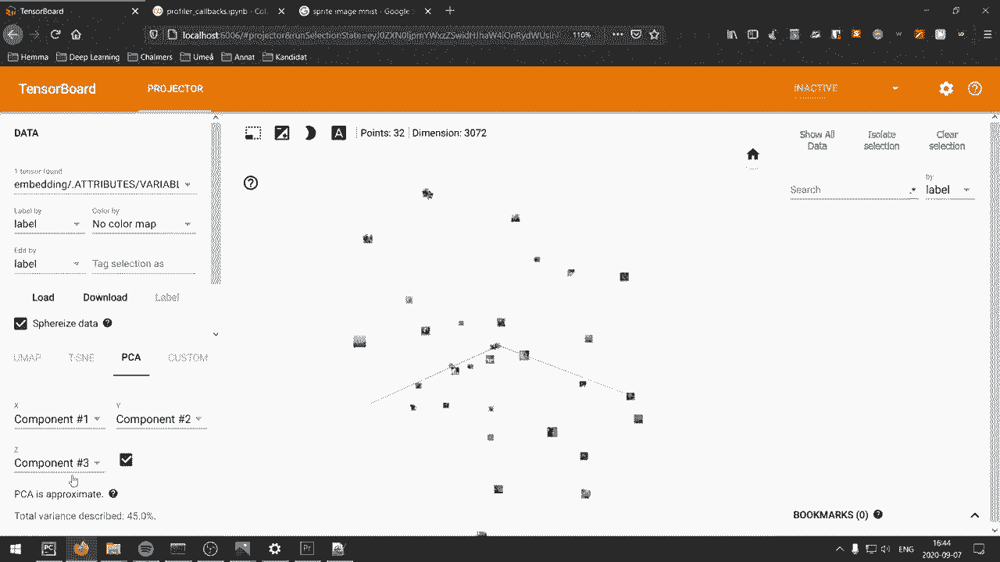

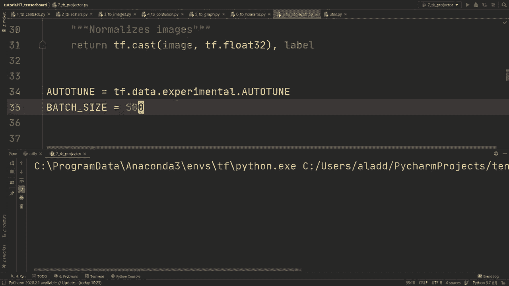

如果我们重新运行，这个速度实际上很快。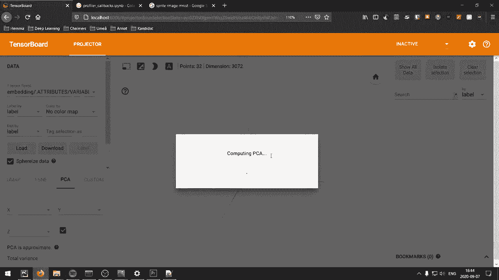

好吧，所以我认为你在这里需要做的，如果你重新运行，你需要做。

有点像一个新的。所以如果我们现在重新运行它。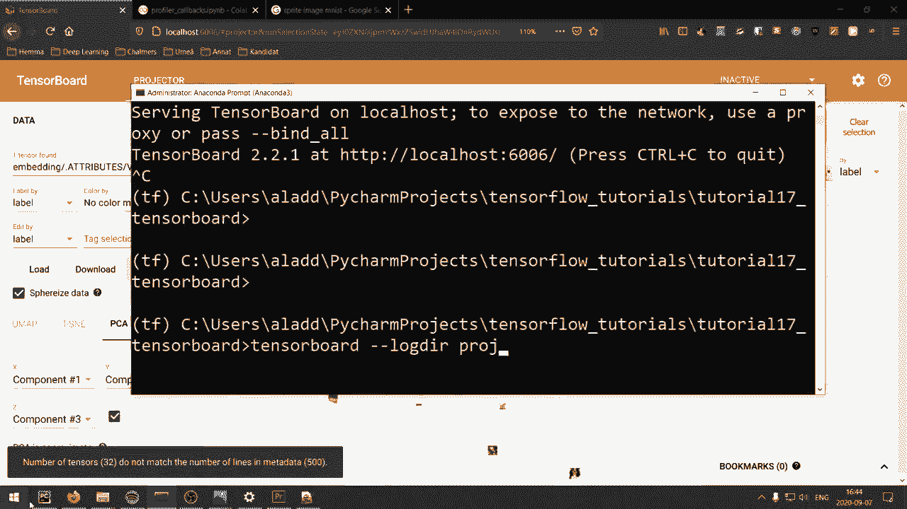

然后我们在Tensorboard中再次打开它。

有时这有效，有时无效。但现在它有效。好吧。现在我们得到500张图像，然后你可以使用T-SNE和PCA，这也是我尝试制作的。

通用，按我们可以将其替换为Mist的方式，我们可以直接运行它，然后如果我们现在检查它。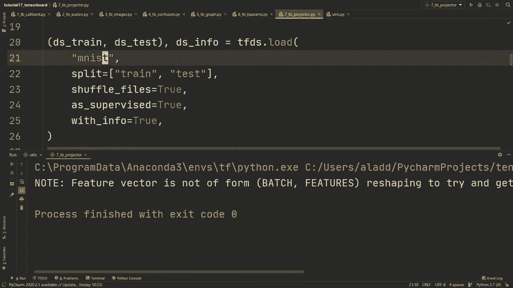

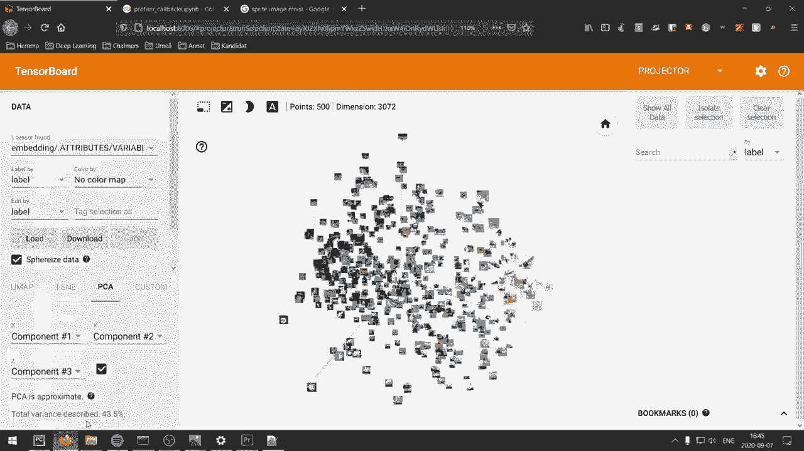

好吧。是的。那么当然我们无法进行数据增强，所以让我们完全移除数据增强，但我们无法将已经是灰度的东西转换为灰度。不过除此之外，我认为这应该是通用的，我们可以将其更改为Mist。然后你将能够进行投影。

你喜欢的任何类型。

好吧，等等，还有一件事，实际上。是的，这是最后一个文件。但我也想在TensorFlow Pro中展示另一个东西。TensorFlow Pro自TensorFlow 2.2以来可用，如果你跟着这些教程，你会知道我使用的是TensorFlow 2。

我在GPU上运行，因此我无法使用它，实际上你需要一个GPU来运行。

所以我所做的是。

Google Colab，这与他们的官方教程非常接近。但实际上，我将逐步进行，也许你在未来观看这个视频时，你可以轻松安装TensorFlow 2.2及以上版本与Anaconda。所以你可能可以做到这一点，并创建一个新的文件。

所以你不需要在Google Collab上执行这个，但这样做只是为了说明。首先，我们在这里有一些导入，然后我们需要执行这个Pip安装Tensorboard插件profile。我们正在导入Tensorflow，在这里我们确保我们在GPU上运行，正如我所说的。这是一个要求。然后TensorFlow，我认为它在CPU上也可以工作，但某些功能需要。

有一个要求是你必须在GPU上执行。所以我们在做tensor数据集。我们正在导入MNIST，非常类似于你在这个教程中看到的。然后我们对图像进行归一化，进行一些映射，然后批处理。接着我们创建一个非常简单的模型并进行模型编译。

然后我们创建一些日志，并生成这些日志。这是来自Tensorflow官方教程，使用当前时间的日志，这种方法非常聪明，因为每次运行时会生成一个新的日志文件，因为时间发生了变化。所以这是一种很好的避免错误的方法，而不是以项目的方式删除文件夹，如果存在的话。这样做可能更简单，我认为。好吧，然后我们有tensor board回调，我们只是在创建它，他们所做的就是执行这个profile批次，他们执行500到520。所以这是使用Tensor board回调，但如果你有自定义循环，也有多种方式可以做到这一点。

如果你想了解更多如何实现，我将引用这个官方教程链接在视频描述中。然后我们只是在做模型拟合，并再次使用这个tensor board进行回调。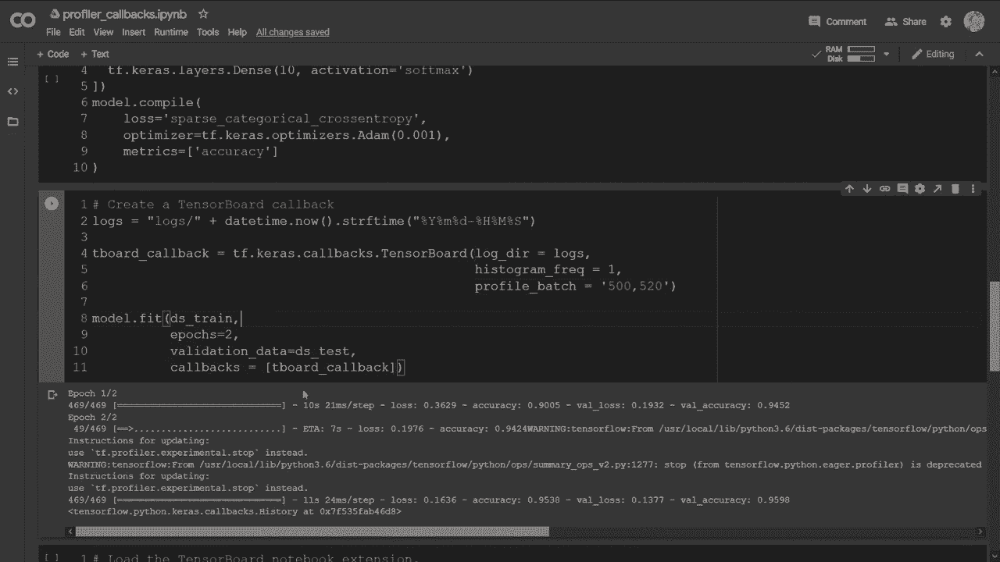

然后如果我们扩展Tensorboard的负载。我们打开Tensorboard并使用日志de equal logs运行它。然后我们可以得到这些不同的东西，所以我们得到了一个概览页面。也许我需要重新运行这个。我想是的，所以我们将进行工厂重置运行时。

然后我们将运行所有内容。所以然后我们可以打开分析器，我们将得到一些不同的工具，我们有一个概览页面，老实说，我还没有详细查看这些。但我会给你展示它们的概述，这可能是最容易查看和理解的地方，他们给出了所有不同部分的摘要，所以你可以看到训练的所有不同组件的时间。

你还可以看到不同的东西，放置让TF操作在主机和设备上执行的数量。我不太确定这里主机和设备之间的区别是什么。所以再次强调，我不是性能分析的专家，但也许有人可以评论这个区别。不过，你可以在这里看到的其他内容包括设备计算精度，如果你使用的是16位。

计算中有多少百分比是在16位上完成的？然后，你可以看到一些推荐，这个图表也相当有用。比如说，你可以看到输入高度输入绑定，85%在等待输入。

比如说，现在我们知道可以做点缓存，我们还能做什么呢？可以进行非并行调用的自动调优。我们可以对两者都这样做。所以没有。😔，并行调用是自动调优，然后我们可以做。缓存。然后我们还可以做点预取，可以进行自动调优的点预取。

我们可以再次发送自动调优，是的，我想我会重新运行这个。所以。运行时间，运行全部，我们将看看输出是否有任何差异。在TensorFlow分析器中，顺便说一下，这个分析批次是在两个批次之间，这里说明你想要分析的内容，所以在这里我们想要分析从500的索引批次到520的索引批次，所以我们只是对20个批次进行分析，如果你做得太多批次，可能会出现内存不足的错误，因此他们建议只做20个或10个批次，并且最好不要放在初始批次中，而是在训练中间进行，因为初始化某些东西可能需要时间。

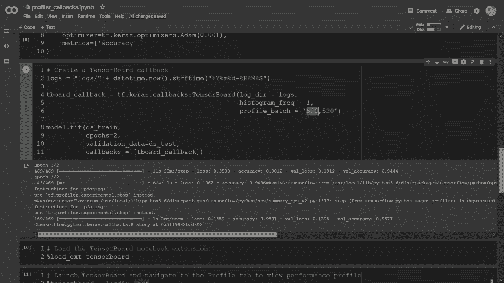

好吧，让我们再看看分析器，看看是否有什么不同，现在我们可以看到你的程序是适度地输入绑定，因为160%在等待输入。但这比我们刚刚的85%有了很大的改善。那我们再看看你还有什么。

实际上，你知道吗，你可以自己尝试一下，你会看到。我还将参考一个TensorFlow的官方教程，值得深入研究这个TensorFlow分析器。但是，是的，举个例子，你可以看到矩阵乘法占用了25%。这是操作时间中最大的一块，然后还有不同的东西，比如追踪查看器，你可以获得一个非常。

低级别的视图，查看CPU和GPU上执行的所有操作，确切地看到哪些占用了时间。所以这是一个非常非常酷的工具，这更多是一个入门介绍，展示如何让它运行，是的。所以就是这样。这将是一个非常长的视频。我可以看到这一点。希望这个视频至少在理解TensorBoard方面是有用的。是的。

非常感谢你观看这个视频，希望在下一个视频中见到你。
