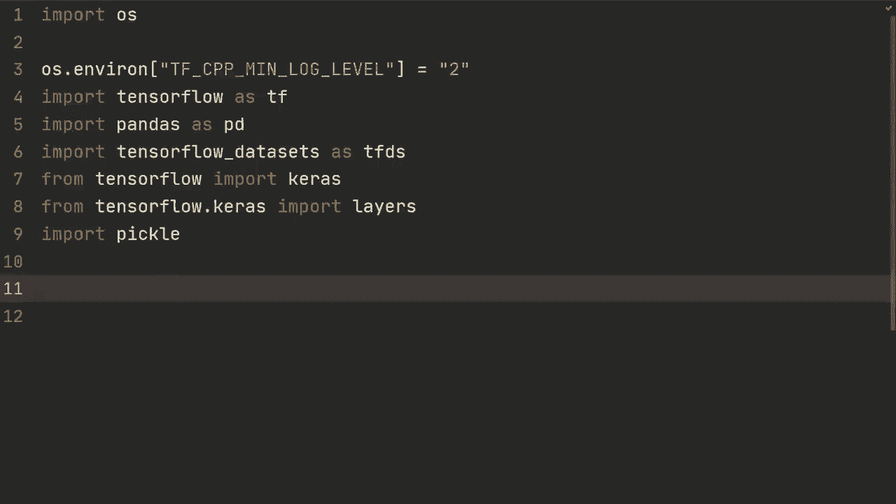
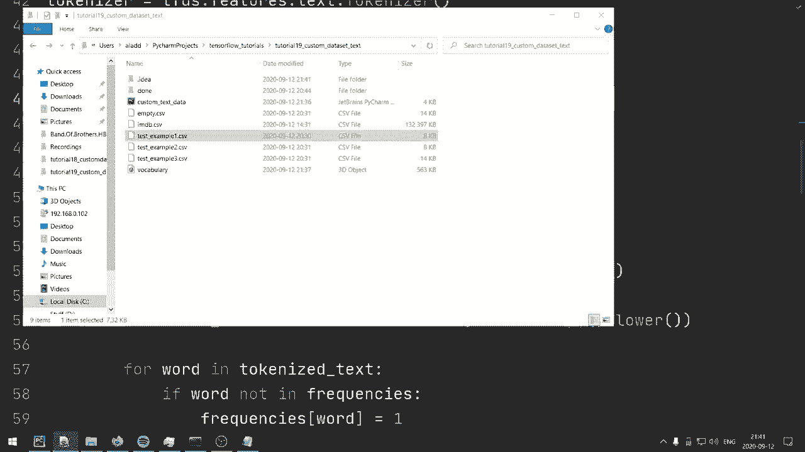
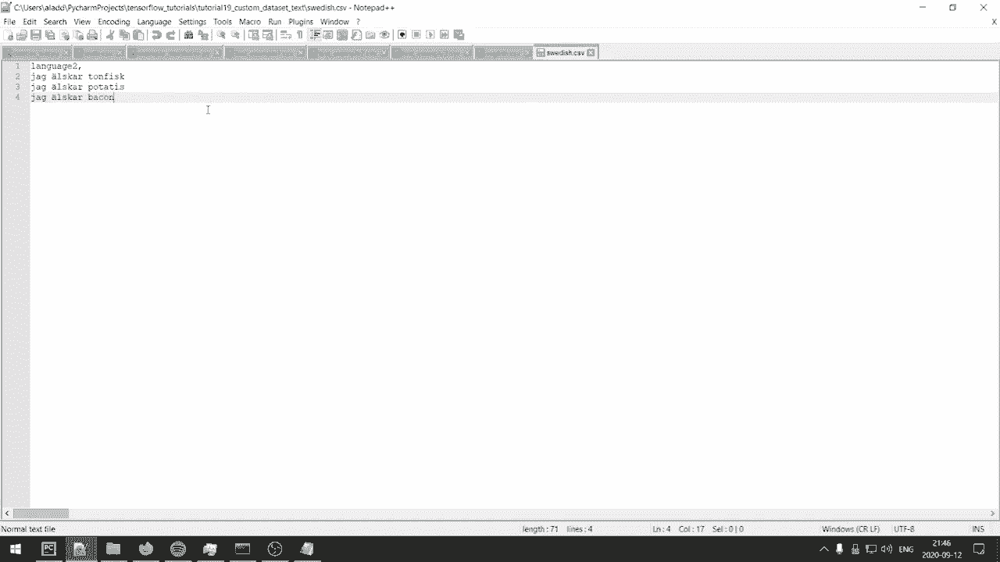

# “当前最好的 TensorFlow 教程！”，P19：L19- 使用 TextLineDataset 自定义文本数据集 

大家好，欢迎回来观看另一个视频。在这个视频中，我们将看看如何使用 Tensorflow 的文本行数据来加载我们自己定制的文本数据集，这个数据集可能是我们项目中正在使用的。让我给你展示一下我们主要在这个视频中使用的数据集。这个数据集，顺便说一下，如果你熟悉的话，是一个情感分析数据，我们会得到一条电影评论，并且我们应该判断该评论是正面还是负面。

好的，例如在这个案例中，我们再次看到，科斯纳先生将一部电影拖得比必要的时间更长，然后继续。此外，我们还有一列用于标签，标识是负面还是正面评论，然后我们有它是属于测试集还是训练集。

需要记住的一件事是，这个数据集实际上也包含无监督的评论。所以在清理和过滤这个数据集时，我们要考虑这一点。

我想说的是，每个数据的结构都将有所不同。但我认为，向你展示如何处理这种特定数据，使用文本行数据将使你理解处理文本数据的方法，这种方法可以扩展到许多不同种类的数据。在视频的最后，我还会向你展示一些在处理与这个数据集结构不相似的数据集时的想法。让我们开始吧。

好吧，让我们开始创建一个文本行数据集。所以我们将进行 Ds train 是 TF.dot.data.do.text line data set。我们将传入我们刚刚查看的 emdb.csv 文件。如你所见，这个文件将包含来自训练集和测试集的示例。

所以我们可以创建另一个 T 测试，作为 Tf 数据文本行数据集的 imMDb。cv。哦，IMDb 的 CSV，然后结束引号。所以我们在这里要做的是，例如，对于 Ds train，我们将尝试过滤出所有属于测试集的示例，反之亦然，对于测试集，我们将尝试过滤出所有属于训练集的示例。在做任何事情之前，了解这一点是好的。所以我们将对 Ds train 中的每一行进行处理，并打印出这一行。好吧，如果我们这样做，它会按顺序打印每一行，因此我们可能不想这样做。

我们可以先执行`dot skip1`，这将跳过描述所有列的第一行，然后我们可以执行`dot take`，我们只需执行`dot take 5`，这意味着我们将仅获取五个示例。那么让我们看看，运行一下看看结果如何。如您所见，我们得到第一个示例或索引01，然后得到评论。

我们获取测试集，然后得到负面评论。我们想要的是这个，我们可以通过`printf.string.split`将其分割，然后用逗号分隔，这实际上会将评论也分割。那么我们可以做到这一点。

为了避免这种情况，如果我们在这里传入一个参数`max split = 4`。那么它将分割这个，这个，这个，这个，然后只会将剩下的评论分割一次。因此，它不会继续分割评论。我们可以重新运行并看看效果如何。

如我们所见，现在它在单行上执行这个操作。好的，所以我们想要的首先是测试集，对吧，这将是这里的第一个索引。因此，我们要做的事情是创建一个函数，称为`filter train`，并传入一行。我们要做的第一件事是分割行，并执行`TF string.start split`。

开始分割行，用逗号分割。然后我们可以发送`max split = 4`。所以首先我们可以看看那个特定示例的归属，我们可以称之为`data belonging`。所以这可能是训练集或测试集。我们将通过`split line index1`来实现。

但是我们也可以得到情感类别，这是索引2的分割行。因此，这可能是正面或负面，或者是无监督的，我们不希望无监督的样本出现在我们的数据集中，所以我们会根据这两个来过滤，数据可以是训练集或测试集，正如我们之前所看到的。

所以我们要做的就是返回`true`。让我们看看能否这样做。返回`true`，如果数据集归属等于训练集。如果情感类别不是无监督的。那么这是我们希望在`Ds train`中拥有的示例。如果不是的话。

我们将返回false。那么我们可以在这里使用dot filter，通过这个名为filter train的过滤函数。如果我们现在再次调用DSstrain，就会发现我们只获得属于训练集的部分，这正是我们想要的。接下来，我们希望为测试集创建一个相同的功能，称为filter test，其他部分应该完全相同，只需将这里改为test，然后对测试集进行相同的filter操作。需要注意的是，你可能想要提前将它们分割成两个不同的CSsv文件。

训练的CSsv和测试的csv，通过这种方式，你可以节省计算资源，因为不必在实际训练模型时过滤示例，但你可能需要在其他地方使用这个过滤函数，因此了解它的存在和用法是好的。

现在我们已经完成了这一步，接下来我们想看看能否做一些待办事项列表。首先，我们要创建某种词汇表。如果我们要将其输入到模型中，我们必须首先创建一个词汇表。我在之前的TensorFlow视频中已经展示了如何做到这一点。

我将再次展示这个过程，因为我认为它非常有价值，能帮助到你。当我们创建了词汇表后，我们希望能够将文本字符串转换为数字索引。我们将使用token text encoder，我相信它就是这个，稍等我确认一下。是的，它叫token text encoder，这会为我们完成这个任务。

最后，我们要填充批次，以便可以发送。比如说S、R和N。对，这就是我们现在想做的。为了创建词汇表，我们首先需要一个分词器。这里有几种不同的分词器。我将使用的是TensorFlow dataset中的tokenizer。

TFTS功能是text.dot.tokenizer。我们要创建一个函数，称为build vocabulary。这个分词器会将句子拆分。比如说我有一个句子：我爱香蕉。它会将其拆分为一个列表：我爱，香蕉，好的，然后就可以进行标记化。

或者更确切地说，抱歉，这将能够进行数字化，这是我们的步骤2，类似于索引。这个特定单词在我们词汇表中的索引，所以假设我们只有这三个单词，也许它们的索引是0、1和2，然后这些可以在稍后发送到我们的R和N中。因此，在构建词汇表时，我们将发送一些数据，也许是DSs train，我们将发送DSs train，并且将发送一些阈值，因为我们希望如果这个词出现了这么多次，那么我们想要将其包含在我们的数据中。

在这种情况下，我们将选择，我不知道，假设是200。这将取决于数据，但我们就选择200，因为这是一个相对较大的数据集。此外，还有不同的方法来构建词汇表。你可以想象以多种方式进行此操作，我可能会向你展示一种更简单的方法。

所以首先，我们需要的是频率，这将只是一个字典。然后我们将处理词汇表，并进行一个集合。首先，我们将执行vocabulary.dot update。我们将发送一些开始标记，好吧，句子开始标记，这在这个示例中就是我们所称的。然后我们将执行vocabulary.dot update，添加句子结束标记，所以EOS表示句子结束，接着是标记。我们希望将这些添加到我们的词汇表中，然后我们将执行for line in DS train.dot skip of one，因此我们将跳过第一行，然后执行split line Tf string.dot split line。

焦点然后最大拆分等于4。然后我们将获得文本或评论。我们将通过拆分索引4的行来实现。然后我们将获得标记化的文本。为了获得它，我们将使用tokenizer.dot tokenize文本。我们还需要将其转换为numpy。接着，我们还要进行dot lower，因为如果字母或单词是大写的。

那么这实际上并没有什么意义。我们只会将所有内容转换为小写，以减少词汇表中的单词数量。然后我们将处理四个单词。在标记化文本中。如果这个词不在频率字典中，我们将添加它。因此，我们将执行frequencies of word，并将其设置为1。

但如果它在我们的词汇表中，那么我们将执行frequencies of word。我们将其加一。然后我们将检查是否达到了阈值，对吧。那是我们在这里发送的阈值。所以，如果frequencies.of word等于某个阈值。那么我们将执行vocabulary.dot update，然后是tokenize文本。好吧。

然后在最后，我们将返回词汇。这是一个相当简单的函数。我们将通过发送我们的`DSs train`来完成这件事。那么我们可以这样做，词汇等于构建词汇。因此调用那个函数，我们将传入`DSs train`。现在，我们可能不想每次都这样做，因为这可能会花费很多时间。

计算这个可能需要一些时间。所以我们可以打开`vocabulary.OBG`，然后我们可以这样做。我们将使用`pickle`，这就是我们为什么要导入它。我们将使用`pickle.dump`词汇，然后是词汇文件。好的，这样就可以了。

构建词汇并将其保存到`vocabulary.OBG`。好的，如果我们创建了它，也许我们想要一些加载它的东西。我们可以通过打开词汇文件来做到这一点。词汇对象和我们的`RB`用于读取，然后词汇是通过`pickle.load`加载该词汇文件。好的，在这种情况下。

首先，让我们先取消注释。因此我们将建立一个词汇，如果我们想在其他时间运行它，也可以保存它。好的，然后我们将创建一些编码器，可以进行数字化。这是将分词字符串转换为索引。所以我们通过`encoder = Tfds.features.text.token_text_encoder`来做到这一点。首先，我们将传入词汇的列表。

然后我们将指定一些词汇结束标记，并将其指定为“未知”。这些将是所有未包含在我们数据集中，且频率至少为200的单词。然后我们将设置`lowercase = true`，并且还将设置分词器。

在这个例子中，仅仅是一个分词器。好的，那么我们要定义我的编码器。我们得到的是一些文本张量，以及一些标签。我们要做的第一件事是编码文本，就是，我们将使用我们的编码器，对吧。这种令牌文本编码器可以将我们发送的文本张量数字化。

所以我们通过编码器的`encode`方法来做到这一点，并传入`texttensor`。然后我们将返回编码的文本和标签。好的，现在在TensorFlow中，我们需要做一件事，这可能有点不必要的复杂，但我们需要确保这个Python函数是我们计算图的一部分。

所以我们需要定义另一个函数。我们称之为`encode.Map`函数。我们将传入一行文本，就是之前我们看到并打印的标签、评论等等的长行。我们要做的第一件事是拆分行。我们将使用`TF strings.split`方法，以逗号为分隔符，最大分割数为4。

然后我们将得到标签字符串，它将是索引2的分割行。所以我不会再打印这一行。只需相信我这是索引2。如果我们进行了分割，这将是索引2。因此这将是负面或积极的。并且就是这样，因为我们也删除了所有未标记的部分。

然后评论将是，我们将在开始时添加一个起始标记。我们将与索引4的分割行一起添加它。所以那是最后一个，将是一个较长的文本字符串。最后，我们还将添加句子结束标记。好的，这就是我们的评论。

然后这将被发送到这个标记文本编码器。它将进行标记化。它将转为小写。然后将其映射到一些数字值。我们可以稍后将其发送到我们的模型。因此，标签将是1。标签字符串等于积极。

否则对于负编码文本，将是零，逗号标签。将等于Tf那pi函数。我们将使用我上面定义的编码器。输入将是评论以及标签。然后我们需要指定输出，在这种情况下，输出将是T F in 64和T f in 32。

所以这部分是为了。这个句子，审查，以及这个将用于标签，它只会是0或1，然后是编码文本的点集形状。这是我们需要为计算图做的，我们将把它设置为一个列表中的none，我们将设置为none，因为评论长度是可以变化的，评论可能仅仅是500个字符，或者可能是100个字符，然后我们将进行标签的点集形状，并且我们只会发送一个列表，因为它只会有一个值，然后我们将返回编码文本，并且我们也将返回标签。

好的，现在我们已经定义了处理数据所需的一切。我们只需对DS train和DS test数据集执行这些映射。所以首先，我们将进行自动调优，希望你对这里所有步骤都很熟悉，来自Tensorflow数据集教程。因此我们将执行Tf data do experimental.dot autotune。

我们将做DSstrain等于DSstrain.dot map。我们将通过map函数来映射它。我们将指定并行调用的数量。这只是为了，如果我们。这样做是为了让它们并行运行，从而加快数据加载速度。然后。

我们还可以调用dot cache，这将缓存一些内容到内存中，以便下一个更快。因此，我们还需要进行洗牌，如你所见，所有的示例都是负面的，然后是积极的，我们希望随机化。因此，数据集的长度为25000用于训练。因此我们将进行洗牌25000。

现在，也许25000有点多。你可以选择5000，但我们就这样吧。做一下打乱，大约5000，确保它完全随机。然后我们需要进行批处理，记住所有评论的长度可能不同。所以我们需要进行填充，使用填充批处理来实现。

指定批处理大小为32。然后我们指定填充形状，在更新的TensorFlow版本中，你不需要这样做。但在旧版本中，我想在2.2之前可能需要这样做。我们需要在这里指定为None，因为我们不知道评论的长度，然后我们只指定一个空元组。这将用于标签，因为它只会是一个整数。

好的，现在我们有了这个，我们可以对测试集做同样的事情。但我们不需要进行映射和打乱，所以我们可以直接这样做。通过编码映射函数，然后进行填充批处理32。再次设置形状，虽然不应该需要这样做，但如果你使用的是旧版本。

你可能需要。所以我在这里包含它。我会快速完成这个。我将创建一个模型。我们在之前的视频中实际上就做过这个。好的，所以相当快，我们只是创建了一个非常简单的模型，实际上只是做嵌入，然后对这些嵌入做全局平均池化。

这些嵌入的输出。然后我们通过一个稠密层映射，最后输出一个节点。接着我们指定了二元交叉熵，因为我们只有两个类，使用的是自适应动量优化器。好的，希望没有错误，这个应该可以运行。好的，但它没有。让我们看看。文本。好的，我们实际上在这个构建词汇表的函数中得到了相当早的结果。

那么，让我们看看我们得到了什么。是的，这里写的是文本做N。我们应该有评论。我们想把它转换为小写，然后想对实际的评论进行标记化。所以希望让我们看看这是否可以运行。好的，令人惊讶的是，这实际上成功了，所以我们可以看到我们得到了。

看看在训练中经过15个回合后达到了97%，而在测试集上得到了88%。但我觉得我们表现如何并不重要，重要的是它实际上可以运行。因此在构建词汇表时，或许你可以修改它，让它仅仅使用。

前1000个单词，然后你就不需要设置这个阈值，我认为这应该很容易实现。正如我一开始所说，这个过程对于每个数据集来说都不同，因为结构会有所不同，所以我想给出一个不同结构的例子。比如说，我有一个测试示例，包含三个CSV文件，实际上它们是完全相同的。

并且带上它，这也是IMDB数据，只是我们在一个文件中有几个示例，在另一个文件中也有几个示例，然后在第三个文件中还有几个示例。所以在这种情况下，如果你将其拆分为多个CSV文件，你可以这样做。

这在处理大型数据集时可能是非常常见的。

然后让我们做一下，我导入系统，然后看一下退出。所以它不会运行下面的代码。然后你可以指定文件名。在这种情况下，分别是test example1那CSV、test example2那CSV，然后test example3那CSV。所以我们可以简单地做data set是TF数据文本行数据集，文件名的数据集。

而且一切都会正常工作。所以就像你把它们都放在一个CSV文件中一样，这真是太神奇了。这就是你可以做的一件事。我们可以只是为了确保它正常工作。我们可以打印行。😊，正如你所看到的，它打印了所有的，包括这里的第一个。实际上，它为所有的都打印了。

所以，也许你想要做的是，为那些CSV文件移除这个。但是这对于多个文件来说是一种相当方便的方法。现在，有一点是你可能想对所有这些CSV文件进行不同的预处理。它们的结构可能不像这里那样完全相同，然后你可以指定data1为TF数据文本行数据集，然后我们可以处理test example1那CSV，然后我们可以跳过第一行，但也许你会做一些，比如通常你会做dot map，然后预处理一下，如果你有不同的处理方式，所以我们就复制一下。

对于所有的。所以我们将做2，3，2，3。然后在你处理它们之后，结合它们，具体取决于这些单独的CSV文件的结构，你可以做一些，比如data是dataset1 dot concatenate，然后dataset2，然后concatenate dataset 3。通过这种方式，我们再次获得整个数据集。

所以如果我们在数据中做四行然后打印那行，我们就得到了整个数据集，包括所有这三个CSV文件。好的，这就是如果你有多个文件的情况。再说一次，让我们导入这个。这开始退出。

所以假设我们有一种翻译数据集。实际上，我将创建这个，我们只是做英语，然后我们做瑞典语，好的，所以我们有它们，我们有英语CSV，然后我们有瑞典语CSV。好的，所以让我们做language1，然后我们就说我爱金枪鱼，我爱土豆。

我爱培根。然后我们可以做语言，瑞典语。所以你不会希望人们都能理解，可能是的，我们写的是什么，金枪鱼。Toun fik。yog 和 scar Potis，yog 和 scar。培根，所以现在我们有这三样，对吧，我们有。

这里只是三个示例，但我们将如何加载它们。首先，我们可以指定一些分词器，正如我们之前所做的。使用 TFDS 做特征处理和文本分词器。然后我们处理英语是 TF 的数据文档文本行数据集。我们会有那个英语做 CSv。对于瑞典语，我们将使用 TF 数据。

文本行数据集，瑞典点 TSV。然后你可以做 D，D S。我们的数据集是那个数据的 T，那个数据集的 zip。然后你可以处理英语和瑞典语。所以现在我们可以在数据集中做四个英语和瑞典语。然后我们可以再次跳过第一行。接着我们可以做类似打印的操作。

tokenizer 做分词。英语点 Nai。然后我们可以做 tokenizer 做分词 瑞典点 numpy。然后我们还需要做 UTF 8 解码，因为我们使用特殊字符。所以特殊字符会是类似这样的。这就是我们为什么要做 UTF 8 解码。现在让我们运行一下，看看结果如何。

然后我们可以看到它正在分割我们之前的示例，这是一个配对，对吧。这是第一个的翻译。接下来你需要做的是，你需要首先准备一个词汇表。然后你需要为每种语言进行分词和奇迹化单词。

所以这就是我希望向你展示的内容，你应该相对自信能够使用这两个。然后我们需要做填充批次来获取批次。等等。然后我们还需要创建一个模型，创建模型。这个模型在这种情况下可能类似于序列到序列模型，这可能对你来说有点过于复杂。或者它甚至可能是一个变换器网络。我没有涉及这些，因为我认为它们有点过于高级。

这超出了本视频的范围。我们在这个视频中想要重点关注的内容，希望能尽量清晰，就是如何加载自定义文本数据集。使用这个文本行数据集，希望我也向你展示了一些不同的方法，具体取决于你的数据集结构。所以我之前说过，没有哪个数据集是完全相同的。

所有数据的结构都将有所不同。所以加载它的方法将取决于你的数据集。但愿你学到了一些加载数据的一般原则，这些原则可以应用到你自己的项目中。视频到此为止，希望你觉得这个视频有用，非常感谢你的观看，希望下个视频见。

