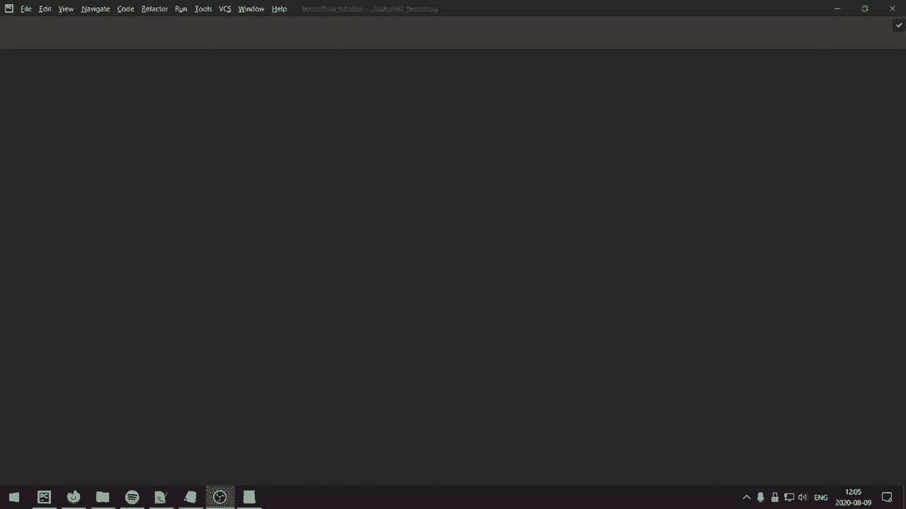
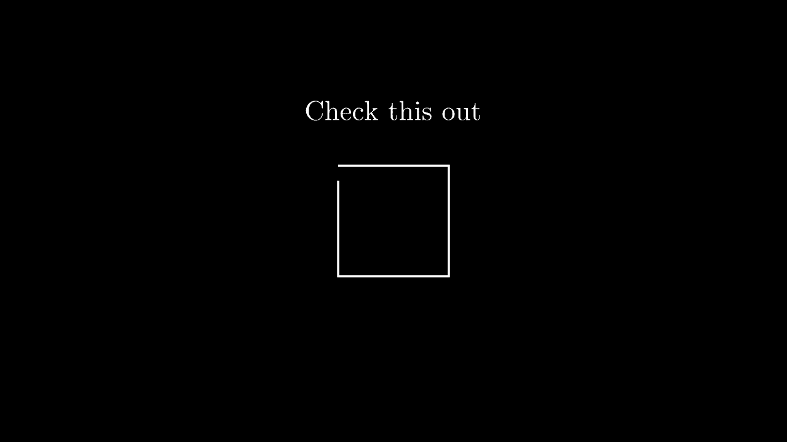
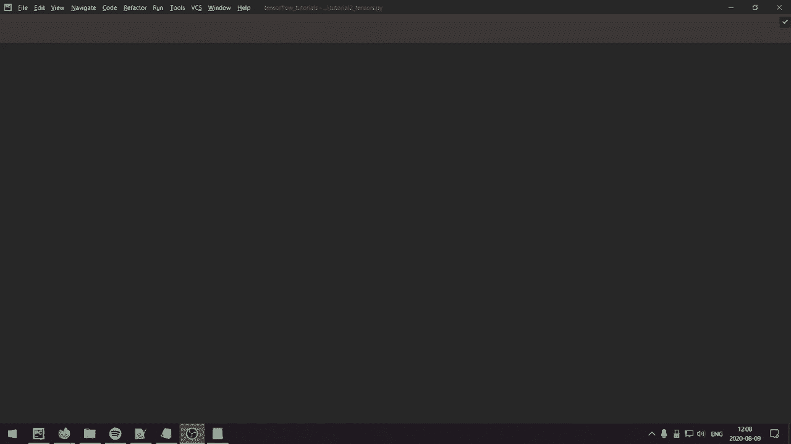
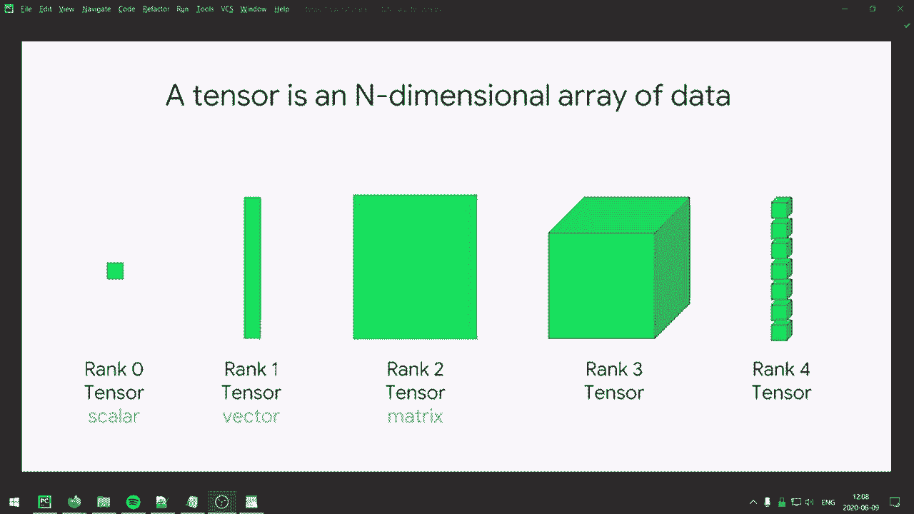
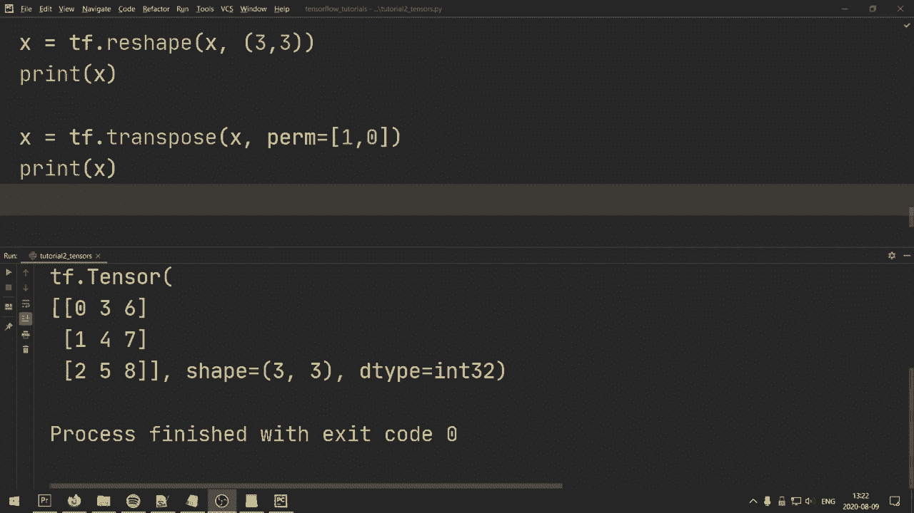

# “当前最好的 TensorFlow 教程！”，P2：L2- 张量基础 

大家好，希望你们都很好，欢迎来到第二个教程，我们将在这里学习基本的张量操作，这是深度学习库的基本构件。

好的，让我们先来看看张量是什么。从编程的角度来看，张量本质上是一个多维数组，能够在 GPU 上运行。从更数学的角度来看，张量是标量、向量和矩阵的推广。例如，向量是一个一维张量，矩阵是一个二维张量。

所以，既然这样，我们就深入了解一些基本操作以及如何在 TensorFlow 中实现它们。我们将从导入 Tensorflow 作为 TF 开始。如果我们直接运行这个，会收到来自 Tensorflow 的消息，基本上是在说它成功打开了 Kuta 库等等，如果你在 GPU 上运行，我觉得这有点烦人，所以我实际上要去...

导入 OS，然后你可以做 OS.do.environment 或者 envion 或者随便你怎么发音 TF 和 CPP min log level。你可以将其设为字符串等于 2，所以本质上这会给我们带来错误信息，但这些信息将被忽略。所以如果我们现在重新运行，我们将不会得到任何东西，反正。

让我们开始我们要讨论的内容，我会有不同的部分。本质上，我将从张量的初始化开始，展示不同的初始化方法，然后是我们可以执行的更数学的操作，接着是张量的索引，最后是张量的重塑。所以。

我们先从如何在 Tensorflow 中创建张量开始。我们可以做的是将 x 设为 Tf.dot.constant。好的。我们可以在这里设置一些值，比如说，我们设定一个标量，就是一个单一的数字，所以我们将其设为四，然后打印出来。

这就是一个标量值的张量，它没有形状，不过我们也可以看到 D 类型，在这种情况下是 32。如果我们设定为 4.0，我认为这将是 flow 32。所以我们还可以指定形状，比如说我们希望它是 1，1，然后如果我们重新运行，将会得到类似于 4 和形状 1 1 的结果。

您还可以指定 D 类型，所以假设我们想使用 float 32，您可以执行 `Tf.dot.float32`，如果我们运行它，它将是一个 float 32，现在它是一个 1x1 的矩阵，仅仅是一个标量而已，但有时在对张量进行不同操作时，指定形状是很重要的。

假设我们想创建一个更大的矩阵，即二维张量，我们可以使用 `TF.constant`，然后做一个列表，里面再嵌套一个列表，可以写成 1，2，3，然后再调用另一个列表 4，5，6。这样会创建两行，每行有三列，因此这将创建一个 2x3 的矩阵，如果我们打印它，我们会得到 2x3，您同样可以指定形状等。

现在，您还可以手动初始化张量，您也可以使用其他初始化方法，比如您可以做 `x = Tf.ones`，并且可以指定形状，可以做一个元组作为第一个参数，形状是 3，3，这样如果我们打印，它将得到一个 3x3 的维度。

而是一个 3x3 的矩阵，仅包含 1 的值。还有其他操作，比如您可以做 `x = Tf.dot.zeros`，然后 `I` 是 2x3，这将是一个全零的 2x3 矩阵。还有一些其他的方法，比如 `Tf.dot.I`，您也可以使用或类似的方式。

在线性代数中，您有 **I** 作为单位矩阵。如果您发音 **I**，那听起来像是 **I**，这就是您指定相同矩阵的方式，因此对角线上的元素是 1，其他位置是 0。如果我们打印它，我们会得到类似这样的结果，对角线上是 1，您还可以指定 D 类型等。如果您想要一些来自分布的东西，Tenflow 也有不同的方法来实现，我只是想展示一些更常见的方式。

如果我们想从均匀分布中生成，可以写 `x = Tf.random.normal`，并且可以指定形状作为第一个输入的元组，假设我们只想要一个 3x3 的矩阵，当然，您也可以做更多维度，我只是为了方便做一个矩阵。

然后我们可以设置均值为 0，标准差为 1。这将来自一个正态分布。如果我们打印它，可能会得到大多数值在 0 和 1 之间。是的，我的意思是，值在 -1 和 1 之间。然后，如果我们想从均匀分布中生成，可以使用 `Tf.random.uniform`。

我们可以指定 1，3，一个向量，然后可以指定最小值和最大值。假设最小值等于 0，然后最大值等于 1。这些将会在 0 和 1 之间有值。它将看起来像这样。这些确实是一些基本的初始化方法，TensorFlow 还有更多，其实我想展示的另一种是可以做类似 Python range 函数的操作，所以只需 TF dot range，例如，如果你做 TF range 的 9，我们打印出来将得到一个从 0 到 1 的向量，然后到 8，9 不包括，完全和 Python 一样。如果你想指定更多，可以设定起始值为 1，然后限制为。

我不知道，假设为 10。然后我们还可以指定增量，因此在这种情况下增量是步长，我不太确定为什么叫增量，但它是值之间的步长。所以假设增量等于 2，那么我们将从 1 开始，接下来的值将是步长为 2，因此我们将得到 1 和 3。我们打印出来，所以得到 1、3、5。

7 和 9 好吧，正如我们所看到的，我们现在创建了这个，这是一个 d 类型的向量，类型为 32，你可以在这个函数中指定 d 类型，但假设你想将其转换为特定类型，那么你可以做 TF dot cast，并传入输入向量，然后你可以指定 D 类型。例如，假设我们想要流 F 64。

在深度学习中，这种情况相当少见。好吧，我们也需要打印它。因此通常你会有 F 32 或甚至 F 16。流 F 64 是相当不寻常的，但使用转换。这确实是不同类型之间转换的一种方法。例如，假设我们想要浮点数，我们会像之前一样做 TF dot float。

然后我们只需指定我们想要的位数，比如 16、32、64。你还可以使用 TF dot int，支持 8、16、34、64。同时你也可以使用 TF dot Bo 将布尔值转换为 0 和 1，这些都是将其转换为不同 D 类型的一些方法。好吧，接下来让我们进行数学运算。首先，我们创建两个向量。

我们设定 x 等于 TF constant，然后是 1、2、3，然后设定 y 等于 TF constant 的 9、8 和 7。如果我们将这里的列相加，我们会得到 10、10 和 10。假设我们想要相加。我们可以设定 Z 等于 TF dot add x 和 Y。如果我们打印 add，则会逐元素相加每个元素。所以这将会把 1 加上 9，2 加上 8，3 加上 7。如果我们运行并打印 add，我们将得到 10。

10 和 10。现在你也可以做 Z 等于 X，然后加上 y，这是一种等效的做法，也许这是最方便的方式，这两者实际上是等价的，所以你选择哪一个都没关系，所以我可能会选择第二种，因为那样更简单。如果我们想要做一些类似的减法，我们可以做 TF dot subtract。

X 和 y 类似地，你也可以做 z 等于 x 减 y，这两者也是等价的。假设你想知道，这将进行逐元素减法，所以将 1 减去 9，2 减去 8，3 减去 7。如果我们想进行逐元素除法，所以我们想要进行除法。

假设，1 的值为 9，2 的值为 8，3 的值为 7，我们可以做 Z 等于 Tf.divide 和 x，y。类似地，我们也可以做 x 然后进行除法。这也会进行逐元素除法。对于逐元素乘法，我们可以做 Tf.multiply x 和 y，但我们也可以做 x 然后直接。

所以 x 星 y 然后。假设我们想进行点积。所以在这种情况下，点积就是做 1 乘以 9 加 2 乘以 8 加 3 乘以 7。所以它会加起来。它会逐元素操作，所以会进行逐元素乘法，然后求和可以使用 Tf.dot 和 tensor.dot，这是一种更高级的函数，可以用于更多的场景，但在这种情况下，我们将对 x 和 y 进行操作，并指定 x 的值，这里是 1。如果我们现在打印，这基本上会对元素进行逐元素乘法，然后求和。

例如，如果我们想手动执行这个，我想我们会做 x 乘以 y，然后做 TF.reduce_sum，然后我们将指定我们应该在哪里加起来的维度，所以 x 等于 0。然后我们可以打印 Z。通过这种方式，我们得到相同的结果。

我也不太确定为什么叫 reduce sum 而不只是 Tf.sum，但好吧。现在假设你想进行逐元素指数运算。你可以做 z 等于 x，然后就像在 Python 中一样。你会这样做，这将逐元素地将每个元素或逐元素地对每个元素进行 5 次方运算。

然后我们想要打印 Z。然后我们得到 132 除以 243，这似乎是准确的。然后我想给你展示如何进行矩阵乘法，所以如果我们指定，假设 TF.random.normal 然后做一个 2x3 矩阵，y 是 Tf.random.normal 然后是 3x4。我们可以做 z 等于 Tf.matrix.multiply 和 mat Mole。然后仅指定 x 和 y。

我们也可以这样做得更方便。我们可以做 Z 等于 x。我真的不确定我该如何发音。所以 x 在 @ 符号下，我认为是 x @ y，然后我们将。让我们在这两个上打印，所以在我们运行之前。我只是想在这里顶部添加两行。我们将处理物理设备。

我们将获取我们的 GPU，然后我们将做 Tf.config.experimental.set_memory_growth，我只有一个 GPU。所以物理设备为 0，然后将其设置为 true，本质上这将使得 TensorFlow 不会在 GPU 上分配所有内存。有时你可能会遇到这些奇怪的错误，如果发生这种情况，就添加这两行。

但是如果你没有问题，就不应该需要添加这些。不过无论如何，让我们回到打印这个。所以如果我们现在看到这些是等效的，对吧？所以你可以用`MaMo`或者只是使用加号。好的，我们继续讨论张量的索引。假设我们做类似`X TF constant`的操作，然后。

我不知道，只是一个包含一些值的向量，0，1，1，2，3，1，2，3。类似于这样。然后我们可以用`print X`，然后用一个冒号，这将打印出所有元素，所以这与打印`X`是一样的。

然后我们就能得到所有的元素。但假设我们只是想，我不知道，比如第一个元素。所以我们希望获取这个向量的部分。我们可以用`print X`和`1 colon`，这样就会打印出除了第一个零值以外的所有内容。然后假设我们也只想要这两个，11，我们可以看看。

我们可以用`print x1,3`，这将是不包括第三个索引，所以0，1，2，3，这不会包括这里的值2，因此我们只会得到这个包含两个元素的向量。假设我们想要所有值，但希望跳过每个其他元素，比如我们想要这个值。

我们想跳过下一个，并希望得到这个值，跳过下一个，接下来我们可以使用`colonco 2`，这将跳过每个其他元素，我们将得到01.32，然后我不知道，假设我们想以相反的顺序打印，可以用`x`和`colonco minus1`，这将以相反的顺序打印。

我只是想注释掉，以免它总是打印。我想假设我们只想指定索引，比如我们想要，我不知道，这个和这个，所以我们想要0和2。我们可以做类似`indices equals TF constant`的操作。然后我们可以为这些值指定索引。然后我们可以使用，做。

假设我们将其称为`x in`，然后用`Tf.dot.gather`。从`x`，从张量`x`中，我们想收集特定的索引0和3，所以如果我们打印`x in`，我们现在会得到0和2。我们想提取的值。好的，这仅适用于向量。我们再来一个例子，假设我们取一个矩阵，所以我们做`x = T of constant`。

然后我们来做1和2，3和4，5和6。所以这将是一个三乘二的矩阵，然后假设我们想获得第一行的所有元素。我们可以这样做，`x`和`0`。我们也可以通过`x comma`和所有的元素来实现。因此，当我们添加张量的多个维度时，我们用逗号分隔这些维度。

同样地，就像我们在向量中所做的那样，我们可以指定我们想要的行。因此，假设我们只想挑选前两行，我们可以做`x[0:2]`，不包括`2`，所以在这种情况下我们只取`0`和`1`。然后我们可以用逗号来表示所有，所以如果我们打印出来，现在应该得到一个包含`1`、`2`、`3`和`4`的二乘二矩阵，这就是基本的张量索引。

让我们删除那些打印语句，现在进行一些基本的重塑，假设我们有`x`是Tf范围为九，因此我们将有九个元素，我们想将其重塑为一个三乘三的矩阵。

然后我们可以执行`x = Tf.dot.reshape(x)`，并指定维度，因此我们做三乘三，然后现在打印`x`，我们将得到`01012`作为第一行，然后`3，4，5，6，7，8`作为最后一行。假设你想转置一下，这样我们将把它作为第一列而不是第一行，方法是`x = Tf.dot.transpose(x)`，我们还可以为排列指定`perm`，这也适用于多个维度，而不仅仅是这里的两个维度，你可以在这种情况下指定`0`或`1，0`，这样就可以交换轴了。如果我们现在打印`x`，那么第一行将成为我们的第一列，第二行现在是我们的第二列。

我们的第二行现在就是这里的第二列。所以这就是张量操作的基础知识，非常感谢观看视频，在下一个视频中我们将开始构建一些基本的神经网络。
