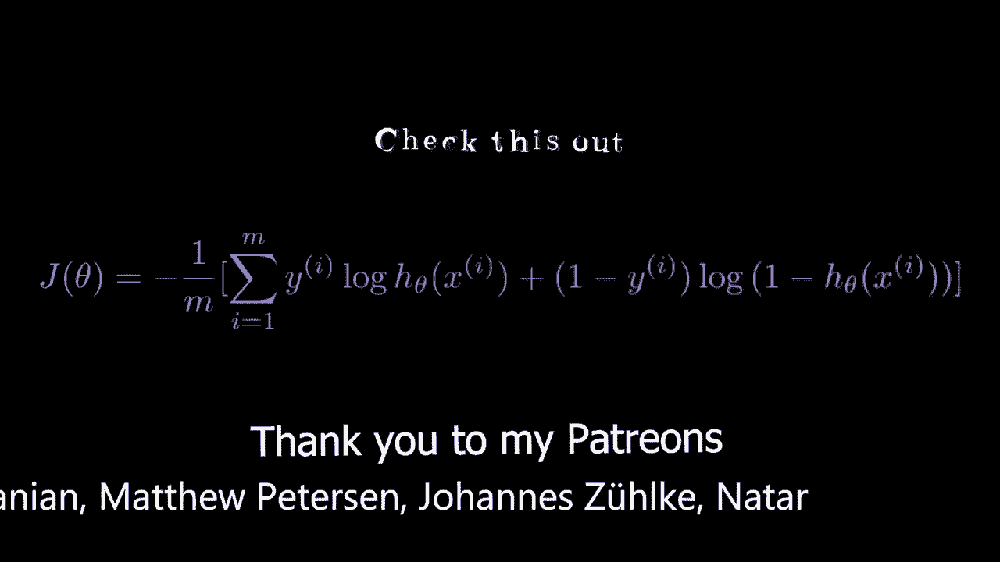
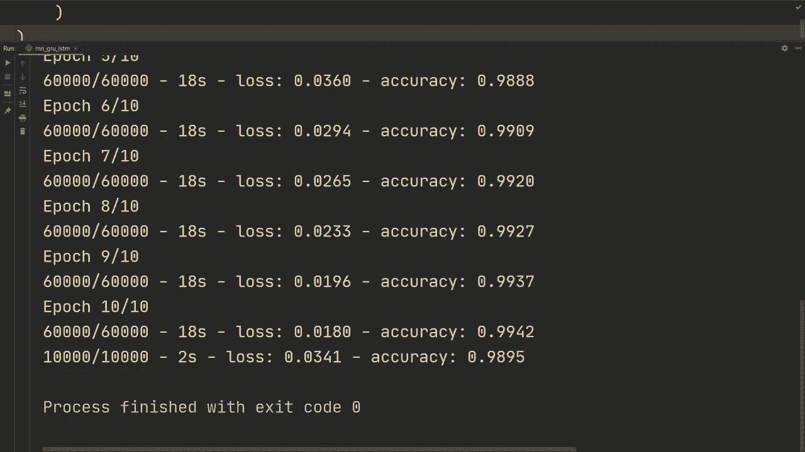

# “当前最好的 TensorFlow 教程！”，P6：L6- RNN、GRU、LSTM 和双向性 

大家好，希望你们过得不错，放上引言，然后我们来聊聊 RNN 等等。

好的，我有我们通常需要的导入。这是为了忽略可能相当烦人的 Tensorflow 消息。尽管我们仍然会收到错误消息，然后使用 Tensorflow 的层构建我们的层，还有 emminis 数据集。这只是为了如果你在 GPU 上运行时遇到任何问题，这两行通常会帮助你。好的，我们来开始我们实际想做的事情。

我们将开始加载数据，因此我们将做 Xtrain，Y train，然后 X test，Y test。等于 Ms.dot.load data，然后我们将 Xtrain 设置为 float 32 类型。当前是 float 64，为了节省计算，我们将其转换。然后我们将通过除以 255 来归一化，使其位于 0 到 1 之间。

对于测试集也做同样的处理。所以流 32，除以 255。那么我们这里做的是什么呢？我们有一张 28x28 像素的图像，当我们把它送入 RNN、GRU 或 LSTM 时，会是怎样的呢？我们会用这三种模型，但实际上我们会针对每个时间步展开图像的一行。比如对于特定的时间步，假设第一个时间步，它将取图像的第一行并发送，然后对于第二个时间步，它将取第二行并发送。为了澄清，你不会使用序列模型来处理图像。

这不是最好的模型，您可以使用我们在两段视频前讨论的 CNN，但使用 RNN 也能奏效。正如我们将看到的，尽管数据集并不理想，但我们将获得合理的性能。这更多是为了说明如何在 Tensorflow 中实际实现 RNN、GRU 和 LSTM，而数据集并不是最佳选择。

不过我们只是选择一个简单的例子来说明。好的，话不多说，实际上我们要做我们的模型，我们将使用 keras 的 sequential。我们会添加模型，然后指定输入。在这种情况下，我们将指定 none 和 28。这里指定 none 是因为我们不需要一个特定的时间步数，所以我们每个时间步有 28 个像素，而在这种情况下，我们实际上有 28 个时间步，但不需要指定该维度。

然后我们将创建一个模型。添加简单的 Rn 层。所以这只是一个基础的 Rn。然后假设有 512 个节点。作为附加参数，我们可以设置 return sequences 为 true，这样它将返回每个时间步骤的输出，这样我们可以在多个 RnN 层之间叠加，所以这个 RnN 的输出将是 512 个节点，然后返回序列在这种情况下会输出每个时间步骤的 512，因为我们将有 28 个时间步骤，然后我们也可以进行激活，将其设置为 Relu。

然后我们可以再添加一个，可以要求添加简单的 Rn 层，我们再做一次 512。我们将设置激活为 Relu。对于输出层，我们将添加模型层。dense，我们将有 10 个输出节点，因此你会注意到在这个第二个简单的 RnN 中，我们没有设置 return sequences。因此对于输出我们没有 return sequences 等于 true。意味着它将传递每个时间步骤，然后在这个简单的 RnN 的最后输出。

我们将在上面添加一个 dense 层，并将有 10 个输出节点。首先做打印模型摘要，所以我们可以看到这里的模型摘要，对于第一个 RnN，我们将有 none none，然后是 512，所以我们将有 512 个输出节点，每个时间步骤都有。我们之所以有 none 和 none，是因为我们有一个是针对批次的，另一个是针对隐藏状态的。我认为这个是针对批次的，另一个是针对隐藏状态的。然后在第二个层中，我们没有设置 return sequences 为 true，因此我们只有 none 对于批次，然后从最后的隐藏状态得到 512 个节点，当它处理所有输入时。最后我们只需要在此基础上添加一层。因此，现在我们要做的就是模型编译，并指定损失函数，使用 ks 的损失 sparse category。

croros entropy，然后我们将设置 from logics 为 true，因为我们在最后的 dense 层没有 softmax。然后优化器，我们将使用 ks 的优化器，设置为 atom。我们将学习率设置为 0.001。然后指标，我们只需跟踪准确性。现在我们要做的就是在训练集上使用模型进行拟合。然后指定批量大小，假设为 64。然后让我们运行 10 次。

而 verbo 等于 2 只是为了每个周期打印。然后在最后，我们想对我们的测试集进行评估。所以我们将发送 X 测试和标签 Y 测试。我们还将指定批量大小为 64，然后再次设置 verboos 等于 2。好吧。那么我们来运行一下，看看是否能成功。好吧，在 10 个周期后，我们在训练集上得到了 98%，在测试集上也接近 98%。

我想在这里提到，我们使用了ReLU激活函数。训练递归网络的默认设置是使用tanh。我不知道在这种情况下是否会更好，但无论如何，我只是想提一下。如果你不指定激活函数。

在构建这些递归网络时，默认是使用tanh。因此，还有一点是，运行这个过程比我想象的要长一些，所以我们在下一个模型中使用256个单元。我们现在想做的基本上是一样的，但我们想构建一个GRU。我们要做的就是将这个简单的RNN更改为GRU，这几乎就是你需要做的全部。因此，如果我们现在重新运行，我们可以看看结果。我想这不是一个公平的比较，但GRU的性能应该优于简单的RNN，尽管我们现在使用了一半的单元，并且使用tanh而不是ReLU，但重点并不是比较，而是展示它的有效性，以及如何使用简单的RNN和GRU。

LSTM相对简单，我们只需将其更改为LSTM，但无论如何。我还想展示如何实现双向层。好的，在10个epoch后，我们在训练集上达到了99.5%，在测试集上接近99%。这实际上相当不错，两个层的GRU，256个单元，能达到这个水平确实不错，所以现在我们将其更改为LSTM，看看是否有所改善。

LSTM和GRU在性能上是等效的。我认为LSTM稍微优于GRU，但让我们看看在这个数据集上是否如此。好的，似乎我们的性能几乎是相同的。LSTM稍微好一些，也许在测试集上，但大体上是一样的。

所以我们现在想做的是，不仅使用单向LSTM，而是使用双向LSTM，添加它非常简单。我们只需添加双向层，就像这样。然后像这样。因此，我们将添加双向层，然后发送LSTM层。

让我们为第二个节点这样做。或者说，让我们开始吧。那么我们先打印一个模型总结，看看它的样子。好的，我不打算让它训练。所以从这里可以看出，由于我们添加了这个双向层，我们将得到512个节点，而不是256个。因此，我们在LSTM中为每个隐藏状态的计算指定的节点数量是256。

但是，由于我们添加了双向结构，我们将有一个向前和一个向后的节点。所以这里的节点数量会加倍。如你所见，我们可以对第二个节点也进行双向层的操作。

我们可以添加这个。😔，就在这里，这也将有512个节点。那么我们来运行一下，看看双向是否比单向的LSTM好。经过10个epoch，我们看到性能与单向使用基本相同，所以双向并没有真正起到帮助作用。我也不太确定为什么，可能只是需要更多的训练，或者它并没有那么大的帮助。

对于这个特定的数据集，但通常情况下，使用双向作为默认设置是一个不错的选择。不过无论如何，这就是如何进行简单的RN、GRU和LSTM的基础知识，以及如何添加双向性。在这个场景中，我们使用了MNIS数据集，所以使用Ms数据时我们给自己提供了很大的便利。在训练更复杂的数据时，你需要考虑更多的事情，比如为每个批次填充和屏蔽数据，我们将在未来的视频中讨论，当我们加载更复杂和自定义的数据时。

感谢观看，希望在下一个视频见到你！
