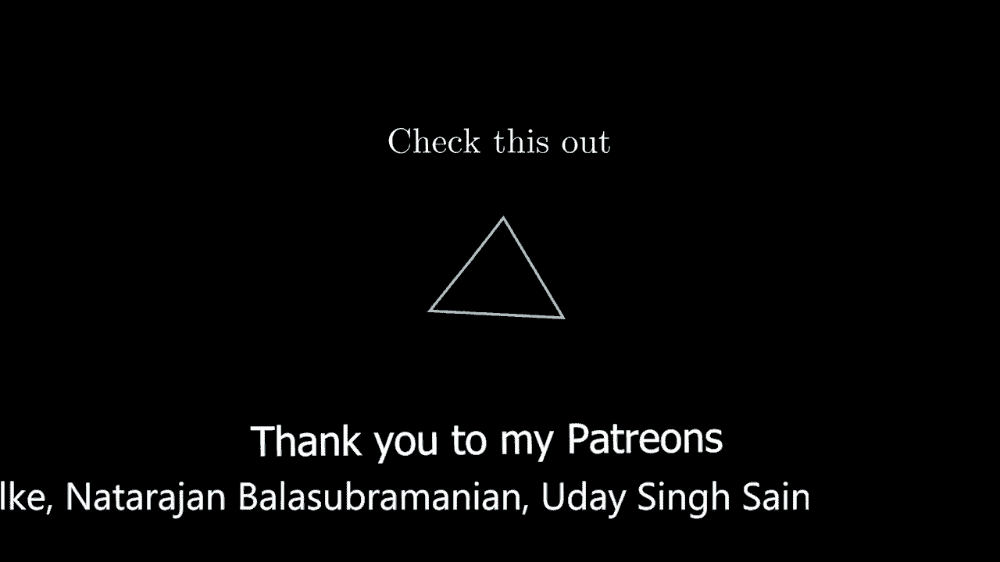
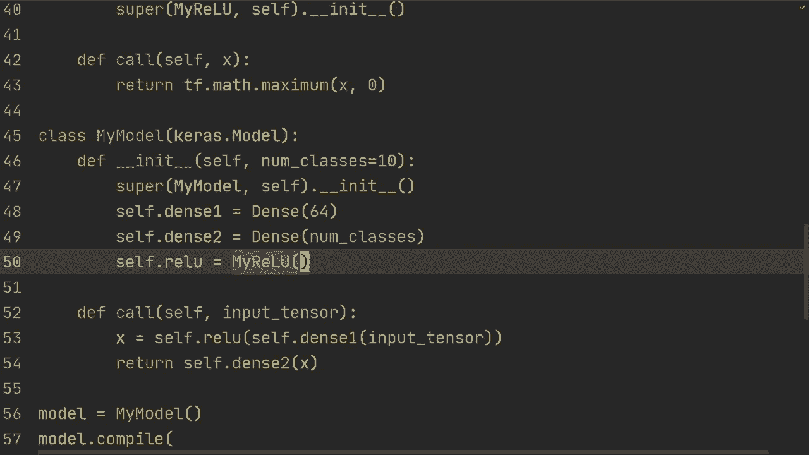

# “当前最好的 TensorFlow 教程！”，P9：L9- 自定义图层 

大家好，希望你们过得非常精彩。在这个视频中，我想向你展示如何创建自定义层。😊！

到目前为止，我们已经看到了如何使用子类化构建非常灵活的模型，现在我们想更进一步，自己创建层。因此，我会向你解释我所指的内容，但首先为了说明我们面前的代码，我们只是引入了在几乎每个视频中看到的内容，然后我们有这两行代码以避免任何GPU错误，最后我们只是在加载Ms数据，这样可以节省一些时间，所以我们将从创建自己的自定义模型开始，像我们在上一个视频中做的一样，这会非常简单，我们将创建类my model，继承自Kast模型，首先找到init方法，我们会使用self，然后可以指定Ms的类数为10，接着我们将调用super mymod self的init。

然后我们将进行self dense1，这里我们只需创建两个密集层。好的。我们将使用layers do dense，设定为64个节点，然后self dense2是layers dense的nu classes，我们将调用self，然后是x。

输入或称为输入张量。然后我们将执行self do den one的输入张量。接着在其上运行Tf.nn.relu。这就是我们在上一个视频中看到的内容，因此我快速讲解，然后我们想返回self do then2的x。好的。现在让我们快速构建一个模型，编译模型并进行拟合。

我们将执行model equals my model。我们将执行model do compile。损失等于ks，损失，bars。分类交叉熵。从逻辑上讲等于true。😔，然后让我们进行模型拟合。你之前见过这些，所以我会快速写出。好的，现在我们有一个使用子类化的自定义模型，然后我们定义了编译、拟合和评估，所以让我们确保这确实有效，如果我们运行这个，我们会看到它实际上在训练，这应该相对较快，因为我们只有是的，我们有一个非常非常小的网络，像64个节点，然后10个输出节点，让我们实际讨论一下我想在这个视频中展示的内容。

现在我们想自己创建这些层。目前我们使用的是Ks中的层，里面包含密集层，然后使用Tf.n.relu。这是可以的，你可以用它构建非常灵活的模型，在大多数情况下这都很好。但有时为了理解，你想自己构建这些层，这样可以更深入地理解内部机制。所以我将向你展示如何做到这一点。让我们做一个类，命名为dense，并继承自layers layer。

我们将创建我们的初始化函数，所以我们将做init，然后是self和unit。接着我们将指定输入维度。然后我们要做的就是运行super方法，所以super dense self that init。然后我们将self.W设置为self.add weight。

实际上有多种方法来做到这一点。这是更简单的方法，你也可以用T点变量自己初始化，但我将以这种简单的方法展示给你。首先，我们需要设置一个名称，我们就叫它W。实际上，这一点非常重要，你会在下一个视频中看到如何保存和加载模型。我发现如果不指定名称，就无法保存模型，所以这非常重要。接下来，我们要指定一个输入维度的形状，然后设置单位。输入维度就是我们一开始的值，784，即28乘以28，然后单位就是我们要映射到的值，所以在使用layers164时，单位是64。

初始化器我们将使用随机正态分布，你可以查看其他初始化方法。然后我们将指定trainable等于true。所以trainable等于true。这适用于像batch norm这样的层，其中某些参数实际上不是可训练的。但在这个密集层中，我们的所有参数都将是可训练的，然后我们将进行self。

B是self.add weight。我们将其命名为B，形状就是单位。因此，我们进行矩阵乘法时需要W，这就是它必须具有输入维度的原因。然后它将是单位节点，所以我们为每个节点添加一个。这就是我们在这里所用的单位。然后我们可以进行初始化，我们将其初始化为零。

这也是一个可训练参数。最后，我们只需实现call方法。对于一些输入，我们将返回T点矩阵乘以输入。然后self到W，最后我们需要添加B。现在，我们可以在这里替换，所以我们可以做self ta dense 1是dense，然后设置64和784。

然后我们来做一个自密集层，输入维度是10，然后是64。现在把这个输出放在那里，看看是否有效。好的，我们似乎得到了与上一个几乎相等的结果，最重要的是它确实可以运行。首先，你可以注意到，在这些例子中，我们不需要指定输入维度，我们称之为懒惰层，这样你根本不需要说明输入维度，它会自动计算出来。所以我们现在想做的是移除这一部分，使其无论输入维度如何都能工作。我们要做到这一点的方法是创建一个构建方法。现在我们有了初始化，我们将在这里移除输入维度。

然后我们将创建一个构建方法。我们将定义构建，传入self和输入形状。接着，我们将在这里创建Ws，因此我们将把这段代码粘贴到构建方法中。

现在非常棒的是，使用输入形状而不是输入维度，我们可以处理最后一个维度。在这种情况下，我们在第一维有训练样本，然后由于我们在这里的重塑，我们有784。

所以我们在这里做-1，然后我们将使用单位，虽然在初始化方法中我们将self.units设置为units。接着，我们需要将这里的单位替换为self.units，W和B都需要如此。

所以现在令人惊讶的是，如果我们运行这个，我们就不需要指定输入维度，这样希望可以工作。我们可以运行这些类。现在让我们试试，看看会得到什么。它似乎有效，我们看到这两个功能几乎是相同的。你可能会说，我们仍在使用TfN和dot Reello，实际上自己创建这个也不错，这就是我们的下一步。你可以通过两种方式做到这一点，可以创建一个函数或像我们现在这样创建一个类。我认为最常见的方法是定义一个函数，但让我们创建一个类，你可以尝试制作一个函数。

它几乎是一样的。但我们将做一个类Mireello，然后定义初始化，只需传入self。我们需要调用super的Mireello，self和初始化。然后在我们的实际调用中，我们只需返回Tf.math.maximum(x, 0)。

这只是返回 x 和 0 中的最大值，这正是相对的，对吧？所以在这一点上，你可能会说，嗯，我们到底如何创建这个 Tf math maximum 函数。你可能觉得这是一种作弊的方式，我想说这甚至更底层，这是你可以尝试的，你可以阅读文档和源代码，了解他们是如何实现这个函数的等等，但总会有机会让你深入探索细节。因此，我会在这里划定界限，我们可以在这些张量上使用这些数学运算，当我们有这个 myrelu 时，我们可以做 self。

tre 是我的 Relu，所以我们必须实例化这个类，虽然如果你使用一个函数，这就不是这种情况。那么我们要做的是替换这个 Tf，然后做 relu，然后在此基础上做 selftrelu。所以我们可以先运行这个。因此，你现在已经看到如何通过 Kaa 子类化自己构建这些模型，以及如何实际构建这些层，比如稠密层和 re 函数。这些都是相当简单的，但你可以想象构建更复杂的层。我也建议你尝试一下。好的，这就是本视频的全部内容，非常感谢你的观看，希望在下一个视频见到你。

