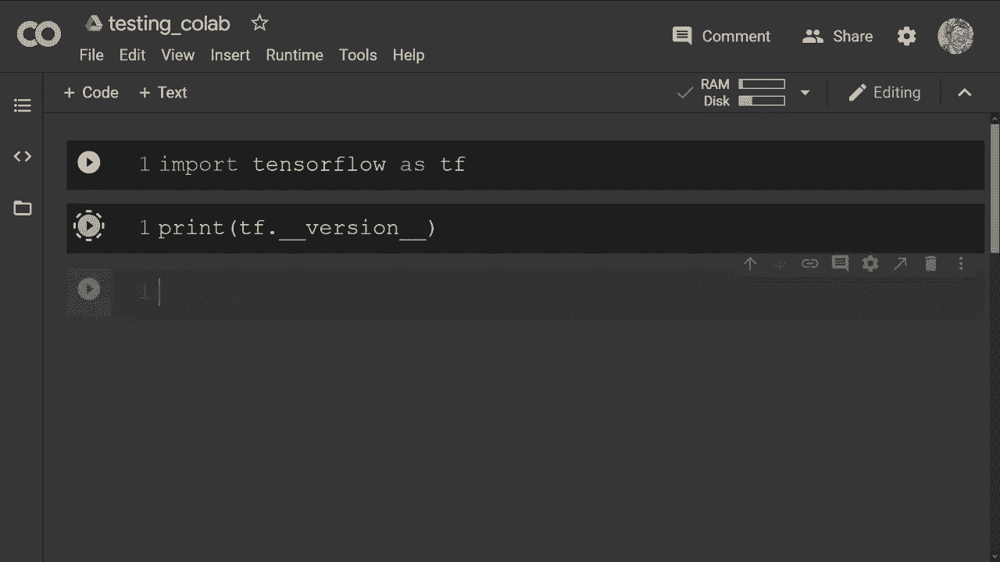
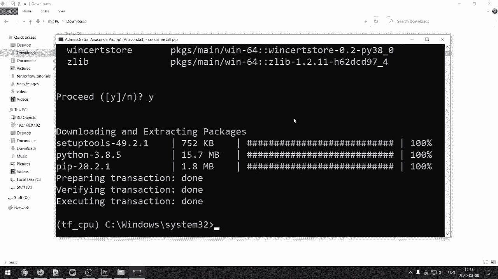
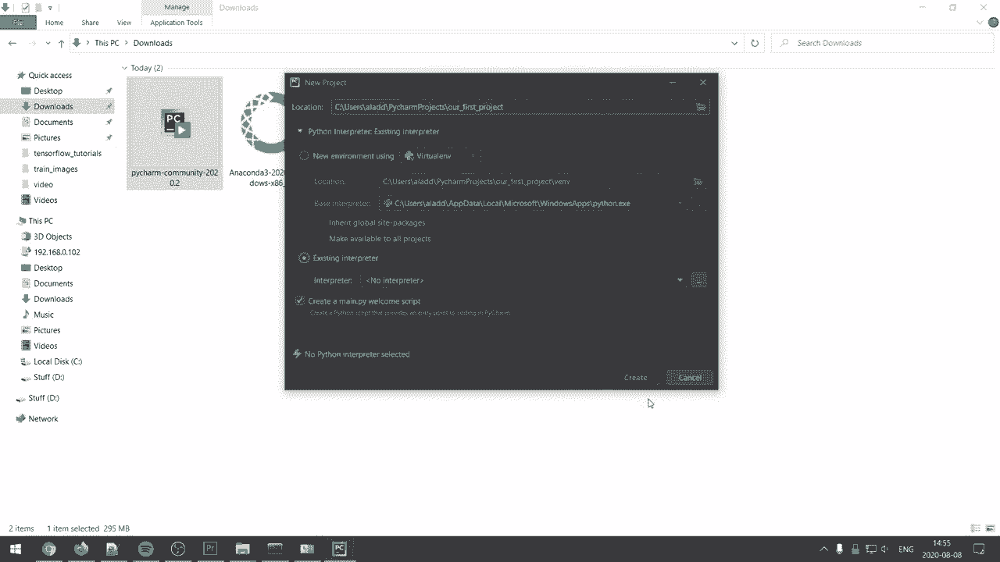
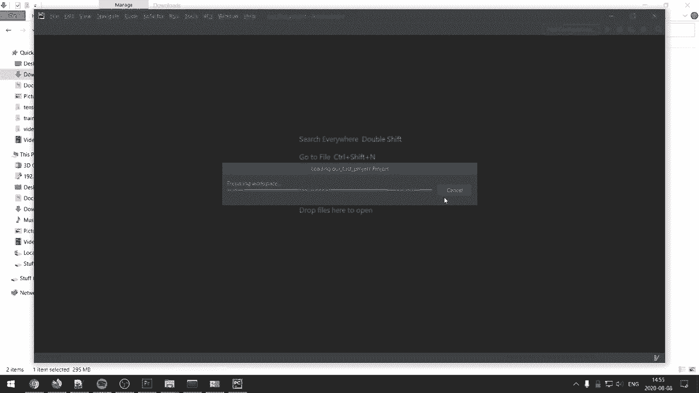

# “当前最好的 TensorFlow 教程！”，看完就能自己动手做项目啦！＜实战教程系列＞ - P1：L1- 安装和设置深度学习环境(Anaconda 和 PyCharm) 

🎼女士们，先生们，欢迎来到世界上最好的 TensorFlow 教程！

我已经计划和构建这些视频有一段时间了，目标是为我们在 TensorFlow 中建立一个坚实的基础。观看并完成这些视频后，你将准备好开始做自己酷炫的项目。因此，我希望你对 Python 的基础知识有所了解，最好还有一些线性代数的数学知识，了解深度学习背后的理论也很重要，这样你会更容易理解我们实际在做的事情。

但如果你没有安装，我会写下理论前提，并推荐你一些很好的资源，让你可以学习每个特定视频的主题。通过这种方式，我可以完全专注于 TensorFlow 和编码部分，使这些视频更加简洁。

好的，既然如此，大家我们就开始吧。在开始之前，我们需要安装它，没开玩笑，这可能是最困难的部分。最简单的开始方法就是使用 Google Coab，视频描述中会有链接，所以使用 Coab 你不需要安装任何东西。如果由于某种原因它不起作用，你可以暂时使用这个，它的界面看起来大概是这样的，你会有一些单元格，可以直接导入 TensorFlow STF，然后我们可以执行类似于打印 TensorFlow 版本的操作。

你将拥有最新版本的 TensorFlow。现在，最好是将它安装在你自己的电脑上，我想我找到了一些相对简单的方法来安装适用于 GPU 和 CPU 的 TensorFlow，我会展示我知道的最简单的设置方法。首先我们要访问的链接，以及所有的链接都会在视频描述中。我们向下滚动，点击下载 Anaconda，然后根据我的情况选择 64 位 Windows 的特定 Anaconda 安装，接下来我们要去的第二个页面是 PyCharm 的安装，这是我推荐的编辑器，我们将下载社区版本，也就是免费的版本。

现在你已经下载了这两样东西，我们将开始安装 Anaconda。让我们以管理员身份运行它，基本上我们只需要保持默认选项，所以我们点击下一步，我同意，下一步，下一步，然后安装。安装完成后，我们会点击下一步，下一步，然后完成。

好吧，我们要打开 Anaconda，首先要做的是创建一个环境。Anaconda 允许你拥有多个环境，每个环境可以有不同的软件包。例如，假设你想要一个 Python 的版本，然后另一个版本，你可以为这两者创建不同的环境。现在我们要创建的环境取决于你是否启用了 GPU，或者是要在 CPU 上运行。因此，你可以访问这个页面，查看你的显卡是否具备所需的计算能力。

如果你确实启用了 GPU，那么你需要先下载显卡的驱动程序。所以如果你是玩家，可能已经有这些驱动程序，因此不用担心。不过，例如，如果你有 G4 体验并且有最新的驱动程序，可能已经安装了 NviIo 驱动程序，所以你不需要再做了，但其他情况可以在这个页面上找到。我们从你有 GPU 的选项开始，所以我们将执行 `conda create --name`，称之为 Tf，代表 Tensorflow，然后再写 `Tensorflow-GPU`，按下回车。

很棒的是，安装内容时，如果你查看将要下载的库，它会下载 Nvidia 的工具包，并且还会下载相关的代码和库。所以你不必费心去寻找特定版本以匹配等，只需输入确认，然后它会下载你所需的一切。

所以，当这完成后，我们现在有一个可以在 GPU 上运行 Tensorflow 的环境，而我们所需做的只是一条命令来安装它。因此，这种方式的唯一缺点是 Tensorflow 并没有原生支持 Conda，这意味着我们将会稍微滞后一些版本，而在这种情况下，最新版本是 2。

现在我们要使用 Tensorflow 2.1，但这样做可以节省很多麻烦。如果 Tensorflow 团队的任何人正在观看这个视频，请考虑使用 Conda 发布 Tensorflow，因为 Pythtorch 这样做非常简单，安装也很方便，这对我们使用 TensorFlow 的用户来说轻松很多。对于在 CPU 上安装 Tensorflow 的第二个选项，我们将创建一个名为 Tf 的环境，称之为 CPU。

然后我们需要激活该环境。因此，我们将执行 `Con activate Tensorflow CPU`。我们要做的第一件事是安装 Pip。现在我们有了 Pip，可以执行 `Pip install TensorF`。

下一步是安装 Pycharm，我们只需点击下一步，下一步。我想要一个快捷方式，然后我想把 Python 文件关联到 Pycharm 打开，接着点击下一步。安装。然后运行 Pyr。导入设置可以不勾选，没问题。然后这样也可以。😔 接着我会安装 Vim，但如果你不知道 Vim 是什么，或者不使用它。

然后不要安装这个。接着开始使用 Pycharm。我们要做的是，嗯，让我们看看。我们可以创建一个新项目。然后我们可以做，P，叫它。我们的第一个项目。接下来我们会去现有的解释器，这里我们会去，嗯，这里有个点点点。

我们将去 Conda 环境，现在你应该能看到你的两个环境。所以如果你刚创建了一个，你应该能看到那个环境。我要选择那个启用了 GPU 的 Tf，然后我会点击“使其对所有项目可用”，然后按确定。

现在我们有了那个解释器，我只需点击创建。

是的。现在你应该能够做，嗯，你应该能够执行 `import tensorflow as tf`。然后我们可以执行 `print(tf.version)`。这样我们就得到了 TensorFlow 版本 2.1.0。如果你使用的是 CPU，你可能应该有最新版本。假设由于某种原因这不起作用，我见过一些人有找到 Conda 环境的问题。

你还应该能够进入设置，然后能够进入项目的 Python 解释器，在这里你应该能够点击添加，然后选择 Conda 环境，接着选择现有环境，然后在这里你应该能看到解释器。

在这种情况下是 TensorFlow CPU，然后你可以选择使其对所有项目可用。

所以，如果你找不到 Python 解释器，这就是本视频关于设置 TensorFlow 的全部内容。如果你有任何问题，请留言，我会尽力帮助你。话不多说，在下一个视频中我们将开始编码，希望能在那儿见到你。

